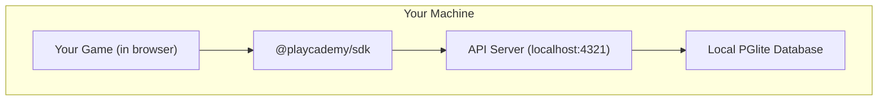

# Welcome

## Overview

Playcademy hosts learning experiences in the Playcademy Arcade, where players explore with an avatar, discover apps and games, and carry their progress and items from one experience to the next.

## The Core Platform

This diagram illustrates how the major pieces of the ecosystem fit together.

<div className="w-full max-w-3xl my-6 rounded-xl overflow-hidden">
  

  
</div>

## Key Tools

You'll primarily interact with these tools:

{/_ prettier-ignore _/}

<table>
  <thead>
    <tr>
      <th style={{ width: '25%', textAlign: 'right' }}>
        Package
      </th>

      <th>
        Description
      </th>
    </tr>

  </thead>

  <tbody>
    <tr>
      <td style={{ textAlign: 'right' }}>
        <strong>
          [`playcademy`](/platform/cli)
        </strong>
      </td>

      <td>
        Command-line interface for project initialization, local development, and deployment.
      </td>
    </tr>

    <tr>
      <td style={{ textAlign: 'right' }}>
        <strong>
          [`@playcademy/sdk`](/platform/sdk)
        </strong>
      </td>

      <td>
        TypeScript SDK for connecting your project to the Playcademy platform.
      </td>
    </tr>

    <tr>
      <td style={{ textAlign: 'right' }}>
        <strong>
          [`@playcademy/vite-plugin`](/platform/vite-plugin)
        </strong>
      </td>

      <td>
        Starts the development sandbox and backend server during `vite dev` for better DX.
      </td>
    </tr>

  </tbody>
</table>

<Callout type="info">
  **Note for Godot & Unity Developers**

This guide focuses on our Vite-based toolchain for building apps and games.

For engine-specific instructions, see our dedicated guides for [Godot](/platform/guides/godot) and [Unity](/platform/guides/unity).
</Callout>

## Explore the Platform

<Cards>
  <Card title="Quick Start" href="/platform/quickstart">
    Install the Playcademy CLI and build your first project from scratch. Covers everything from
    initialization to deployment.
  </Card>

  <Card title="SDK Documentation" href="/platform/sdk">
    Learn how to connect your project to platform features like player inventory, state
    management, and real-time events.
  </Card>

  <Card title="Integrations" href="/platform/integrations">
    Add server-side logic with custom API routes and platform integrations like Timeback,
    database, and authentication.
  </Card>

  <Card title="CLI Reference" href="/platform/cli/commands">
    Complete command-line interface documentation with all available commands.
  </Card>

  <Card title="Web Development" href="/platform/guides/web">
    Build web apps with JavaScript/TypeScript and modern web frameworks.
  </Card>

  <Card title="Godot Development" href="/platform/guides/godot">
    Integrate Playcademy into your Godot Engine projects.
  </Card>
</Cards>

# Quick Start

import { DiscordIcon } from '@/components/svg-icons'
import { config } from '@/lib/config'
import { Link as LinkIcon } from 'lucide-react'

## Overview

In this quickstart, you'll use the [**Playcademy CLI**](/platform/cli) along with the [**Vite Plugin**](/platform/vite-plugin) to build a simple web project that:

1. Connects to Playcademy
2. Loads player data automatically
3. Integrates with platform features
4. Runs locally and deploys to production

<Callout title="Not Using Vite?">
  This guide uses Vite as the default web development setup.

For engine-specific guides, see:

- [Godot Integration](/platform/guides/godot)
- [Unity Integration](/platform/guides/unity)
  </Callout>

## Prerequisites

Before we begin, ensure you have:

1. **Node or Bun** installed (we recommend [Bun](https://bun.sh) for the best experience)
2. [**Developer status**](/platform/cli/commands#developer-access) approved on your account

<Callout type="info" title="Don't have developer status yet?">
  Run [`playcademy dev apply`](/platform/cli/commands#dev-apply) after running [`playcademy
      login`](/platform/cli/commands#login).
</Callout>

## Installation

<Steps>
  <Step>
    ### Authenticate

    Start by [authenticating](/platform/cli/authentication) with your Playcademy account:

    <PackageManagerTabs
      commands={{
      bun: 'bunx playcademy login',
      npm: 'npx playcademy login',
      pnpm: 'pnpm dlx playcademy login',
      yarn: 'yarn dlx playcademy login',

}}
/>

    Verify you're logged in:

    <PackageManagerTabs
      commands={{
      bun: 'bunx playcademy me',
      npm: 'npx playcademy me',
      pnpm: 'pnpm dlx playcademy me',
      yarn: 'yarn dlx playcademy me',

}}
/>

    <Callout type="info" title="Don't have a Playcademy account yet?">
      <Tabs items={['Staging', 'Production']}>
        <Tab value="Staging">
          [Create an account](https://hub.playcademy.net/auth) to get started on **staging**.
        </Tab>

        <Tab value="Production">
          [Create an account](https://playcademy.net/auth) to get started on **production**.
        </Tab>
      </Tabs>
    </Callout>

  </Step>

  <Step>
    ### Create Your Project

    Scaffold a new Playcademy project:

    <PackageManagerTabs
      commands={{
      bun: 'bun create playcademy my-app',
      npm: 'npm create playcademy my-app',
      pnpm: 'pnpm create playcademy my-app',
      yarn: 'yarn create playcademy my-app',

}}
/>

    The CLI will guide you through:

    1. **Project type**: Select **Vite** or **Godot** (for this quickstart, select **Vite**)
    2. **Framework**: Choose React, Vue, Svelte, or Vanilla (for this quickstart, select **React**)
    3. **Project info**: Name, description, and emoji
    4. **Integrations**: Timeback, Database, etc.

  </Step>

  <Step>
    ### Create a Provider

    Create a context provider to make the Playcademy client available throughout your app:

    ```tsx title="src/PlaycademyProvider.tsx"
    import { createContext, useContext, useEffect, useState } from 'react'

    import { PlaycademyClient } from '@playcademy/sdk'

    const PlaycademyContext = createContext<PlaycademyClient | null>(null)

    export function PlaycademyProvider({ children }: { children: React.ReactNode }) {
        const [client, setClient] = useState<PlaycademyClient | null>(null)

        useEffect(() => {
            PlaycademyClient.init().then(setClient)
        }, [])

        if (!client) return <div>Loading...</div>

        return <PlaycademyContext.Provider value={client}>{children}</PlaycademyContext.Provider>
    }

    export function usePlaycademy() {
        const client = useContext(PlaycademyContext)
        if (!client) throw new Error('usePlaycademy must be used within PlaycademyProvider')
        return client
    }
    ```

  </Step>

  <Step>
    ### Wrap Your App

    Update your app entry point to wrap everything with the provider:

    ```tsx title="src/main.tsx"
    import React from 'react'
    import ReactDOM from 'react-dom/client'

    import App from './App'
    import { PlaycademyProvider } from './PlaycademyProvider'

    import './index.css'

    ReactDOM.createRoot(document.getElementById('root')!).render(
        <React.StrictMode>
            <PlaycademyProvider>
                <App />
            </PlaycademyProvider>
        </React.StrictMode>,
    )
    ```

    <Callout type="info" title="Coming Soon">
      Framework-specific tooling is coming soon.

      ```tsx title="src/main.ts"
      import { PlaycademyProvider } from '@playcademy/react'

      ReactDOM.createRoot(document.getElementById('root')!).render(
          <React.StrictMode>
              <PlaycademyProvider>
                  <App />
              </PlaycademyProvider>
          </React.StrictMode>,
      )
      ```
    </Callout>

  </Step>

  <Step>
    ### Use the Client

    Now use the client anywhere in your app:

    ```tsx title="src/App.tsx"
    import { useEffect, useState } from 'react'

    import { usePlaycademy } from './PlaycademyProvider'

    function App() {
        const client = usePlaycademy()
        const [user, setUser] = useState<{ name: string; id: string } | null>(null)

        useEffect(() => {
            client.users.me().then(setUser)
        }, [client])

        if (!user) return <div>Loading user...</div>

        return (
            <div>
                <h1>Welcome, {user.name}!</h1>
                <p>Your project is connected to Playcademy! 🎉</p>
                <p>User ID: {user.id}</p>
            </div>
        )
    }

    export default App
    ```

    <Callout type="warn" title="Using a different framework?">
      The pattern is the same.

      Initialize `PlaycademyClient.init()` early in your app, then use the client throughout your components.
    </Callout>

  </Step>

  <Step>
    ### Develop Locally

    Start the Vite development server:

    <PackageManagerTabs
      commands={{
      bun: 'bun dev',
      npm: 'npm run dev',
      pnpm: 'pnpm run dev',
      yarn: 'yarn run dev',

}}
/>

    The [**Vite Plugin**](/platform/vite-plugin/develop) automatically:

    1. Starts the [**sandbox server**](/platform/vite-plugin/develop#sandbox-server) (`localhost:4321`): simulates the platform API
    2. Starts the [**backend server**](/platform/vite-plugin/develop#backend-server) (`localhost:8788`): runs your custom routes and integrations

    <Callout type="info" title="Not Using Vite?">
      If you're not using Vite, start the backend server separately:

      <PackageManagerTabs
        commands={{
      bun: 'bunx playcademy dev',
      npm: 'npx playcademy dev',
      pnpm: 'pnpm dlx playcademy dev',
      yarn: 'yarn dlx playcademy dev',

}}
/>

      Then start your own bundler/dev server in another terminal.
    </Callout>

  </Step>

  <Step>
    ### Build Your Project

    Build your project for deployment:

    <PackageManagerTabs
      commands={{
      bun: 'bun run build',
      npm: 'npm run build',
      pnpm: 'pnpm run build',
      yarn: 'yarn run build',

}}
/>

    The [**Vite Plugin**](/platform/vite-plugin/build) automatically creates `.playcademy/<app-slug>.zip` ready for deployment.

    <Callout type="info" title="Optional: Add buildPath to Config">
      You can add the build path to your config to skip the prompt during deployment:

      ```js title="playcademy.config.js"
      export default {
          name: 'Playcademy App',
          description: 'A fun project',
          emoji: '🚀',
          buildPath: '.playcademy/playcademy-app.zip',
      }
      ```

      If you don't add it, `playcademy deploy` will prompt you for the path interactively.
    </Callout>

  </Step>

  <Step>
    ### Deploy to Playcademy

    [Deploy](/platform/cli/deployment) your project with a single command:

    <PackageManagerTabs
      commands={{
      bun: 'bunx playcademy deploy',
      npm: 'npx playcademy deploy',
      pnpm: 'pnpm dlx playcademy deploy',
      yarn: 'yarn dlx playcademy deploy',

}}
/>

    <Callout type="info" title="Deploy to Production">
      The CLI deploys to **staging** by default.

      When you're ready to go live:

      <PackageManagerTabs
        commands={{
      bun: 'bunx playcademy deploy --env production',
      npm: 'npx playcademy deploy --env production',
      pnpm: 'pnpm dlx playcademy deploy --env production',
      yarn: 'yarn dlx playcademy deploy --env production',

}}
/>
</Callout>
</Step>

  <Step>
    ### Stream Logs

    Debug your deployed app by streaming real-time logs:

    <PackageManagerTabs
      commands={{
      bun: 'bunx playcademy logs',
      npm: 'npx playcademy logs',
      pnpm: 'pnpm dlx playcademy logs',
      yarn: 'yarn dlx playcademy logs',

}}
/>

    See [`playcademy logs`](/platform/cli/commands#logs) for all options.

  </Step>
</Steps>

## Next Steps

You've built and deployed your first (very simple) Playcademy app!

<div className="flex flex-wrap gap-3 my-6">
  <CTAButton href={config.discordInviteUrl} variant="secondary" icon={<DiscordIcon />}>
    Ask a Question
  </CTAButton>
</div>

Ready to build a production-ready app?

Explore backend integrations that add storage, user accounts, and server-side logic.

<div className="my-6">
  <table className="w-full">
    <thead>
      <tr className="border-b">
        <th className="text-right pr-4 pb-2 font-semibold">
          Integration
        </th>

        <th className="text-left pb-2 pl-4 font-semibold border-r-0">
          Description
        </th>

        <th className="text-center pb-2 pl-4 font-semibold border-l-0" style={{ width: '1%' }} />
      </tr>
    </thead>

    <tbody>
      <tr className="border-b">
        <td className="text-right pr-4 py-1 font-medium">
          <a href="/platform/integrations/database">
            Database
          </a>
        </td>

        <td className="py-0 pl-4 border-r-0">
          Type-safe SQLite with Drizzle ORM
        </td>

        <td className="py-0 border-l-0">
          <a href="/platform/integrations/database" className="flex items-center justify-center py-1">
            <LinkIcon className="w-4 h-4" />
          </a>
        </td>
      </tr>

      <tr className="border-b">
        <td className="text-right pr-4 py-1 font-medium">
          <a href="/platform/integrations/authentication">
            Authentication
          </a>
        </td>

        <td className="py-0 pl-4 border-r-0">
          User accounts with Better Auth
        </td>

        <td className="py-0 border-l-0">
          <a href="/platform/integrations/authentication" className="flex items-center justify-center py-1">
            <LinkIcon className="w-4 h-4" />
          </a>
        </td>
      </tr>

      <tr className="border-b">
        <td className="text-right pr-4 py-1 font-medium">
          <a href="/platform/integrations/custom-routes">
            Custom Routes
          </a>
        </td>

        <td className="py-0 pl-4 border-r-0">
          Server-side API endpoints
        </td>

        <td className="py-0 border-l-0">
          <a href="/platform/integrations/custom-routes" className="flex items-center justify-center py-1">
            <LinkIcon className="w-4 h-4" />
          </a>
        </td>
      </tr>

      <tr className="border-b">
        <td className="text-right pr-4 py-1 font-medium">
          <a href="/platform/integrations/kv">
            KV Storage
          </a>
        </td>

        <td className="py-0 pl-4 border-r-0">
          Fast key-value storage
        </td>

        <td className="py-0 border-l-0">
          <a href="/platform/integrations/kv" className="flex items-center justify-center py-1">
            <LinkIcon className="w-4 h-4" />
          </a>
        </td>
      </tr>

      <tr className="border-b">
        <td className="text-right pr-4 py-1 font-medium">
          <a href="/platform/integrations/bucket">
            Bucket Storage
          </a>
        </td>

        <td className="py-0 pl-4 border-r-0">
          File storage for assets
        </td>

        <td className="py-0 border-l-0">
          <a href="/platform/integrations/bucket" className="flex items-center justify-center py-1">
            <LinkIcon className="w-4 h-4" />
          </a>
        </td>
      </tr>

      <tr>
        <td className="text-right pr-4 py-1 font-medium">
          <a href="/platform/integrations/timeback">
            Timeback
          </a>
        </td>

        <td className="py-0 pl-4 border-r-0">
          Educational progress tracking
        </td>

        <td className="py-0 border-l-0">
          <a href="/platform/integrations/timeback" className="flex items-center justify-center py-1">
            <LinkIcon className="w-4 h-4" />
          </a>
        </td>
      </tr>
    </tbody>

  </table>
</div>

<Cards>
  <Card title="Integrations" href="/platform/integrations/custom-routes">
    Add backend features to unlock the full platform capabilities
  </Card>

  <Card title="SDK Documentation" href="/platform/sdk/browser">
    Deep dive into all available platform APIs
  </Card>

  <Card title="Development Guide" href="/platform/cli/development">
    Learn advanced local development workflows and debugging
  </Card>

  <Card title="CLI Reference" href="/platform/cli/commands">
    Master all CLI commands for development and deployment
  </Card>
</Cards>

# @playcademy/sandbox

# @playcademy/sandbox

**Local development server for isolated Playcademy game development.**

The Playcademy sandbox provides a complete local simulation of the Playcademy platform API for development and testing.

## What is the Sandbox?

The sandbox is a local development server that lets you:

- **Develop games locally** with full platform integration.
- **Test SDK functionality** without needing the live platform.
- **Simulate user accounts** and game data in a controlled environment.
- **Work offline** without an internet connection.

It's a "mock Playcademy platform" running on your machine that behaves just like the real thing.

### Key Benefits

- **Isolated Environment**: Completely local execution with no external dependencies.
- **Zero Configuration**: Automatic database setup and seeding.
- **Full API Compatibility**: All Playcademy APIs available locally.
- **Fast Development Cycle**: Quick startup with persistent local database.

## How It Works

The sandbox runs a local API server to provide a complete development environment. When using our Vite templates, this is handled automatically.



## Usage

The easiest way to use the sandbox is with our official Vite templates, which handle everything automatically via the `@playcademy/vite-plugin`. You can also run it manually as a standalone CLI for advanced use cases.

### Automatic Setup (Recommended)

When you start your development server with `bun dev`, the Vite plugin will launch the sandbox in the background.

::: code-group

```bash [bun]
bun dev
```

```bash [pnpm]
pnpm dev
```

```bash [yarn]
yarn dev
```

```bash [npm]
npm run dev
```

:::

You'll see output confirming that the sandbox is running:

```
VITE v6.3.5

➜  Local:   http://localhost:5173/
➜  Network: use --host to expose

PLAYCADEMY v0.1.0

➜  Game:      playground
➜  Sandbox:   http://localhost:4321/api
```

```typescript
// vite.config.ts
import { defineConfig } from 'vite';

import { playcademy } from '@playcademy/vite-plugin';

export default defineConfig({
  plugins: [
    playcademy({
      sandbox: {
        autoStart: true
      }
    })
  ]
});
```

### Manual Setup

You can run the sandbox as a standalone process from the command line.

::: code-group

```bash [bun]
# Run with defaults
bunx @playcademy/sandbox

# Run with custom port and verbose logging
bunx @playcademy/sandbox --port 8080 --verbose
```

```bash [pnpm]
pnpm dlx @playcademy/sandbox --port 8080 --verbose
```

```bash [yarn]
yarn dlx @playcademy/sandbox --port 8080 --verbose
```

```bash [npm]
npx @playcademy/sandbox --port 8080 --verbose
```

:::

#### Command-Line Options

| Option                  | Alias | Description                              | Default     |
| :---------------------- | :---- | :--------------------------------------- | :---------- |
| `--port <number>`       | `-p`  | Port for the API server.                 | `4321`      |
| `--verbose`             | `-v`  | Enables verbose logging for debugging.   | `false`     |
| `--quiet`               | `-q`  | Quiet mode (suppress interactive output) | `false`     |
| `--no-seed`             |       | Disables seeding of demo data.           | seeds       |
| `--recreate-db`         |       | Recreate the on-disk database on start.  | `false`     |
| `--memory`              |       | Use in-memory database (no persistence). | `false`     |
| `--db-path <path>`      |       | Custom path for the database file.       | `undefined` |
| `--config-path <path>`  |       | Path to playcademy.config.json.          | `cwd`       |
| `--project-name <name>` |       | Sets the project name for game seeding.  | `undefined` |
| `--project-slug <slug>` |       | Sets the project slug for game seeding.  | `undefined` |

#### Manual SDK Configuration

If you run the sandbox manually, you'll need to configure the SDK client to point to it.

```typescript
import { PlaycademyClient } from '@playcademy/sdk';

const client = await PlaycademyClient.init({
  baseUrl: 'http://localhost:4321/api',
  // In manual mode, you must provide a mock token
  token: 'mock-dev-token'
});
```

## Sandbox Features

| Feature              | Description                                                                                                                                            |
| :------------------- | :----------------------------------------------------------------------------------------------------------------------------------------------------- |
| **API Simulation**   | Emulates the entire Playcademy backend API for users, games, inventory, etc.                                                                           |
| **Data Persistence** | Persists data to disk by default (survives restarts). Use `--recreate-db` to reset, `--memory` for in-memory only, or `--db-path` for custom location. |
| **Mock Data**        | Automatically seeds with demo users and data on first run or when database is empty.                                                                   |
| **Game Context**     | When run via the Vite plugin, it automatically registers your current project as a mock game.                                                          |

## Server Endpoints

Once running, the sandbox provides several key endpoints:

- **Health Check**: `GET /health`
- **API Base URL**: `/api`

All production Playcademy APIs are available under the `/api` prefix, including `/users`, `/games`, `/inventory`, and more.

## TimeBack Integration Testing

The sandbox supports TimeBack integration testing in three modes: mock (offline), local (Docker), and remote (real TimeBack API).

### TimeBack Modes

| Mode         | Description                                                           |
| :----------- | :-------------------------------------------------------------------- |
| **Mock**     | No external dependencies, works offline. Uses generated mock data.    |
| **Local**    | Connect to a local TimeBack instance (Docker).                        |
| **Remote**   | Real course IDs + API credentials. Tests against actual TimeBack API. |
| **Disabled** | No TimeBack config. TimeBack routes return errors.                    |

### CLI Options

When running the sandbox standalone, configure TimeBack via CLI flags:

```bash
# Local TimeBack (Docker)
bunx @playcademy/sandbox \
  --timeback-local \
  --timeback-oneroster-url http://localhost:8080/ims/oneroster \
  --timeback-caliper-url http://localhost:8080/caliper \
  --timeback-student-id your-student-id

# Remote TimeBack (requires env vars for credentials)
bunx @playcademy/sandbox \
  --timeback-student-id your-student-sourcedId
```

| Option                           | Description                                            |
| :------------------------------- | :----------------------------------------------------- |
| `--timeback-local`               | Enable local TimeBack mode (Docker)                    |
| `--timeback-oneroster-url <url>` | OneRoster API URL                                      |
| `--timeback-caliper-url <url>`   | Caliper API URL                                        |
| `--timeback-course-id <id>`      | Course ID for enrollments                              |
| `--timeback-student-id <id>`     | Student ID to link to demo user                        |
| `--timeback-role <role>`         | User role (student, parent, teacher, administrator)    |
| `--timeback-org-id <id>`         | Organization ID                                        |
| `--timeback-org-name <name>`     | Organization display name                              |
| `--timeback-org-type <type>`     | Organization type (school, district, department, etc.) |

### Environment Variables

For remote TimeBack (or as alternative to CLI flags):

```bash
# TimeBack API credentials (required for remote mode)
TIMEBACK_ONEROSTER_API_URL=https://api.timeback.org/ims/oneroster
TIMEBACK_API_CLIENT_ID=your-client-id
TIMEBACK_API_CLIENT_SECRET=your-client-secret
TIMEBACK_API_AUTH_URL=https://auth.timeback.org

# Link sandbox demo user to a real TimeBack student
SANDBOX_TIMEBACK_STUDENT_ID=your-student-sourcedId
SANDBOX_TIMEBACK_COURSE_ID=your-course-id
```

### With Vite Plugin

When using `@playcademy/vite-plugin`, TimeBack enrollments and roles can be configured directly in `vite.config.ts` for a streamlined experience. See the [Vite plugin documentation](_media/README.md#timeback-options-timeback) for details.

The Vite plugin also provides a `t` hotkey to cycle through TimeBack roles during development.

### Runtime Testing

Once configured, your game can use the SDK to submit activities:

```typescript
await client.timeback.endActivity({
  correctQuestions: 8,
  totalQuestions: 10
});
```

**Note on CLI Commands:**
The sandbox provides TimeBack management endpoints, but CLI commands (`playcademy timeback setup`, `verify`) require Better Auth authentication and won't work against the sandbox. These commands should be run against the platform.

### Available TimeBack Endpoints

The sandbox provides these TimeBack endpoints (matching production platform):

**Management:**

- `GET /api/timeback/integrations/:gameId` - Get integration details
- `POST /api/timeback/setup` - Create TimeBack integration
- `DELETE /api/timeback/integrations/:gameId` - Delete integration
- `GET /api/timeback/verify/:gameId` - Verify OneRoster resources
- `GET /api/timeback/config/:gameId` - Get TimeBack configuration

**Runtime:**

- `POST /api/timeback/end-activity` - Submit activity results

**XP Queries:**

- `GET /api/timeback/xp/today` - Get today's XP
- `PUT /api/timeback/xp/today` - Update today's XP
- `GET /api/timeback/xp/total` - Get total XP
- `GET /api/timeback/xp/history` - Get XP history

These use the same api-core handlers as the production platform, ensuring consistency.

When properly configured, your game can call `client.timeback.endActivity()` during local development and see real events appear in your TimeBack dashboard.

## Debugging

### Health Check

You can verify the sandbox API server is running by sending a request to its `/health` endpoint.

```bash
curl -sSL http://localhost:4321/health | jq
```

This should return a JSON object with the status:

```json
{
  "status": "ok",
  "timestamp": "2023-10-27T00:00:00.000Z"
}
```

### Common Issues

| Issue                          | Solution                                                                                                                                            |
| :----------------------------- | :-------------------------------------------------------------------------------------------------------------------------------------------------- |
| **Sandbox doesn't start**      | When using Vite, check that `autoStart: true` in `vite.config.ts` and `@playcademy/vite-plugin` is installed. Check terminal for errors.            |
| **API calls return HTML**      | This indicates the API server isn't running or is on a different port. Check your sandbox `url` configuration.                                      |
| **Port conflicts**             | The sandbox uses port 4321 by default. If another process is using this port, stop it or use `--port` to specify a different port.                  |
| **Data persists unexpectedly** | By default, the sandbox persists data to disk. Use `--recreate-db` to reset the database, or `--memory` for session-only data that doesn't persist. |

## Production vs. Sandbox

The SDK is designed to work seamlessly in both environments. `PlaycademyClient.init()` automatically detects whether it's running in a production environment or against a local sandbox.

| Feature            | Sandbox                                           | Production               |
| :----------------- | :------------------------------------------------ | :----------------------- |
| **Data**           | Mock, temporary                                   | Real user data           |
| **Authentication** | Mock tokens                                       | Secure authentication    |
| **Persistence**    | Local disk (default) or session-only (`--memory`) | Permanent cloud database |

## Contributing

The sandbox is a crucial development tool for the Playcademy ecosystem. For contribution guidelines, see the [monorepo CONTRIBUTING.md](_media/CONTRIBUTING.md).

## Variables

### version

```ts
const version: string = packageJson.version;
```

Defined in: [index.ts:24](https://github.com/superbuilders/playcademy/blob/90cc220c1c3e278efed896a876784ef03cbbbd85/packages/sandbox/src/server/index.ts#L24)

## Functions

### startServer()

```ts
function startServer(
  port,
  project?,
  options?
): Promise<{
  gameId: undefined | string;
  main: ServerType;
  setRole: (role) => void;
  stop: () => Promise<void>;
  timebackMode: null | 'local' | 'remote' | 'mock';
}>;
```

Defined in: [index.ts:34](https://github.com/superbuilders/playcademy/blob/90cc220c1c3e278efed896a876784ef03cbbbd85/packages/sandbox/src/server/index.ts#L34)

Start the sandbox server

#### Parameters

##### port

`number`

Port to listen on

##### project?

`ProjectInfo`

Optional project information for seeding

##### options?

`Omit`\<`ServerOptions`, `"port"` | `"project"`> = `{}`

Server configuration options

#### Returns

`Promise`\<\{
`gameId`: `undefined` | `string`;
`main`: `ServerType`;
`setRole`: (`role`) => `void`;
`stop`: () => `Promise`\<`void`>;
`timebackMode`: `null` | `"local"` | `"remote"` | `"mock"`;
}>

Server instance with stop method

# @playcademy/sdk

# @playcademy/sdk

**Official TypeScript SDK for the Playcademy platform**

The Playcademy SDK provides a comprehensive, type-safe interface for building games on the Playcademy platform. It handles authentication, game sessions, user data, inventory management, and all platform APIs through a unified client interface.

## Overview

The SDK serves as the primary interface between your game and the Playcademy platform, providing:

- **Automatic Environment Detection**: Seamlessly works in development and production
- **Type-Safe API Access**: Full TypeScript support with comprehensive type definitions
- **Session Management**: Automatic game session handling and state persistence
- **Event System**: Real-time notifications for inventory changes, level ups, and more
- **Developer Tools**: Built-in support for game development and testing workflows

### Public vs Internal SDK

The Playcademy SDK is split into two entry points:

#### Public SDK (`@playcademy/sdk`)

For game developers building games on the Playcademy platform. Includes 8 essential namespaces:

- **Core**: `identity`, `runtime`, `backend`, `users`
- **Economy**: `credits`
- **Gameplay**: `scores`
- **Multiplayer**: `realtime`
- **Integrations**: `timeback`

```typescript
import { PlaycademyClient } from '@playcademy/sdk';

const client = await PlaycademyClient.init();
await client.timeback.endActivity({
  /* ... */
});
await client.users.inventory.add('gold-coin', 100);
```

#### Internal SDK (`@playcademy/sdk/internal`)

For CLI, platform, and admin tools. Includes all 21 namespaces (8 public + 13 internal):

**Additional internal namespaces:**

- **Platform Auth**: `auth` (email/password login, API keys)
- **Administration**: `admin` (game management, items, currencies)
- **Developer Tools**: `dev` (publish games, uploads)
- **Game Directory**: `games` (fetch, list, sessions)
- **Overworld Features**: `character`, `achievements`, `leaderboard`, `levels`, `shop`, `maps`, `sprites`, `notifications`
- **Analytics**: `telemetry`

```typescript
import { PlaycademyClient } from '@playcademy/sdk/internal';

const client = new PlaycademyClient({ baseUrl: 'https://hub.playcademy.net' });
await client.auth.login({ email: 'dev@example.com', password: '***' });
const games = await client.games.list();
await client.admin.games.pauseGame('game-123');
```

**Note**: The internal SDK is for trusted code only (CLI, platform internals). Game developers should use the public SDK.

### Key Benefits

- **Zero Configuration**: Automatic initialization with environment detection
- **Production Ready**: Battle-tested API patterns with robust error handling
- **Real-Time Communication**: Open game-scoped WebSocket channels for multiplayer features.
- **Event System**: Subscribe to platform events like inventory changes and level ups
- **Comprehensive Coverage**: Access to all Playcademy platform features
- **Development Experience**: Integrated with sandbox environment for local development

### Use Cases

- **Game Development**: Primary SDK for building games on Playcademy
- **Web Applications**: Frontend applications interacting with the platform
- **Developer Tools**: Scripts and utilities for game management
- **Server Integration**: Backend services integrating with Playcademy APIs
- **Testing & Automation**: Automated testing of platform integrations

### Connection Monitoring

The SDK automatically monitors network connectivity and provides hooks for games to handle disconnects gracefully:

- **Automatic Detection**: Multi-signal approach detects offline, slow, and degraded connections
- **Game Handlers**: Implement custom disconnect behavior (e.g., return to lobby, pause game)
- **Platform Integration**: Built-in helpers for displaying connection alerts
- **Zero Config**: Works out of the box, customizable when needed

See the SDK Browser documentation for detailed connection monitoring documentation and examples.

## Installation

Install the SDK using your preferred package manager:

```bash
# Using Bun (recommended)
bun add @playcademy/sdk

# Using npm
npm install @playcademy/sdk

# Using yarn
yarn add @playcademy/sdk

# Using pnpm
pnpm add @playcademy/sdk
```

## Quick Start

### Automatic Initialization (Recommended)

For most game development scenarios, use automatic initialization:

```typescript
import { PlaycademyClient } from '@playcademy/sdk';

async function initializeGame() {
  try {
    // Automatic initialization - detects environment and configures appropriately
    const client = await PlaycademyClient.init({
      // Optional: Handle connection issues gracefully
      onDisconnect: ({ state, displayAlert }) => {
        if (state === 'offline') {
          displayAlert?.('Connection lost. Reconnecting...', { type: 'warning' });
          // Return to safe state (e.g., lobby)
        }
      }
    });

    // Get current user
    const user = await client.users.me();
    console.log('Welcome,', user.name);

    // The client is ready for all platform operations
    return client;
  } catch (error) {
    console.error('Failed to initialize Playcademy SDK:', error);
    throw error;
  }
}
```

### Environment Detection

The SDK automatically detects and configures for different environments:

- **Development**: Connects to local sandbox (started by `@playcademy/vite-plugin`)
- **Production**: Receives configuration from Playcademy platform loader
- **Testing**: Falls back to mock configuration for automated testing

## Core Features

### Game Session Management

```typescript
// Automatic session management when gameId is available
const client = await PlaycademyClient.init();

// Save transient game state (position, health, temporary data)
await client.games.saveState({
  currentLevel: 'forest_glade',
  playerPosition: { x: 100, y: 200 },
  health: 85,
  activePowerUps: ['speed_boost']
});

// Load previously saved state
const gameState = await client.games.loadState();
console.log('Loaded state:', gameState);

// Exit game (automatically ends session if managed)
await client.runtime.exit();
```

### User & Inventory Management

```typescript
// Get user information
const user = await client.users.me();

// Inventory operations (accepts UUIDs or slugs)
const inventory = await client.users.inventory.get();
await client.users.inventory.add('magic-sword', 1);
await client.users.inventory.remove('health-potion', 1);

// Check item quantities and ownership
const goldCount = await client.users.inventory.quantity('gold-coin');
const hasKey = await client.users.inventory.has('dungeon-key');
const hasEnoughGold = await client.users.inventory.has('gold-coin', 100);
```

### Credits & Currency

```typescript
// Platform currency management
const balance = await client.credits.balance();
await client.credits.add(100);
await client.credits.spend(50);

// Check affordability
if ((await client.credits.balance()) >= 100) {
  await client.credits.spend(100);
  console.log('Purchase successful!');
}
```

### Experience & Levels

```typescript
// Level management
const userLevel = await client.levels.get();
const progress = await client.levels.progress();
console.log(`Level ${userLevel.currentLevel}, ${progress.xpToNextLevel} XP to next level`);

// Note: XP is now managed entirely through TimeBack integration.
// XP updates come from TimeBack webhooks only.
```

### TimeBack Integration

Access user role and enrollments, and track learning activities:

```typescript
// Access TimeBack role and enrollments
const role = client.timeback.role; // 'student' | 'parent' | 'teacher' | 'administrator'
const enrollments = client.timeback.enrollments; // [{ subject, grade, courseId }]

// Check if user is enrolled in a specific grade
const grade3Enrollment = enrollments.find((e) => e.grade === 3);
if (grade3Enrollment) {
  // Show grade 3 content
}

// Start tracking an activity (only activityId required!)
client.timeback.startActivity({
  activityId: 'math-quiz-level-1'
});
// Auto-derived: activityName "Math Quiz Level 1"
// Auto-filled by backend: appName, subject, sensorUrl

// ... player completes activity ...

// End activity and submit results (XP calculated automatically)
await client.timeback.endActivity({
  correctQuestions: 8,
  totalQuestions: 10
});
// XP calculation: base (1 min = 1 XP) × accuracy multiplier
// 100%: 1.25x | 80-99%: 1.0x | 65-79%: 0.5x | <65%: 0x
```

### Real-time Authentication

Get authentication tokens for WebSocket connections used by the platform's multiplayer system.

```typescript
// Get a realtime token for WebSocket authentication
const { token } = await client.realtime.token.get();

// Token is used internally by the platform's multiplayer WebSocket client
// for presence tracking, player positions, and real-time game features
```

## API Reference

### Core Modules

#### **Authentication** (`client.auth`)

- `logout()`: Logs out user and clears authentication token

#### **Users** (`client.users`)

- `me()`: Get current user information
- **Inventory** (`client.users.inventory`):
  - `get()`: Get user's inventory
  - `add(identifier, quantity)`: Add items to inventory
  - `remove(identifier, quantity)`: Remove items from inventory
  - `quantity(identifier)`: Get item quantity
  - `has(identifier, minQuantity?)`: Check item ownership

#### **Games** (`client.games`)

- `list()`: Get all available games
- `fetch(gameIdOrSlug)`: Get specific game details
- `saveState(state)`: Save transient game state
- `loadState()`: Load saved game state
- `startSession(gameId?)`: Start game session
- `endSession(sessionId, gameId?)`: End game session

#### **Credits** (`client.credits`)

- `balance()`: Get current credits balance
- `add(amount)`: Add credits to user
- `spend(amount)`: Spend user credits

#### **Levels** (`client.levels`)

- `get()`: Get current user level information
- `progress()`: Get level progress and XP to next level
- `addXP(amount)`: Add experience points
- **Config** (`client.levels.config`):
  - `list()`: Get all level configurations
  - `get(level)`: Get specific level configuration

#### **Maps** (`client.maps`)

- `elements(mapId)`: Get map elements and points of interest

#### **Runtime** (`client.runtime`)

- `getGameToken(gameId, options?)`: Get game-specific authentication token
- `exit()`: Signal platform to exit game view

#### **Real-time** (`client.realtime`)

- `token.get()`: Retrieves a JWT for WebSocket authentication (used by the platform's multiplayer system).

#### **TimeBack** (`client.timeback`)

- `role`: The user's TimeBack role (`'student'`, `'parent'`, `'teacher'`, or `'administrator'`)
- `enrollments`: Array of course enrollments with `subject`, `grade`, and `courseId`
- `startActivity(metadata)`: Start tracking an activity (stores start time and metadata)
  - `metadata.activityId`: Unique activity identifier (required)
  - `metadata.activityName`: Human-readable activity name
  - `metadata.subject`: Subject area (Math, Reading, Science, etc.)
  - `metadata.appName`: Application name
  - `metadata.sensorUrl`: Sensor URL for tracking
- `endActivity(scoreData)`: End activity and submit results
  - `scoreData.correctQuestions`: Number of correct answers
  - `scoreData.totalQuestions`: Total number of questions
- **XP Query** (`client.timeback.xp`):
  - `today(options?)`: Get today's XP (supports timezone parameter)
  - `total()`: Get total accumulated XP
  - `history(options?)`: Get XP history with optional date filtering
  - `summary(options?)`: Get both today's and total XP in one call

#### **Leaderboard** (`client.leaderboard`) - Game-specific

- `fetch(options?)`: Get leaderboard for a specific game
  - `options.timeframe`: Filter by time period (`'all_time'`, `'monthly'`, `'weekly'`, `'daily'`)
  - `options.gameId`: Game ID to fetch leaderboard for (required)
  - `options.limit`: Number of entries to return (default: 10)
  - `options.offset`: Pagination offset (default: 0)

#### **Scores** (`client.scores`) - Platform-wide

- `submit(gameId, score, metadata?)`: Submit a score for any game
- `getUserScores(userId, options?)`: Get all scores for a user
  - `options.gameId`: Filter by specific game (optional)
  - `options.limit`: Number of scores to return (default: 50)

### Developer Tools

#### **Developer Authentication** (`client.dev.auth`)

- `applyForDeveloper()`: Apply for developer status
- `getDeveloperStatus()`: Check current developer status

#### **Game Management** (`client.dev.games`)

- `upsert(slug, metadata, gameFile)`: Create or update game
- `update(gameId, updates)`: Update game properties
- `delete(gameId)`: Delete game

#### **API Keys** (`client.dev.keys`)

- `createKey(gameId, name)`: Create API key for server authentication
- `listKeys()`: List all API keys
- `revokeKey(keyId)`: Revoke API key

#### **Item Management** (`client.dev.items`)

- `list(gameId)`: List all items for a game
- `get(gameId, slug)`: Get specific item
- `create(gameId, slug, data)`: Create new game item
- `update(gameId, itemId, updates)`: Update existing item
- `delete(gameId, itemId)`: Delete item

## Event System

The SDK provides real-time event notifications for important platform changes:

### Available Events

```typescript
// Authentication changes
client.on('authChange', (payload) => {
  console.log('Authentication changed:', payload.token);
});

// Connection state changes
client.on('connectionChange', ({ state, reason }) => {
  console.log(`Connection: ${state} - ${reason}`);
});

// Inventory changes
client.on('inventoryChange', (payload) => {
  console.log(`Item ${payload.itemId}: ${payload.delta} (total: ${payload.newTotal})`);
});

// Experience gained
client.on('xpGained', (payload) => {
  console.log(`Gained ${payload.amount} XP (total: ${payload.totalXP})`);
});

// Level up notifications
client.on('levelUp', (payload) => {
  console.log(`Level up! ${payload.oldLevel} → ${payload.newLevel}`);
  console.log('Credits awarded:', payload.creditsAwarded);
});
```

### Disconnect Handling

For convenience, use the `onDisconnect` method to handle only offline/degraded states:

```typescript
const cleanup = client.onDisconnect(({ state, reason, displayAlert }) => {
  console.log(`Disconnect detected: ${state}`);
  displayAlert?.(`Connection ${state}: ${reason}`, { type: 'warning' });
});

// Later: cleanup() to unregister
```

### Event-Driven UI Updates

```typescript
// Update UI in response to platform events
client.on('inventoryChange', (payload) => {
  updateInventoryDisplay(payload.itemId, payload.newTotal);
});

client.on('levelUp', (payload) => {
  showLevelUpAnimation(payload.newLevel);
  showCreditsAwarded(payload.creditsAwarded);
});

client.on('xpGained', (payload) => {
  updateXPBar(payload.totalXP, payload.leveledUp);
});
```

## Advanced Usage

### Manual Initialization

For server-side applications or custom environments:

```typescript
import { PlaycademyClient } from '@playcademy/sdk';

import type { LoginResponse } from '@playcademy/sdk';

// Step 1: Authenticate
const loginData: LoginResponse = await PlaycademyClient.login(
  'https://api.playcademy.com',
  'user@example.com',
  'password'
);

// Step 2: Initialize client
const client = new PlaycademyClient({
  baseUrl: 'https://api.playcademy.com',
  token: loginData.token,
  gameId: 'your-game-id' // Optional: enables automatic session management
});
```

### Custom Configuration

```typescript
const client = new PlaycademyClient({
  baseUrl: 'https://api.playcademy.com',
  token: 'your-auth-token',
  gameId: 'your-game-id',
  // Additional options
  timeout: 10000, // Request timeout in milliseconds
  retries: 3 // Number of retry attempts
});
```

### Error Handling

```typescript
import { PlaycademyError } from '@playcademy/sdk';

try {
  const user = await client.users.me();
  // Handle success
} catch (error) {
  if (error instanceof PlaycademyError) {
    console.error('Playcademy API Error:', error.message);
    console.error('Status Code:', error.statusCode);
    console.error('Error Code:', error.code);
  } else {
    console.error('Unexpected error:', error);
  }
}
```

## Development Environment

### Integration with Playcademy Vite Plugin

When using the official Playcademy Vite templates, the development environment is automatically configured:

```typescript
// In your game's main file
import { PlaycademyClient } from '@playcademy/sdk';

// The vite plugin automatically starts the sandbox
const client = await PlaycademyClient.init();
// SDK automatically connects to local sandbox at http://localhost:4321
```

### Manual Sandbox Setup

If not using the Vite plugin, start the sandbox manually:

```bash
# Start sandbox server (will also start realtime server on port 4322)
bunx @playcademy/sandbox --port 4321 --verbose

# In your application
const client = new PlaycademyClient({
    baseUrl: 'http://localhost:4321/api',
    realtimeUrl: 'ws://localhost:4322',
    token: 'dev-token' // Sandbox provides mock authentication
})
```

## Best Practices

### Initialization & Setup

- **Always use automatic initialization** for game development with `PlaycademyClient.init()`
- **Handle initialization errors gracefully** with proper try-catch blocks
- **Store the client instance** for reuse throughout your application lifecycle

### State Management

- **Use `games.saveState()`** for transient data (current level, position, temporary status)
- **Use `users.inventory`** for persistent items and resources that carry between sessions
- **Save state periodically**, not on every frame or minor change
- **Load state once** at game start, then manage locally

### Performance Optimization

- **Cache frequently accessed data** like user information and inventory
- **Batch inventory operations** when possible instead of individual API calls
- **Use event listeners** to update UI reactively rather than polling
- **Implement proper loading states** for better user experience

### Error Handling

- **Wrap all SDK calls** in appropriate try-catch blocks
- **Provide fallback behavior** for network errors and API failures
- **Show meaningful error messages** to users when operations fail
- **Implement retry logic** for non-critical operations

### Development Workflow

- **Use the sandbox environment** for all local development
- **Test both online and offline scenarios** to ensure robust error handling
- **Enable verbose logging** during development for debugging
- **Validate API responses** and handle edge cases appropriately

## Testing

### Unit Testing

```typescript
// Mock the SDK for unit tests
import { jest } from '@jest/globals';

// Mock the entire SDK module
jest.mock('@playcademy/sdk', () => ({
  PlaycademyClient: {
    init: jest.fn().mockResolvedValue({
      users: {
        me: jest.fn().mockResolvedValue({ id: 'test-user', name: 'Test User' }),
        inventory: {
          get: jest.fn().mockResolvedValue([]),
          add: jest.fn().mockResolvedValue(undefined)
        }
      }
    })
  }
}));
```

### Integration Testing

```typescript
// Test with real sandbox
import { PlaycademyClient } from '@playcademy/sdk';

describe('Playcademy Integration', () => {
  let client: PlaycademyClient;

  beforeAll(async () => {
    // Initialize with sandbox
    client = new PlaycademyClient({
      baseUrl: 'http://localhost:4321/api',
      token: 'test-token'
    });
  });

  test('should fetch user data', async () => {
    const user = await client.users.me();
    expect(user).toBeDefined();
    expect(user.name).toEqual(expect.any(String));
  });
});
```

## Troubleshooting

### Common Issues

**SDK Initialization Timeout**

```
Error: PLAYCADEMY_INIT not received within 5000ms
```

- Ensure you're running in the correct environment (development with sandbox, or production with platform)
- Check that the Vite plugin is properly configured
- Verify the sandbox is running on the expected port

**Authentication Errors**

```
Error: Unauthorized (401)
```

- Check that your authentication token is valid
- Ensure you have the necessary permissions for the operation
- Try re-authenticating with `PlaycademyClient.login()`

**Network Connection Issues**

```
Error: Failed to fetch
```

- Verify the API endpoint is accessible
- Check network connectivity
- Ensure CORS is properly configured for cross-origin requests

### Debugging

Use these debugging techniques for troubleshooting SDK issues:

```typescript
// Check initialization process
try {
  const client = await PlaycademyClient.init();
  console.log('SDK initialized successfully');
} catch (error) {
  console.error('SDK initialization failed:', error);
}

// Monitor network requests in browser dev tools (Network tab)
// Check console for SDK error messages
// Verify API responses and error details
```

## Contributing

The SDK is a critical component of the Playcademy platform ecosystem. When contributing:

1. **Maintain Type Safety**: Ensure all new APIs are fully typed
2. **Update Documentation**: Keep this README and JSDoc comments current
3. **Add Tests**: Include both unit and integration tests for new features
4. **Follow Patterns**: Use consistent patterns with existing SDK methods
5. **Handle Errors**: Implement proper error handling and user feedback

For general contribution guidelines, see the [monorepo CONTRIBUTING.md](_media/CONTRIBUTING.md).

## Enumerations

### MessageEvents

Defined in: [messaging.ts:51](https://github.com/superbuilders/playcademy/blob/90cc220c1c3e278efed896a876784ef03cbbbd85/packages/sdk/src/messaging.ts#L51)

Enumeration of all message types used in the Playcademy messaging system.

**Message Flow Patterns**:

**Parent → Game (Overworld → Game)**:

- INIT: Provides game with authentication token and configuration
- TOKEN_REFRESH: Updates game's authentication token before expiry
- PAUSE/RESUME: Controls game execution state
- FORCE_EXIT: Immediately terminates the game
- OVERLAY: Shows/hides UI overlays over the game

**Game → Parent (Game → Overworld)**:

- READY: Game has loaded and is ready to receive messages
- EXIT: Game requests to be closed (user clicked exit, game ended, etc.)
- TELEMETRY: Game reports performance metrics (FPS, memory usage, etc.)

#### Enumeration Members

##### AUTH_CALLBACK

```ts
AUTH_CALLBACK: 'PLAYCADEMY_AUTH_CALLBACK';
```

Defined in: [messaging.ts:180](https://github.com/superbuilders/playcademy/blob/90cc220c1c3e278efed896a876784ef03cbbbd85/packages/sdk/src/messaging.ts#L180)

OAuth callback data from popup/new-tab windows.
Sent from popup window back to parent after OAuth completes.
Payload:

- `code`: string (OAuth authorization code)
- `state`: string (OAuth state for CSRF protection)
- `error`: string | null (OAuth error if any)

##### AUTH_STATE_CHANGE

```ts
AUTH_STATE_CHANGE: 'PLAYCADEMY_AUTH_STATE_CHANGE';
```

Defined in: [messaging.ts:170](https://github.com/superbuilders/playcademy/blob/90cc220c1c3e278efed896a876784ef03cbbbd85/packages/sdk/src/messaging.ts#L170)

Notifies about authentication state changes.
Can be sent in both directions depending on auth flow.
Payload:

- `authenticated`: boolean
- `user`: UserInfo | null
- `error`: Error | null

##### CONNECTION_STATE

```ts
CONNECTION_STATE: 'PLAYCADEMY_CONNECTION_STATE';
```

Defined in: [messaging.ts:110](https://github.com/superbuilders/playcademy/blob/90cc220c1c3e278efed896a876784ef03cbbbd85/packages/sdk/src/messaging.ts#L110)

Broadcasts connection state changes to games.
Sent by platform when network connectivity changes.
Payload:

- `state`: 'online' | 'offline' | 'degraded'
- `reason`: string

##### DISPLAY_ALERT

```ts
DISPLAY_ALERT: 'PLAYCADEMY_DISPLAY_ALERT';
```

Defined in: [messaging.ts:156](https://github.com/superbuilders/playcademy/blob/90cc220c1c3e278efed896a876784ef03cbbbd85/packages/sdk/src/messaging.ts#L156)

Game requests platform to display an alert.
Sent when connection issues are detected or other important events occur.
Payload:

- `message`: string
- `options`: `{ type?: 'info' | 'warning' | 'error', duration?: number }`

##### EXIT

```ts
EXIT: 'PLAYCADEMY_EXIT';
```

Defined in: [messaging.ts:128](https://github.com/superbuilders/playcademy/blob/90cc220c1c3e278efed896a876784ef03cbbbd85/packages/sdk/src/messaging.ts#L128)

Game requests to be closed/exited.
Sent when user clicks exit button or game naturally ends.
Payload: void

##### FORCE_EXIT

```ts
FORCE_EXIT: 'PLAYCADEMY_FORCE_EXIT';
```

Defined in: [messaging.ts:94](https://github.com/superbuilders/playcademy/blob/90cc220c1c3e278efed896a876784ef03cbbbd85/packages/sdk/src/messaging.ts#L94)

Forces immediate game termination (emergency exit).
Game should clean up resources and exit immediately.
Payload: void

##### INIT

```ts
INIT: 'PLAYCADEMY_INIT';
```

Defined in: [messaging.ts:64](https://github.com/superbuilders/playcademy/blob/90cc220c1c3e278efed896a876784ef03cbbbd85/packages/sdk/src/messaging.ts#L64)

Initializes the game with authentication context and configuration.
Sent immediately after game iframe loads.
Payload:

- `baseUrl`: string
- `token`: string
- `gameId`: string

##### KEY_EVENT

```ts
KEY_EVENT: 'PLAYCADEMY_KEY_EVENT';
```

Defined in: [messaging.ts:147](https://github.com/superbuilders/playcademy/blob/90cc220c1c3e278efed896a876784ef03cbbbd85/packages/sdk/src/messaging.ts#L147)

Game reports key events to parent.
Sent when certain keys are pressed within the game iframe.
Payload:

- `key`: string
- `code?`: string
- `type`: 'keydown' | 'keyup'

##### OVERLAY

```ts
OVERLAY: 'PLAYCADEMY_OVERLAY';
```

Defined in: [messaging.ts:101](https://github.com/superbuilders/playcademy/blob/90cc220c1c3e278efed896a876784ef03cbbbd85/packages/sdk/src/messaging.ts#L101)

Shows or hides UI overlays over the game.
Game may need to pause or adjust rendering accordingly.
Payload: boolean (true = show overlay, false = hide overlay)

##### PAUSE

```ts
PAUSE: 'PLAYCADEMY_PAUSE';
```

Defined in: [messaging.ts:80](https://github.com/superbuilders/playcademy/blob/90cc220c1c3e278efed896a876784ef03cbbbd85/packages/sdk/src/messaging.ts#L80)

Pauses game execution (e.g., when user switches tabs).
Game should pause timers, animations, and user input.
Payload: void

##### READY

```ts
READY: 'PLAYCADEMY_READY';
```

Defined in: [messaging.ts:121](https://github.com/superbuilders/playcademy/blob/90cc220c1c3e278efed896a876784ef03cbbbd85/packages/sdk/src/messaging.ts#L121)

Game has finished loading and is ready to receive messages.
Sent once after game initialization is complete.
Payload: void

##### RESUME

```ts
RESUME: 'PLAYCADEMY_RESUME';
```

Defined in: [messaging.ts:87](https://github.com/superbuilders/playcademy/blob/90cc220c1c3e278efed896a876784ef03cbbbd85/packages/sdk/src/messaging.ts#L87)

Resumes game execution after being paused.
Game should restore timers, animations, and user input.
Payload: void

##### TELEMETRY

```ts
TELEMETRY: 'PLAYCADEMY_TELEMETRY';
```

Defined in: [messaging.ts:137](https://github.com/superbuilders/playcademy/blob/90cc220c1c3e278efed896a876784ef03cbbbd85/packages/sdk/src/messaging.ts#L137)

Game reports performance telemetry data.
Sent periodically for monitoring and analytics.
Payload:

- `fps`: number
- `mem`: number

##### TOKEN_REFRESH

```ts
TOKEN_REFRESH: 'PLAYCADEMY_TOKEN_REFRESH';
```

Defined in: [messaging.ts:73](https://github.com/superbuilders/playcademy/blob/90cc220c1c3e278efed896a876784ef03cbbbd85/packages/sdk/src/messaging.ts#L73)

Updates the game's authentication token before it expires.
Sent periodically to maintain valid authentication.
Payload:

- `token`: string
- `exp`: number

## Classes

### ApiError

Defined in: [core/errors.ts:86](https://github.com/superbuilders/playcademy/blob/90cc220c1c3e278efed896a876784ef03cbbbd85/packages/sdk/src/core/errors.ts#L86)

API error thrown when a request fails.

Contains structured error information from the API response:

- `status` - HTTP status code (e.g., 404)
- `code` - API error code (e.g., "NOT_FOUND")
- `message` - Human-readable error message
- `details` - Optional additional error context

#### Example

```typescript
try {
  await client.games.get('nonexistent');
} catch (error) {
  if (error instanceof ApiError) {
    console.log(error.status); // 404
    console.log(error.code); // "NOT_FOUND"
    console.log(error.message); // "Game not found"
    console.log(error.details); // { identifier: "nonexistent" }
  }
}
```

#### Extends

- `Error`

#### Constructors

##### Constructor

```ts
new ApiError(
   status,
   code,
   message,
   details?,
   rawBody?): ApiError;
```

Defined in: [core/errors.ts:105](https://github.com/superbuilders/playcademy/blob/90cc220c1c3e278efed896a876784ef03cbbbd85/packages/sdk/src/core/errors.ts#L105)

###### Parameters

###### status

`number`

HTTP status code

###### code

`string`

API error code

###### message

`string`

Human-readable error message

###### details?

`unknown`

Additional error context

###### rawBody?

`unknown`

Raw response body

###### Returns

[`ApiError`](./README.mdx#apierror)

###### Overrides

```ts
Error.constructor;
```

#### Properties

##### code

```ts
readonly code: string;
```

Defined in: [core/errors.ts:91](https://github.com/superbuilders/playcademy/blob/90cc220c1c3e278efed896a876784ef03cbbbd85/packages/sdk/src/core/errors.ts#L91)

API error code (e.g., "NOT_FOUND", "VALIDATION_FAILED").
Use this for programmatic error handling.

##### details

```ts
readonly details: unknown;
```

Defined in: [core/errors.ts:97](https://github.com/superbuilders/playcademy/blob/90cc220c1c3e278efed896a876784ef03cbbbd85/packages/sdk/src/core/errors.ts#L97)

Additional error context from the API.
Structure varies by error type (e.g., validation errors include field details).

##### rawBody

```ts
readonly rawBody: unknown;
```

Defined in: [core/errors.ts:103](https://github.com/superbuilders/playcademy/blob/90cc220c1c3e278efed896a876784ef03cbbbd85/packages/sdk/src/core/errors.ts#L103)

**`Internal`**

Raw response body for debugging.

##### status

```ts
readonly status: number;
```

Defined in: [core/errors.ts:107](https://github.com/superbuilders/playcademy/blob/90cc220c1c3e278efed896a876784ef03cbbbd85/packages/sdk/src/core/errors.ts#L107)

HTTP status code

#### Methods

##### is()

```ts
is(code): boolean;
```

Defined in: [core/errors.ts:163](https://github.com/superbuilders/playcademy/blob/90cc220c1c3e278efed896a876784ef03cbbbd85/packages/sdk/src/core/errors.ts#L163)

Check if this is a specific error type.

###### Parameters

###### code

`string`

###### Returns

`boolean`

###### Example

```typescript
if (error.is('NOT_FOUND')) {
  // Handle not found
} else if (error.is('VALIDATION_FAILED')) {
  // Handle validation error
}
```

##### isClientError()

```ts
isClientError(): boolean;
```

Defined in: [core/errors.ts:170](https://github.com/superbuilders/playcademy/blob/90cc220c1c3e278efed896a876784ef03cbbbd85/packages/sdk/src/core/errors.ts#L170)

Check if this is a client error (4xx).

###### Returns

`boolean`

##### isRetryable()

```ts
isRetryable(): boolean;
```

Defined in: [core/errors.ts:185](https://github.com/superbuilders/playcademy/blob/90cc220c1c3e278efed896a876784ef03cbbbd85/packages/sdk/src/core/errors.ts#L185)

Check if this error is retryable.
Server errors and rate limits are typically retryable.

###### Returns

`boolean`

##### isServerError()

```ts
isServerError(): boolean;
```

Defined in: [core/errors.ts:177](https://github.com/superbuilders/playcademy/blob/90cc220c1c3e278efed896a876784ef03cbbbd85/packages/sdk/src/core/errors.ts#L177)

Check if this is a server error (5xx).

###### Returns

`boolean`

##### fromResponse()

```ts
static fromResponse(
   status,
   statusText,
   body): ApiError;
```

Defined in: [core/errors.ts:131](https://github.com/superbuilders/playcademy/blob/90cc220c1c3e278efed896a876784ef03cbbbd85/packages/sdk/src/core/errors.ts#L131)

**`Internal`**

Create an ApiError from an HTTP response.
Parses the structured error response from the API.

###### Parameters

###### status

`number`

###### statusText

`string`

###### body

`unknown`

###### Returns

[`ApiError`](./README.mdx#apierror)

---

### ConnectionManager

Defined in: [core/connection/manager.ts:48](https://github.com/superbuilders/playcademy/blob/90cc220c1c3e278efed896a876784ef03cbbbd85/packages/sdk/src/core/connection/manager.ts#L48)

Manages connection monitoring for the Playcademy client.

The ConnectionManager serves as an integration layer between the low-level
ConnectionMonitor and the PlaycademyClient. It handles:

- Event wiring and coordination
- Disconnect callbacks with context
- Platform-level alert integration
- Request success/failure tracking

This class is used internally by PlaycademyClient and typically not
instantiated directly by game developers.

#### See

- [ConnectionMonitor](./README.mdx#connectionmonitor) for the underlying monitoring implementation
- [PlaycademyClient.onDisconnect](./README.mdx#playcademyclient#ondisconnect-2) for the public API

#### Constructors

##### Constructor

```ts
new ConnectionManager(config): ConnectionManager;
```

Defined in: [core/connection/manager.ts:75](https://github.com/superbuilders/playcademy/blob/90cc220c1c3e278efed896a876784ef03cbbbd85/packages/sdk/src/core/connection/manager.ts#L75)

Creates a new ConnectionManager instance.

###### Parameters

###### config

`ConnectionManagerConfig`

Configuration options for the manager

###### Returns

[`ConnectionManager`](./README.mdx#connectionmanager)

###### Example

```typescript
const manager = new ConnectionManager({
  baseUrl: 'https://api.playcademy.com',
  authContext: { isInIframe: false },
  onDisconnect: (context) => {
    console.log(`Disconnected: ${context.state}`);
  },
  onConnectionChange: (state, reason) => {
    console.log(`Connection changed: ${state}`);
  }
});
```

#### Methods

##### checkNow()

```ts
checkNow(): Promise<ConnectionState>;
```

Defined in: [core/connection/manager.ts:124](https://github.com/superbuilders/playcademy/blob/90cc220c1c3e278efed896a876784ef03cbbbd85/packages/sdk/src/core/connection/manager.ts#L124)

Manually triggers a connection check immediately.

Forces a heartbeat ping to verify the current connection status.
Useful when you need to check connectivity before a critical operation.

In iframe mode, this returns the last known state from platform.

###### Returns

`Promise`\<[`ConnectionState`](./README.mdx#connectionstate)>

Promise resolving to the current connection state

###### Example

```typescript
const state = await manager.checkNow();
if (state === 'online') {
  await performCriticalOperation();
}
```

##### getState()

```ts
getState(): ConnectionState;
```

Defined in: [core/connection/manager.ts:102](https://github.com/superbuilders/playcademy/blob/90cc220c1c3e278efed896a876784ef03cbbbd85/packages/sdk/src/core/connection/manager.ts#L102)

Gets the current connection state.

###### Returns

[`ConnectionState`](./README.mdx#connectionstate)

The current connection state ('online', 'offline', or 'degraded')

###### Example

```typescript
const state = manager.getState();
if (state === 'offline') {
  console.log('No connection');
}
```

##### onDisconnect()

```ts
onDisconnect(callback): () => void;
```

Defined in: [core/connection/manager.ts:184](https://github.com/superbuilders/playcademy/blob/90cc220c1c3e278efed896a876784ef03cbbbd85/packages/sdk/src/core/connection/manager.ts#L184)

Registers a callback to be called when connection issues are detected.

The callback only fires for 'offline' and 'degraded' states, not when
recovering to 'online'. This provides a clean API for games to handle
disconnect scenarios without being notified of every state change.

Works in both iframe and standalone modes transparently.

###### Parameters

###### callback

[`DisconnectHandler`](./README.mdx#disconnecthandler)

Function to call when connection degrades

###### Returns

Cleanup function to unregister the callback

```ts
(): void;
```

###### Returns

`void`

###### Example

```typescript
const cleanup = manager.onDisconnect(({ state, reason, displayAlert }) => {
  if (state === 'offline') {
    displayAlert?.('Connection lost. Saving your progress...', { type: 'error' });
    saveGameState();
  }
});

// Later: cleanup() to unregister
```

##### reportRequestFailure()

```ts
reportRequestFailure(error): void;
```

Defined in: [core/connection/manager.ts:156](https://github.com/superbuilders/playcademy/blob/90cc220c1c3e278efed896a876784ef03cbbbd85/packages/sdk/src/core/connection/manager.ts#L156)

Reports a failed API request to the connection monitor.

Only network errors are tracked (not 4xx/5xx HTTP responses).
After consecutive failures exceed the threshold, the state transitions
to 'degraded' or 'offline'.

Typically called automatically by the SDK's request wrapper.
No-op in iframe mode (platform handles monitoring).

###### Parameters

###### error

`unknown`

The error from the failed request

###### Returns

`void`

##### reportRequestSuccess()

```ts
reportRequestSuccess(): void;
```

Defined in: [core/connection/manager.ts:140](https://github.com/superbuilders/playcademy/blob/90cc220c1c3e278efed896a876784ef03cbbbd85/packages/sdk/src/core/connection/manager.ts#L140)

Reports a successful API request to the connection monitor.

This resets the consecutive failure counter and transitions from
'degraded' to 'online' state if applicable.

Typically called automatically by the SDK's request wrapper.
No-op in iframe mode (platform handles monitoring).

###### Returns

`void`

##### stop()

```ts
stop(): void;
```

Defined in: [core/connection/manager.ts:200](https://github.com/superbuilders/playcademy/blob/90cc220c1c3e278efed896a876784ef03cbbbd85/packages/sdk/src/core/connection/manager.ts#L200)

Stops connection monitoring and performs cleanup.

Removes event listeners and clears heartbeat intervals.
Should be called when the client is being destroyed.

###### Returns

`void`

---

### ConnectionMonitor

Defined in: [core/connection/monitor.ts:45](https://github.com/superbuilders/playcademy/blob/90cc220c1c3e278efed896a876784ef03cbbbd85/packages/sdk/src/core/connection/monitor.ts#L45)

Monitors network connectivity using multiple signals and notifies callbacks of state changes.

The ConnectionMonitor uses a multi-signal approach to detect connection issues:

1. **navigator.onLine events** - Instant detection of hard disconnects
2. **Heartbeat pings** - Periodic checks to detect slow/degraded connections
3. **Request failure tracking** - Piggybacks on actual API calls

This comprehensive approach ensures reliable detection across different network
failure modes common in school WiFi environments (hard disconnect, slow connection,
intermittent failures).

#### Example

```typescript
const monitor = new ConnectionMonitor({
  baseUrl: 'https://api.playcademy.com',
  heartbeatInterval: 10000, // Check every 10s
  failureThreshold: 2 // Trigger after 2 failures
});

monitor.onChange((state, reason) => {
  console.log(`Connection: ${state} - ${reason}`);
});

monitor.start();
```

#### See

ConnectionManagerConfig for configuration options

#### Constructors

##### Constructor

```ts
new ConnectionMonitor(config): ConnectionMonitor;
```

Defined in: [core/connection/monitor.ts:67](https://github.com/superbuilders/playcademy/blob/90cc220c1c3e278efed896a876784ef03cbbbd85/packages/sdk/src/core/connection/monitor.ts#L67)

Creates a new ConnectionMonitor instance.

The monitor starts in a stopped state. Call `start()` to begin monitoring.

###### Parameters

###### config

[`ConnectionMonitorConfig`](./README.mdx#connectionmonitorconfig)

Configuration options

###### Returns

[`ConnectionMonitor`](./README.mdx#connectionmonitor)

#### Methods

##### checkNow()

```ts
checkNow(): Promise<ConnectionState>;
```

Defined in: [core/connection/monitor.ts:174](https://github.com/superbuilders/playcademy/blob/90cc220c1c3e278efed896a876784ef03cbbbd85/packages/sdk/src/core/connection/monitor.ts#L174)

Manually triggers an immediate connection check.

Forces a heartbeat ping to verify connectivity right now, bypassing
the normal interval. Useful before critical operations.

###### Returns

`Promise`\<[`ConnectionState`](./README.mdx#connectionstate)>

Promise resolving to the current connection state after the check

###### Example

```typescript
const state = await monitor.checkNow();
if (state !== 'online') {
  alert('Please check your internet connection');
}
```

##### getState()

```ts
getState(): ConnectionState;
```

Defined in: [core/connection/monitor.ts:154](https://github.com/superbuilders/playcademy/blob/90cc220c1c3e278efed896a876784ef03cbbbd85/packages/sdk/src/core/connection/monitor.ts#L154)

Gets the current connection state.

###### Returns

[`ConnectionState`](./README.mdx#connectionstate)

The current state ('online', 'offline', or 'degraded')

##### onChange()

```ts
onChange(callback): () => void;
```

Defined in: [core/connection/monitor.ts:144](https://github.com/superbuilders/playcademy/blob/90cc220c1c3e278efed896a876784ef03cbbbd85/packages/sdk/src/core/connection/monitor.ts#L144)

Registers a callback to be notified of all connection state changes.

The callback fires for all state transitions: online → offline,
offline → degraded, degraded → online, etc.

###### Parameters

###### callback

`ConnectionChangeCallback`

Function called with (state, reason) when connection changes

###### Returns

Cleanup function to unregister the callback

```ts
(): void;
```

###### Returns

`void`

###### Example

```typescript
const cleanup = monitor.onChange((state, reason) => {
  console.log(`Connection: ${state}`);
  if (state === 'offline') {
    showReconnectingUI();
  }
});

// Later: cleanup() to unregister
```

##### reportRequestFailure()

```ts
reportRequestFailure(error): void;
```

Defined in: [core/connection/monitor.ts:201](https://github.com/superbuilders/playcademy/blob/90cc220c1c3e278efed896a876784ef03cbbbd85/packages/sdk/src/core/connection/monitor.ts#L201)

Reports a request failure for tracking.

This should be called from your request wrapper whenever an API call fails.
Only network errors are tracked (TypeError, fetch failures) - HTTP error
responses (4xx, 5xx) are ignored.

After consecutive failures exceed the threshold, the monitor transitions
to 'degraded' or 'offline' state.

###### Parameters

###### error

`unknown`

The error from the failed request

###### Returns

`void`

###### Example

```typescript
try {
  await fetch('/api/data');
} catch (error) {
  monitor.reportRequestFailure(error);
  throw error;
}
```

##### reportRequestSuccess()

```ts
reportRequestSuccess(): void;
```

Defined in: [core/connection/monitor.ts:235](https://github.com/superbuilders/playcademy/blob/90cc220c1c3e278efed896a876784ef03cbbbd85/packages/sdk/src/core/connection/monitor.ts#L235)

Reports a successful request.

This should be called from your request wrapper whenever an API call succeeds.
Resets the consecutive failure counter and transitions from 'degraded' to
'online' if the connection has recovered.

###### Returns

`void`

###### Example

```typescript
try {
  const result = await fetch('/api/data');
  monitor.reportRequestSuccess();
  return result;
} catch (error) {
  monitor.reportRequestFailure(error);
  throw error;
}
```

##### start()

```ts
start(): void;
```

Defined in: [core/connection/monitor.ts:86](https://github.com/superbuilders/playcademy/blob/90cc220c1c3e278efed896a876784ef03cbbbd85/packages/sdk/src/core/connection/monitor.ts#L86)

Starts monitoring the connection state.

Sets up event listeners and begins heartbeat checks based on configuration.
Idempotent - safe to call multiple times.

###### Returns

`void`

##### stop()

```ts
stop(): void;
```

Defined in: [core/connection/monitor.ts:107](https://github.com/superbuilders/playcademy/blob/90cc220c1c3e278efed896a876784ef03cbbbd85/packages/sdk/src/core/connection/monitor.ts#L107)

Stops monitoring the connection state and cleans up resources.

Removes event listeners and clears heartbeat intervals.
Idempotent - safe to call multiple times.

###### Returns

`void`

---

### PlaycademyClient

Defined in: [clients/public.ts:17](https://github.com/superbuilders/playcademy/blob/90cc220c1c3e278efed896a876784ef03cbbbd85/packages/sdk/src/clients/public.ts#L17)

Playcademy SDK client for game developers.
Provides namespaced access to platform features for games running inside Cademy.

#### Extends

- `PlaycademyBaseClient`

#### Constructors

##### Constructor

```ts
new PlaycademyClient(config?): PlaycademyClient;
```

Defined in: [clients/base.ts:63](https://github.com/superbuilders/playcademy/blob/90cc220c1c3e278efed896a876784ef03cbbbd85/packages/sdk/src/clients/base.ts#L63)

###### Parameters

###### config?

`Partial`\<`ClientConfig`>

###### Returns

[`PlaycademyClient`](./README.mdx#playcademyclient)

###### Inherited from

```ts
PlaycademyBaseClient.constructor;
```

#### Properties

##### authContext?

```ts
protected optional authContext: {
  isInIframe: boolean;
};
```

Defined in: [clients/base.ts:41](https://github.com/superbuilders/playcademy/blob/90cc220c1c3e278efed896a876784ef03cbbbd85/packages/sdk/src/clients/base.ts#L41)

###### isInIframe

```ts
isInIframe: boolean;
```

###### Inherited from

```ts
PlaycademyBaseClient.authContext;
```

##### authStrategy

```ts
protected authStrategy: AuthStrategy;
```

Defined in: [clients/base.ts:36](https://github.com/superbuilders/playcademy/blob/90cc220c1c3e278efed896a876784ef03cbbbd85/packages/sdk/src/clients/base.ts#L36)

###### Inherited from

```ts
PlaycademyBaseClient.authStrategy;
```

##### backend

```ts
backend: {
  delete: Promise<T>;
  download: Promise<Response>;
  get: Promise<T>;
  patch: Promise<T>;
  post: Promise<T>;
  put: Promise<T>;
  request: Promise<T>;
  url: string;
};
```

Defined in: [clients/public.ts:77](https://github.com/superbuilders/playcademy/blob/90cc220c1c3e278efed896a876784ef03cbbbd85/packages/sdk/src/clients/public.ts#L77)

Make requests to your game's custom backend API routes.

- `get(path)`, `post(path, body)`, `put()`, `delete()` - HTTP methods
- Routes are relative to your game's deployment (e.g., '/hello' → your-game.playcademy.gg/api/hello)

###### delete()

```ts
delete<T>(path, headers?): Promise<T>;
```

Makes a DELETE request to your game's backend.

###### Type Parameters

###### T

`T` = `unknown`

###### Parameters

###### path

`string`

The API route path (e.g., '/cache' or 'cache/clear')

###### headers?

`Record`\<`string`, `string`>

Optional additional headers

###### Returns

`Promise`\<`T`>

Promise resolving to the response data

###### Example

```typescript
await client.backend.delete('/cache/clear');
```

###### download()

```ts
download(
   path,
   method,
   body?,
headers?): Promise<Response>;
```

Downloads a file or binary data from your game's backend.
Returns the raw Response object, allowing you to access blobs, streams, or other binary data.

###### Parameters

###### path

`string`

The API route path (e.g., '/files/download' or 'files/download')

###### method

`Method` = `'GET'`

HTTP method (defaults to GET)

###### body?

`unknown`

Optional request body

###### headers?

`Record`\<`string`, `string`>

Optional additional headers

###### Returns

`Promise`\<`Response`>

Promise resolving to the raw fetch Response

###### Example

```typescript
// Download a file
const response = await client.backend.download('/files?key=my-file.pdf');
const blob = await response.blob();
const url = URL.createObjectURL(blob);

// Download with POST and custom headers
const response = await client.backend.download(
  '/files/export',
  'POST',
  { format: 'pdf' },
  { Accept: 'application/pdf' }
);
```

###### get()

```ts
get<T>(path, headers?): Promise<T>;
```

Makes a GET request to your game's backend.

###### Type Parameters

###### T

`T` = `unknown`

###### Parameters

###### path

`string`

The API route path (e.g., '/hello' or 'hello')

###### headers?

`Record`\<`string`, `string`>

Optional additional headers

###### Returns

`Promise`\<`T`>

Promise resolving to the response data

###### Example

```typescript
const data = await client.backend.get('/hello');
console.log(data.message);
```

###### patch()

```ts
patch<T>(
   path,
   body?,
headers?): Promise<T>;
```

Makes a PATCH request to your game's backend.

###### Type Parameters

###### T

`T` = `unknown`

###### Parameters

###### path

`string`

The API route path (e.g., '/profile' or 'profile')

###### body?

`unknown`

The request body data

###### headers?

`Record`\<`string`, `string`>

Optional additional headers

###### Returns

`Promise`\<`T`>

Promise resolving to the response data

###### Example

```typescript
const result = await client.backend.patch('/profile', {
  displayName: 'NewName'
});
```

###### post()

```ts
post<T>(
   path,
   body?,
headers?): Promise<T>;
```

Makes a POST request to your game's backend.

###### Type Parameters

###### T

`T` = `unknown`

###### Parameters

###### path

`string`

The API route path (e.g., '/save' or 'save')

###### body?

`unknown`

The request body data

###### headers?

`Record`\<`string`, `string`>

Optional additional headers

###### Returns

`Promise`\<`T`>

Promise resolving to the response data

###### Example

```typescript
const result = await client.backend.post('/save', {
  level: 5,
  score: 1000
});
```

###### put()

```ts
put<T>(
   path,
   body?,
headers?): Promise<T>;
```

Makes a PUT request to your game's backend.

###### Type Parameters

###### T

`T` = `unknown`

###### Parameters

###### path

`string`

The API route path (e.g., '/settings' or 'settings')

###### body?

`unknown`

The request body data

###### headers?

`Record`\<`string`, `string`>

Optional additional headers

###### Returns

`Promise`\<`T`>

Promise resolving to the response data

###### Example

```typescript
const result = await client.backend.put('/settings', {
  volume: 0.8
});
```

###### request()

```ts
request<T>(
   path,
   method,
   body?,
headers?): Promise<T>;
```

Makes a custom HTTP request to your game's backend.
Use this for non-standard HTTP methods or advanced configurations.

###### Type Parameters

###### T

`T` = `unknown`

###### Parameters

###### path

`string`

The API route path (e.g., '/custom' or 'custom')

###### method

`Method`

HTTP method (GET, POST, PUT, DELETE, PATCH, etc.)

###### body?

`unknown`

Optional request body

###### headers?

`Record`\<`string`, `string`>

Optional additional headers

###### Returns

`Promise`\<`T`>

Promise resolving to the response data

###### Example

```typescript
const result = await client.backend.request('/custom', 'OPTIONS');
```

###### url()

```ts
url(pathOrStrings, ...values): string;
```

Builds a complete URL to your game's backend route.
Useful for embedding backend URLs in HTML elements (img, video, audio, anchor tags).

Supports both regular function call and tagged template literal syntax.

###### Parameters

###### pathOrStrings

The API route path as a string, or template strings array

`string` | `TemplateStringsArray`

###### values

...`unknown`\[]

Template literal interpolated values (when using tagged template syntax)

###### Returns

`string`

Complete URL to the backend route

###### Example

```typescript
// Regular function call
const url1 = client.backend.url('/assets/sprite.png');
const url2 = client.backend.url(`/assets/${fileKey}`);

// Tagged template literal (recommended)
const url3 = client.backend.url`/assets/${fileKey}`;

// Use in JSX/HTML elements
const imageUrl = client.backend.url`/assets/${sprite.key}`;
const videoUrl = client.backend.url('/videos/intro.mp4');
const downloadUrl = client.backend.url`/downloads/${file.key}`;
```

##### baseUrl

```ts
baseUrl: string;
```

Defined in: [clients/base.ts:34](https://github.com/superbuilders/playcademy/blob/90cc220c1c3e278efed896a876784ef03cbbbd85/packages/sdk/src/clients/base.ts#L34)

###### Inherited from

```ts
PlaycademyBaseClient.baseUrl;
```

##### config

```ts
protected config: Partial<ClientConfig>;
```

Defined in: [clients/base.ts:38](https://github.com/superbuilders/playcademy/blob/90cc220c1c3e278efed896a876784ef03cbbbd85/packages/sdk/src/clients/base.ts#L38)

###### Inherited from

```ts
PlaycademyBaseClient.config;
```

##### connectionManager?

```ts
protected optional connectionManager: ConnectionManager;
```

Defined in: [clients/base.ts:43](https://github.com/superbuilders/playcademy/blob/90cc220c1c3e278efed896a876784ef03cbbbd85/packages/sdk/src/clients/base.ts#L43)

###### Inherited from

```ts
PlaycademyBaseClient.connectionManager;
```

##### credits

```ts
credits: {
  add: (amount) => Promise<number>;
  balance: () => Promise<number>;
  spend: (amount) => Promise<number>;
}
```

Defined in: [clients/public.ts:58](https://github.com/superbuilders/playcademy/blob/90cc220c1c3e278efed896a876784ef03cbbbd85/packages/sdk/src/clients/public.ts#L58)

Playcademy Credits (platform currency) management.

- `get()` - Get user's credit balance
- `add(amount)` - Award credits to user

###### add()

```ts
add: (amount) => Promise<number>;
```

Adds Playcademy Credits to the user's inventory.
This is a convenience method that automatically finds the credits item ID.

###### Parameters

###### amount

`number`

The amount of credits to add (must be positive)

###### Returns

`Promise`\<`number`>

Promise resolving to the new total balance

###### Example

```typescript
const newBalance = await client.credits.add(100);
console.log('New balance after adding 100 credits:', newBalance);
```

###### balance()

```ts
balance: () => Promise<number>;
```

Gets the current balance of Playcademy Credits for the authenticated user.
This is a convenience method that finds the primary currency in the user's inventory.

###### Returns

`Promise`\<`number`>

Promise resolving to the current credits balance

###### Example

```typescript
const balance = await client.credits.balance();
console.log('Current credits:', balance);
```

###### spend()

```ts
spend: (amount) => Promise<number>;
```

Spends (removes) Playcademy Credits from the user's inventory.
This is a convenience method that automatically finds the credits item ID.

###### Parameters

###### amount

`number`

The amount of credits to spend (must be positive)

###### Returns

`Promise`\<`number`>

Promise resolving to the new total balance

###### Example

```typescript
const newBalance = await client.credits.spend(50);
console.log('New balance after spending 50 credits:', newBalance);
```

##### gameId?

```ts
protected optional gameId: string;
```

Defined in: [clients/base.ts:37](https://github.com/superbuilders/playcademy/blob/90cc220c1c3e278efed896a876784ef03cbbbd85/packages/sdk/src/clients/base.ts#L37)

###### Inherited from

```ts
PlaycademyBaseClient.gameId;
```

##### gameUrl?

```ts
optional gameUrl: string;
```

Defined in: [clients/base.ts:35](https://github.com/superbuilders/playcademy/blob/90cc220c1c3e278efed896a876784ef03cbbbd85/packages/sdk/src/clients/base.ts#L35)

###### Inherited from

```ts
PlaycademyBaseClient.gameUrl;
```

##### identity

```ts
identity: {
  _getContext: () => {
    isInIframe: boolean;
  };
  connect: (options) => Promise<AuthResult>;
}
```

Defined in: [clients/public.ts:26](https://github.com/superbuilders/playcademy/blob/90cc220c1c3e278efed896a876784ef03cbbbd85/packages/sdk/src/clients/public.ts#L26)

Connect external identity providers to the user's Playcademy account.

- `connect(provider)` - Link Discord, Google, etc. via OAuth popup

###### \_getContext()

```ts
_getContext: () => {
  isInIframe: boolean;
};
```

**`Internal`**

Gets the current identity connection context (for internal use).

###### Returns

```ts
{
  isInIframe: boolean;
}
```

###### isInIframe

```ts
isInIframe: boolean;
```

###### connect()

```ts
connect: (options) => Promise<AuthResult>;
```

Connects an external identity provider to the user's Playcademy account.

For games in iframes: Uses popup flow to avoid navigation issues.
For standalone apps: Uses redirect flow for traditional OAuth.

###### Parameters

###### options

`AuthOptions`

Connection options including provider and callback URL

###### Returns

`Promise`\<`AuthResult`>

Promise resolving to the connection result

###### Examples

```typescript
// Connect TimeBack identity
const result = await client.identity.connect({
  provider: AuthProvider.TIMEBACK,
  callbackUrl: 'https://myapp.com/api/auth/callback',
  onStateChange: (state) => {
    console.log('Connection state:', state.message);
  }
});

if (result.success) {
  console.log('Connected as:', result.user.email);
}
```

```typescript
// Force popup mode even in standalone context
const result = await client.identity.connect({
  provider: AuthProvider.TIMEBACK,
  callbackUrl: 'https://myapp.com/api/auth/callback',
  mode: 'popup'
});
```

```typescript
// Provide custom OAuth configuration for external games
const result = await client.identity.connect({
  provider: AuthProvider.TIMEBACK,
  callbackUrl: 'https://myapp.com/api/auth/callback',
  oauth: {
    clientId: 'my-oauth-client-id',
    // Optional: override default endpoints
    authorizationEndpoint: 'https://custom-idp.com/oauth2/authorize',
    tokenEndpoint: 'https://custom-idp.com/oauth2/token',
    scope: 'openid email profile custom_scope'
  }
});
```

```typescript
// The SDK automatically includes Playcademy user ID in the OAuth state
const result = await client.identity.connect({
  provider: AuthProvider.TIMEBACK,
  callbackUrl: 'https://myapp.com/api/auth/callback'
});

// On your server callback, parse the state to get the user ID:
import { PlaycademyClient } from '@playcademy/sdk';

app.get('/api/auth/callback', async (req, res) => {
  const { csrfToken, data } = PlaycademyClient.identity.parseOAuthState(req.query.state);
  const playcademyUserId = data?.playcademy_user_id;
  const gameId = data?.game_id;

  // Now you can associate the OAuth user with the Playcademy user
  await linkAccounts(oauthUserId, playcademyUserId);
});
```

##### initPayload?

```ts
protected optional initPayload: InitPayload;
```

Defined in: [clients/base.ts:42](https://github.com/superbuilders/playcademy/blob/90cc220c1c3e278efed896a876784ef03cbbbd85/packages/sdk/src/clients/base.ts#L42)

###### Inherited from

```ts
PlaycademyBaseClient.initPayload;
```

##### internalClientSessionId?

```ts
protected optional internalClientSessionId: string;
```

Defined in: [clients/base.ts:40](https://github.com/superbuilders/playcademy/blob/90cc220c1c3e278efed896a876784ef03cbbbd85/packages/sdk/src/clients/base.ts#L40)

###### Inherited from

```ts
PlaycademyBaseClient.internalClientSessionId;
```

##### listeners

```ts
protected listeners: EventListeners = {};
```

Defined in: [clients/base.ts:39](https://github.com/superbuilders/playcademy/blob/90cc220c1c3e278efed896a876784ef03cbbbd85/packages/sdk/src/clients/base.ts#L39)

###### Inherited from

```ts
PlaycademyBaseClient.listeners;
```

##### realtime

```ts
realtime: {
  token: {
    get: () => Promise<RealtimeTokenResponse>;
  }
}
```

Defined in: [clients/public.ts:70](https://github.com/superbuilders/playcademy/blob/90cc220c1c3e278efed896a876784ef03cbbbd85/packages/sdk/src/clients/public.ts#L70)

Realtime multiplayer authentication.

- `getToken()` - Get token for WebSocket/realtime connections

###### token

```ts
token: {
  get: () => Promise<RealtimeTokenResponse>;
}
```

Token sub-namespace for realtime token management

###### token.get()

```ts
get: () => Promise<RealtimeTokenResponse>;
```

Gets a realtime JWT token for establishing WebSocket connections.
This token is used by the platform's multiplayer WebSocket client for authentication.

###### Returns

`Promise`\<`RealtimeTokenResponse`>

Promise resolving to token response

###### Example

```typescript
// Get a realtime token for WebSocket authentication
const response = await client.realtime.token.get();
console.log('Realtime token:', response.token);

// Token is used internally by websocketStore for multiplayer connections
```

##### runtime

```ts
runtime: {
  assets: {
     arrayBuffer: (path) => Promise<ArrayBuffer>;
     blob: (path) => Promise<Blob>;
     fetch: (path, options?) => Promise<Response>;
     json: <T>(path) => Promise<T>;
     text: (path) => Promise<string>;
     url: string;
  };
  exit: () => Promise<void>;
  getGameToken: (gameId, options?) => Promise<GameTokenResponse>;
  getListenerCounts: () => Record<string, number>;
  onForceExit: (handler) => void;
  onInit: (handler) => void;
  onOverlay: (handler) => void;
  onPause: (handler) => void;
  onResume: (handler) => void;
  onTokenRefresh: (handler) => void;
  ready: () => void;
  removeAllListeners: () => void;
  removeListener: (eventType, handler) => void;
  sendTelemetry: (data) => void;
};
```

Defined in: [clients/public.ts:35](https://github.com/superbuilders/playcademy/blob/90cc220c1c3e278efed896a876784ef03cbbbd85/packages/sdk/src/clients/public.ts#L35)

Game runtime lifecycle and asset loading.

- `exit()` - Return to Cademy hub
- `getGameToken()` - Get short-lived auth token
- `assets.url()`, `assets.json()`, `assets.fetch()` - Load game assets
- `on('pause')`, `on('resume')` - Handle visibility changes

###### assets

```ts
assets: {
  arrayBuffer: (path) => Promise<ArrayBuffer>;
  blob: (path) => Promise<Blob>;
  fetch: (path, options?) => Promise<Response>;
  json: <T>(path) => Promise<T>;
  text: (path) => Promise<string>;
  url: string;
}
```

Static assets sub-namespace.
Helper methods for loading static files bundled with your game.
Use these for runtime asset loading that Vite can't analyze at build time.

###### assets.arrayBuffer()

```ts
arrayBuffer: (path) => Promise<ArrayBuffer>;
```

Fetches a file from the CDN as an ArrayBuffer.

###### Parameters

###### path

`string`

Relative path to the file

###### Returns

`Promise`\<`ArrayBuffer`>

Promise resolving to an ArrayBuffer

###### Example

```typescript
// Load binary data
const buffer = await client.runtime.assets.arrayBuffer('assets/data.bin');

// Load WebAssembly module
const wasmBuffer = await client.runtime.assets.arrayBuffer('game.wasm');
const module = await WebAssembly.compile(wasmBuffer);
```

###### assets.blob()

```ts
blob: (path) => Promise<Blob>;
```

Fetches a file from the CDN as a Blob.

###### Parameters

###### path

`string`

Relative path to the file

###### Returns

`Promise`\<`Blob`>

Promise resolving to a Blob

###### Example

```typescript
// Load image as blob
const imageBlob = await client.runtime.assets.blob('images/hero.png');
const objectUrl = URL.createObjectURL(imageBlob);
img.src = objectUrl;
```

###### assets.fetch()

```ts
fetch: (path, options?) => (Promise<Response> = fetchAsset);
```

Fetches a static asset from the game deployment.

Internal fetch helper used by json, blob, text, arrayBuffer methods.

###### Parameters

###### path

`string`

###### options?

`RequestInit`

###### Returns

`Promise`\<`Response`>

###### Param

Relative path to the asset

###### Param

Optional fetch options

###### Returns

Promise resolving to the fetch Response

###### Example

```typescript
const response = await client.runtime.assets.fetch('data/config.json');
const data = await response.json();
```

###### assets.json()

```ts
json: <T>(path) => Promise<T>;
```

Fetches and parses a JSON file from the CDN.

###### Type Parameters

###### T

`T` = `unknown`

###### Parameters

###### path

`string`

Relative path to the JSON file

###### Returns

`Promise`\<`T`>

Promise resolving to the parsed JSON data

###### Example

```typescript
// Load dynamic level data
const levelData = await client.runtime.assets.json(`levels/level-${id}.json`);
console.log('Level name:', levelData.name);
```

###### assets.text()

```ts
text: (path) => Promise<string>;
```

Fetches a text file from the CDN.

###### Parameters

###### path

`string`

Relative path to the text file

###### Returns

`Promise`\<`string`>

Promise resolving to the file contents as a string

###### Example

```typescript
// Load text data
const story = await client.runtime.assets.text('data/story.txt');
console.log(story);
```

###### assets.url()

```ts
url(pathOrStrings, ...values): string;
```

Builds a complete URL to a static asset bundled with your game.
Useful for loading files at runtime that Vite can't analyze at build time.

Supports both regular function call and tagged template literal syntax.

###### Parameters

###### pathOrStrings

The asset path as a string, or template strings array

`string` | `TemplateStringsArray`

###### values

...`unknown`\[]

Template literal interpolated values (when using tagged template syntax)

###### Returns

`string`

Complete URL to the CDN asset

###### Example

```typescript
// Regular function call
const url1 = client.runtime.assets.url('levels/level-5.json');
const url2 = client.runtime.assets.url(`badges/${badgeType}.png`);

// Tagged template literal (recommended for dynamic paths)
const url3 = client.runtime.assets.url`levels/level-${levelId}.json`;

// Use in JSX/HTML elements
img.src = client.runtime.assets.url`badges/${badgeType}.png`;
audio.src = client.runtime.assets.url`sfx/${soundEffect}.wav`;
```

###### exit()

```ts
exit: () => Promise<void>;
```

Gracefully exits the game runtime.
Automatically ends any active game session and emits an exit event.

###### Returns

`Promise`\<`void`>

Promise that resolves when exit is complete

###### Example

```typescript
// Clean up and exit the game
await client.runtime.exit();
```

###### getGameToken()

```ts
getGameToken: (gameId, options?) => Promise<GameTokenResponse>;
```

Retrieves a game token for the specified game.
Optionally applies the token to the current client instance.

###### Parameters

###### gameId

`string`

The ID of the game to get a token for

###### options?

Optional configuration

###### apply?

`boolean`

Whether to automatically apply the token to this client

###### Returns

`Promise`\<`GameTokenResponse`>

Promise resolving to game token response

###### Example

```typescript
// Get token without applying it
const tokenResponse = await client.runtime.getGameToken('game-123');

// Get token and apply it to current client
const tokenResponse = await client.runtime.getGameToken('game-123', { apply: true });
```

###### getListenerCounts()

```ts
getListenerCounts: () => Record<string, number>;
```

Gets the count of active listeners for debugging purposes.

###### Returns

`Record`\<`string`, `number`>

Object with listener counts by event type

###### Example

```typescript
const counts = client.runtime.getListenerCounts();
console.log(`Active listeners:`, counts);
```

###### onForceExit()

```ts
onForceExit: (handler) => void;
```

Listens for force exit events from the parent.
Called when the game must terminate immediately (emergency exit).

###### Parameters

###### handler

() => `void`

Function to call when game must force exit

###### Returns

`void`

###### Example

```typescript
client.runtime.onForceExit(() => {
  game.emergencyCleanup();
  // Game should exit immediately after cleanup
});
```

###### onInit()

```ts
onInit: (handler) => void;
```

Listens for game initialization events from the parent.
Called when the parent sends initial configuration and auth context.

###### Parameters

###### handler

(`context`) => `void`

Function to call when initialization occurs

###### Returns

`void`

###### Example

```typescript
client.runtime.onInit((context) => {
  console.log(`Game ${context.gameId} initialized`);
  console.log(`API base URL: ${context.baseUrl}`);
});
```

###### onOverlay()

```ts
onOverlay: (handler) => void;
```

Listens for overlay visibility events from the parent.
Called when UI overlays are shown/hidden over the game.

###### Parameters

###### handler

(`isVisible`) => `void`

Function to call when overlay state changes

###### Returns

`void`

###### Example

```typescript
client.runtime.onOverlay((isVisible) => {
  if (isVisible) {
    game.showOverlayMode();
  } else {
    game.hideOverlayMode();
  }
});
```

###### onPause()

```ts
onPause: (handler) => void;
```

Listens for pause events from the parent.
Called when the game should pause execution (e.g., user switches tabs).

###### Parameters

###### handler

() => `void`

Function to call when game should pause

###### Returns

`void`

###### Example

```typescript
client.runtime.onPause(() => {
  game.pause();
  audioManager.pauseAll();
});
```

###### onResume()

```ts
onResume: (handler) => void;
```

Listens for resume events from the parent.
Called when the game should resume execution after being paused.

###### Parameters

###### handler

() => `void`

Function to call when game should resume

###### Returns

`void`

###### Example

```typescript
client.runtime.onResume(() => {
  game.resume();
  audioManager.resumeAll();
});
```

###### onTokenRefresh()

```ts
onTokenRefresh: (handler) => void;
```

Listens for token refresh events from the parent.
Called when the parent updates the authentication token.

###### Parameters

###### handler

(`data`) => `void`

Function to call when token is refreshed

###### Returns

`void`

###### Example

```typescript
client.runtime.onTokenRefresh(({ token, exp }) => {
  console.log(`Token refreshed, expires at: ${new Date(exp)}`);
  // Token is automatically applied to the client
});
```

###### ready()

```ts
ready: () => void;
```

Signals that the game has finished loading and is ready to receive messages.
Should be called once after game initialization is complete.

###### Returns

`void`

###### Example

```typescript
// After game has loaded
await client.runtime.ready();
```

###### removeAllListeners()

```ts
removeAllListeners: () => void;
```

Removes all runtime event listeners.
Use this for cleanup when the game is shutting down.

###### Returns

`void`

###### Example

```typescript
// Clean up all runtime listeners before exit
client.runtime.removeAllListeners();
await client.runtime.exit();
```

###### removeListener()

```ts
removeListener: (eventType, handler) => void;
```

Removes a specific event listener.
Use this to stop listening for specific events.

###### Parameters

###### eventType

[`MessageEvents`](./README.mdx#messageevents)

The message event type to stop listening for

###### handler

`RuntimeEventHandler`

The exact handler function that was registered

###### Returns

`void`

###### Example

```typescript
const pauseHandler = () => game.pause();
client.runtime.onPause(pauseHandler);

// Later, remove the specific handler
client.runtime.removeListener(MessageEvents.PAUSE, pauseHandler);
```

###### sendTelemetry()

```ts
sendTelemetry: (data) => void;
```

Sends performance telemetry data to the parent.
Used for monitoring game performance and analytics.

###### Parameters

###### data

Performance metrics data

###### fps

`number`

Current frames per second

###### mem

`number`

Current memory usage in MB

###### Returns

`void`

###### Example

```typescript
// Send current performance metrics
client.runtime.sendTelemetry({
  fps: game.getCurrentFPS(),
  mem: performance.memory ? performance.memory.usedJSHeapSize / 1024 / 1024 : 0
});
```

##### scores

```ts
scores: {
  submit: (gameId, score, metadata?) => Promise<ScoreSubmission>;
}
```

Defined in: [clients/public.ts:64](https://github.com/superbuilders/playcademy/blob/90cc220c1c3e278efed896a876784ef03cbbbd85/packages/sdk/src/clients/public.ts#L64)

Game score submission and leaderboards.

- `submit(gameId, score, metadata?)` - Record a game score

###### submit()

```ts
submit: (gameId, score, metadata?) => Promise<ScoreSubmission>;
```

Submits a score for a specific game.
Note: This still requires a gameId as scores must be associated with a game.

###### Parameters

###### gameId

`string`

The game ID to submit the score for

###### score

`number`

The score value to submit

###### metadata?

`Record`\<`string`, `unknown`>

Optional metadata about the score

###### Returns

`Promise`\<`ScoreSubmission`>

Promise resolving to the created score record

###### Example

```typescript
const scoreRecord = await client.scores.submit('game-123', 1250, {
  level: 5,
  difficulty: 'hard'
});
console.log('Score submitted:', scoreRecord.id);
```

##### timeback

```ts
timeback: {
  endActivity: (data) => Promise<EndActivityResponse>;
  pauseActivity: () => void;
  resumeActivity: () => void;
  startActivity: (metadata) => void;
  get user(): TimebackUser;
};
```

Defined in: [clients/public.ts:51](https://github.com/superbuilders/playcademy/blob/90cc220c1c3e278efed896a876784ef03cbbbd85/packages/sdk/src/clients/public.ts#L51)

TimeBack integration for activity tracking and user context.

User context (cached from init, refreshable):

- `user.role` - User's role (student, parent, teacher, etc.)
- `user.enrollments` - Courses the player is enrolled in for this game
- `user.organizations` - Schools/districts the player belongs to
- `user.fetch()` - Refresh user context from server

Activity tracking:

- `startActivity(metadata)` - Begin tracking an activity
- `pauseActivity()` / `resumeActivity()` - Pause/resume timer
- `endActivity(scoreData)` - Submit activity results to TimeBack

###### endActivity()

```ts
endActivity: (data) => Promise<EndActivityResponse>;
```

End the current activity and submit results to TimeBack.
Calculates duration from startActivity, computes XP based on score and time,
and submits both ActivityEvent and TimeSpent events.

###### Parameters

###### data

`EndActivityScoreData`

Score data and optional XP override

###### Returns

`Promise`\<`EndActivityResponse`>

Promise resolving to end activity response

###### Throws

Error if startActivity was not called first

###### Example

```typescript
// Auto-calculate XP
await client.timeback.endActivity({
  correctQuestions: 8,
  totalQuestions: 10
});

// Report mastery only
await client.timeback.endActivity({
  correctQuestions: 8,
  totalQuestions: 10,
  masteredUnits: 1
});

// Override XP
await client.timeback.endActivity({
  correctQuestions: 8,
  totalQuestions: 10,
  xpAwarded: 15
});
```

###### pauseActivity()

```ts
pauseActivity: () => void;
```

Pause the current activity timer.
Paused time is not counted toward the activity duration.
Must be called after startActivity and before endActivity.

###### Returns

`void`

###### Throws

Error if no activity is in progress or if already paused

###### Example

```typescript
client.timeback.startActivity({ activityId: 'math-quiz-1' });
// ... student starts quiz ...

// Student needs a break
client.timeback.pauseActivity();

// ... student returns ...
client.timeback.resumeActivity();
```

###### resumeActivity()

```ts
resumeActivity: () => void;
```

Resume the current activity timer after a pause.
Must be called after pauseActivity.

###### Returns

`void`

###### Throws

Error if no activity is in progress or if not currently paused

###### Example

```typescript
client.timeback.startActivity({ activityId: 'math-quiz-1' });
client.timeback.pauseActivity();
// ... break time ...
client.timeback.resumeActivity();
// ... student continues quiz ...
```

###### startActivity()

```ts
startActivity: (metadata) => void;
```

Start tracking an activity. Stores activity metadata and start time internally.
Must be called before endActivity.

###### Parameters

###### metadata

`ActivityData`

Activity metadata (only activityId required)

###### Returns

`void`

###### Example

```typescript
// Minimal - most common
client.timeback.startActivity({
  activityId: 'level-1-quiz'
});
// Auto-derives: activityName "Level 1 Quiz"

// With custom name override
client.timeback.startActivity({
  activityId: 'level-1-quiz',
  activityName: 'Advanced Arithmetic Challenge'
});
```

###### user

###### Get Signature

```ts
get user(): TimebackUser;
```

TimeBack user context with role, enrollments, and organizations.
Access cached data via properties, or call `fetch()` for fresh data.

###### Example

```typescript
// Access cached data (from init)
const role = client.timeback.user.role;
const enrollments = client.timeback.user.enrollments;

// Fetch fresh data from server (cached for 5 min)
const fresh = await client.timeback.user.fetch();

// Force refresh bypassing cache
const forced = await client.timeback.user.fetch({ force: true });
```

###### Returns

`TimebackUser`

##### users

```ts
users: {
  inventory: {
    add: (identifier, qty) => Promise<InventoryMutationResponse>;
    get: () => Promise<InventoryItemWithItem[]>;
    has: (identifier, minQuantity) => Promise<boolean>;
    quantity: (identifier) => Promise<number>;
    remove: (identifier, qty) => Promise<InventoryMutationResponse>;
  }
  me: () => Promise<AuthenticatedUser>;
}
```

Defined in: [clients/base.ts:361](https://github.com/superbuilders/playcademy/blob/90cc220c1c3e278efed896a876784ef03cbbbd85/packages/sdk/src/clients/base.ts#L361)

Current user data and inventory management.

- `me()` - Get authenticated user profile
- `inventory.get()` - List user's items
- `inventory.add(slug, qty)` - Award items to user

###### inventory

```ts
inventory: {
  add: (identifier, qty) => Promise<InventoryMutationResponse>;
  get: () => Promise<InventoryItemWithItem[]>;
  has: (identifier, minQuantity) => Promise<boolean>;
  quantity: (identifier) => Promise<number>;
  remove: (identifier, qty) => Promise<InventoryMutationResponse>;
}
```

Inventory management methods for the current user.

###### inventory.add()

```ts
add: (identifier, qty) => Promise<InventoryMutationResponse>;
```

Adds items to the user's inventory.
Accepts either an item UUID or slug.
Emits an 'inventoryChange' event when successful.

###### Parameters

###### identifier

`string`

The item UUID or slug

###### qty

`number`

The quantity to add (must be positive)

###### Returns

`Promise`\<`InventoryMutationResponse`>

Promise resolving to mutation response with new total

###### Example

```typescript
// Using slug
const result = await client.users.inventory.add('gold-coin', 100);

// Using UUID
const result = await client.users.inventory.add('550e8400-e29b-41d4-a716-446655440000', 100);

console.log('New total:', result.newTotal);
```

###### inventory.get()

```ts
get: () => Promise<InventoryItemWithItem[]>;
```

Retrieves the user's complete inventory.

###### Returns

`Promise`\<`InventoryItemWithItem`\[]>

Promise resolving to array of inventory items with item details

###### Example

```typescript
const inventory = await client.users.inventory.get();
inventory.forEach((item) => {
  console.log(`${item.item.name}: ${item.quantity}`);
});
```

###### inventory.has()

```ts
has: (identifier, minQuantity) => Promise<boolean>;
```

Checks if the user has at least the specified quantity of an item.
Accepts either an item UUID or slug.

###### Parameters

###### identifier

`string`

The item UUID or slug

###### minQuantity

`number` = `1`

Minimum quantity required (defaults to 1)

###### Returns

`Promise`\<`boolean`>

Promise resolving to true if user has enough of the item

###### Example

```typescript
const hasKey = await client.users.inventory.has('gold-coin');
const hasEnoughGold = await client.users.inventory.has('gold-coin', 100);
const hasPotion = await client.users.inventory.has('uuid-123-456', 5);

if (hasKey && hasEnoughGold) {
  console.log('Can enter premium dungeon!');
}
```

###### inventory.quantity()

```ts
quantity: (identifier) => Promise<number>;
```

Gets the current quantity of an item.
Accepts either an item UUID or slug.

###### Parameters

###### identifier

`string`

The item UUID or slug

###### Returns

`Promise`\<`number`>

Promise resolving to the current quantity (0 if not owned)

###### Example

```typescript
const qty = await client.users.inventory.quantity('health-potion');
const qty2 = await client.users.inventory.quantity('uuid-123-456');
console.log('Health potions:', qty);
```

###### inventory.remove()

```ts
remove: (identifier, qty) => Promise<InventoryMutationResponse>;
```

Removes items from the user's inventory.
Accepts either an item UUID or slug.
Emits an 'inventoryChange' event when successful.

###### Parameters

###### identifier

`string`

The item UUID or slug

###### qty

`number`

The quantity to remove (must be positive)

###### Returns

`Promise`\<`InventoryMutationResponse`>

Promise resolving to mutation response with new total

###### Example

```typescript
// Using slug
const result = await client.users.inventory.remove('HEALTH_POTION', 1);

// Using UUID
const result = await client.users.inventory.remove('uuid-456-789', 1);

console.log('Remaining:', result.newTotal);
```

###### me()

```ts
me: () => Promise<AuthenticatedUser>;
```

Retrieves the current user's profile information with authentication context.

###### Returns

`Promise`\<`AuthenticatedUser`>

Promise resolving to user profile data including auth provider info

###### Example

```typescript
const user = await client.users.me();
console.log('Username:', user.username);
console.log('Email:', user.email);
console.log('Has Timeback Account:', user.hasTimebackAccount);
```

###### Inherited from

```ts
PlaycademyBaseClient.users;
```

##### identity

```ts
static identity: {
  parseOAuthState: (state) => {
     csrfToken: string;
     data?: Record<string, string>;
  };
};
```

Defined in: [clients/public.ts:90](https://github.com/superbuilders/playcademy/blob/90cc220c1c3e278efed896a876784ef03cbbbd85/packages/sdk/src/clients/public.ts#L90)

Static identity utilities for OAuth operations

###### parseOAuthState()

```ts
parseOAuthState: (state) => {
  csrfToken: string;
  data?: Record<string, string>;
};
```

Parses an OAuth state parameter to extract CSRF token and custom data.
Use this in your server callback to retrieve the data encoded in the state.

Parses an OAuth state parameter to extract CSRF token and any encoded data.

###### Parameters

###### state

`string`

The OAuth state parameter to parse

###### Returns

```ts
{
  csrfToken: string;
  data?: Record<string, string>;
}
```

Object containing CSRF token and optional decoded data

###### csrfToken

```ts
csrfToken: string;
```

###### data?

```ts
optional data: Record<string, string>;
```

###### Param

The OAuth state parameter from the callback

###### Returns

Object containing the CSRF token and optional custom data

###### Example

```typescript
// In your server callback endpoint
import { PlaycademyClient } from '@playcademy/sdk';

app.get('/api/auth/callback', async (req, res) => {
  const { csrfToken, data } = PlaycademyClient.identity.parseOAuthState(req.query.state);

  // Validate CSRF token
  if (!isValidCsrf(csrfToken)) {
    return res.status(403).send('Invalid state');
  }

  // Access Playcademy user ID if available
  const playcademyUserId = data?.playcademy_user_id;
  const gameId = data?.game_id;

  // Exchange code for tokens...
  // Link accounts...
});
```

##### init()

```ts
static init: <T>(this, options?) => Promise<T>;
```

Defined in: [clients/public.ts:84](https://github.com/superbuilders/playcademy/blob/90cc220c1c3e278efed896a876784ef03cbbbd85/packages/sdk/src/clients/public.ts#L84)

Auto-initializes a PlaycademyClient with context from the environment

Auto-initializes a PlaycademyClient with context from the environment.
Works in both iframe mode (production/development) and standalone mode (local dev).

This is the recommended way to initialize the SDK as it automatically:

- Detects the runtime environment (iframe vs standalone)
- Configures the client with the appropriate context
- Sets up event listeners for token refresh
- Exposes the client for debugging in development mode

###### Type Parameters

###### T

`T` _extends_ [`PlaycademyClient`](./README.mdx#playcademyclient) = [`PlaycademyClient`](./README.mdx#playcademyclient)

###### Parameters

###### this

(...`args`) => `T`

###### options?

Optional configuration overrides

###### allowedParentOrigins?

`string`\[]

###### baseUrl?

`string`

Override the base URL for API requests

###### enableConnectionMonitoring?

`boolean`

###### onDisconnect?

[`DisconnectHandler`](./README.mdx#disconnecthandler)

###### Returns

`Promise`\<`T`>

Promise resolving to a fully initialized PlaycademyClient

###### Throws

Error if not running in a browser context

###### Example

```typescript
// Default initialization
const client = await PlaycademyClient.init();

// With custom base URL
const client = await PlaycademyClient.init({ baseUrl: 'https://custom.api.com' });
```

##### login()

```ts
static login: (baseUrl, email, password) => Promise<LoginResponse>;
```

Defined in: [clients/public.ts:87](https://github.com/superbuilders/playcademy/blob/90cc220c1c3e278efed896a876784ef03cbbbd85/packages/sdk/src/clients/public.ts#L87)

Authenticates a user with email and password

Authenticates a user with email and password.

This is a standalone authentication method that doesn't require an initialized client.
Use this for login flows before creating a client instance.

###### Parameters

###### baseUrl

`string`

The base URL of the Playcademy API

###### email

`string`

User's email address

###### password

`string`

User's password

###### Returns

`Promise`\<`LoginResponse`>

Promise resolving to authentication response with token

###### Deprecated

Use client.auth.login() instead for better error handling and automatic token management

###### Throws

PlaycademyError if authentication fails or network error occurs

###### Example

```typescript
// Preferred approach:
const client = new PlaycademyClient({ baseUrl: '/api' });
const result = await client.auth.login({
  email: 'user@example.com',
  password: 'password'
});

// Legacy approach (still works):
try {
  const response = await PlaycademyClient.login('/api', 'user@example.com', 'password');
  const client = new PlaycademyClient({ token: response.token });
} catch (error) {
  console.error('Login failed:', error.message);
}
```

#### Methods

##### \_ensureGameId()

```ts
protected _ensureGameId(): string;
```

Defined in: [clients/base.ts:288](https://github.com/superbuilders/playcademy/blob/90cc220c1c3e278efed896a876784ef03cbbbd85/packages/sdk/src/clients/base.ts#L288)

Ensures a gameId is available, throwing an error if not.

###### Returns

`string`

###### Inherited from

```ts
PlaycademyBaseClient._ensureGameId;
```

##### \_setAuthContext()

```ts
_setAuthContext(context): void;
```

Defined in: [clients/base.ts:184](https://github.com/superbuilders/playcademy/blob/90cc220c1c3e278efed896a876784ef03cbbbd85/packages/sdk/src/clients/base.ts#L184)

**`Internal`**

Sets the authentication context for the client.

###### Parameters

###### context

###### isInIframe

`boolean`

###### Returns

`void`

###### Inherited from

```ts
PlaycademyBaseClient._setAuthContext;
```

##### checkConnection()

```ts
checkConnection(): Promise<ConnectionState | "unknown">;
```

Defined in: [clients/base.ts:175](https://github.com/superbuilders/playcademy/blob/90cc220c1c3e278efed896a876784ef03cbbbd85/packages/sdk/src/clients/base.ts#L175)

Manually triggers a connection check immediately.

###### Returns

`Promise`\<[`ConnectionState`](./README.mdx#connectionstate) | `"unknown"`>

###### Inherited from

```ts
PlaycademyBaseClient.checkConnection;
```

##### emit()

```ts
protected emit<E>(event, payload): void;
```

Defined in: [clients/base.ts:203](https://github.com/superbuilders/playcademy/blob/90cc220c1c3e278efed896a876784ef03cbbbd85/packages/sdk/src/clients/base.ts#L203)

Emits an event to all registered listeners.

###### Type Parameters

###### E

`E` _extends_ keyof `ClientEvents`

###### Parameters

###### event

`E`

###### payload

`ClientEvents`\[`E`]

###### Returns

`void`

###### Inherited from

```ts
PlaycademyBaseClient.emit;
```

##### getBaseUrl()

```ts
getBaseUrl(): string;
```

Defined in: [clients/base.ts:83](https://github.com/superbuilders/playcademy/blob/90cc220c1c3e278efed896a876784ef03cbbbd85/packages/sdk/src/clients/base.ts#L83)

Gets the effective base URL for API requests.

###### Returns

`string`

###### Inherited from

```ts
PlaycademyBaseClient.getBaseUrl;
```

##### getConnectionState()

```ts
getConnectionState(): ConnectionState | "unknown";
```

Defined in: [clients/base.ts:168](https://github.com/superbuilders/playcademy/blob/90cc220c1c3e278efed896a876784ef03cbbbd85/packages/sdk/src/clients/base.ts#L168)

Gets the current connection state.

###### Returns

[`ConnectionState`](./README.mdx#connectionstate) | `"unknown"`

###### Inherited from

```ts
PlaycademyBaseClient.getConnectionState;
```

##### getGameBackendUrl()

```ts
protected getGameBackendUrl(): string;
```

Defined in: [clients/base.ts:92](https://github.com/superbuilders/playcademy/blob/90cc220c1c3e278efed896a876784ef03cbbbd85/packages/sdk/src/clients/base.ts#L92)

Gets the effective game backend URL for integration requests.

###### Returns

`string`

###### Inherited from

```ts
PlaycademyBaseClient.getGameBackendUrl;
```

##### getToken()

```ts
getToken(): null | string;
```

Defined in: [clients/base.ts:137](https://github.com/superbuilders/playcademy/blob/90cc220c1c3e278efed896a876784ef03cbbbd85/packages/sdk/src/clients/base.ts#L137)

Gets the current authentication token.

###### Returns

`null` | `string`

###### Inherited from

```ts
PlaycademyBaseClient.getToken;
```

##### getTokenType()

```ts
getTokenType(): TokenType;
```

Defined in: [clients/base.ts:130](https://github.com/superbuilders/playcademy/blob/90cc220c1c3e278efed896a876784ef03cbbbd85/packages/sdk/src/clients/base.ts#L130)

Gets the current token type.

###### Returns

`TokenType`

###### Inherited from

```ts
PlaycademyBaseClient.getTokenType;
```

##### isAuthenticated()

```ts
isAuthenticated(): boolean;
```

Defined in: [clients/base.ts:144](https://github.com/superbuilders/playcademy/blob/90cc220c1c3e278efed896a876784ef03cbbbd85/packages/sdk/src/clients/base.ts#L144)

Checks if the client has a valid API token.

###### Returns

`boolean`

###### Inherited from

```ts
PlaycademyBaseClient.isAuthenticated;
```

##### on()

```ts
on<E>(event, callback): void;
```

Defined in: [clients/base.ts:195](https://github.com/superbuilders/playcademy/blob/90cc220c1c3e278efed896a876784ef03cbbbd85/packages/sdk/src/clients/base.ts#L195)

Registers an event listener for client events.

###### Type Parameters

###### E

`E` _extends_ keyof `ClientEvents`

###### Parameters

###### event

`E`

###### callback

(`payload`) => `void`

###### Returns

`void`

###### Inherited from

```ts
PlaycademyBaseClient.on;
```

##### onAuthChange()

```ts
onAuthChange(callback): void;
```

Defined in: [clients/base.ts:151](https://github.com/superbuilders/playcademy/blob/90cc220c1c3e278efed896a876784ef03cbbbd85/packages/sdk/src/clients/base.ts#L151)

Registers a callback to be called when authentication state changes.

###### Parameters

###### callback

(`token`) => `void`

###### Returns

`void`

###### Inherited from

```ts
PlaycademyBaseClient.onAuthChange;
```

##### onDisconnect()

```ts
onDisconnect(callback): () => void;
```

Defined in: [clients/base.ts:158](https://github.com/superbuilders/playcademy/blob/90cc220c1c3e278efed896a876784ef03cbbbd85/packages/sdk/src/clients/base.ts#L158)

Registers a callback to be called when connection issues are detected.

###### Parameters

###### callback

(`context`) => `void` | `Promise`\<`void`>

###### Returns

```ts
(): void;
```

###### Returns

`void`

###### Inherited from

```ts
PlaycademyBaseClient.onDisconnect;
```

##### ping()

```ts
ping(): string;
```

Defined in: [clients/base.ts:111](https://github.com/superbuilders/playcademy/blob/90cc220c1c3e278efed896a876784ef03cbbbd85/packages/sdk/src/clients/base.ts#L111)

Simple ping method for testing connectivity.

###### Returns

`string`

###### Inherited from

```ts
PlaycademyBaseClient.ping;
```

##### request()

```ts
protected request<T>(
   path,
   method,
options?): Promise<T>;
```

Defined in: [clients/base.ts:216](https://github.com/superbuilders/playcademy/blob/90cc220c1c3e278efed896a876784ef03cbbbd85/packages/sdk/src/clients/base.ts#L216)

Makes an authenticated HTTP request to the platform API.

###### Type Parameters

###### T

`T`

###### Parameters

###### path

`string`

###### method

`Method`

###### options?

###### body?

`unknown`

###### headers?

`Record`\<`string`, `string`>

###### raw?

`boolean`

###### Returns

`Promise`\<`T`>

###### Inherited from

```ts
PlaycademyBaseClient.request;
```

##### requestGameBackend()

```ts
protected requestGameBackend<T>(
   path,
   method,
   body?,
   headers?,
raw?): Promise<T>;
```

Defined in: [clients/base.ts:251](https://github.com/superbuilders/playcademy/blob/90cc220c1c3e278efed896a876784ef03cbbbd85/packages/sdk/src/clients/base.ts#L251)

Makes an authenticated HTTP request to the game's backend Worker.

###### Type Parameters

###### T

`T`

###### Parameters

###### path

`string`

###### method

`Method`

###### body?

`unknown`

###### headers?

`Record`\<`string`, `string`>

###### raw?

`boolean`

###### Returns

`Promise`\<`T`>

###### Inherited from

```ts
PlaycademyBaseClient.requestGameBackend;
```

##### setToken()

```ts
setToken(token, tokenType?): void;
```

Defined in: [clients/base.ts:122](https://github.com/superbuilders/playcademy/blob/90cc220c1c3e278efed896a876784ef03cbbbd85/packages/sdk/src/clients/base.ts#L122)

Sets the authentication token for API requests.

###### Parameters

###### token

`null` | `string`

###### tokenType?

`TokenType`

###### Returns

`void`

###### Inherited from

```ts
PlaycademyBaseClient.setToken;
```

---

### PlaycademyError

Defined in: [core/errors.ts:4](https://github.com/superbuilders/playcademy/blob/90cc220c1c3e278efed896a876784ef03cbbbd85/packages/sdk/src/core/errors.ts#L4)

Base error class for Cademy SDK specific errors.

#### Extends

- `Error`

#### Constructors

##### Constructor

```ts
new PlaycademyError(message): PlaycademyError;
```

Defined in: [core/errors.ts:5](https://github.com/superbuilders/playcademy/blob/90cc220c1c3e278efed896a876784ef03cbbbd85/packages/sdk/src/core/errors.ts#L5)

###### Parameters

###### message

`string`

###### Returns

[`PlaycademyError`](./README.mdx#playcademyerror)

###### Overrides

```ts
Error.constructor;
```

## Interfaces

### ApiErrorInfo

Defined in: [core/errors.ts:238](https://github.com/superbuilders/playcademy/blob/90cc220c1c3e278efed896a876784ef03cbbbd85/packages/sdk/src/core/errors.ts#L238)

Extracted error information for display purposes.

#### Properties

##### code

```ts
code: string;
```

Defined in: [core/errors.ts:242](https://github.com/superbuilders/playcademy/blob/90cc220c1c3e278efed896a876784ef03cbbbd85/packages/sdk/src/core/errors.ts#L242)

API error code

##### details?

```ts
optional details: unknown;
```

Defined in: [core/errors.ts:246](https://github.com/superbuilders/playcademy/blob/90cc220c1c3e278efed896a876784ef03cbbbd85/packages/sdk/src/core/errors.ts#L246)

Additional error context

##### message

```ts
message: string;
```

Defined in: [core/errors.ts:244](https://github.com/superbuilders/playcademy/blob/90cc220c1c3e278efed896a876784ef03cbbbd85/packages/sdk/src/core/errors.ts#L244)

Human-readable error message

##### status

```ts
status: number;
```

Defined in: [core/errors.ts:240](https://github.com/superbuilders/playcademy/blob/90cc220c1c3e278efed896a876784ef03cbbbd85/packages/sdk/src/core/errors.ts#L240)

HTTP status code

---

### ConnectionMonitorConfig

Defined in: [core/connection/types.ts:21](https://github.com/superbuilders/playcademy/blob/90cc220c1c3e278efed896a876784ef03cbbbd85/packages/sdk/src/core/connection/types.ts#L21)

Configuration options for ConnectionMonitor.

#### See

[ConnectionMonitor](./README.mdx#connectionmonitor) for usage

#### Properties

##### baseUrl

```ts
baseUrl: string;
```

Defined in: [core/connection/types.ts:23](https://github.com/superbuilders/playcademy/blob/90cc220c1c3e278efed896a876784ef03cbbbd85/packages/sdk/src/core/connection/types.ts#L23)

Base URL for heartbeat pings (e.g., '[https://api.playcademy.com](https://api.playcademy.com)')

##### enableHeartbeat?

```ts
optional enableHeartbeat: boolean;
```

Defined in: [core/connection/types.ts:31](https://github.com/superbuilders/playcademy/blob/90cc220c1c3e278efed896a876784ef03cbbbd85/packages/sdk/src/core/connection/types.ts#L31)

Enable periodic heartbeat monitoring (default: true)

##### enableOfflineEvents?

```ts
optional enableOfflineEvents: boolean;
```

Defined in: [core/connection/types.ts:33](https://github.com/superbuilders/playcademy/blob/90cc220c1c3e278efed896a876784ef03cbbbd85/packages/sdk/src/core/connection/types.ts#L33)

Enable browser online/offline event listeners (default: true)

##### failureThreshold?

```ts
optional failureThreshold: number;
```

Defined in: [core/connection/types.ts:29](https://github.com/superbuilders/playcademy/blob/90cc220c1c3e278efed896a876784ef03cbbbd85/packages/sdk/src/core/connection/types.ts#L29)

Number of consecutive failures before triggering disconnect (default: 2)

##### heartbeatInterval?

```ts
optional heartbeatInterval: number;
```

Defined in: [core/connection/types.ts:25](https://github.com/superbuilders/playcademy/blob/90cc220c1c3e278efed896a876784ef03cbbbd85/packages/sdk/src/core/connection/types.ts#L25)

How often to send heartbeat pings in milliseconds (default: 10000)

##### heartbeatTimeout?

```ts
optional heartbeatTimeout: number;
```

Defined in: [core/connection/types.ts:27](https://github.com/superbuilders/playcademy/blob/90cc220c1c3e278efed896a876784ef03cbbbd85/packages/sdk/src/core/connection/types.ts#L27)

How long to wait for heartbeat response in milliseconds (default: 5000)

---

### ConnectionStatePayload

Defined in: [types/events.ts:96](https://github.com/superbuilders/playcademy/blob/90cc220c1c3e278efed896a876784ef03cbbbd85/packages/sdk/src/types/events.ts#L96)

Connection state payload.
Broadcast from platform to games when connection changes.

#### Properties

##### reason

```ts
reason: string;
```

Defined in: [types/events.ts:98](https://github.com/superbuilders/playcademy/blob/90cc220c1c3e278efed896a876784ef03cbbbd85/packages/sdk/src/types/events.ts#L98)

##### state

```ts
state: 'online' | 'offline' | 'degraded';
```

Defined in: [types/events.ts:97](https://github.com/superbuilders/playcademy/blob/90cc220c1c3e278efed896a876784ef03cbbbd85/packages/sdk/src/types/events.ts#L97)

---

### DisconnectContext

Defined in: [types/client.ts:29](https://github.com/superbuilders/playcademy/blob/90cc220c1c3e278efed896a876784ef03cbbbd85/packages/sdk/src/types/client.ts#L29)

Context provided to disconnect handlers

#### Properties

##### displayAlert()

```ts
displayAlert: (message, options?) => void;
```

Defined in: [types/client.ts:37](https://github.com/superbuilders/playcademy/blob/90cc220c1c3e278efed896a876784ef03cbbbd85/packages/sdk/src/types/client.ts#L37)

Utility to display a platform-level alert

###### Parameters

###### message

`string`

###### options?

###### duration?

`number`

###### type?

`"error"` | `"info"` | `"warning"`

###### Returns

`void`

##### reason

```ts
reason: string;
```

Defined in: [types/client.ts:33](https://github.com/superbuilders/playcademy/blob/90cc220c1c3e278efed896a876784ef03cbbbd85/packages/sdk/src/types/client.ts#L33)

Reason for the disconnect

##### state

```ts
state: 'offline' | 'degraded';
```

Defined in: [types/client.ts:31](https://github.com/superbuilders/playcademy/blob/90cc220c1c3e278efed896a876784ef03cbbbd85/packages/sdk/src/types/client.ts#L31)

Current connection state

##### timestamp

```ts
timestamp: number;
```

Defined in: [types/client.ts:35](https://github.com/superbuilders/playcademy/blob/90cc220c1c3e278efed896a876784ef03cbbbd85/packages/sdk/src/types/client.ts#L35)

Timestamp when disconnect was detected

---

### DisplayAlertPayload

Defined in: [types/events.ts:7](https://github.com/superbuilders/playcademy/blob/90cc220c1c3e278efed896a876784ef03cbbbd85/packages/sdk/src/types/events.ts#L7)

#### Properties

##### message

```ts
message: string;
```

Defined in: [types/events.ts:8](https://github.com/superbuilders/playcademy/blob/90cc220c1c3e278efed896a876784ef03cbbbd85/packages/sdk/src/types/events.ts#L8)

##### options?

```ts
optional options: {
  duration?: number;
  type?: "error" | "info" | "warning";
};
```

Defined in: [types/events.ts:9](https://github.com/superbuilders/playcademy/blob/90cc220c1c3e278efed896a876784ef03cbbbd85/packages/sdk/src/types/events.ts#L9)

###### duration?

```ts
optional duration: number;
```

###### type?

```ts
optional type: "error" | "info" | "warning";
```

---

### ErrorResponseBody

Defined in: [core/errors.ts:55](https://github.com/superbuilders/playcademy/blob/90cc220c1c3e278efed896a876784ef03cbbbd85/packages/sdk/src/core/errors.ts#L55)

Structure of error response bodies returned by API endpoints.

#### Example

```json
{
  "error": {
    "code": "NOT_FOUND",
    "message": "Item not found",
    "details": { "identifier": "abc123" }
  }
}
```

#### Properties

##### error?

```ts
optional error: {
  code?: string;
  details?: unknown;
  message?: string;
};
```

Defined in: [core/errors.ts:56](https://github.com/superbuilders/playcademy/blob/90cc220c1c3e278efed896a876784ef03cbbbd85/packages/sdk/src/core/errors.ts#L56)

###### code?

```ts
optional code: string;
```

###### details?

```ts
optional details: unknown;
```

###### message?

```ts
optional message: string;
```

## Type Aliases

### ApiErrorCode

```ts
type ApiErrorCode =
  | 'BAD_REQUEST'
  | 'UNAUTHORIZED'
  | 'FORBIDDEN'
  | 'ACCESS_DENIED'
  | 'NOT_FOUND'
  | 'METHOD_NOT_ALLOWED'
  | 'CONFLICT'
  | 'ALREADY_EXISTS'
  | 'GONE'
  | 'PRECONDITION_FAILED'
  | 'PAYLOAD_TOO_LARGE'
  | 'VALIDATION_FAILED'
  | 'TOO_MANY_REQUESTS'
  | 'RATE_LIMITED'
  | 'EXPIRED'
  | 'INTERNAL'
  | 'INTERNAL_ERROR'
  | 'NOT_IMPLEMENTED'
  | 'SERVICE_UNAVAILABLE'
  | 'TIMEOUT'
  | string;
```

Defined in: [core/errors.ts:15](https://github.com/superbuilders/playcademy/blob/90cc220c1c3e278efed896a876784ef03cbbbd85/packages/sdk/src/core/errors.ts#L15)

Error codes returned by the API.
These map to specific error types and HTTP status codes.

---

### ConnectionState

```ts
type ConnectionState = 'online' | 'offline' | 'degraded';
```

Defined in: [core/connection/types.ts:14](https://github.com/superbuilders/playcademy/blob/90cc220c1c3e278efed896a876784ef03cbbbd85/packages/sdk/src/core/connection/types.ts#L14)

Possible connection states.

- **online**: Connection is stable and healthy
- **offline**: Complete loss of network connectivity
- **degraded**: Connection is slow or experiencing intermittent issues

---

### DevUploadEvent

```ts
type DevUploadEvent =
  | {
      type: 'init';
    }
  | {
      loaded: number;
      percent: number;
      total: number;
      type: 's3Progress';
    }
  | {
      type: 'finalizeStart';
    }
  | {
      currentFileLabel?: string;
      percent: number;
      type: 'finalizeProgress';
    }
  | {
      message: string;
      type: 'finalizeStatus';
    }
  | {
      type: 'complete';
    }
  | {
      type: 'close';
    };
```

Defined in: [namespaces/platform/dev.types.ts:49](https://github.com/superbuilders/playcademy/blob/90cc220c1c3e278efed896a876784ef03cbbbd85/packages/sdk/src/namespaces/platform/dev.types.ts#L49)

---

### DevUploadHooks

```ts
type DevUploadHooks = {
  onClose?: () => void;
  onEvent?: (e) => void;
};
```

Defined in: [namespaces/platform/dev.types.ts:58](https://github.com/superbuilders/playcademy/blob/90cc220c1c3e278efed896a876784ef03cbbbd85/packages/sdk/src/namespaces/platform/dev.types.ts#L58)

#### Properties

##### onClose()?

```ts
optional onClose: () => void;
```

Defined in: [namespaces/platform/dev.types.ts:60](https://github.com/superbuilders/playcademy/blob/90cc220c1c3e278efed896a876784ef03cbbbd85/packages/sdk/src/namespaces/platform/dev.types.ts#L60)

###### Returns

`void`

##### onEvent()?

```ts
optional onEvent: (e) => void;
```

Defined in: [namespaces/platform/dev.types.ts:59](https://github.com/superbuilders/playcademy/blob/90cc220c1c3e278efed896a876784ef03cbbbd85/packages/sdk/src/namespaces/platform/dev.types.ts#L59)

###### Parameters

###### e

[`DevUploadEvent`](./README.mdx#devuploadevent)

###### Returns

`void`

---

### DisconnectHandler()

```ts
type DisconnectHandler = (context) => void | Promise<void>;
```

Defined in: [types/client.ts:24](https://github.com/superbuilders/playcademy/blob/90cc220c1c3e278efed896a876784ef03cbbbd85/packages/sdk/src/types/client.ts#L24)

Handler called when connection state changes to offline or degraded.
Games can implement this to handle disconnects gracefully.

#### Parameters

##### context

[`DisconnectContext`](./README.mdx#disconnectcontext)

#### Returns

`void` | `Promise`\<`void`>

## Variables

### messaging

```ts
const messaging: PlaycademyMessaging;
```

Defined in: [messaging.ts:807](https://github.com/superbuilders/playcademy/blob/90cc220c1c3e278efed896a876784ef03cbbbd85/packages/sdk/src/messaging.ts#L807)

**Playcademy Messaging Singleton**

This is the main messaging instance used throughout the Playcademy platform.
It's exported as a singleton to ensure consistent communication across all parts
of the application.

**Why a Singleton?**:

- Ensures all parts of the app use the same messaging instance
- Prevents conflicts between multiple messaging systems
- Simplifies the API - no need to pass instances around
- Maintains consistent event listener management

**Usage in Different Contexts**:

**In Games**:

```typescript
import { messaging, MessageEvents } from '@playcademy/sdk';

// Tell parent we're ready
messaging.send(MessageEvents.READY, undefined);

// Listen for pause/resume
messaging.listen(MessageEvents.PAUSE, () => game.pause());
messaging.listen(MessageEvents.RESUME, () => game.resume());
```

**In Parent Shell**:

```typescript
import { messaging, MessageEvents } from '@playcademy/sdk';

// Send initialization data to game
messaging.send(MessageEvents.INIT, { baseUrl, token, gameId });

// Listen for game events
messaging.listen(MessageEvents.EXIT, () => closeGame());
messaging.listen(MessageEvents.READY, () => showGame());
```

**Automatic Transport Selection**:
The messaging system automatically chooses the right transport method:

- Uses postMessage when game is in iframe sending to parent
- Uses CustomEvent for local development and parent-to-game communication

**Type Safety**:
All message sending and receiving is fully type-safe with TypeScript.

## Functions

### extractApiErrorInfo()

```ts
function extractApiErrorInfo(error): null | ApiErrorInfo;
```

Defined in: [core/errors.ts:265](https://github.com/superbuilders/playcademy/blob/90cc220c1c3e278efed896a876784ef03cbbbd85/packages/sdk/src/core/errors.ts#L265)

Extract useful error information from an API error.
Useful for displaying errors to users in a friendly way.

#### Parameters

##### error

`unknown`

#### Returns

`null` | [`ApiErrorInfo`](./README.mdx#apierrorinfo)

#### Example

```typescript
try {
  await client.shop.purchase(itemId);
} catch (error) {
  const info = extractApiErrorInfo(error);
  if (info) {
    showToast(`Error: ${info.message}`);
  }
}
```

# @playcademy/vite-plugin

# @playcademy/vite-plugin

**Vite plugin for Playcademy app development and deployment**

This plugin integrates Playcademy's development sandbox and build tools into your Vite workflow, automatically generating manifests, managing development environments, and creating deployment-ready archives.

## Overview

The Playcademy Vite plugin streamlines app development by providing:

- **Development Sandbox**: Automatically starts a local Playcademy API server during development.
- **Manifest Generation**: Creates required `playcademy.manifest.json` files for platform deployment
- **Build Optimization**: Configures Vite settings for optimal Playcademy platform compatibility
- **Deployment Packaging**: Optionally creates zip archives ready for platform upload

### Key Benefits

- **Zero-Config Development**: Works out of the box with sensible defaults
- **Hot Reload Integration**: Seamless development experience with Vite's hot module replacement
- **Platform Compatibility**: Ensures builds work correctly on the Playcademy platform
- **Type Safety**: Full TypeScript support with comprehensive type definitions
- **Flexible Configuration**: Extensive options for customizing both development and build processes

## Installation

Install the plugin in your Playcademy project:

```bash
# Using Bun (recommended)
bun add -D @playcademy/vite-plugin

# Using npm
npm install --save-dev @playcademy/vite-plugin

# Using yarn
yarn add --dev @playcademy/vite-plugin

# Using pnpm
pnpm add -D @playcademy/vite-plugin
```

## Quick Start

Add the plugin to your `vite.config.ts`:

```typescript
import { defineConfig } from 'vite';

import { playcademy } from '@playcademy/vite-plugin';

export default defineConfig({
  plugins: [
    playcademy() // Uses all defaults
  ]
});
```

Start development:

```bash
bun dev
```

The plugin will:

- Start the sandbox server at `http://localhost:4321/api`
- Enable API integration for your app
- Provide hot reload for rapid development

## Configuration

### Basic Configuration

```typescript
import { playcademy } from '@playcademy/vite-plugin';

export default defineConfig({
  plugins: [
    playcademy({
      export: {
        autoZip: true // Create deployment zip (enabled by default)
      },
      sandbox: {
        autoStart: true, // Start sandbox automatically
        verbose: false, // Enable debug logging
        logLevel: 'info', // Log level (debug, info, warn, error)
        seed: true, // Seed database with demo data
        recreateDb: false, // Recreate database on each start
        memoryOnly: false // Use in-memory database
      }
    })
  ]
});
```

### Disabling Auto-Zip

By default, the plugin creates a deployment archive. To disable:

```typescript
export default defineConfig({
  plugins: [
    playcademy({
      export: {
        autoZip: false // Disable automatic zip creation
      }
    })
  ]
});
```

### Custom Sandbox Configuration

```typescript
export default defineConfig({
  plugins: [
    playcademy({
      sandbox: {
        autoStart: false, // Disable auto-start
        url: 'http://localhost:8080', // Custom port
        verbose: true, // Enable verbose logging
        logLevel: 'debug' // Set log level (debug, info, warn, error)
      }
    })
  ]
});
```

## Plugin Options

### Top-Level Options

| Option       | Type                         | Default      | Description                                  |
| ------------ | ---------------------------- | ------------ | -------------------------------------------- |
| `configPath` | `string`                     | `undefined`  | Path to playcademy.config.js (auto-detected) |
| `mode`       | `'platform' \| 'standalone'` | `'platform'` | Plugin operation mode                        |

**Mode Options:**

- `'platform'`: Full Playcademy experience with sandbox server, backend bundling, and shell wrapper (recommended)
- `'standalone'`: Backend bundling only, no platform features

### Export Options (`export`)

Configuration for build output:

| Option    | Type      | Default | Description                   |
| --------- | --------- | ------- | ----------------------------- |
| `autoZip` | `boolean` | `true`  | Create deployment zip archive |

### Sandbox Options (`sandbox`)

Configuration for the development sandbox server:

| Option         | Type                                     | Default                       | Description                             |
| -------------- | ---------------------------------------- | ----------------------------- | --------------------------------------- |
| `autoStart`    | `boolean`                                | `true`                        | Start sandbox during development        |
| `url`          | `string`                                 | `'http://localhost:4321/api'` | Sandbox server URL                      |
| `verbose`      | `boolean`                                | `false`                       | Enable verbose logging                  |
| `logLevel`     | `'debug' \| 'info' \| 'warn' \| 'error'` | `'info'`                      | Log level for sandbox server            |
| `recreateDb`   | `boolean`                                | `false`                       | Recreate database on each start         |
| `seed`         | `boolean`                                | `true`                        | Seed database with demo data            |
| `memoryOnly`   | `boolean`                                | `false`                       | Use in-memory database (non-persistent) |
| `databasePath` | `string`                                 | `undefined`                   | Custom path for database file           |

### Display Options (`display`)

Configuration for visual elements during development:

| Option      | Type      | Default | Description                             |
| ----------- | --------- | ------- | --------------------------------------- |
| `hideBadge` | `boolean` | `false` | Hide the Playcademy badge in the corner |

### TimeBack Options (`timeback`)

Configuration for TimeBack integration testing during local development. Set to `false` to explicitly disable TimeBack even if configured in playcademy.config.

| Option         | Type                                                                  | Default                 | Description                                       |
| -------------- | --------------------------------------------------------------------- | ----------------------- | ------------------------------------------------- |
| `id`           | `string`                                                              | auto-generated mock ID  | TimeBack student ID                               |
| `role`         | `'student' \| 'parent' \| 'teacher' \| 'administrator' \| 'guardian'` | `'student'`             | User role for testing different permission levels |
| `organization` | `'mock' \| object`                                                    | `'mock'`                | Organization (school/district) configuration      |
| `courses`      | `Record<string, 'mock' \| string \| null>`                            | all courses from config | Course enrollment overrides                       |

#### Organization Object Properties

| Property | Type                                                                         | Default                | Description            |
| -------- | ---------------------------------------------------------------------------- | ---------------------- | ---------------------- |
| `id`     | `string`                                                                     | `'PLAYCADEMY'`         | Organization sourcedId |
| `name`   | `string`                                                                     | `'Playcademy Studios'` | Organization name      |
| `type`   | `'school' \| 'district' \| 'department' \| 'local' \| 'state' \| 'national'` | `'department'`         | Organization type      |

#### TimeBack Configuration Example

```typescript
export default defineConfig({
  plugins: [
    playcademy({
      timeback: {
        // All courses from playcademy.config.js enrolled by default with mock IDs
        role: 'student' // Test as student (default)
      }
    })
  ]
});

// Override specific courses
export default defineConfig({
  plugins: [
    playcademy({
      timeback: {
        courses: {
          'FastMath:3': 'mock', // Mock enrollment for grade 3
          'FastMath:4': null, // Exclude from enrollment (test partial)
          'Science:5': 'real-course-id-123' // Real TimeBack course
        }
      }
    })
  ]
});

// Full real TimeBack integration
export default defineConfig({
  plugins: [
    playcademy({
      timeback: {
        id: 'real-student-sourced-id',
        organization: {
          id: 'real-org-id',
          name: 'Springfield Elementary',
          type: 'school'
        },
        courses: {
          'FastMath:3': 'real-course-id-g3',
          'FastMath:4': 'real-course-id-g4'
        }
      }
    })
  ]
});
```

## CLI Hotkeys

During development, the plugin provides keyboard shortcuts in the terminal:

| Key | Description                                              |
| --- | -------------------------------------------------------- |
| `m` | Toggle between platform and standalone modes             |
| `d` | Recreate sandbox database (resets to fresh seeded state) |
| `p` | Cycle platform user role (player → developer → admin)    |
| `t` | Cycle TimeBack role (student → parent → teacher → admin) |

> **Note:** Some configuration changes require recreating the sandbox database to take effect. Press `d` after changing options like `timeback.id`, `timeback.organization`, or `timeback.courses` in your vite.config.ts.

## Build Output

### Development Mode

During `bun dev`, the plugin:

- Starts the sandbox server (if enabled)
- Provides API simulation
- Enables hot reload for your code
- Seamlessly wraps your app in the Playcademy environment

Console output:

```
VITE v6.3.5  ready in 500ms

➜  Local:   http://localhost:5173/
➜  Network: use --host to expose

PLAYCADEMY v1.2.3

➜  Project:  my-app
➜  Sandbox:  http://localhost:4321/api
```

**How it works**: When you visit `http://localhost:5173/` in your browser, you'll see your app wrapped in the Playcademy development shell (which mimics the production platform environment). Inside the iframe, your app is served at the root path `/`, so client-side routers (React Router, wouter, etc.) work naturally without any special configuration.

The plugin uses the `Sec-Fetch-Dest` header to intelligently detect whether a request is from the shell's iframe or top-level browser navigation, automatically serving the appropriate content.

**Client-side routing**: Both in development and production, your routers will see clean paths like `/` and `/game`. In production, the platform uses a runner that loads your app from the CDN while presenting clean routing paths. You don't need to configure anything - just write your routes normally:

```tsx
<Router>
  <Route path="/" component={Home} />
  <Route path="/game" component={Game} />
  <Route path="/settings" component={Settings} />
</Router>
```

**Runtime asset loading**: If your app loads assets dynamically at runtime (files that Vite can't analyze at build time), use the SDK's CDN helpers:

```typescript
import { PlaycademyClient } from '@playcademy/sdk';

const client = await PlaycademyClient.init();

// Load dynamic JSON data (e.g., level selected by user)
const levelData = await client.runtime.assets.json`levels/level-${levelId}.json`;

// Load images dynamically using tagged template literals
img.src = client.runtime.assets.url`badges/${badgeType}.png`;
audio.src = client.runtime.assets.url`sfx/${soundEffect}.wav`;

// Or use regular function calls
const data = await client.runtime.assets.fetch('data/config.json');
const blob = await client.runtime.assets.blob('images/hero.png');
```

These helpers automatically resolve to the correct asset URLs in production and relative paths in local development.

### Production Build

During `bun run build`, the plugin:

- Generates `playcademy.manifest.json` in `dist/`
- Generates `.vite/manifest.json` for optimal asset loading
- Creates deployment zip (if `autoZip: true`)
- Optimizes build for platform deployment

Console output:

```
dist/index.html                           2.45 kB │ gzip:  1.12 kB
dist/assets/index-Bj8fxu6c.js           135.24 kB │ gzip: 43.82 kB

[Playcademy]
playcademy.manifest.json                   0.25 kB
.playcademy/my-game.zip                1,234.56 kB
```

## Generated Files

### Manifest File

The plugin generates `dist/playcademy.manifest.json`:

```json
{
  "version": "1",
  "platform": "web",
  "createdAt": "2024-01-01T12:00:00.000Z"
}
```

### Deployment Archive

By default, the plugin creates `.playcademy/{project-name}.zip` containing all build files ready for platform upload. This can be disabled by setting `autoZip: false`.

## Development

### Development Workflow

```bash
# Start the development environment from monorepo root
bun dev

# This starts all applications with proper port allocation:
# - Landing: http://localhost:5173
# - Hub: http://localhost:5174
# - Docs: http://localhost:5175
# - Blog: http://localhost:5176
# - Sandbox: http://localhost:4321
```

For package-specific development:

```bash
# Change to package directory
cd packages/vite-plugin

# Build the plugin
bun run build

# Publish to npm (requires permissions)
bun run pub
```

## Dependencies

### Runtime Dependencies

- **archiver**: Zip file creation for deployment packages
- **picocolors**: Terminal color output for logging

### Development Dependencies

- **@playcademy/sandbox**: Development sandbox server
- **@types/archiver**: TypeScript definitions for archiver
- **yocto-spinner**: Progress indicators for build operations

### Peer Dependencies

- **typescript**: TypeScript compiler (v5+)

## Common Use Cases

### Basic Web App

```typescript
// Minimal configuration for most web games
export default defineConfig({
  plugins: [playcademy()]
});
```

### Testing with Clean Database

```typescript
// Start with a fresh database on each dev server restart
export default defineConfig({
  plugins: [
    playcademy({
      sandbox: {
        recreateDb: true // Recreate database on each start
      }
    })
  ]
});
```

### In-Memory Database for CI

```typescript
// Use in-memory database for fast, ephemeral testing
export default defineConfig({
  plugins: [
    playcademy({
      sandbox: {
        memoryOnly: true // Database in RAM only
      }
    })
  ]
});
```

### Godot Export

```typescript
// Configuration for Godot HTML5 exports
export default defineConfig({
  plugins: [
    playcademy({
      export: {
        platform: 'godot',
        entryPoint: 'game.html'
      }
    })
  ]
});
```

### Mode-Based Configuration

```typescript
// Different settings for development vs production
export default defineConfig(({ mode }) => ({
  plugins: [
    playcademy({
      sandbox: {
        verbose: mode === 'development'
      }
    })
  ]
}));
```

### TimeBack Integration

```typescript
// Test TimeBack enrollments and role-based features
export default defineConfig({
  plugins: [
    playcademy({
      timeback: {
        // id defaults to auto-generated mock ID
        courses: {
          'FastMath:3': 'mock',
          'FastMath:4': 'mock'
        },
        role: 'student'
      }
    })
  ]
});
```

During development, press `t` in the terminal to cycle through roles (student → parent → teacher → administrator → guardian) and test different permission levels. The browser reloads automatically.

## Troubleshooting

### Common Issues

**Manifest not generated**

- Ensure plugin is properly configured in `vite.config.ts`
- Check for build errors in console output
- Verify the build completes successfully

**Zip file not created**

- Auto-zip is enabled by default - check that build completed without errors
- Look for zip in `.playcademy/` directory
- If you previously disabled it, remove `autoZip: false` from export options

### Debug Mode

Enable verbose logging for troubleshooting:

```typescript
playcademy({
  sandbox: {
    verbose: true
  }
});
```

## Interfaces

### BannerOptions

Defined in: [types/internal.ts:170](https://github.com/superbuilders/playcademy/blob/90cc220c1c3e278efed896a876784ef03cbbbd85/packages/vite-plugin/src/types/internal.ts#L170)

Options for the startup banner

#### Properties

##### backend?

```ts
optional backend: {
  port: number;
  vitePort?: number;
};
```

Defined in: [types/internal.ts:188](https://github.com/superbuilders/playcademy/blob/90cc220c1c3e278efed896a876784ef03cbbbd85/packages/vite-plugin/src/types/internal.ts#L188)

Backend server info

###### port

```ts
port: number;
```

###### vitePort?

```ts
optional vitePort: number;
```

Vite port for proxied URL display

##### gameName?

```ts
optional gameName: string;
```

Defined in: [types/internal.ts:175](https://github.com/superbuilders/playcademy/blob/90cc220c1c3e278efed896a876784ef03cbbbd85/packages/vite-plugin/src/types/internal.ts#L175)

Game/project name (platform mode only)

##### sandbox?

```ts
optional sandbox:
  | {
  enabled: true;
  port: number;
}
  | {
  enabled: false;
};
```

Defined in: [types/internal.ts:178](https://github.com/superbuilders/playcademy/blob/90cc220c1c3e278efed896a876784ef03cbbbd85/packages/vite-plugin/src/types/internal.ts#L178)

Sandbox server info

##### timeback?

```ts
optional timeback: {
  courseCount: number;
  enrolledCount: number;
  mode: "mock" | "local" | "remote";
};
```

Defined in: [types/internal.ts:195](https://github.com/superbuilders/playcademy/blob/90cc220c1c3e278efed896a876784ef03cbbbd85/packages/vite-plugin/src/types/internal.ts#L195)

Timeback info (platform mode only)

###### courseCount

```ts
courseCount: number;
```

###### enrolledCount

```ts
enrolledCount: number;
```

###### mode

```ts
mode: 'mock' | 'local' | 'remote';
```

##### version

```ts
version: string;
```

Defined in: [types/internal.ts:172](https://github.com/superbuilders/playcademy/blob/90cc220c1c3e278efed896a876784ef03cbbbd85/packages/vite-plugin/src/types/internal.ts#L172)

Plugin version

---

### CliDevServerOptions

Defined in: [types/internal.ts:124](https://github.com/superbuilders/playcademy/blob/90cc220c1c3e278efed896a876784ef03cbbbd85/packages/vite-plugin/src/types/internal.ts#L124)

Options for setting up the CLI dev server

#### Properties

##### configPath?

```ts
optional configPath: string;
```

Defined in: [types/internal.ts:128](https://github.com/superbuilders/playcademy/blob/90cc220c1c3e278efed896a876784ef03cbbbd85/packages/vite-plugin/src/types/internal.ts#L128)

##### gameId?

```ts
optional gameId: string;
```

Defined in: [types/internal.ts:129](https://github.com/superbuilders/playcademy/blob/90cc220c1c3e278efed896a876784ef03cbbbd85/packages/vite-plugin/src/types/internal.ts#L129)

##### platformUrl?

```ts
optional platformUrl: string;
```

Defined in: [types/internal.ts:127](https://github.com/superbuilders/playcademy/blob/90cc220c1c3e278efed896a876784ef03cbbbd85/packages/vite-plugin/src/types/internal.ts#L127)

##### port

```ts
port: number;
```

Defined in: [types/internal.ts:125](https://github.com/superbuilders/playcademy/blob/90cc220c1c3e278efed896a876784ef03cbbbd85/packages/vite-plugin/src/types/internal.ts#L125)

##### viteConfig

```ts
viteConfig: ResolvedConfig;
```

Defined in: [types/internal.ts:126](https://github.com/superbuilders/playcademy/blob/90cc220c1c3e278efed896a876784ef03cbbbd85/packages/vite-plugin/src/types/internal.ts#L126)

---

### CliServerManager

Defined in: [types/internal.ts:112](https://github.com/superbuilders/playcademy/blob/90cc220c1c3e278efed896a876784ef03cbbbd85/packages/vite-plugin/src/types/internal.ts#L112)

CLI server manager interface for controlling backend server lifecycle

#### Properties

##### cleanup()

```ts
cleanup: () => void;
```

Defined in: [types/internal.ts:118](https://github.com/superbuilders/playcademy/blob/90cc220c1c3e278efed896a876784ef03cbbbd85/packages/vite-plugin/src/types/internal.ts#L118)

###### Returns

`void`

##### port

```ts
port: number;
```

Defined in: [types/internal.ts:116](https://github.com/superbuilders/playcademy/blob/90cc220c1c3e278efed896a876784ef03cbbbd85/packages/vite-plugin/src/types/internal.ts#L116)

##### server

```ts
server: {
  dispose: () => Promise<void>;
}
```

Defined in: [types/internal.ts:113](https://github.com/superbuilders/playcademy/blob/90cc220c1c3e278efed896a876784ef03cbbbd85/packages/vite-plugin/src/types/internal.ts#L113)

###### dispose()

```ts
dispose: () => Promise<void>;
```

###### Returns

`Promise`\<`void`>

##### stopHotReload()

```ts
stopHotReload: () => void;
```

Defined in: [types/internal.ts:117](https://github.com/superbuilders/playcademy/blob/90cc220c1c3e278efed896a876784ef03cbbbd85/packages/vite-plugin/src/types/internal.ts#L117)

###### Returns

`void`

---

### HotkeyOptions

Defined in: [types/internal.ts:162](https://github.com/superbuilders/playcademy/blob/90cc220c1c3e278efed896a876784ef03cbbbd85/packages/vite-plugin/src/types/internal.ts#L162)

Options for hotkeys and mode switching

#### Properties

##### platformModeOptions

```ts
platformModeOptions: PlatformModeOptions;
```

Defined in: [types/internal.ts:164](https://github.com/superbuilders/playcademy/blob/90cc220c1c3e278efed896a876784ef03cbbbd85/packages/vite-plugin/src/types/internal.ts#L164)

##### viteConfig

```ts
viteConfig: ResolvedConfig;
```

Defined in: [types/internal.ts:163](https://github.com/superbuilders/playcademy/blob/90cc220c1c3e278efed896a876784ef03cbbbd85/packages/vite-plugin/src/types/internal.ts#L163)

---

### PlatformModeOptions

Defined in: [types/internal.ts:135](https://github.com/superbuilders/playcademy/blob/90cc220c1c3e278efed896a876784ef03cbbbd85/packages/vite-plugin/src/types/internal.ts#L135)

Options for platform mode (sandbox + backend + shell)

#### Properties

##### backendPort

```ts
backendPort: number;
```

Defined in: [types/internal.ts:146](https://github.com/superbuilders/playcademy/blob/90cc220c1c3e278efed896a876784ef03cbbbd85/packages/vite-plugin/src/types/internal.ts#L146)

##### configPath?

```ts
optional configPath: string;
```

Defined in: [types/internal.ts:147](https://github.com/superbuilders/playcademy/blob/90cc220c1c3e278efed896a876784ef03cbbbd85/packages/vite-plugin/src/types/internal.ts#L147)

##### databasePath?

```ts
optional databasePath: string;
```

Defined in: [types/internal.ts:144](https://github.com/superbuilders/playcademy/blob/90cc220c1c3e278efed896a876784ef03cbbbd85/packages/vite-plugin/src/types/internal.ts#L144)

##### hideBadge

```ts
hideBadge: boolean;
```

Defined in: [types/internal.ts:145](https://github.com/superbuilders/playcademy/blob/90cc220c1c3e278efed896a876784ef03cbbbd85/packages/vite-plugin/src/types/internal.ts#L145)

##### logLevel

```ts
logLevel: 'debug' | 'info' | 'warn' | 'error';
```

Defined in: [types/internal.ts:139](https://github.com/superbuilders/playcademy/blob/90cc220c1c3e278efed896a876784ef03cbbbd85/packages/vite-plugin/src/types/internal.ts#L139)

##### memoryOnly

```ts
memoryOnly: boolean;
```

Defined in: [types/internal.ts:143](https://github.com/superbuilders/playcademy/blob/90cc220c1c3e278efed896a876784ef03cbbbd85/packages/vite-plugin/src/types/internal.ts#L143)

##### recreateDb

```ts
recreateDb: boolean;
```

Defined in: [types/internal.ts:141](https://github.com/superbuilders/playcademy/blob/90cc220c1c3e278efed896a876784ef03cbbbd85/packages/vite-plugin/src/types/internal.ts#L141)

##### sandboxPort

```ts
sandboxPort: number;
```

Defined in: [types/internal.ts:137](https://github.com/superbuilders/playcademy/blob/90cc220c1c3e278efed896a876784ef03cbbbd85/packages/vite-plugin/src/types/internal.ts#L137)

##### sandboxUrl

```ts
sandboxUrl: string;
```

Defined in: [types/internal.ts:140](https://github.com/superbuilders/playcademy/blob/90cc220c1c3e278efed896a876784ef03cbbbd85/packages/vite-plugin/src/types/internal.ts#L140)

##### seed

```ts
seed: boolean;
```

Defined in: [types/internal.ts:142](https://github.com/superbuilders/playcademy/blob/90cc220c1c3e278efed896a876784ef03cbbbd85/packages/vite-plugin/src/types/internal.ts#L142)

##### startSandbox

```ts
startSandbox: boolean;
```

Defined in: [types/internal.ts:136](https://github.com/superbuilders/playcademy/blob/90cc220c1c3e278efed896a876784ef03cbbbd85/packages/vite-plugin/src/types/internal.ts#L136)

##### timeback?

```ts
optional timeback:
  | false
  | PlaycademyTimebackOptions;
```

Defined in: [types/internal.ts:148](https://github.com/superbuilders/playcademy/blob/90cc220c1c3e278efed896a876784ef03cbbbd85/packages/vite-plugin/src/types/internal.ts#L148)

##### verbose

```ts
verbose: boolean;
```

Defined in: [types/internal.ts:138](https://github.com/superbuilders/playcademy/blob/90cc220c1c3e278efed896a876784ef03cbbbd85/packages/vite-plugin/src/types/internal.ts#L138)

---

### PlaycademyDisplayOptions

Defined in: [types/options.ts:276](https://github.com/superbuilders/playcademy/blob/90cc220c1c3e278efed896a876784ef03cbbbd85/packages/vite-plugin/src/types/options.ts#L276)

Configuration options for the development shell wrapper

The shell provides the platform UI during development, including the
Playcademy badge, game selection, and other platform features.

#### Properties

##### hideBadge?

```ts
optional hideBadge: boolean;
```

Defined in: [types/options.ts:288](https://github.com/superbuilders/playcademy/blob/90cc220c1c3e278efed896a876784ef03cbbbd85/packages/vite-plugin/src/types/options.ts#L288)

Hide the Playcademy badge in the corner during development.

###### Default

```ts
false;
```

###### Example

```ts
display: {
  hideBadge: true; // Hide the badge
}
```

---

### PlaycademyExportOptions

Defined in: [types/options.ts:21](https://github.com/superbuilders/playcademy/blob/90cc220c1c3e278efed896a876784ef03cbbbd85/packages/vite-plugin/src/types/options.ts#L21)

Configuration options for exporting/building Playcademy games

Controls how your game is packaged for deployment.

#### Properties

##### autoZip?

```ts
optional autoZip: boolean;
```

Defined in: [types/options.ts:36](https://github.com/superbuilders/playcademy/blob/90cc220c1c3e278efed896a876784ef03cbbbd85/packages/vite-plugin/src/types/options.ts#L36)

Automatically create a deployment zip archive after build.

The zip file is created at `.playcademy/{project-name}.zip` and contains
all files needed for deployment (frontend assets + backend bundle).

###### Default

```ts
true;
```

###### Example

```ts
export: {
  autoZip: false // Disable auto-zipping
}
```

---

### PlaycademyOutputData

Defined in: [types/internal.ts:53](https://github.com/superbuilders/playcademy/blob/90cc220c1c3e278efed896a876784ef03cbbbd85/packages/vite-plugin/src/types/internal.ts#L53)

Build output data for logging and tracking

#### Properties

##### manifestPath?

```ts
optional manifestPath: string;
```

Defined in: [types/internal.ts:54](https://github.com/superbuilders/playcademy/blob/90cc220c1c3e278efed896a876784ef03cbbbd85/packages/vite-plugin/src/types/internal.ts#L54)

##### manifestSizeKb?

```ts
optional manifestSizeKb: string;
```

Defined in: [types/internal.ts:55](https://github.com/superbuilders/playcademy/blob/90cc220c1c3e278efed896a876784ef03cbbbd85/packages/vite-plugin/src/types/internal.ts#L55)

##### zipPath?

```ts
optional zipPath: string;
```

Defined in: [types/internal.ts:56](https://github.com/superbuilders/playcademy/blob/90cc220c1c3e278efed896a876784ef03cbbbd85/packages/vite-plugin/src/types/internal.ts#L56)

##### zipSizeKb?

```ts
optional zipSizeKb: string;
```

Defined in: [types/internal.ts:57](https://github.com/superbuilders/playcademy/blob/90cc220c1c3e278efed896a876784ef03cbbbd85/packages/vite-plugin/src/types/internal.ts#L57)

---

### PlaycademyPluginOptions

Defined in: [types/options.ts:318](https://github.com/superbuilders/playcademy/blob/90cc220c1c3e278efed896a876784ef03cbbbd85/packages/vite-plugin/src/types/options.ts#L318)

Main configuration options for the Playcademy Vite plugin

Configure how your game integrates with the Playcademy platform during
development and build.

#### Example

```ts
// vite.config.ts
import { playcademy } from '@playcademy/vite-plugin';

export default defineConfig({
  plugins: [
    playcademy({
      mode: 'platform',
      sandbox: {
        logLevel: 'debug',
        recreateDb: true
      },
      display: {
        hideBadge: true
      }
    })
  ]
});
```

#### Properties

##### configPath?

```ts
optional configPath: string;
```

Defined in: [types/options.ts:334](https://github.com/superbuilders/playcademy/blob/90cc220c1c3e278efed896a876784ef03cbbbd85/packages/vite-plugin/src/types/options.ts#L334)

Path to the playcademy.config.js file.

By default, the plugin searches for the config file in the current directory
and up to 3 parent directories. Use this option to explicitly specify the
config file path when using non-standard project structures.

###### Example

```ts
// When running from a client/ subdirectory with config in root
{
  configPath: '../playcademy.config.js';
}
```

##### display?

```ts
optional display: PlaycademyDisplayOptions;
```

Defined in: [types/options.ts:401](https://github.com/superbuilders/playcademy/blob/90cc220c1c3e278efed896a876784ef03cbbbd85/packages/vite-plugin/src/types/options.ts#L401)

Display configuration options.

Control visual elements during development.

###### Example

```ts
{
  display: {
    hideBadge: true;
  }
}
```

##### export?

```ts
optional export: PlaycademyExportOptions;
```

Defined in: [types/options.ts:368](https://github.com/superbuilders/playcademy/blob/90cc220c1c3e278efed896a876784ef03cbbbd85/packages/vite-plugin/src/types/options.ts#L368)

Export/build configuration options.

Controls how your game is packaged for deployment.

###### Example

```ts
{
  export: {
    autoZip: true // Create deployment zip automatically
  }
}
```

##### mode?

```ts
optional mode: PlaycademyMode;
```

Defined in: [types/options.ts:352](https://github.com/superbuilders/playcademy/blob/90cc220c1c3e278efed896a876784ef03cbbbd85/packages/vite-plugin/src/types/options.ts#L352)

Plugin operation mode.

- `'platform'`: Full development experience with sandbox server and shell (recommended)
- `'standalone'`: Backend bundling only, no platform features

Most games should use `'platform'` mode.

###### Default

```ts
'platform';
```

###### Example

```ts
{
  mode: 'standalone'; // For testing backend in isolation
}
```

##### sandbox?

```ts
optional sandbox: PlaycademySandboxOptions;
```

Defined in: [types/options.ts:385](https://github.com/superbuilders/playcademy/blob/90cc220c1c3e278efed896a876784ef03cbbbd85/packages/vite-plugin/src/types/options.ts#L385)

Sandbox server configuration options.

The sandbox provides a local Playcademy platform environment for development.

###### Example

```ts
{
  sandbox: {
    logLevel: 'debug',
    recreateDb: true
  }
}
```

##### timeback?

```ts
optional timeback:
  | false
  | PlaycademyTimebackOptions;
```

Defined in: [types/options.ts:421](https://github.com/superbuilders/playcademy/blob/90cc220c1c3e278efed896a876784ef03cbbbd85/packages/vite-plugin/src/types/options.ts#L421)

Timeback integration configuration.

Configure mock or real Timeback enrollments for local development.
Timeback `id` is auto-generated for mock testing.

###### Example

```ts
timeback: {
  courses: {
    'FastMath:3': 'mock',
    'FastMath:4': 'mock',
  },
}
```

Set to `false` to explicitly disable Timeback even if configured in playcademy.config.

---

### PlaycademySandboxOptions

Defined in: [types/options.ts:45](https://github.com/superbuilders/playcademy/blob/90cc220c1c3e278efed896a876784ef03cbbbd85/packages/vite-plugin/src/types/options.ts#L45)

Configuration options for the Playcademy sandbox server

The sandbox server provides a local development environment that simulates
the Playcademy platform, including API endpoints, authentication, and database.

#### Properties

##### autoStart?

```ts
optional autoStart: boolean;
```

Defined in: [types/options.ts:59](https://github.com/superbuilders/playcademy/blob/90cc220c1c3e278efed896a876784ef03cbbbd85/packages/vite-plugin/src/types/options.ts#L59)

Automatically start the sandbox server when Vite starts.

Set to `false` if you want to start the sandbox server manually.

###### Default

```ts
true;
```

###### Example

```ts
sandbox: {
  autoStart: false; // Start sandbox manually
}
```

##### databasePath?

```ts
optional databasePath: string;
```

Defined in: [types/options.ts:186](https://github.com/superbuilders/playcademy/blob/90cc220c1c3e278efed896a876784ef03cbbbd85/packages/vite-plugin/src/types/options.ts#L186)

Custom path for the database file.

Specifies where the SQLite database file should be stored.
If not provided, defaults to a path based on node_modules location.

Special value `':memory:'` creates an in-memory database
(equivalent to `memoryOnly: true`).

###### Examples

```ts
sandbox: {
  databasePath: './my-game-sandbox.db';
}
```

```ts
sandbox: {
  databasePath: ':memory:'; // In-memory database
}
```

##### logLevel?

```ts
optional logLevel: "debug" | "info" | "warn" | "error";
```

Defined in: [types/options.ts:110](https://github.com/superbuilders/playcademy/blob/90cc220c1c3e278efed896a876784ef03cbbbd85/packages/vite-plugin/src/types/options.ts#L110)

Log level for the sandbox server.

Controls the verbosity of sandbox server logs:

- `'debug'`: Very detailed logs (all operations)
- `'info'`: Standard operational logs
- `'warn'`: Warnings only
- `'error'`: Errors only

###### Default

```ts
'info';
```

###### Example

```ts
sandbox: {
  logLevel: 'debug'; // Show all debug info
}
```

##### memoryOnly?

```ts
optional memoryOnly: boolean;
```

Defined in: [types/options.ts:161](https://github.com/superbuilders/playcademy/blob/90cc220c1c3e278efed896a876784ef03cbbbd85/packages/vite-plugin/src/types/options.ts#L161)

Use an in-memory database instead of a file.

The database only exists in RAM and is lost when the server stops.
Faster but non-persistent. Useful for testing and CI environments.

###### Default

```ts
false;
```

###### Example

```ts
sandbox: {
  memoryOnly: true; // Database in RAM only
}
```

##### recreateDb?

```ts
optional recreateDb: boolean;
```

Defined in: [types/options.ts:129](https://github.com/superbuilders/playcademy/blob/90cc220c1c3e278efed896a876784ef03cbbbd85/packages/vite-plugin/src/types/options.ts#L129)

Recreate the sandbox database on each server start.

When `true`, the database is dropped and recreated with seed data
every time the dev server starts. Useful for ensuring a clean state
during development.

**Warning**: All existing data will be lost on each restart.

###### Default

```ts
false;
```

###### Example

```ts
sandbox: {
  recreateDb: true; // Fresh database on every restart
}
```

##### seed?

```ts
optional seed: boolean;
```

Defined in: [types/options.ts:145](https://github.com/superbuilders/playcademy/blob/90cc220c1c3e278efed896a876784ef03cbbbd85/packages/vite-plugin/src/types/options.ts#L145)

Seed the database with demo data on startup.

Creates demo users, games, achievements, and other platform data
for testing. Disable if you want to start with an empty database.

###### Default

```ts
true;
```

###### Example

```ts
sandbox: {
  seed: false; // Start with empty database
}
```

##### url?

```ts
optional url: string;
```

Defined in: [types/options.ts:75](https://github.com/superbuilders/playcademy/blob/90cc220c1c3e278efed896a876784ef03cbbbd85/packages/vite-plugin/src/types/options.ts#L75)

Custom URL for the sandbox server.

Useful if you need to run the sandbox on a specific host or port.
By default, the sandbox uses `http://localhost:{port}` where port
is auto-assigned.

###### Example

```ts
sandbox: {
  url: 'http://localhost:8788';
}
```

##### verbose?

```ts
optional verbose: boolean;
```

Defined in: [types/options.ts:91](https://github.com/superbuilders/playcademy/blob/90cc220c1c3e278efed896a876784ef03cbbbd85/packages/vite-plugin/src/types/options.ts#L91)

Enable verbose logging for the sandbox server.

Shows detailed information about requests, database operations, and more.
Equivalent to setting `logLevel: 'debug'`.

###### Default

```ts
false;
```

###### Example

```ts
sandbox: {
  verbose: true;
}
```

---

### PlaycademyTimebackOptions

Defined in: [types/options.ts:229](https://github.com/superbuilders/playcademy/blob/90cc220c1c3e278efed896a876784ef03cbbbd85/packages/vite-plugin/src/types/options.ts#L229)

Timeback integration configuration for local development.

By default, all courses from playcademy.config.js are enrolled with mock IDs.
Use this to override specific courses or exclude them from enrollment.

#### Example

```ts
// Use all defaults (all courses from config with mock IDs)
timeback: {}

// Override role only (still enrolls all courses with mock IDs)
timeback: {
  role: 'teacher',
}

// Override specific course with real ID (others still use mock)
timeback: {
  courses: {
    'FastMath:3': 'real-course-id-g3',
  },
}

// Exclude a course from enrollment (test partial enrollment)
timeback: {
  courses: {
    'FastMath:4': false,  // Not enrolled in grade 4
  },
}

// Full real Timeback integration
timeback: {
  id: 'real-student-sourced-id',
  courses: {
    'FastMath:3': 'real-course-id-g3',
    'FastMath:4': 'real-course-id-g4',
  },
}
```

#### Properties

##### courses?

```ts
optional courses: Record<string, null | string | false>;
```

Defined in: [types/options.ts:267](https://github.com/superbuilders/playcademy/blob/90cc220c1c3e278efed896a876784ef03cbbbd85/packages/vite-plugin/src/types/options.ts#L267)

Course enrollment overrides. By default, all courses from playcademy.config.js
are enrolled with mock IDs.

- Omit entirely: Use all courses from config with mock IDs
- `'mock'` or omit key: Use mock ID for that course
- Real string: Use that course ID
- `null` or `false`: Exclude from enrollment

##### id?

```ts
optional id: string;
```

Defined in: [types/options.ts:234](https://github.com/superbuilders/playcademy/blob/90cc220c1c3e278efed896a876784ef03cbbbd85/packages/vite-plugin/src/types/options.ts#L234)

Timeback ID for the test user. Defaults to auto-generated mock ID.
Set to a real student sourcedId for testing against real Timeback.

##### organization?

```ts
optional organization:
  | "mock"
  | {
  id?: string;
  name?: string;
  type?: "school" | "district" | "department" | "local" | "state" | "national";
};
```

Defined in: [types/options.ts:247](https://github.com/superbuilders/playcademy/blob/90cc220c1c3e278efed896a876784ef03cbbbd85/packages/vite-plugin/src/types/options.ts#L247)

Organization (school/district) configuration.
Defaults to PLAYCADEMY mock organization. All properties are optional -
only override what you need.

###### Type declaration

`"mock"`

```ts
{
  id?: string;
  name?: string;
  type?: "school" | "district" | "department" | "local" | "state" | "national";
}
```

###### id?

```ts
optional id: string;
```

Organization sourcedId (defaults to PLAYCADEMY)

###### name?

```ts
optional name: string;
```

Organization display name (defaults to 'Playcademy Studios')

###### type?

```ts
optional type: "school" | "district" | "department" | "local" | "state" | "national";
```

Organization type (defaults to 'department')

##### role?

```ts
optional role: "student" | "parent" | "teacher" | "administrator" | "guardian";
```

Defined in: [types/options.ts:240](https://github.com/superbuilders/playcademy/blob/90cc220c1c3e278efed896a876784ef03cbbbd85/packages/vite-plugin/src/types/options.ts#L240)

User role for testing. Defaults to 'student'.
Use this to test parent/teacher views of your game.

---

### PluginContext

Defined in: [types/internal.ts:42](https://github.com/superbuilders/playcademy/blob/90cc220c1c3e278efed896a876784ef03cbbbd85/packages/vite-plugin/src/types/internal.ts#L42)

Plugin context shared across hooks

#### Properties

##### backendPort

```ts
backendPort: null | number;
```

Defined in: [types/internal.ts:45](https://github.com/superbuilders/playcademy/blob/90cc220c1c3e278efed896a876784ef03cbbbd85/packages/vite-plugin/src/types/internal.ts#L45)

##### buildOutputs

```ts
buildOutputs: PlaycademyOutputData;
```

Defined in: [types/internal.ts:47](https://github.com/superbuilders/playcademy/blob/90cc220c1c3e278efed896a876784ef03cbbbd85/packages/vite-plugin/src/types/internal.ts#L47)

##### options

```ts
options: ResolvedPluginOptions;
```

Defined in: [types/internal.ts:43](https://github.com/superbuilders/playcademy/blob/90cc220c1c3e278efed896a876784ef03cbbbd85/packages/vite-plugin/src/types/internal.ts#L43)

##### sandboxPort

```ts
sandboxPort: null | number;
```

Defined in: [types/internal.ts:46](https://github.com/superbuilders/playcademy/blob/90cc220c1c3e278efed896a876784ef03cbbbd85/packages/vite-plugin/src/types/internal.ts#L46)

##### viteConfig

```ts
viteConfig: null | ResolvedConfig;
```

Defined in: [types/internal.ts:44](https://github.com/superbuilders/playcademy/blob/90cc220c1c3e278efed896a876784ef03cbbbd85/packages/vite-plugin/src/types/internal.ts#L44)

---

### ProjectInfo

Defined in: [types/internal.ts:88](https://github.com/superbuilders/playcademy/blob/90cc220c1c3e278efed896a876784ef03cbbbd85/packages/vite-plugin/src/types/internal.ts#L88)

Project information extracted from package.json and directory structure

#### Properties

##### description?

```ts
optional description: string;
```

Defined in: [types/internal.ts:92](https://github.com/superbuilders/playcademy/blob/90cc220c1c3e278efed896a876784ef03cbbbd85/packages/vite-plugin/src/types/internal.ts#L92)

##### displayName

```ts
displayName: string;
```

Defined in: [types/internal.ts:90](https://github.com/superbuilders/playcademy/blob/90cc220c1c3e278efed896a876784ef03cbbbd85/packages/vite-plugin/src/types/internal.ts#L90)

##### slug

```ts
slug: string;
```

Defined in: [types/internal.ts:89](https://github.com/superbuilders/playcademy/blob/90cc220c1c3e278efed896a876784ef03cbbbd85/packages/vite-plugin/src/types/internal.ts#L89)

##### timebackCourses?

```ts
optional timebackCourses: TimebackCourseConfig[];
```

Defined in: [types/internal.ts:93](https://github.com/superbuilders/playcademy/blob/90cc220c1c3e278efed896a876784ef03cbbbd85/packages/vite-plugin/src/types/internal.ts#L93)

##### version

```ts
version: string;
```

Defined in: [types/internal.ts:91](https://github.com/superbuilders/playcademy/blob/90cc220c1c3e278efed896a876784ef03cbbbd85/packages/vite-plugin/src/types/internal.ts#L91)

---

### ResolvedPluginOptions

Defined in: [types/internal.ts:23](https://github.com/superbuilders/playcademy/blob/90cc220c1c3e278efed896a876784ef03cbbbd85/packages/vite-plugin/src/types/internal.ts#L23)

Internal resolved plugin options

#### Properties

##### autoZip

```ts
autoZip: boolean;
```

Defined in: [types/internal.ts:26](https://github.com/superbuilders/playcademy/blob/90cc220c1c3e278efed896a876784ef03cbbbd85/packages/vite-plugin/src/types/internal.ts#L26)

##### configPath?

```ts
optional configPath: string;
```

Defined in: [types/internal.ts:24](https://github.com/superbuilders/playcademy/blob/90cc220c1c3e278efed896a876784ef03cbbbd85/packages/vite-plugin/src/types/internal.ts#L24)

##### databasePath?

```ts
optional databasePath: string;
```

Defined in: [types/internal.ts:34](https://github.com/superbuilders/playcademy/blob/90cc220c1c3e278efed896a876784ef03cbbbd85/packages/vite-plugin/src/types/internal.ts#L34)

##### hideBadge

```ts
hideBadge: boolean;
```

Defined in: [types/internal.ts:35](https://github.com/superbuilders/playcademy/blob/90cc220c1c3e278efed896a876784ef03cbbbd85/packages/vite-plugin/src/types/internal.ts#L35)

##### logLevel

```ts
logLevel: 'debug' | 'info' | 'warn' | 'error';
```

Defined in: [types/internal.ts:30](https://github.com/superbuilders/playcademy/blob/90cc220c1c3e278efed896a876784ef03cbbbd85/packages/vite-plugin/src/types/internal.ts#L30)

##### memoryOnly

```ts
memoryOnly: boolean;
```

Defined in: [types/internal.ts:33](https://github.com/superbuilders/playcademy/blob/90cc220c1c3e278efed896a876784ef03cbbbd85/packages/vite-plugin/src/types/internal.ts#L33)

##### mode

```ts
mode: PlaycademyMode;
```

Defined in: [types/internal.ts:25](https://github.com/superbuilders/playcademy/blob/90cc220c1c3e278efed896a876784ef03cbbbd85/packages/vite-plugin/src/types/internal.ts#L25)

##### recreateDb

```ts
recreateDb: boolean;
```

Defined in: [types/internal.ts:31](https://github.com/superbuilders/playcademy/blob/90cc220c1c3e278efed896a876784ef03cbbbd85/packages/vite-plugin/src/types/internal.ts#L31)

##### sandboxUrl

```ts
sandboxUrl: string;
```

Defined in: [types/internal.ts:27](https://github.com/superbuilders/playcademy/blob/90cc220c1c3e278efed896a876784ef03cbbbd85/packages/vite-plugin/src/types/internal.ts#L27)

##### seed

```ts
seed: boolean;
```

Defined in: [types/internal.ts:32](https://github.com/superbuilders/playcademy/blob/90cc220c1c3e278efed896a876784ef03cbbbd85/packages/vite-plugin/src/types/internal.ts#L32)

##### startSandbox

```ts
startSandbox: boolean;
```

Defined in: [types/internal.ts:28](https://github.com/superbuilders/playcademy/blob/90cc220c1c3e278efed896a876784ef03cbbbd85/packages/vite-plugin/src/types/internal.ts#L28)

##### timeback?

```ts
optional timeback:
  | false
  | PlaycademyTimebackOptions;
```

Defined in: [types/internal.ts:36](https://github.com/superbuilders/playcademy/blob/90cc220c1c3e278efed896a876784ef03cbbbd85/packages/vite-plugin/src/types/internal.ts#L36)

##### verbose

```ts
verbose: boolean;
```

Defined in: [types/internal.ts:29](https://github.com/superbuilders/playcademy/blob/90cc220c1c3e278efed896a876784ef03cbbbd85/packages/vite-plugin/src/types/internal.ts#L29)

---

### SandboxManager

Defined in: [types/internal.ts:99](https://github.com/superbuilders/playcademy/blob/90cc220c1c3e278efed896a876784ef03cbbbd85/packages/vite-plugin/src/types/internal.ts#L99)

Sandbox manager interface for controlling sandbox lifecycle

#### Properties

##### baseUrl

```ts
baseUrl: string;
```

Defined in: [types/internal.ts:100](https://github.com/superbuilders/playcademy/blob/90cc220c1c3e278efed896a876784ef03cbbbd85/packages/vite-plugin/src/types/internal.ts#L100)

##### cleanup()

```ts
cleanup: () => void | Promise<void>;
```

Defined in: [types/internal.ts:106](https://github.com/superbuilders/playcademy/blob/90cc220c1c3e278efed896a876784ef03cbbbd85/packages/vite-plugin/src/types/internal.ts#L106)

###### Returns

`void` | `Promise`\<`void`>

##### gameId?

```ts
optional gameId: string;
```

Defined in: [types/internal.ts:103](https://github.com/superbuilders/playcademy/blob/90cc220c1c3e278efed896a876784ef03cbbbd85/packages/vite-plugin/src/types/internal.ts#L103)

##### port

```ts
port: number;
```

Defined in: [types/internal.ts:101](https://github.com/superbuilders/playcademy/blob/90cc220c1c3e278efed896a876784ef03cbbbd85/packages/vite-plugin/src/types/internal.ts#L101)

##### project

```ts
project: null | ProjectInfo;
```

Defined in: [types/internal.ts:102](https://github.com/superbuilders/playcademy/blob/90cc220c1c3e278efed896a876784ef03cbbbd85/packages/vite-plugin/src/types/internal.ts#L102)

##### setRole()?

```ts
optional setRole: (role) => void;
```

Defined in: [types/internal.ts:105](https://github.com/superbuilders/playcademy/blob/90cc220c1c3e278efed896a876784ef03cbbbd85/packages/vite-plugin/src/types/internal.ts#L105)

###### Parameters

###### role

`"student"` | `"parent"` | `"teacher"` | `"administrator"`

###### Returns

`void`

##### timebackMode?

```ts
optional timebackMode: null | "mock" | "local" | "remote";
```

Defined in: [types/internal.ts:104](https://github.com/superbuilders/playcademy/blob/90cc220c1c3e278efed896a876784ef03cbbbd85/packages/vite-plugin/src/types/internal.ts#L104)

---

### StandaloneModeOptions

Defined in: [types/internal.ts:154](https://github.com/superbuilders/playcademy/blob/90cc220c1c3e278efed896a876784ef03cbbbd85/packages/vite-plugin/src/types/internal.ts#L154)

Options for standalone mode (backend only)

#### Properties

##### backendPort

```ts
backendPort: number;
```

Defined in: [types/internal.ts:155](https://github.com/superbuilders/playcademy/blob/90cc220c1c3e278efed896a876784ef03cbbbd85/packages/vite-plugin/src/types/internal.ts#L155)

##### configPath?

```ts
optional configPath: string;
```

Defined in: [types/internal.ts:156](https://github.com/superbuilders/playcademy/blob/90cc220c1c3e278efed896a876784ef03cbbbd85/packages/vite-plugin/src/types/internal.ts#L156)

---

### TimebackCourseConfig

Defined in: [types/internal.ts:63](https://github.com/superbuilders/playcademy/blob/90cc220c1c3e278efed896a876784ef03cbbbd85/packages/vite-plugin/src/types/internal.ts#L63)

TimeBack course configuration from playcademy.config

#### Properties

##### courseId?

```ts
optional courseId: string;
```

Defined in: [types/internal.ts:66](https://github.com/superbuilders/playcademy/blob/90cc220c1c3e278efed896a876784ef03cbbbd85/packages/vite-plugin/src/types/internal.ts#L66)

##### grade

```ts
grade: number;
```

Defined in: [types/internal.ts:65](https://github.com/superbuilders/playcademy/blob/90cc220c1c3e278efed896a876784ef03cbbbd85/packages/vite-plugin/src/types/internal.ts#L65)

##### masterableUnits?

```ts
optional masterableUnits: null | number;
```

Defined in: [types/internal.ts:68](https://github.com/superbuilders/playcademy/blob/90cc220c1c3e278efed896a876784ef03cbbbd85/packages/vite-plugin/src/types/internal.ts#L68)

##### subject

```ts
subject: string;
```

Defined in: [types/internal.ts:64](https://github.com/superbuilders/playcademy/blob/90cc220c1c3e278efed896a876784ef03cbbbd85/packages/vite-plugin/src/types/internal.ts#L64)

##### totalXp?

```ts
optional totalXp: null | number;
```

Defined in: [types/internal.ts:67](https://github.com/superbuilders/playcademy/blob/90cc220c1c3e278efed896a876784ef03cbbbd85/packages/vite-plugin/src/types/internal.ts#L67)

---

### TimebackPluginContext

Defined in: [types/internal.ts:78](https://github.com/superbuilders/playcademy/blob/90cc220c1c3e278efed896a876784ef03cbbbd85/packages/vite-plugin/src/types/internal.ts#L78)

Combined TimeBack context for vite-plugin internal use.
Bundles base courses (from config) with user overrides (from plugin options).

NOTE: This is different from SDK's TimebackInitContext which is the
payload sent to games. This is for plugin configuration bundling.

#### Properties

##### baseCourses

```ts
baseCourses: TimebackCourseConfig[];
```

Defined in: [types/internal.ts:80](https://github.com/superbuilders/playcademy/blob/90cc220c1c3e278efed896a876784ef03cbbbd85/packages/vite-plugin/src/types/internal.ts#L80)

Base courses from playcademy.config.js

##### overrides?

```ts
optional overrides: PlaycademyTimebackOptions;
```

Defined in: [types/internal.ts:82](https://github.com/superbuilders/playcademy/blob/90cc220c1c3e278efed896a876784ef03cbbbd85/packages/vite-plugin/src/types/internal.ts#L82)

User overrides from vite.config.ts plugin options

## Type Aliases

### PlatformRoleOverride

```ts
type PlatformRoleOverride = (typeof PLATFORM_ROLES)[number];
```

Defined in: [types/internal.ts:18](https://github.com/superbuilders/playcademy/blob/90cc220c1c3e278efed896a876784ef03cbbbd85/packages/vite-plugin/src/types/internal.ts#L18)

---

### PlaycademyMode

```ts
type PlaycademyMode = 'platform' | 'standalone';
```

Defined in: [types/options.ts:14](https://github.com/superbuilders/playcademy/blob/90cc220c1c3e278efed896a876784ef03cbbbd85/packages/vite-plugin/src/types/options.ts#L14)

Plugin operation mode

Controls how the Vite plugin operates during development:

- `'platform'`: Full Playcademy platform experience with sandbox server, backend bundling, and shell wrapper (default)
- `'standalone'`: Backend only, no sandbox or shell

#### Default

```ts
'platform';
```

---

### TimebackRoleOverride

```ts
type TimebackRoleOverride = (typeof TIMEBACK_ROLES)[number];
```

Defined in: [types/internal.ts:12](https://github.com/superbuilders/playcademy/blob/90cc220c1c3e278efed896a876784ef03cbbbd85/packages/vite-plugin/src/types/internal.ts#L12)

## Variables

### PLATFORM_ROLES

```ts
const PLATFORM_ROLES: readonly ['player', 'developer', 'admin'];
```

Defined in: [types/internal.ts:17](https://github.com/superbuilders/playcademy/blob/90cc220c1c3e278efed896a876784ef03cbbbd85/packages/vite-plugin/src/types/internal.ts#L17)

Platform roles that can be cycled through in dev mode

---

### TIMEBACK_ROLES

```ts
const TIMEBACK_ROLES: readonly ['student', 'parent', 'teacher', 'administrator'];
```

Defined in: [types/internal.ts:11](https://github.com/superbuilders/playcademy/blob/90cc220c1c3e278efed896a876784ef03cbbbd85/packages/vite-plugin/src/types/internal.ts#L11)

TimeBack roles that can be cycled through in dev mode

## Functions

### playcademy()

```ts
function playcademy(options): Plugin;
```

Defined in: [plugin.ts:64](https://github.com/superbuilders/playcademy/blob/90cc220c1c3e278efed896a876784ef03cbbbd85/packages/vite-plugin/src/plugin.ts#L64)

Playcademy Vite Plugin

Provides:

- Auto-starting sandbox server during development
- Hijacking dev server to serve Playcademy loader environment
- Build-time manifest generation and optional zip packaging

#### Parameters

##### options

[`PlaycademyPluginOptions`](./README.mdx#playcademypluginoptions) = `{}`

#### Returns

`Plugin`

# Introduction

import { BookOpen, Code, Link as LinkIcon, Rocket } from 'lucide-react'
import Image from 'next/image'

## Overview

Timeback provides an interoperable suite of [1EdTech](https://www.1edtech.org/)-compliant APIs for educational data and infrastructure.
This documentation serves as a resource for developers building on top of the Timeback platform, addressing the gap between low-level specifications and production-grade educational apps.

<div className="w-full max-w-4xl my-8 rounded-xl overflow-hidden">
  

  
</div>

## What is Timeback?

Timeback provides eight core APIs for building educational applications:

<div className="my-6">
  <table className="w-full">
    <thead>
      <tr className="border-b">
        <th className="text-right pr-4 pb-2 font-semibold">
          API
        </th>

        <th className="text-left pb-2 pl-4 font-semibold border-r-0">
          Purpose
        </th>

        <th className="text-center pb-2 pl-4 font-semibold border-l-0" />
      </tr>
    </thead>

    <tbody>
      <tr className="border-b">
        <td className="text-right pr-4 py-1 font-medium">
          <a href="/timeback/api-reference/oneroster">
            OneRoster
          </a>
        </td>

        <td className="py-0 pl-4 border-r-0">
          Manage courses, class rosters, and student enrollments across learning platforms
        </td>

        <td className="py-0 border-l-0">
          <a href="/timeback/api-reference/oneroster" className="flex items-center justify-center py-1">
            <LinkIcon className="w-4 h-4" />
          </a>
        </td>
      </tr>

      <tr className="border-b">
        <td className="text-right pr-4 py-1 font-medium">
          <a href="/timeback/api-reference/edubridge">
            EduBridge
          </a>
        </td>

        <td className="py-0 pl-4 border-r-0">
          Simplified resource management and pre-aggregated student analytics
        </td>

        <td className="py-0 border-l-0">
          <a href="/timeback/api-reference/edubridge" className="flex items-center justify-center py-1">
            <LinkIcon className="w-4 h-4" />
          </a>
        </td>
      </tr>

      <tr className="border-b">
        <td className="text-right pr-4 py-1 font-medium">
          <a href="/timeback/api-reference/caliper">
            Caliper
          </a>
        </td>

        <td className="py-0 pl-4 border-r-0">
          Track learning sessions, record activity events, and calculate XP based on time
          and mastery
        </td>

        <td className="py-0 border-l-0">
          <a href="/timeback/api-reference/caliper" className="flex items-center justify-center py-1">
            <LinkIcon className="w-4 h-4" />
          </a>
        </td>
      </tr>

      <tr className="border-b">
        <td className="text-right pr-4 py-1 font-medium">
          <a href="/timeback/api-reference/qti">
            QTI
          </a>
        </td>

        <td className="py-0 pl-4 border-r-0">
          Create, deliver, and score digital assessments with interoperable question
          formats
        </td>

        <td className="py-0 border-l-0">
          <a href="/timeback/api-reference/qti" className="flex items-center justify-center py-1">
            <LinkIcon className="w-4 h-4" />
          </a>
        </td>
      </tr>

      <tr className="border-b">
        <td className="text-right pr-4 py-1 font-medium">
          <a href="/timeback/api-reference/powerpath">
            PowerPath
          </a>
        </td>

        <td className="py-0 pl-4 border-r-0">
          Deliver adaptive quizzes, placement tests, and mastery-based progression paths
        </td>

        <td className="py-0 border-l-0">
          <a href="/timeback/api-reference/powerpath" className="flex items-center justify-center py-1">
            <LinkIcon className="w-4 h-4" />
          </a>
        </td>
      </tr>

      <tr className="border-b">
        <td className="text-right pr-4 py-1 font-medium">
          <a href="/timeback/api-reference/case">
            CASE
          </a>
        </td>

        <td className="py-0 pl-4 border-r-0">
          Align educational content to academic standards like CCSS, NGSS, and state
          frameworks
        </td>

        <td className="py-0 border-l-0">
          <a href="/timeback/api-reference/case" className="flex items-center justify-center py-1">
            <LinkIcon className="w-4 h-4" />
          </a>
        </td>
      </tr>

      <tr className="border-b">
        <td className="text-right pr-4 py-1 font-medium">
          <a href="/timeback/api-reference/open-badges">
            Open Badges
          </a>
        </td>

        <td className="py-0 pl-4 border-r-0">
          Issue and verify digital credentials for skills, achievements, and learning
          outcomes
        </td>

        <td className="py-0 border-l-0">
          <a href="/timeback/api-reference/open-badges" className="flex items-center justify-center py-1">
            <LinkIcon className="w-4 h-4" />
          </a>
        </td>
      </tr>

      <tr>
        <td className="text-right pr-4 py-1 font-medium">
          <a href="/timeback/api-reference/clr">
            CLR
          </a>
        </td>

        <td className="py-0 pl-4 border-r-0">
          Create comprehensive learner records that aggregate achievements across
          platforms
        </td>

        <td className="py-0 border-l-0">
          <a href="/timeback/api-reference/clr" className="flex items-center justify-center py-1">
            <LinkIcon className="w-4 h-4" />
          </a>
        </td>
      </tr>
    </tbody>

  </table>
</div>

## Building on Timeback

### Which path should you choose?

| Task                  | Direct Integration                         | Playcademy                                                                     |
| --------------------- | ------------------------------------------ | ------------------------------------------------------------------------------ |
| **Onboarding**        | Request credentials for staging/production | Automatic                                                                      |
| **Authentication**    | Implement OAuth flow in your app           | Automatic                                                                      |
| **Course Creation**   | Manual OneRoster operations                | [`playcademy timeback setup`](/platform/integrations/timeback#getting-started) |
| **Activity Tracking** | Manual OneRoster/Caliper operations        | [`client.timeback.startActivity()`](/platform/sdk/browser#clienttimeback)      |
| **Deployment**        | Configure your own hosting                 | [`playcademy deploy`](/platform/cli/deployment)                                |
| **Best for**          | Existing infrastructure, full control      | New projects, rapid development                                                |

<div className="not-prose my-6 grid gap-4 md:grid-cols-2">
  <a href="/timeback/starter-pack" className="rounded-2xl border border-slate-200/70 bg-white/60 p-5 shadow-sm transition hover:-translate-y-0.5 hover:border-slate-300 focus-visible:outline-none focus-visible:ring-2 focus-visible:ring-slate-400 dark:border-slate-800/70 dark:bg-slate-950/40">
    <div className="flex items-center gap-3 text-base font-semibold text-slate-900 dark:text-slate-100">
      <Code className="h-5 w-5 text-slate-500 dark:text-slate-400" />

      Direct Integration
    </div>

    <span className="mt-2 text-sm text-slate-600 dark:text-slate-300">
      Use Timeback's APIs directly for complete control of your data flow and infrastructure.
    </span>

  </a>

  <a href="/timeback/use-playcademy" className="group relative overflow-hidden rounded-2xl p-[3px] shadow-xl transition hover:scale-[1.01] focus-visible:outline-none focus-visible:ring-2 focus-visible:ring-blue-300">
    <div className="absolute -inset-[150%] bg-[conic-gradient(from_0deg,#60a5fa_0deg,#2dd4bf_120deg,#34d399_240deg,#60a5fa_360deg)] animate-border-spin opacity-100 dark:bg-[conic-gradient(from_0deg,#3b82f6_0deg,#06b6d4_120deg,#10b981_240deg,#3b82f6_360deg)]" />

    <div className="relative flex h-full flex-col rounded-[1.5rem] bg-white p-5 text-slate-900 dark:bg-slate-950 dark:text-white">
      <div className="flex items-center gap-3 text-lg font-semibold">
        <Rocket className="h-5 w-5 text-blue-500 dark:text-white" />

        Playcademy + Timeback
      </div>

      <span className="mt-3 text-sm text-slate-600 dark:text-white/85">
        Get managed authentication, hosting, deployment, and Timeback tooling in one place
        so you can ship learning experiences faster.
      </span>

      <span className="mt-5 inline-flex items-center gap-1 text-xs font-semibold uppercase tracking-wider text-blue-600 dark:text-white/80">
        Learn more →
      </span>
    </div>

  </a>
</div>

<style>
  {`
      @keyframes border-spin {
          from {
              transform: rotate(0deg);
          }
          to {
              transform: rotate(360deg);
          }
      }
      .animate-border-spin {
          animation: border-spin 4s linear infinite;
      }
    `}
</style>

# Starter Pack

## The Big Picture

Timeback is built on **eight 1EdTech-compliant APIs** that work together to power educational applications.

<div className="w-full max-w-3xl my-6 rounded-xl overflow-hidden">
  

  
</div>

Each API has different endpoints, data models, and use cases. Knowing where to start is half the battle.

## Core Services

You'll use **OneRoster** and **Caliper** for most of your work, so building familiarity with them is where we'll start.

<Tabs items={['OneRoster', 'Caliper']}>
<Tab value="OneRoster"> ### What OneRoster Manages \[!toc]

    | Resource        | Purpose                              |
    | --------------- | ------------------------------------ |
    | **Courses**     | What content exists ("Math Grade 5") |
    | **Students**    | Who uses your app                    |
    | **Resources**   | Learning materials (videos, quizzes) |
    | **Assessments** | Scores and XP earned                 |
    | **Classess**    | Specific offerings of a course       |
    | **Enrollments** | Who can access what                  |

    Use OneRoster when you need to structure educational content, manage student enrollments, or store assessment results.

    <Card title="Courses & Enrollments" href="/timeback/concepts/courses-and-enrollments">
      Learn how courses and enrollments work
    </Card>

  </Tab>

  <Tab value="Caliper">
    ### What Caliper Tracks \[!toc]

    | Event Type         | Purpose                                  |
    | ------------------ | ---------------------------------------- |
    | **ActivityEvent**  | Started/completed activities with scores |
    | **TimeSpentEvent** | Active vs inactive learning time         |

    Use Caliper when you need to track student activity, measure learning time, or build analytics dashboards.

    <Card title="Activities & XP" href="/timeback/concepts/activities-and-xp">
      Learn how activity tracking works
    </Card>

  </Tab>
</Tabs>

### How They Work Together

<Steps>
  <Step>
    ### Create Course Structure

    Use [**OneRoster**](/timeback/api-reference/oneroster) to create a course, add components (units/lessons), and attach resources.

  </Step>

  <Step>
    ### Enroll Students

    Use [**OneRoster**](/timeback/api-reference/oneroster) (or [**EduBridge**](/timeback/api-reference/edubridge)) to enroll students in the course, giving them access to content.

  </Step>

  <Step>
    ### Track Learning

    Use [**Caliper**](/timeback/api-reference/caliper) to track when students start and complete activities in real-time.

  </Step>

  <Step>
    ### Store Results

    Use [**OneRoster**](/timeback/api-reference/oneroster) to store final scores, XP, and mastery data in assessment results.

  </Step>
</Steps>

This pattern repeats across nearly everything you build on Timeback.

## Additional APIs

<Tabs items={['EduBridge', 'QTI', 'PowerPath', 'CASE', 'OpenBadge', 'CLR']}>
<Tab value="EduBridge"> ### What EduBridge Does \[!toc]

    Provides convenience layer on top of OneRoster.

    | Feature                  | Purpose                                   |
    | ------------------------ | ----------------------------------------- |
    | **Enrollment Analytics** | Aggregate XP, time, and progress per user |
    | **Subject Tracks**       | Manage K-12 curriculum sequences          |
    | **Bulk Operations**      | Enroll/unenroll students efficiently      |
    | **Weekly Facts**         | Get quick insights for dashboards         |

    Use EduBridge when you need simplified access to common queries without navigating OneRoster's complexity.

    <Card title="EduBridge API Reference" href="/timeback/api-reference/edubridge">
      Explore detailed EduBridge documentation
    </Card>

  </Tab>

  <Tab value="QTI">
    ### What QTI Does \[!toc]

    Create, deliver, and score digital assessments using standardized question formats.

    | Feature              | Purpose                              |
    | -------------------- | ------------------------------------ |
    | **Question Items**   | Multiple choice, true/false, fill-in |
    | **Assessment Tests** | Combine items into quizzes and exams |
    | **Scoring**          | Automatic grading with rubrics       |
    | **Item Banking**     | Reusable question libraries          |

    Use QTI when you need standardized assessment formats that work across multiple platforms and tools.

    <Card title="QTI API Reference" href="/timeback/api-reference/qti">
      Explore detailed QTI documentation
    </Card>

  </Tab>

  <Tab value="PowerPath">
    ### What PowerPath Does \[!toc]

    Deliver adaptive quizzes that adjust difficulty based on student performance.

    | Feature              | Purpose                                |
    | -------------------- | -------------------------------------- |
    | **Placement Tests**  | Determine starting grade level         |
    | **Adaptive Quizzes** | Questions adjust to student ability    |
    | **Mastery Tracking** | Monitor progress toward learning goals |
    | **Path Progression** | Unlock content based on performance    |

    Use PowerPath when you want content to dynamically adjust to student performance and create personalized learning paths.

    <Card title="PowerPath API Reference" href="/timeback/api-reference/powerpath">
      Explore detailed PowerPath documentation
    </Card>

  </Tab>

  <Tab value="CASE">
    ### What CASE Does \[!toc]

    Align educational content to academic standards frameworks.

    | Feature                    | Purpose                             |
    | -------------------------- | ----------------------------------- |
    | **Standards Frameworks**   | Link to CCSS, NGSS, state standards |
    | **Competency Definitions** | Define learning objectives          |
    | **Content Alignment**      | Tag resources with standards        |
    | **Crosswalks**             | Map between different frameworks    |

    Use CASE when you need to demonstrate curriculum compliance with academic standards or create standards-aligned content.

    <Card title="CASE API Reference" href="/timeback/api-reference/case">
      Explore detailed CASE documentation
    </Card>

  </Tab>

  <Tab value="OpenBadge">
    ### What OpenBadge Does \[!toc]

    Issue verifiable digital credentials for skills and achievements.

    | Feature            | Purpose                                  |
    | ------------------ | ---------------------------------------- |
    | **Badge Issuance** | Create and award digital badges          |
    | **Verification**   | Cryptographically verifiable credentials |
    | **Metadata**       | Rich descriptions of achievements        |
    | **Portability**    | Students own and share their badges      |

    Use OpenBadge when you want portable credentials students can add to resumes, portfolios, or share with institutions.

    <Card title="OpenBadge API Reference" href="/timeback/api-reference/open-badges">
      Explore detailed OpenBadge documentation
    </Card>

  </Tab>

  <Tab value="CLR">
    ### What CLR Does \[!toc]

    Create comprehensive learner records that aggregate achievements across platforms.

    | Feature                    | Purpose                              |
    | -------------------------- | ------------------------------------ |
    | **Achievement Records**    | Compile all learning accomplishments |
    | **Cross-Platform Data**    | Aggregate from multiple sources      |
    | **Verifiable Transcripts** | Cryptographically signed records     |
    | **Standards-Based**        | Link achievements to competencies    |

    Use CLR when you're building portfolio systems, transcript aggregators, or comprehensive learner record platforms.

    <Card title="CLR API Reference" href="/timeback/api-reference/clr">
      Explore detailed CLR documentation
    </Card>

  </Tab>
</Tabs>

## Authentication: The Central Service

Every API request requires OAuth 2.0 authentication through a central service.

<Steps>
  <Step>
    ### Request Credentials

    Contact the Timeback team to get your **Client ID** and **Client Secret** for staging or production.

  </Step>

  <Step>
    ### Generate Access Token

    Exchange your credentials for an access token using the OAuth 2.0 client credentials flow.

  </Step>

  <Step>
    ### Use Token in Requests

    Include the access token in all API requests. Tokens expire after 1 hour, so refresh as needed.

  </Step>
</Steps>

<Card title="Authentication Guide" href="/timeback/essentials/authentication">
  Complete setup instructions for OAuth 2.0
</Card>

## Endpoints: Where Things Live

Different APIs have different base URLs.

Some APIs share an endpoint, while others are served from their own subdomain.

<Card title="All Endpoints" href="/timeback/resources/endpoints">
  View all staging and production endpoints
</Card>

## Putting It All Together

Understanding the APIs is one thing; seeing them work in concert is another. Below is the complete lifecycle, from course creation to student completion, showing exactly how [**OneRoster**](/timeback/api-reference/oneroster) and [**Caliper**](/timeback/api-reference/caliper) power the experience.

<Steps>
  <Step>
    ### Create Course

    Before students can do anything, you need to define what exists.

    Use [**OneRoster**](/timeback/api-reference/oneroster) to create:

    1. **Course**: The top-level container: `MathApp: Grade 5`
    2. **Components**: Organizational units within the course: `Unit 1: Fractions`
    3. **Resources**: Actual learning materials: videos, quizzes, articles
    4. **Classes**: Specific offerings: `MathApp: Grade 5 - Winter 2025`
    5. **Enrollments**: Which students can access which classes

  </Step>

  <Step>
    ### Get Context

    When a student opens your app, you need to know who they are and what they can access.

    Query [**OneRoster**](/timeback/api-reference/oneroster) or [**EduBridge**](/timeback/api-reference/edubridge) for:

    * **Enrollment**: "Is User A enrolled in `MathApp: Grade 5` or `MathApp: Grade 6`?"
    * **Course Progress**: "What is the student's progress in `MathApp: Grade 5`?"

    This tells you what activities to show and what the student is allowed to attempt.

  </Step>

  <Step>
    ### Start Activity

    The student clicks "Start" on an activity.

    Track the start time in the client to calculate elapsed time. Nothing is sent to Timeback yet.

  </Step>

  <Step>
    ### Complete Activity & Send Events

    The student finishes the activity.

    Send TWO [**Caliper**](/timeback/api-reference/caliper) events:

    1. **`ActivityEvent`**: Records completion with score and XP
    2. **`TimeSpentEvent`**: Tracks active/inactive/waste time

    These events power real-time analytics and dashboards.

  </Step>

  <Step>
    ### Update Gradebook

    For permanent academic records, write the result to [**OneRoster's**](/timeback/api-reference/oneroster) gradebook.

    Create an **`AssessmentResult`** with:

    1. **Score**: The student's grade (e.g., 85%)
    2. **XP**: Points earned for this activity
    3. **Metadata**: Additional context (accuracy, attempt number, etc.)

    This updates the official gradebook accessible to teachers, students, and administrators.

  </Step>
</Steps>

### Choose Your Integration Path

<div className="grid grid-cols-1 md:grid-cols-2 gap-4 my-6">
  <Card title="Building a New App?" href="/timeback/essentials/creating-courses">
    Start by defining your **Course Structure** in OneRoster.
  </Card>

  <Card title="Adding Analytics?" href="/timeback/essentials/tracking-progress">
    Skip straight to **Caliper** event instrumentation.
  </Card>

  <Card title="Complex Curriculum?" href="/timeback/api-reference/case">
    Learn how to align content with **CASE** standards.
  </Card>

  <Card title="Batteries Included?" href="/timeback/use-playcademy">
    Learn how to build Timeback-native apps on Playcademy
  </Card>
</div>

# Use Playcademy

import { DiscordIcon } from '@/components/svg-icons'
import { config } from '@/lib/config'
import Logo from '@/public/logo.png'
import Image from 'next/image'

## Overview

Direct Timeback integration requires managing OAuth, courses, events, and gradebooks manually.

[Playcademy](/platform) handles this complexity so you can focus on building great learning experiences.

| Feature                       | Direct Integration         | Playcademy                    |
| ----------------------------- | -------------------------- | ----------------------------- |
| **Setup time**                | Multi-day integration      | 5 minutes                     |
| **Authentication**            | Implement OAuth yourself   | Zero config                   |
| **Track activity & award XP** | 5+ API calls, manual logic | 1 SDK call                    |
| **Multi-grade support**       | Custom routing required    | Built-in                      |
| **Course management**         | Manual OneRoster API       | [CLI commands](/platform/cli) |

## Quick Start

<Steps>
  <Step>
    ### Enable Timeback

    Add Timeback to your project using the [Playcademy CLI](/platform/cli):

    <Tabs items={["New Project", "Existing Project"]}>
      <Tab value="New Project">
        <TerminalBlock command="playcademy init # Select Timeback when prompted" simple />
      </Tab>

      <Tab value="Existing Project">
        <TerminalBlock command="playcademy timeback init" simple />
      </Tab>
    </Tabs>

  </Step>

  <Step>
    ### Create Courses

    Run [setup](/platform/cli) to create OneRoster courses in Timeback:

    <TerminalBlock
      command="playcademy timeback setup"
      output={[
      '✔ Created 3 course(s)',
      '',
      '✔ Timeback integration set up successfully!',
      '',
      '  Grade 3 (Math): course-abc123',
      '  Grade 4 (Math): course-def456',
      '  Grade 5 (Math): course-ghi789',

]}
/>

    This creates courses, classes, and the necessary OneRoster structure automatically.

  </Step>

  <Step>
    ### Track Activities

    Use the [Playcademy SDK](/platform/sdk/browser) to track student progress:

    ```typescript title="client/lesson.tsx"
    import { PlaycademyClient } from '@playcademy/sdk'

    const client = await PlaycademyClient.init()

    client.timeback.startActivity({
        activityId: 'fractions-quiz',
        grade: 4,
        subject: 'Math',
    })

    /**
     * Student does the activity
     */

    await client.timeback.endActivity({
        correctQuestions: 8,
        totalQuestions: 10,
    })
    ```

  </Step>
</Steps>

## Why Playcademy?

We've solved the integration complexity so you don't have to.

Use our platform to bridge the gap between your game and the classroom.

<div className="flex flex-wrap gap-3 my-6">
  <CTAButton href="/platform" variant="secondary" icon={<Image src={Logo} alt="Playcademy" className="size-7" />}>
    Start Building
  </CTAButton>

<CTAButton href={config.discordInviteUrl} variant="secondary" icon={<DiscordIcon />}>
Join Discord
</CTAButton>

</div>

## What's Next?

<Cards>
  <Card title="Platform Overview" href="/platform">
    Explore the full Playcademy platform
  </Card>

  <Card title="Integration Details" href="/platform/integrations/timeback">
    Deep dive into Timeback integration architecture
  </Card>

  <Card title="Browser SDK" href="/platform/sdk/browser#clienttimeback">
    Explore the complete Timeback API
  </Card>

  <Card title="Multi-Grade Apps" href="/timeback/concepts/multi-grade-apps">
    Learn how multi-grade routing works
  </Card>

  <Card title="Deploy Your App" href="/platform/cli/deployment">
    Deploy with Timeback integration
  </Card>

  <Card title="CLI Reference" href="/platform/cli/commands#timeback">
    Complete Timeback command documentation
  </Card>
</Cards>

# Grade 1

## Overview

Grade 1 mathematics deepens understanding of addition and subtraction within 20, extends place value concepts to two-digit numbers, introduces measurement and data concepts, and continues geometric reasoning. Students develop computational fluency, work with word problems, and begin using mathematical properties to solve problems.

<Callout type="info" title="At a glance">
  * **Big ideas**: Addition and subtraction within 20, place value to 120, early measurement and
    time, and reasoning about shapes.

- **What changes from Kindergarten**: More structured work
  with equations, larger numbers, and interpreting simple data displays.

- **How to use this page**: Skim the Standards Index below, then jump into the domains that match the skills
  your game or activity targets.
  </Callout>

## Standards Index

**1.G — Geometry**

- [1.G.A — Reason with shapes and their attributes](#1-g-a)

**1.MD — Measurement and Data**

- [1.MD.A — Measure lengths indirectly and by iterating length units](#1-md-a)
- [1.MD.B — Tell and write time](#1-md-b)
- [1.MD.C — Represent and interpret data](#1-md-c)

**1.NBT — Number and Operations in Base Ten**

- [1.NBT.A — Extend the counting sequence](#1-nbt-a)
- [1.NBT.B — Understand place value](#1-nbt-b)
- [1.NBT.C — Use place value understanding and properties of operations to add and subtract](#1-nbt-c)

**1.OA — Operations and Algebraic Thinking**

- [1.OA.A — Represent and solve problems involving addition and subtraction](#1-oa-a)
- [1.OA.B — Understand and apply properties of operations and the relationship between addition and subtraction](#1-oa-b)
- [1.OA.C — Add and subtract within 20](#1-oa-c)
- [1.OA.D — Work with addition and subtraction equations](#1-oa-d)

## Learning Standards

<Callout type="tip" title="Reading the standards">
  * Each **bold code** (for example, `1.OA.1`) is a specific standard.

- Use the **TOC on the
  right** or the **Standards Index** above to jump directly to the domain you care about.

- Treat this section as a reference: scan for the domains and codes that align with your lesson or
  game mechanics.
  </Callout>

### 1.G — Geometry

#### 1.G.A — Reason with shapes and their attributes.

- **1.G.1**: Distinguish between defining attributes (e.g., triangles are closed and three-sided) versus non-defining attributes (e.g., color, orientation, overall size); build and draw shapes to possess defining attributes.
- **1.G.2**: Compose two-dimensional shapes (rectangles, squares, trapezoids, triangles, half-circles, and quarter-circles) or three-dimensional shapes (cubes, right rectangular prisms, right circular cones, and right circular cylinders) to create a composite shape, and compose new shapes from the composite shape. (Students do not need to learn formal names such as “right rectangular prism.”)
- **1.G.3**: Partition circles and rectangles into two and four equal shares, describe the shares using the words halves, fourths, and quarters, and use the phrases half of, fourth of, and quarter of. Describe the whole as two of, or four of the shares. Understand for these examples that decomposing into more equal shares creates smaller shares.

### 1.MD — Measurement and Data

#### 1.MD.A — Measure lengths indirectly and by iterating length units.

- **1.MD.1**: Order three objects by length
- **1.MD.2**: Express the length of an object as a whole number of length units, by laying multiple copies of a shorter object (the length unit) end to end; understand that the length measurement of an object is the number of same-size length units that span it with no gaps or overlaps. (Limit to contexts where the object being measured is spanned by a whole number of length units with no gaps or overlaps.)

#### 1.MD.B — Tell and write time.

- **1.MD.3**: Tell and write time in hours and half-hours using analog and digital clocks.

#### 1.MD.C — Represent and interpret data.

- **1.MD.4**: Organize, represent, and interpret data with up to three categories; ask and answer questions about the total number of data points, how many in each category, and how many more or less are in one category than in another.

### 1.NBT — Number and Operations in Base Ten

#### 1.NBT.A — Extend the counting sequence.

- **1.NBT.1**: Count to 120, starting at any number less than 120. In this range, read and write numerals and represent a number of objects with a written numeral.

#### 1.NBT.B — Understand place value.

- **1.NBT.2**: Understand that the two digits of a two-digit number represent amounts of tens and ones. Understand the following as special cases:
  - a) 10 can be thought of as a bundle of ten ones—called a “ten.”
  - b) The numbers from 11 to 19 are composed of a ten and one, two, three, four, five, six, seven, eight, or nine ones.
  - c) The numbers 10, 20, 30, 40, 50, 60, 70, 80, 90 refer to one, two, three, four, five, six, seven, eight, or nine tens (and 0 ones).
- **1.NBT.3**: Compare two two-digit numbers based on meanings of the tens and ones digits, recording the results of comparisons with the symbols `>`, `=`, and `<`.

#### 1.NBT.C — Use place value understanding and properties of operations to add and subtract.

- **1.NBT.4**: Add within 100, including adding a two-digit number and a one-digit number, and adding a two-digit number and a multiple of 10, using concrete models or drawings and strategies based on place value, properties of operations, and/or the relationship between addition and subtraction; relate the strategy to a written method and explain the reasoning used. Understand that in adding two-digit numbers, one adds tens and tens, ones and ones; and sometimes it is necessary to compose a ten.
- **1.NBT.5**: Given a two-digit number, mentally find 10 more or 10 less than the number, without having to count; explain the reasoning used.
- **1.NBT.6**: Subtract multiples of 10 in the range 10–90 from multiples of 10 in the range 10–90 (positive or zero differences), using concrete models or drawings and strategies based on place value, properties of operations, and/or the relationship between addition and subtraction; relate the strategy to a written method and explain the reasoning used.

### 1.OA — Operations and Algebraic Thinking

#### 1.OA.A — Represent and solve problems involving addition and subtraction.

- **1.OA.1**: Use addition and subtraction within 20 to solve word problems involving situations of adding to, taking from, putting together, taking apart, and comparing, with unknowns in all positions, e.g., by using objects, drawings, and equations with a symbol for the unknown number to represent the problem.
- **1.OA.2**: Solve word problems that call for addition of three whole numbers whose sum is less than or equal to 20, e.g., by using objects, drawings, and equations with a symbol for the unknown number to represent the problem.

#### 1.OA.B — Understand and apply properties of operations and the relationship between addition and subtraction.

- **1.OA.3**: Apply properties of operations as strategies to add and subtract. Examples: If 8 + 3 = 11 is known, then 3 + 8 = 11 is also known (commutative property of addition). To add 2 + 6 + 4, the second two numbers can be added to make a ten, so 2 + 6 + 4 = 2 + 10 = 12 (associative property of addition).
- **1.OA.4**: Understand subtraction as an unknown-addend problem. For example, subtract 10 – 8 by finding the number that makes 10 when added to 8.

#### 1.OA.C — Add and subtract within 20.

- **1.OA.5**: Relate counting to addition and subtraction (e.g., by counting on 2 to add 2).
- **1.OA.6**: Add and subtract within 20, demonstrating fluency for addition and subtraction within 10. Use strategies such as counting on; making ten (e.g., 8 + 6 = 8 + 2 + 4 = 10 + 4 = 14); decomposing a number leading to a ten (e.g., 13 – 4 = 13 – 3 – 1 = 10 – 1 = 9); using the relationship between addition and subtraction (e.g., knowing that 8 + 4 = 12, one knows 12 – 8 = 4); and creating equivalent but easier or known sums (e.g., adding 6 + 7 by creating the known equivalent 6 + 6 + 1 = 12 + 1 = 13).

#### 1.OA.D — Work with addition and subtraction equations.

- **1.OA.7**: Understand the meaning of the equal sign, and determine if equations involving addition and subtraction are true or false. For example, which of the following equations are true and which are false? 6 = 6, 7 = 8 – 1, 5 + 2 = 2 + 5, 4 + 1 = 5 + 2.
- **1.OA.8**: Determine the unknown whole number in an addition or subtraction equation relating three whole numbers. For example, determine the unknown number that makes the equation true in each of the equations 8 + ? = 11, 5 = □ – 3, 6 + 6 = □.

## Domains Covered

- Geometry (1.G)
- Measurement and Data (1.MD)
- Number and Operations in Base Ten (1.NBT)
- Operations and Algebraic Thinking (1.OA)

# Grade 2

## Overview

Grade 2 mathematics extends place value to three-digit numbers, builds fluency with addition and subtraction within 1000, introduces foundations for multiplication through equal groups and arrays, and expands measurement, time, money, and data concepts. Students work with larger numbers, develop mental math strategies, and explore more complex geometric concepts including partitioning shapes into equal shares.

## Standards Index

**2.G — Geometry**

- [2.G.A — Reason with shapes and their attributes](#2-g-a)

**2.MD — Measurement and Data**

- [2.MD.A — Measure and estimate lengths in standard units](#2-md-a)
- [2.MD.B — Represent and interpret data](#2-md-b)
- [2.MD.C — Relate addition and subtraction to length](#2-md-c)
- [2.MD.D — Work with time and money](#2-md-d)

**2.NBT — Number and Operations in Base Ten**

- [2.NBT.A — Understand place value](#2-nbt-a)
- [2.NBT.B — Use place value understanding and properties of operations to add and subtract](#2-nbt-b)

**2.OA — Operations and Algebraic Thinking**

- [2.OA.A — Represent and solve problems involving addition and subtraction](#2-oa-a)
- [2.OA.B — Add and subtract within 20](#2-oa-b)
- [2.OA.C — Work with equal groups of objects to gain foundations for multiplication](#2-oa-c)

## Learning Standards

### 2.G — Geometry

#### 2.G.A — Reason with shapes and their attributes.

- **2.G.1**: Recognize and draw shapes having specified attributes, such as a given number of angles or a given number of equal faces. Identify triangles, quadrilaterals, pentagons, hexagons, and cubes. (Sizes are compared directly or visually, not compared by measuring.)
- **2.G.2**: Partition a rectangle into rows and columns of same-size squares and count to find the total number of them.
- **2.G.3**: Partition circles and rectangles into two, three, or four equal shares, describe the shares using the words halves, thirds, half of, a third of, etc., and describe the whole as two halves, three thirds, four fourths. Recognize that equal shares of identical wholes need not have the same shape.

### 2.MD — Measurement and Data

#### 2.MD.A — Measure and estimate lengths in standard units.

- **2.MD.1**: Measure the length of an object by selecting and using appropriate tools such as rulers, yardsticks, meter sticks, and measuring tapes.
- **2.MD.2**: Measure the length of an object twice, using length units of different lengths for the two measurements; describe how the two measurements relate to the size of the unit chosen.
- **2.MD.3**: Estimate lengths using units of inches, feet, centimeters, and meters.
- **2.MD.4**: Measure to determine how much longer one object is than another, expressing the length difference in terms of a standard length unit.

#### 2.MD.B — Represent and interpret data.

- **2.MD.10**: Draw a picture graph and a bar graph (with single-unit scale) to represent a data set with up to four categories. Solve simple put-together, take-apart, and compare problems using information presented in a bar graph.
- **2.MD.9**: Generate measurement data by measuring lengths of several objects to the nearest whole unit, or by making repeated measurements of the same object. Show the measurements by making a line plot, where the horizontal scale is marked off in whole-number units.

#### 2.MD.C — Relate addition and subtraction to length.

- **2.MD.5**: Use addition and subtraction within 100 to solve word problems involving lengths that are given in the same units, e.g., by using drawings (such as drawings of rulers) and equations with a symbol for the unknown number to represent the problem.
- **2.MD.6**: Represent whole numbers as lengths from 0 on a number line diagram with equally spaced points corresponding to the numbers 0, 1, 2, ..., and represent whole-number sums and differences within 100 on a number line diagram.

#### 2.MD.D — Work with time and money.

- **2.MD.7**: Tell and write time from analog and digital clocks to the nearest five minutes, using a.m. and p.m.
- **2.MD.8**: Solve word problems involving dollar bills, quarters, dimes, nickels, and pennies, using $ and ¢ symbols appropriately. Example: If you have 2 dimes and 3 pennies, how many cents do you have?

### 2.NBT — Number and Operations in Base Ten

#### 2.NBT.A — Understand place value.

- **2.NBT.1**: Understand that the three digits of a three-digit number represent amounts of hundreds, tens, and ones (e.g., 706 equals 7 hundreds, 0 tens, and 6 ones). Understand the following as special cases:
  - a) 100 can be thought of as a bundle of ten tens—called a “hundred.”
  - b) The numbers 100, 200, 300, 400, 500, 600, 700, 800, 900 refer to one, two, three, four, five, six, seven, eight, or nine hundreds (and 0 tens and 0 ones).
- **2.NBT.2**: Count within 1000; skip-count by 5s, 10s, and 100s.
- **2.NBT.3**: Read and write numbers to 1000 using base-ten numerals, number names, and expanded form.
- **2.NBT.4**: Compare two three-digit numbers based on meanings of the hundreds, tens, and ones digits, using >, =, and \< symbols to record the results of comparisons.

#### 2.NBT.B — Use place value understanding and properties of operations to add and subtract.

- **2.NBT.5**: Fluently add and subtract within 100 using strategies based on place value, properties of operations, and/or the relationship between addition and subtraction.
- **2.NBT.6**: Add up to four two-digit numbers using strategies based on place value and properties of operations.
- **2.NBT.7**: Add and subtract within 1000, using concrete models or drawings and strategies based on place value, properties of operations, and/or the relationship between addition and subtraction; relate the strategy to a written method. Understand that in adding or subtracting three-digit numbers, one adds or subtracts hundreds and hundreds, tens and tens, ones and ones; and sometimes it is necessary to compose or decompose tens or hundreds.
- **2.NBT.8**: Mentally add 10 or 100 to a given number 100–900, and mentally subtract 10 or 100 from a given number 100–900.
- **2.NBT.9**: Explain why addition and subtraction strategies work, using place value and the properties of operations.

### 2.OA — Operations and Algebraic Thinking

#### 2.OA.A — Represent and solve problems involving addition and subtraction.

- **2.OA.1**: Use addition and subtraction within 100 to solve one- and two-step word problems involving situations of adding to, taking from, putting together, taking apart, and comparing, with unknowns in all positions, e.g., by using drawings and equations with a symbol for the unknown number to represent the problem.

#### 2.OA.B — Add and subtract within 20.

- **2.OA.2**: Fluently add and subtract within 20 using mental strategies. By end of 2, know from memory all sums of two one-digit numbers.

#### 2.OA.C — Work with equal groups of objects to gain foundations for multiplication.

- **2.OA.3**: Determine whether a group of objects (up to 20) has an odd or even number of members, e.g., by pairing objects or counting them by 2s; write an equation to express an even number as a sum of two equal addends.
- **2.OA.4**: Use addition to find the total number of objects arranged in rectangular arrays with up to 5 rows and up to 5 columns

## Domains Covered

- Geometry (2.G)
- Measurement and Data (2.MD)
- Number and Operations in Base Ten (2.NBT)
- Operations and Algebraic Thinking (2.OA)

# Grade 3

## Overview

Grade 3 mathematics marks a major shift with the introduction of multiplication, division, and fractions. Students develop fluency with multiplication and division within 100, begin understanding fractions as numbers on the number line, explore area and perimeter concepts, and work with multi-digit arithmetic using place value strategies.

## Standards Index

**3.G — Geometry**

- [3.G.A — Reason with shapes and their attributes](#3-g-a)

**3.MD — Measurement and Data**

- [3.MD.A — Solve problems involving measurement and estimation of intervals of time, liquid volumes, and masses of objects](#3-md-a)
- [3.MD.B — Represent and interpret data](#3-md-b)
- [3.MD.C — Geometric measurement: understand concepts of area and relate area to multiplication and to addition](#3-md-c)
- [3.MD.D — Geometric measurement: recognize perimeter as an attribute of plane figures and distinguish between linear and area measures](#3-md-d)

**3.NBT — Number and Operations in Base Ten**

- [3.NBT.A — Use place value understanding and properties of operations to perform multi-digit arithmetic](#3-nbt-a)

**3.NF — Number and Operations—Fractions**

- [3.NF.A — Develop understanding of fractions as numbers](#3-nf-a)

**3.OA — Operations and Algebraic Thinking**

- [3.OA.A — Represent and solve problems involving multiplication and division](#3-oa-a)
- [3.OA.B — Understand properties of multiplication and the relationship between multiplication and division](#3-oa-b)
- [3.OA.C — Multiply and divide within 100](#3-oa-c)
- [3.OA.D — Solve problems involving the four operations, and identify and explain patterns in arithmetic](#3-oa-d)

## Learning Standards

### 3.G — Geometry

#### 3.G.A — Reason with shapes and their attributes.

- **3.G.1**: Understand that shapes in different categories (e.g., rhombuses, rectangles, and others) may share attributes (e.g., having four sides), and that the shared attributes can define a larger category (e.g., quadrilaterals). Recognize rhombuses, rectangles, and squares as examples of quadrilaterals, and draw examples of quadrilaterals that do not belong to any of these subcategories.
- **3.G.2**: Partition shapes into parts with equal areas. Express the area of each part as a unit fraction of the whole. For example, partition a shape into 4 parts with equal area, and describe the area of each part as 1/4 of the area of the shape.

### 3.MD — Measurement and Data

#### 3.MD.A — Solve problems involving measurement and estimation of intervals of time, liquid volumes, and masses of objects.

- **3.MD.1**: Tell and write time to the nearest minute and measure time intervals in minutes. Solve word problems involving addition and subtraction of time intervals in minutes, e.g., by representing the problem on a number line diagram.
- **3.MD.2**: Measure and estimate liquid volumes and masses of objects using standard units of grams (g), kilograms (kg), and liters (l). Add, subtract, multiply, or divide to solve one-step word problems involving masses or volumes that are given in the same units, e.g., by using drawings (such as a beaker with a measurement scale) to represent the problem. (Excludes compound units and multiplicative comparison problems.)

#### 3.MD.B — Represent and interpret data.

- **3.MD.3**: Draw a scaled picture graph and a scaled bar graph to represent a data set with several categories. Solve one- and two-step “how many more” and “how many less” problems using information presented in scaled bar graphs. For example, draw a bar graph in which each square in the bar graph might represent 5 pets.
- **3.MD.4**: Generate measurement data by measuring lengths using rulers marked with halves and fourths of an inch. Show the data by making a line plot, where the horizontal scale is marked off in appropriate units—whole numbers, halves, or quarters.

#### 3.MD.C — Geometric measurement: understand concepts of area and relate area to multiplication and to addition.

- **3.MD.5**: Recognize area as an attribute of plane figures and understand concepts of area measurement.
  - a) A square with side length 1 unit, called “a unit square,” is said to have “one square unit” of area, and can be used to measure area.
  - b) A plane figure which can be covered without gaps or overlaps by n unit squares is said to have an area of n square units.
- **3.MD.6**: Measure areas by counting unit squares (square cm, square m, square in, square ft, and improvised units).
- **3.MD.7**: Relate area to the operations of multiplication and addition.
  - a) Find the area of a rectangle with whole-number side lengths by tiling it, and show that the area is the same as would be found by multiplying the side lengths.
  - b) Multiply side lengths to find areas of rectangles with whole-number side lengths in the context of solving real world and mathematical problems, and represent whole-number products as rectangular areas in mathematical reasoning.
  - c) Use tiling to show in a concrete case that the area of a rectangle with whole-number side lengths a and b + c is the sum of a × b and a × c. Use area models to represent the distributive property in mathematical reasoning.
  - d) Recognize area as additive. Find areas of rectilinear figures by decomposing them into non-overlapping rectangles and adding the areas of the non-overlapping parts, applying this technique to solve real world problems.

#### 3.MD.D — Geometric measurement: recognize perimeter as an attribute of plane figures and distinguish between linear and area measures.

- **3.MD.8**: Solve real world and mathematical problems involving perimeters of polygons, including finding the perimeter given the side lengths, finding an unknown side length, and exhibiting rectangles with the same perimeter and different areas or with the same area and different perimeters.

### 3.NBT — Number and Operations in Base Ten

#### 3.NBT.A — Use place value understanding and properties of operations to perform multi-digit arithmetic.

- **3.NBT.1**: Use place value understanding to round whole numbers to the nearest 10 or 100.
- **3.NBT.2**: Fluently add and subtract within 1000 using strategies and algorithms based on place value, properties of operations, and/or the relationship between addition and subtraction.
- **3.NBT.3**: Multiply one-digit whole numbers by multiples of 10 in the range 10–90 (e.g., 9 × 80, 5 × 60) using strategies based on place value and properties of operations.

### 3.NF — Number and Operations—Fractions

#### 3.NF.A — Develop understanding of fractions as numbers.

- **3.NF.1**: Understand a fraction 1/b as the quantity formed by 1 part when a whole is partitioned into b equal parts; understand a fraction a/b as the quantity formed by a parts of size 1/b.
- **3.NF.2**: Understand a fraction as a number on the number line
- **3.NF.3**: Explain equivalence of fractions in special cases, and compare fractions by reasoning about their size.
  - a) Understand two fractions as equivalent (equal) if they are the same size, or the same point on a number line.
  - b) Recognize and generate simple equivalent fractions, e.g., 1/2 = 2/4, 4/6 = 2/3. Explain why the fractions are equivalent, e.g., by using a visual fraction model.
  - c) Express whole numbers as fractions, and recognize fractions that are equivalent to whole numbers. Examples: Express 3 in the form 3 = 3/1; recognize that 6/1 = 6; locate 4/4 and 1 at the same point of a number line diagram.
  - d) Compare two fractions with the same numerator or the same denominator by reasoning about their size. Recognize that comparisons are valid only when the two fractions refer to the same whole. Record the results of comparisons with the symbols `>`, `=`, or `<`, and justify the conclusions, e.g., by using a visual fraction model.

### 3.OA — Operations and Algebraic Thinking

#### 3.OA.A — Represent and solve problems involving multiplication and division.

- **3.OA.1**: Interpret products of whole numbers, e.g., interpret 5 × 7 as the total number of objects in 5 groups of 7 objects each. For example, describe a context in which a total number of objects can be expressed as 5 × 7.
- **3.OA.2**: Interpret whole-number quotients of whole numbers, e.g., interpret 56 ÷ 8 as the number of objects in each share when 56 objects are partitioned equally into 8 shares, or as a number of shares when 56 objects are partitioned into equal shares of 8 objects each. For example, describe a context in which a number of shares or a number of groups can be expressed as 56 ÷ 8.
- **3.OA.3**: Use multiplication and division within 100 to solve word problems in situations involving equal groups, arrays, and measurement quantities, e.g., by using drawings and equations with a symbol for the unknown number to represent the problem.
- **3.OA.4**: Determine the unknown whole number in a multiplication or division equation relating three whole numbers. For example, determine the unknown number that makes the equation true in each of the equations 8 × ? = 48, 5 = □ ÷ 3, 6 × 6 = ?.

#### 3.OA.B — Understand properties of multiplication and the relationship between multiplication and division.

- **3.OA.5**: Apply properties of operations as strategies to multiply and divide. Examples: If 6 × 4 = 24 is known, then 4 × 6 = 24 is also known (commutative property of multiplication). 3 × 5 × 2 can be found by 3 × 5 = 15, then 15 × 2 = 30, or by 5 × 2 = 10, then 3 × 10 = 30 (associative property of multiplication). Knowing that 8 × 5 = 40 and 8 × 2 = 16, one can find 8 × 7 as 8 × (5 + 2) = (8 × 5) + (8 × 2) = 40 + 16 = 56 (distributive property).
- **3.OA.6**: Understand division as an unknown-factor problem. For example, find 32 ÷ 8 by finding the number that makes 32 when multiplied by 8.

#### 3.OA.C — Multiply and divide within 100.

- **3.OA.7**: Fluently multiply and divide within 100, using strategies such as the relationship between multiplication and division (e.g., knowing that 8 × 5 = 40, one knows 40 ÷ 5 = 8) or properties of operations. By the end of 3, know from memory all products of two one-digit numbers.

#### 3.OA.D — Solve problems involving the four operations, and identify and explain patterns in arithmetic.

- **3.OA.8**: Solve two-step word problems using the four operations. Represent these problems using equations with a letter standing for the unknown quantity. Assess the reasonableness of answers using mental computation and estimation strategies including rounding.
- **3.OA.9**: Identify arithmetic patterns (including patterns in the addition table or multiplication table), and explain them using properties of operations. For example, observe that 4 times a number is always even, and explain why 4 times a number can be decomposed into two equal addends.

## Domains Covered

- Geometry (3.G)
- Measurement and Data (3.MD)
- Number and Operations in Base Ten (3.NBT)
- Number and Operations—Fractions (3.NF)
- Operations and Algebraic Thinking (3.OA)

# Grade 4

## Overview

Grade 4 mathematics deepens understanding of multi-digit operations, factors and multiples, fraction equivalence and operations, decimal notation, and geometric measurement. Students work with larger numbers, develop multi-digit multiplication and division strategies, and extend fraction understanding to include operations and decimal representations.

## Standards Index

**4.G — Geometry**

- [4.G.A — Draw and identify lines and angles, and classify shapes by properties of their lines and angles](#4-g-a)

**4.MD — Measurement and Data**

- [4.MD.A — Solve problems involving measurement and conversion of measurements from a larger unit to a smaller unit](#4-md-a)
- [4.MD.B — Represent and interpret data](#4-md-b)
- [4.MD.C — Geometric measurement: understand concepts of angle and measure angles](#4-md-c)

**4.NBT — Number and Operations in Base Ten**

- [4.NBT.A — Generalize place value understanding for multi-digit whole numbers](#4-nbt-a)
- [4.NBT.B — Use place value understanding and properties of operations to perform multi-digit arithmetic](#4-nbt-b)

**4.NF — Number and Operations—Fractions**

- [4.NF.A — Extend understanding of fraction equivalence and ordering](#4-nf-a)
- [4.NF.B — Build fractions from unit fractions by applying and extending previous understandings of operations on whole numbers](#4-nf-b)
- [4.NF.C — Understand decimal notation for fractions, and compare decimal fractions](#4-nf-c)

**4.OA — Operations and Algebraic Thinking**

- [4.OA.A — Use the four operations with whole numbers to solve problems](#4-oa-a)
- [4.OA.B — Gain familiarity with factors and multiples](#4-oa-b)
- [4.OA.C — Generate and analyze patterns](#4-oa-c)

## Learning Standards

### 4.G — Geometry

#### 4.G.A — Draw and identify lines and angles, and classify shapes by properties of their lines and angles.

- **4.G.1**: Draw points, lines, line segments, rays, angles (right, acute, obtuse), and perpendicular and parallel lines. Identify these in two-dimensional figures.
- **4.G.2**: Classify two-dimensional figures based on the presence or absence of parallel or perpendicular lines, or the presence or absence of angles of a specified size. Recognize right triangles as a category, and identify right triangles.
- **4.G.3**: Recognize a line of symmetry for a two-dimensional figure as a line across the figure such that the figure can be folded along the line into matching parts. Identify line-symmetric figures and draw lines of symmetry.

### 4.MD — Measurement and Data

#### 4.MD.A — Solve problems involving measurement and conversion of measurements from a larger unit to a smaller unit.

- **4.MD.1**: Know relative sizes of measurement units within one system of units including km, m, cm; kg, g; lb, oz.; l, ml; hr, min, sec. Within a single system of measurement, express measurements in a larger unit in terms of a smaller unit. Record measurement equivalents in a two‑column table. For example, know that 1 ft is 12 times as long as 1 in. Express the length of a 4 ft snake as 48 in. Generate a conversion table for feet and inches listing the number pairs (1, 12), (2, 24), (3, 36), ...
- **4.MD.2**: Use the four operations to solve word problems involving distances, intervals of time, liquid volumes, masses of objects, and money, including problems involving simple fractions or decimals, and problems that require expressing measurements given in a larger unit in terms of a smaller unit. Represent measurement quantities using diagrams such as number line diagrams that feature a measurement scale.
- **4.MD.3**: Apply the area and perimeter formulas for rectangles in real world and mathematical problems. For example, find the width of a rectangular room given the area of the flooring and the length, by viewing the area formula as a multiplication equation with an unknown factor.

#### 4.MD.B — Represent and interpret data.

- **4.MD.4**: Make a line plot to display a data set of measurements in fractions of a unit (1/2, 1/4, 1/8). Solve problems involving addition and subtraction of fractions by using information presented in line plots. For example, from a line plot find and interpret the difference in length between the longest and shortest specimens in an insect collection.

#### 4.MD.C — Geometric measurement: understand concepts of angle and measure angles.

- **4.MD.5**: Recognize angles as geometric shapes that are formed wherever two rays share a common endpoint, and understand concepts of angle measurement:
  - a) An angle is measured with reference to a circle with its center at the common endpoint of the rays, by considering the fraction of the circular arc between the points where the two rays intersect the circle. An angle that turns through 1/360 of a circle is called a “one‑degree angle,” and can be used to measure angles.
  - b) An angle that turns through n one‑degree angles is said to have an angle measure of n degrees.
- **4.MD.6**: Measure angles in whole-number degrees using a protractor. Sketch angles of specified measure.
- **4.MD.7**: Recognize angle measure as additive. When an angle is decomposed into non-overlapping parts, the angle measure of the whole is the sum of the angle measures of the parts. Solve addition and subtraction problems to find unknown angles on a diagram in real world and mathematical problems, e.g., by using an equation with a symbol for the unknown angle measure.

### 4.NBT — Number and Operations in Base Ten

#### 4.NBT.A — Generalize place value understanding for multi-digit whole numbers.

- **4.NBT.1**: Recognize that in a multi-digit whole number, a digit in one place represents ten times what it represents in the place to its right. For example, recognize that 700 ÷ 70 = 10 by applying concepts of place value and division.
- **4.NBT.2**: Read and write multi-digit whole numbers using base-ten numerals, number names, and expanded form. Compare two multi-digit numbers based on meanings of the digits in each place, using >, =, and \< symbols to record the results of comparisons.
- **4.NBT.3**: Use place value understanding to round multi-digit whole numbers to any place.

#### 4.NBT.B — Use place value understanding and properties of operations to perform multi-digit arithmetic.

- **4.NBT.4**: Fluently add and subtract multi-digit whole numbers using the standard algorithm.
- **4.NBT.5**: Multiply a whole number of up to four digits by a one-digit whole number, and multiply two two-digit numbers, using strategies based on place value and the properties of operations. Illustrate and explain the calculation by using equations, rectangular arrays, and/or area models.
- **4.NBT.6**: Find whole-number quotients and remainders with up to four-digit dividends and one-digit divisors, using strategies based on place value, the properties of operations, and/or the relationship between multiplication and division. Illustrate and explain the calculation by using equations, rectangular arrays, and/or area models.

### 4.NF — Number and Operations—Fractions

#### 4.NF.A — Extend understanding of fraction equivalence and ordering.

- **4.NF.1**: Explain why a fraction a/b is equivalent to a fraction (n × a)/(n × b) by using visual fraction models, with attention to how the number and size of the parts differ even though the two fractions themselves are the same size. Use this principle to recognize and generate equivalent fractions.
- **4.NF.2**: Compare two fractions with different numerators and different denominators, e.g., by creating common denominators or numerators, or by comparing to a benchmark fraction such as 1/2. Recognize that comparisons are valid only when the two fractions refer to the same whole. Record the results of comparisons with symbols `>`, `=`, or `<`, and justify the conclusions, e.g., by using a visual fraction model.

#### 4.NF.B — Build fractions from unit fractions by applying and extending previous understandings of operations on whole numbers.

- **4.NF.3**: Understand a fraction a/b with a > 1 as a sum of fractions 1/b.
  - a) Understand addition and subtraction of fractions as joining and separating parts referring to the same whole.
  - b) Decompose a fraction into a sum of fractions with the same denominator in more than one way, recording each decomposition by an equation. Justify decompositions, e.g., by using a visual fraction model. Examples: 3/8 = 1/8 + 1/8 + 1/8 ; 3/8 = 1/8 + 2/8 ; 2 1/8 = 1 + 1 + 1/8 = 8/8 + 8/8 + 1/8.
  - c) Add and subtract mixed numbers with like denominators, e.g., by replacing each mixed number with an equivalent fraction, and/or by using properties of operations and the relationship between addition and subtraction.
  - d) Solve word problems involving addition and subtraction of fractions referring to the same whole and having like denominators, e.g., by using visual fraction models and equations to represent the problem.
- **4.NF.4**: Apply and extend previous understandings of multiplication to multiply a fraction by a whole number.
  - a) Understand a fraction a/b as a multiple of 1/b. For example, use a visual fraction model to represent 5/4 as the product 5 × (1/4), recording the conclusion by the equation 5/4 = 5 × (1/4).
  - b) Understand a multiple of a/b as a multiple of 1/b, and use this understanding to multiply a fraction by a whole number. For example, use a visual fraction model to express 3 × (2/5) as 6 × (1/5), recognizing this product as 6/5. (In general, n × (a/b) = (n × a)/b.)
  - c) Solve word problems involving multiplication of a fraction by a whole number, e.g., by using visual fraction models and equations to represent the problem. For example, if each person at a party will eat 3/8 of a pound of roast beef, and there will be 5 people at the party, how many pounds of roast beef will be needed? Between what two whole numbers does your answer lie?

#### 4.NF.C — Understand decimal notation for fractions, and compare decimal fractions.

- **4.NF.5**: Express a fraction with denominator 10 as an equivalent fraction with denominator 100, and use this technique to add two fractions with respective denominators 10 and 100. For example, express 3/10 as 30/100, and add 3/10 + 4/100 = 34/100.
- **4.NF.6**: Use decimal notation for fractions with denominators 10 or 100. For example, rewrite 0.62 as 62/100; describe a length as 0.62 meters; locate 0.62 on a number line diagram.
- **4.NF.7**: Compare two decimals to hundredths by reasoning about their size. Recognize that comparisons are valid only when the two decimals refer to the same whole. Record the results of comparisons with the symbols `>`, `=`, or `<`, and justify the conclusions, e.g., by using a visual model.

### 4.OA — Operations and Algebraic Thinking

#### 4.OA.A — Use the four operations with whole numbers to solve problems.

- **4.OA.1**: Interpret a multiplication equation as a comparison, e.g., interpret 35 = 5 × 7 as a statement that 35 is 5 times as many as 7 and 7 times as many as 5. Represent verbal statements of multiplicative comparisons as multiplication equations.
- **4.OA.2**: Multiply or divide to solve word problems involving multiplicative comparison, e.g., by using drawings and equations with a symbol for the unknown number to represent the problem, distinguishing multiplicative comparison from additive comparison.
- **4.OA.3**: Solve multistep word problems posed with whole numbers and having whole-number answers using the four operations, including problems in which remainders must be interpreted. Represent these problems using equations with a letter standing for the unknown quantity. Assess the reasonableness of answers using mental computation and estimation strategies including rounding.

#### 4.OA.B — Gain familiarity with factors and multiples.

- **4.OA.4**: Find all factor pairs for a whole number in the range 1–100. Recognize that a whole number is a multiple of each of its factors. Determine whether a given whole number in the range 1–100 is a multiple of a given one-digit number. Determine whether a given whole number in the range 1–100 is prime or composite.

#### 4.OA.C — Generate and analyze patterns.

- **4.OA.5**: Generate a number or shape pattern that follows a given rule. Identify apparent features of the pattern that were not explicit in the rule itself. For example, given the rule “Add 3” and the starting number 1, generate terms in the resulting sequence and observe that the terms appear to alternate between odd and even numbers. Explain informally why the numbers will continue to alternate in this way.

## Domains Covered

- Geometry (4.G)
- Measurement and Data (4.MD)
- Number and Operations in Base Ten (4.NBT)
- Number and Operations—Fractions (4.NF)
- Operations and Algebraic Thinking (4.OA)

# Grade 5

## Overview

Grade 5 mathematics emphasizes fluency with decimal operations, full fraction operations including multiplication and division, understanding the place value system to thousandths, working with expressions and patterns, volume concepts, and coordinate graphing. Students develop sophisticated computational skills and deepen their understanding of the number system.

## Standards Index

**5.G — Geometry**

- [5.G.A — Graph points on the coordinate plane to solve real-world and mathematical problems](#5-g-a)
- [5.G.B — Classify two-dimensional figures into categories based on their properties](#5-g-b)

**5.MD — Measurement and Data**

- [5.MD.A — Convert like measurement units within a given measurement system](#5-md-a)
- [5.MD.B — Represent and interpret data](#5-md-b)
- [5.MD.C — Geometric measurement: understand concepts of volume and relate volume to multiplication and to addition](#5-md-c)

**5.NBT — Number and Operations in Base Ten**

- [5.NBT.A — Understand the place value system](#5-nbt-a)
- [5.NBT.B — Perform operations with multi-digit whole numbers and with decimals to hundredths](#5-nbt-b)

**5.NF — Number and Operations—Fractions**

- [5.NF.A — Use equivalent fractions as a strategy to add and subtract fractions](#5-nf-a)
- [5.NF.B — Apply and extend previous understandings of multiplication and division to multiply and divide fractions](#5-nf-b)

**5.OA — Operations and Algebraic Thinking**

- [5.OA.A — Write and interpret numerical expressions](#5-oa-a)
- [5.OA.B — Analyze patterns and relationships](#5-oa-b)

## Learning Standards

### 5.G — Geometry

#### 5.G.A — Graph points on the coordinate plane to solve real-world and mathematical problems.

- **5.G.1**: Use a pair of perpendicular number lines, called axes, to define a coordinate system, with the intersection of the lines (the origin) arranged to coincide with the 0 on each line and a given point in the plane located by using an ordered pair of numbers, called its coordinates. Understand that the first number indicates how far to travel from the origin in the direction of one axis, and the second number indicates how far to travel in the direction of the second axis, with the convention that the names of the two axes and the coordinates correspond (e.g., x‑axis and x‑coordinate, y‑axis and y‑coordinate).
- **5.G.2**: Represent real world and mathematical problems by graphing points in the first quadrant of the coordinate plane, and interpret coordinate values of points in the context of the situation.

#### 5.G.B — Classify two-dimensional figures into categories based on their properties.

- **5.G.3**: Understand that attributes belonging to a category of two—dimensional figures also belong to all subcategories of that category. For example, all rectangles have four right angles and squares are rectangles, so all squares have four right angles.
- **5.G.4**: Classify two—dimensional figures in a hierarchy based on properties.

### 5.MD — Measurement and Data

#### 5.MD.A — Convert like measurement units within a given measurement system.

- **5.MD.1**: Convert among different-sized standard measurement units within a given measurement system (e.g., convert 5 cm to 0.05 m), and use these conversions in solving multi-step, real world problems.

#### 5.MD.B — Represent and interpret data.

- **5.MD.2**: Make a line plot to display a data set of measurements in fractions of a unit (1/2, 1/4, 1/8). Use operations on fractions for this grade to solve problems involving information presented in line plots. For example, given different measurements of liquid in identical beakers, find the amount of liquid each beaker would contain if the total amount in all the beakers were redistributed equally.

#### 5.MD.C — Geometric measurement: understand concepts of volume and relate volume to multiplication and to addition.

- **5.MD.3**: Recognize volume as an attribute of solid figures and understand concepts of volume measurement.
  -a) A cube with side length 1 unit, called a “unit cube,” is said to have “one cubic unit” of volume, and can be used to measure volume.
  - b) A solid figure which can be packed without gaps or overlaps using n unit cubes is said to have a volume of n cubic units.
- **5.MD.4**: Measure volumes by counting unit cubes, using cubic cm, cubic in, cubic ft, and improvised units.
- **5.MD.5**: Relate volume to the operations of multiplication and addition and solve real world and mathematical problems involving volume.
  - a) Find the volume of a right rectangular prism with whole-number side lengths by packing it with unit cubes, and show that the volume is the same as would be found by multiplying the edge lengths, equivalently by multiplying the height by the area of the base. Represent threefold whole-number products as volumes, e.g., to represent the associative property of multiplication.
  - b) Apply the formulas V = l × w × h and V = b × h for rectangular prisms to find volumes of right rectangular prisms with whole-number edge lengths in the context of solving real world and mathematical problems.
  - c) Recognize volume as additive. Find volumes of solid figures composed of two non‑overlapping right rectangular prisms by adding the volumes of the non‑overlapping parts, applying this technique to solve real world problems.

### 5.NBT — Number and Operations in Base Ten

#### 5.NBT.A — Understand the place value system.

- **5.NBT.1**: Recognize that in a multi-digit number, a digit in one place represents 10 times as much as it represents in the place to its right and 1/10 of what it represents in the place to its left.
- **5.NBT.2**: Explain patterns in the number of zeros of the product when multiplying a number by powers of 10, and explain patterns in the placement of the decimal point when a decimal is multiplied or divided by a power of 10. Use whole-number exponents to denote powers of 10.
- **5.NBT.3**: Read, write, and compare decimals to thousandths.
  - a) Read and write decimals to thousandths using base-ten numerals, number names, and expanded form, e.g., 347.392 = 3 × 100 + 4 × 10 + 7 × 1 + 3 × (1/10) + 9 × (1/100) + 2 × (1/1000).
  - b) Compare two decimals to thousandths based on meanings of the digits in each place, using >, =, and \< symbols to record the results of comparisons.
- **5.NBT.4**: Use place value understanding to round decimals to any place.

#### 5.NBT.B — Perform operations with multi-digit whole numbers and with decimals to hundredths.

- **5.NBT.5**: Fluently multiply multi-digit whole numbers using the standard algorithm.
- **5.NBT.6**: Find whole-number quotients of whole numbers with up to four-digit dividends and two-digit divisors, using strategies based on place value, the properties of operations, and/or the relationship between multiplication and division. Illustrate and explain the calculation by using equations, rectangular arrays, and/or area models.
- **5.NBT.7**: Add, subtract, multiply, and divide decimals to hundredths, using concrete models or drawings and strategies based on place value, properties of operations, and/or the relationship between addition and subtraction; relate the strategy to a written method and explain the reasoning used.

### 5.NF — Number and Operations—Fractions

#### 5.NF.A — Use equivalent fractions as a strategy to add and subtract fractions.

- **5.NF.1**: Add and subtract fractions with unlike denominators (including mixed numbers) by replacing given fractions with equivalent fractions in such a way as to produce an equivalent sum or difference of fractions with like denominators. For example, 2/3 + 5/4 = 8/12 + 15/12 = 23/12. (In general, a/b + c/d = (ad + bc)/bd.)
- **5.NF.2**: Solve word problems involving addition and subtraction of fractions referring to the same whole, including cases of unlike denominators, e.g., by using visual fraction models or equations to represent the problem. Use benchmark fractions and number sense of fractions to estimate mentally and assess the reasonableness of answers. For example, recognize an incorrect result 2/5 + 1/2 = 3/7, by observing that 3/7 \< 1/2.

#### 5.NF.B — Apply and extend previous understandings of multiplication and division to multiply and divide fractions.

- **5.NF.3**: Interpret a fraction as division of the numerator by the denominator (a/b = a ÷ b). Solve word problems involving division of whole numbers leading to answers in the form of fractions or mixed numbers, e.g., by using visual fraction models or equations to represent the problem. For example, interpret 3/4 as the result of dividing 3 by 4, noting that 3/4 multiplied by 4 equals 3, and that when 3 wholes are shared equally among 4 people each person has a share of size 3/4. If 9 people want to share a 50‑pound sack of rice equally by weight, how many pounds of rice should each person get? Between what two whole numbers does your answer lie?
- **5.NF.4**: Apply and extend previous understandings of multiplication to multiply a fraction or whole number by a fraction. a) Interpret the product (a/b) × q as a parts of a partition of q into b equal parts; equivalently, as the result of a sequence of operations a × q ÷ b. For example, use a visual fraction model to show (2/3) × 4 = 8/3, and create a story context for this equation. Do the same with (2/3) × (4/5) = 8/15. (In general, (a/b) × (c/d) = ac/bd.) b) Find the area of a rectangle with fractional side lengths by tiling it with unit squares of the appropriate unit fraction side lengths, and show that the area is the same as would be found by multiplying the side lengths. Multiply fractional side lengths to find areas of rectangles, and represent fraction products as rectangular areas.
- **5.NF.5**: Interpret multiplication as scaling (resizing), by:
  - a) Comparing the size of a product to the size of one factor on the basis of the size of the other factor, without performing the indicated multiplication.
  - b) Explaining why multiplying a given number by a fraction greater than 1 results in a product greater than the given number (recognizing multiplication by whole numbers greater than 1 as a familiar case); explaining why multiplying a given number by a fraction less than 1 results in a product smaller than the given number; and relating the principle of fraction equivalence a/b = (n×a)/(n×b) to the effect of multiplying a/b by 1.
- **5.NF.6**: Solve real world problems involving multiplication of fractions and mixed numbers, e.g., by using visual fraction models or equations to represent the problem.
- **5.NF.7**: Apply and extend previous understandings of division to divide unit fractions by whole numbers and whole numbers by unit fractions.
  - a) Interpret division of a unit fraction by a non-zero whole number, and compute such quotients. For example, create a story context for (1/3) ÷ 4, and use a visual fraction model to show the quotient. Use the relationship between multiplication and division to explain that (1/3) ÷ 4 = 1/12 because (1/12) × 4 = 1/3.
  - b) Interpret division of a whole number by a unit fraction, and compute such quotients. For example, create a story context for 4 ÷ (1/5), and use a visual fraction model to show the quotient. Use the relationship between multiplication and division to explain that 4 ÷ (1/5) = 20 because 20 × (1/5) = 4.
  - c) Solve real world problems involving division of unit fractions by non-zero whole numbers and division of whole numbers by unit fractions, e.g., by using visual fraction models and equations to represent the problem. For example, how much chocolate will each person get if 3 people share 1/2 lb of chocolate equally? How many 1/3‑cup servings are in 2 cups of raisins?

### 5.OA — Operations and Algebraic Thinking

#### 5.OA.A — Write and interpret numerical expressions.

- **5.OA.1**: Use parentheses, brackets, or braces in numerical expressions, and evaluate expressions with these symbols.
- **5.OA.2**: Write simple expressions that record calculations with numbers, and interpret numerical expressions without evaluating them. For example, express the calculation “add 8 and 7, then multiply by 2” as 2 × (8 + 7). Recognize that 3 × (18932 + 921) is three times as large as 18932 + 921, without having to calculate the indicated sum or product.

#### 5.OA.B — Analyze patterns and relationships.

- **5.OA.3**: Generate two numerical patterns using two given rules. Identify apparent relationships between corresponding terms. Form ordered pairs consisting of corresponding terms from the two patterns, and graph the ordered pairs on a coordinate plane. For example, given the rule “Add 3” and the starting number 0, and given the rule “Add 6” and the starting number 0, generate terms in the resulting sequences, and observe that the terms in one sequence are twice the corresponding terms in the other sequence. Explain informally why this is so.

## Domains Covered

- Geometry (5.G)
- Measurement and Data (5.MD)
- Number and Operations in Base Ten (5.NBT)
- Number and Operations—Fractions (5.NF)
- Operations and Algebraic Thinking (5.OA)

# Grade 6

## Overview

Grade 6 mathematics introduces ratios, proportional relationships, division of fractions, negative numbers and the coordinate plane, algebraic expressions and equations, and statistical thinking. Students transition from arithmetic to algebraic reasoning, work with the complete rational number system, and begin formal statistical analysis.

## Standards Index

**6.EE — Expressions and Equations**

- [6.EE.A — Apply and extend previous understandings of arithmetic to algebraic expressions](#6-ee-a)
- [6.EE.B — Reason about and solve one-variable equations and inequalities](#6-ee-b)
- [6.EE.C — Represent and analyze quantitative relationships between dependent and independent variables](#6-ee-c)

**6.G — Geometry**

- [6.G.A — Solve real‑world and mathematical problems involving area, surface area, and volume](#6-g-a)

**6.NS — The Number System**

- [6.NS.A — Apply and extend previous understandings of multiplication and division to divide fractions by fractions](#6-ns-a)
- [6.NS.B — Compute fluently with multi-digit numbers and find common factors and multiples](#6-ns-b)
- [6.NS.C — Apply and extend previous understandings of numbers to the system of rational numbers](#6-ns-c)

**6.RP — Ratios and Proportional Relationships**

- [6.RP.A — Understand ratio concepts and use ratio reasoning to solve problems](#6-rp-a)

**6.SP — Statistics and Probability**

- [6.SP.A — Develop understanding of statistical variability](#6-sp-a)
- [6.SP.B — Summarize and describe distributions](#6-sp-b)

## Learning Standards

### 6.EE — Expressions and Equations

#### 6.EE.A — Apply and extend previous understandings of arithmetic to algebraic expressions.

- **6.EE.1**: Write and evaluate numerical expressions involving whole-number exponents.
- **6.EE.2**: Write, read, and evaluate expressions in which letters stand for numbers.
  - a) Write expressions that record operations with numbers and with letters standing for numbers. For example, express the calculation “Subtract y from 5” as 5 – y.
  - b) Identify parts of an expression using mathematical terms (sum, term, product, factor, quotient, coefficient); view one or more parts of an expression as a single entity. For example, describe the expression 2(8 + 7) as a product of two factors; view (8 + 7) as both a single entity and a sum of two terms.
  - c) Evaluate expressions at specific values of their variables. Include expressions that arise from formulas used in real‑world problems. Perform arithmetic operations, including those involving whole‑number exponents, in the conventional order when there are no parentheses to specify a particular order (Order of Operations). For example, use the formulas V = s^3 and A = 6s^2 to find the volume and surface area of a cube with sides of length s = 1/2.
- **6.EE.3**: Apply the properties of operations to generate equivalent expressions. For example, apply the distributive property to the expression 3(2 + x) to produce the equivalent expression 6 + 3x; apply the distributive property to the expression 24x + 18y to produce the equivalent expression 6(4x + 3y); apply properties of operations to y + y + y to produce the equivalent expression 3y.
- **6.EE.4**: Identify when two expressions are equivalent (i.e., when the two expressions name the same number regardless of which value is substituted into them). For example, the expressions y + y + y and 3y are equivalent because they name the same number regardless of which number y stands for.

#### 6.EE.B — Reason about and solve one-variable equations and inequalities.

- **6.EE.5**: Understand solving an equation or inequality as a process of answering a question: which values from a specified set, if any, make the equation or inequality true? Use substitution to determine whether a given number in a specified set makes an equation or inequality true.
- **6.EE.6**: Use variables to represent numbers and write expressions when solving a real‑world or mathematical problem; understand that a variable can represent an unknown number, or, depending on the purpose at hand, any number in a specified set.
- **6.EE.7**: Solve real‑world and mathematical problems by writing and solving equations of the form x + p = q and px = q for cases in which p, q and x are all nonnegative rational numbers.
- **6.EE.8**: Write an inequality of the form x > c or x \< c to represent a constraint or condition in a real‑world or mathematical problem. Recognize that inequalities of the form x > c or x \< c have infinitely many solutions

#### 6.EE.C — Represent and analyze quantitative relationships between dependent and independent variables.

- **6.EE.9**: Use variables to represent two quantities in a real‑world problem that change in relationship to one another; write an equation to express one quantity, thought of as the dependent variable, in terms of the other quantity, thought of as the independent variable. Analyze the relationship between the dependent and independent variables using graphs and tables, and relate these to the equation. For example, in a problem involving motion at constant speed, list and graph ordered pairs of distances and times, and write the equation d = 65t to represent the relationship between distance and time.

### 6.G — Geometry

#### 6.G.A — Solve real‑world and mathematical problems involving area, surface area, and volume.

- **6.G.1**: Find the area of right triangles, other triangles, special quadrilaterals, and polygons by composing into rectangles or decomposing into triangles and other shapes; apply these techniques in the context of solving real‑world and mathematical problems.
- **6.G.2**: Find the volume of a right rectangular prism with fractional edge lengths by packing it with unit cubes of the appropriate unit fraction edge lengths, and show that the volume is the same as would be found by multiplying the edge lengths of the prism. Apply the formulas V = lwh and V = bh to find volumes of right rectangular prisms with fractional edge lengths in the context of solving real‑world and mathematical problems.
- **6.G.3**: Draw polygons in the coordinate plane given coordinates for the vertices
- **6.G.4**: Represent three‑dimensional figures using nets made up of rectangles and triangles, and use the nets to find the surface area of these figures. Apply these techniques in the context of solving real‑world and mathematical problems.

### 6.NS — The Number System

#### 6.NS.A — Apply and extend previous understandings of multiplication and division to divide fractions by fractions.

- **6.NS.1**: Interpret and compute quotients of fractions, and solve word problems involving division of fractions by fractions, e.g., by using visual fraction models and equations to represent the problem. For example, create a story context for (2/3) ÷ (3/4) and use a visual fraction model to show the quotient; use the relationship between multiplication and division to explain that (2/3) ÷ (3/4) = 8/9 because 3/4 of 8/9 is 2/3. (In general, (a/b) ÷ (c/d) = ad/bc.) How much chocolate will each person get if 3 people share 1/2 lb of chocolate equally? How many 3/4‑cup servings are in 2/3 of a cup of yogurt? How wide is a rectangular strip of land with length 3/4 mi and area 1/2 square mi?

#### 6.NS.B — Compute fluently with multi-digit numbers and find common factors and multiples.

- **6.NS.2**: Fluently divide multi-digit numbers using the standard algorithm.
- **6.NS.3**: Fluently add, subtract, multiply, and divide multi-digit decimals using the standard algorithm for each operation.
- **6.NS.4**: Find the greatest common factor of two whole numbers less than or equal to 100 and the least common multiple of two whole numbers less than or equal to 12. Use the distributive property to express a sum of two whole numbers 1–100 with a common factor as a multiple of a sum of two whole numbers with no common factor. For example, express 36 + 8 as 4(9 + 2).

#### 6.NS.C — Apply and extend previous understandings of numbers to the system of rational numbers.

- **6.NS.5**: Understand that positive and negative numbers are used together to describe quantities having opposite directions or values (e.g., temperature above/below zero, elevation above/below sea level, credits/debits, positive/negative electric charge); use positive and negative numbers to represent quantities in real‑world contexts, explaining the meaning of 0 in each situation.
- **6.NS.6**: Understand a rational number as a point on the number line. Extend number line diagrams and coordinate axes familiar from previous grades to represent points on the line and in the plane with negative number coordinates.
  - a) Recognize opposite signs of numbers as indicating locations on opposite sides of 0 on the number line; recognize that the opposite of the opposite of a number is the number itself, e.g., –(–3) = 3, and that 0 is its own opposite.
  - b) Understand signs of numbers in ordered pairs as indicating locations in quadrants of the coordinate plane; recognize that when two ordered pairs differ only by signs, the locations of the points are related by reflections across one or both axes.
  - c) Find and position integers and other rational numbers on a horizontal or vertical number line diagram; find and position pairs of integers and other rational numbers on a coordinate plane.
- **6.NS.7**: Understand ordering and absolute value of rational numbers.
  - a) Interpret statements of inequality as statements about the relative position of two numbers on a number line diagram. For example, interpret –3 > –7 as a statement that –3 is located to the right of –7 on a number line oriented from left to right.
  - b) Write, interpret, and explain statements of order for rational numbers in real‑world contexts. For example, write –3 °C > –7 °C to express the fact that –3 °C is warmer than –7 °C.
  - c) Understand the absolute value of a rational number as its distance from 0 on the number line; interpret absolute value as magnitude for a positive or negative quantity in a real‑world situation. For example, for an account balance of –30 dollars, write |–30| = 30 to describe the size of the debt in dollars.
  - d) Distinguish comparisons of absolute value from statements about order. For example, recognize that an account balance less than –30 dollars represents a debt greater than 30 dollars.
- **6.NS.8**: Solve real‑world and mathematical problems by graphing points in all four quadrants of the coordinate plane. Include use of coordinates and absolute value to find distances between points with the same first coordinate or the same second coordinate.

### 6.RP — Ratios and Proportional Relationships

#### 6.RP.A — Understand ratio concepts and use ratio reasoning to solve problems.

- **6.RP.1**: Understand the concept of a ratio and use ratio language to describe a ratio relationship between two quantities. For example, “The ratio of wings to beaks in the bird house at the zoo was 2:1, because for every 2 wings there was 1 beak.” “For every vote candidate A received, candidate C received nearly three votes.”
- **6.RP.2**: Understand the concept of a unit rate a/b associated with a ratio a:b with b ≠ 0, and use rate language in the context of a ratio relationship. For example, “This recipe has a ratio of 3 cups of flour to 4 cups of sugar, so there is 3/4 cup of flour for each cup of sugar.” “We paid $75 for 15 hamburgers, which is a rate of $5 per hamburger.” (Expectations for unit rates in this grade are limited to non‑complex fractions.)
- **6.RP.3**: Use ratio and rate reasoning to solve real‑world and mathematical problems, e.g., by reasoning about tables of equivalent ratios, tape diagrams, double number line diagrams, or equations. a) Make tables of equivalent ratios relating quantities with whole-number measurements, find missing values in the tables, and plot the pairs of values on the coordinate plane. Use tables to compare ratios. b) Solve unit rate problems including those involving unit pricing and constant speed. For example, if it took 7 hours to mow 4 lawns, then at that rate, how many lawns could be mowed in 35 hours? At what rate were lawns being mowed? c) Find a percent of a quantity as a rate per 100 (e.g., 30% of a quantity means 30/100 times the quantity); solve problems involving finding the whole, given a part and the percent. d) Use ratio reasoning to convert measurement units; manipulate and transform units appropriately when multiplying or dividing quantities.

### 6.SP — Statistics and Probability

#### 6.SP.A — Develop understanding of statistical variability.

- **6.SP.1**: Recognize a statistical question as one that anticipates variability in the data related to the question and accounts for it in the answers. For example, “How old am I?” is not a statistical question, but “How old are the students in my school?” is a statistical question because one anticipates variability in students’ ages.
- **6.SP.2**: Understand that a set of data collected to answer a statistical question has a distribution which can be described by its center, spread, and overall shape.
- **6.SP.3**: Recognize that a measure of center for a numerical data set summarizes all of its values with a single number, while a measure of variation describes how its values vary with a single number.

#### 6.SP.B — Summarize and describe distributions.

- **6.SP.4**: Display numerical data in plots on a number line, including dot plots, histograms, and box plots.
- **6.SP.5**: Summarize numerical data sets in relation to their context, such as by:
  - a) Reporting the number of observations.
  - b) Describing the nature of the attribute under investigation, including how it was measured and its units of measurement.
  - c) Giving quantitative measures of center (median and/or mean) and variability (interquartile range and/or mean absolute deviation), as well as describing any overall pattern and any striking deviations from the overall pattern with reference to the context in which the data were gathered.
  - d) Relating the choice of measures of center and variability to the shape of the data distribution and the context in which the data were gathered.

## Domains Covered

- Expressions and Equations (6.EE)
- Geometry (6.G)
- Ratios and Proportional Relationships (6.RP)
- Statistics and Probability (6.SP)
- The Number System (6.NS)

# K-6 Math

import { Card, Cards } from 'fumadocs-ui/components/card'

## Overview

Playcademy aims to provide an end-to-end educational pipeline for K-6 mathematics. This means serving the full scope of K-6 math curriculum to students, either through a placement-learning-assessment track or with strict drilling in the necessary subject material to ensure mastery (or both).

We accomplish this first by drawing from a variety of curriculum sources, such as CCSS (common core), the 1EdTech CASE network, and TEKS. Then, we develop the resulting curricula into problem sets and data structures that are usable by the Playcademy platform. Finally, we serve this content directly to students using gamification mechanics and the 2HL learning model.

## Curriculum Organization

The documented K-6 math curriculum is organized chronologically by grade level, following the Common Core State Standards (CCSS) framework. Each grade level contains standards organized into domains (major mathematical areas) and clusters (groups of related standards within a domain).

## Browse by Grade Level

<Cards>
  <Card title="Kindergarten" href="/academics/k6-math/kindergarten">
    Foundational concepts of counting, number relationships, basic operations, measurement, and
    geometric shapes.
  </Card>

  <Card title="Grade 1" href="/academics/k6-math/grade-1">
    Addition and subtraction, understanding place value, and measurement.
  </Card>

  <Card title="Grade 2" href="/academics/k6-math/grade-2">
    Building fluency with addition and subtraction, understanding place value to 1000.
  </Card>

  <Card title="Grade 3" href="/academics/k6-math/grade-3">
    Multiplication and division, fractions, and area concepts.
  </Card>

  <Card title="Grade 4" href="/academics/k6-math/grade-4">
    Multi-digit arithmetic, fraction equivalence, and decimal notation.
  </Card>

  <Card title="Grade 5" href="/academics/k6-math/grade-5">
    Decimal operations, fraction operations, and volume concepts.
  </Card>

  <Card title="Grade 6" href="/academics/k6-math/grade-6">
    Ratios and proportional relationships, negative numbers, and algebraic expressions.
  </Card>
</Cards>

## Cross-Grade Resources

<Cards>
  <Card title="Standards Reference" href="/academics/k6-math/reference">
    Complete chronological table of all K-6 CCSS standards with individual standard details.
  </Card>

  <Card title="Test Availability" href="/academics/k6-math/test-availability">
    MasteryTrack assessment inventory and standards coverage.
  </Card>
</Cards>

## Curriculum Sources

- **Common Core State Standards (CCSS-M)** - Primary standards framework
- **1EdTech CASE Network** - Competency and standards exchange
- **Additional sources** - Supplementary curriculum frameworks and research

## Documentation Purpose

This documentation serves multiple purposes:

1. **Game Design** - Inform which math concepts to target in educational games
2. **Platform Development** - Guide feature development for math-specific tools and data structures
3. **Curriculum Alignment** - Ensure Playcademy content aligns with educational standards
4. **Stakeholder Communication** - Provide clear curriculum overview for educators, partners, and the team

# Kindergarten

## Overview

Kindergarten mathematics focuses on foundational concepts of counting, number relationships, basic operations, measurement, and geometric shapes. Students develop number sense through hands-on experiences, learn to count and compare quantities, begin understanding addition and subtraction, and explore attributes of shapes and measurable objects.

## Standards Index

**K.CC — Counting and Cardinality**

- [K.CC.A — Know number names and the count sequence](#k-cc-a)
- [K.CC.B — Count to tell the number of objects](#k-cc-b)
- [K.CC.C — Compare numbers](#k-cc-c)

**K.G — Geometry**

- [K.G.A — Identify and describe shapes (squares, circles, triangles, rectangles, hexagons, cubes, cones, cylinders, and spheres)](#k-g-a)
- [K.G.B — Analyze, compare, create, and compose shapes](#k-g-b)

**K.MD — Measurement and Data**

- [K.MD.A — Describe and compare measurable attributes](#k-md-a)
- [K.MD.B — Classify objects and count the number of objects in categories](#k-md-b)

**K.NBT — Number and Operations in Base Ten**

- [K.NBT.A — Work with numbers 11–19 to gain foundations for place value](#k-nbt-a)

**K.OA — Operations and Algebraic Thinking**

- [K.OA.A — Understand addition as putting together and adding to, and understand subtraction as taking apart and taking from](#k-oa-a)

## Learning Standards

### K.CC — Counting and Cardinality

#### K.CC.A — Know number names and the count sequence.

- **K.CC.1**: Count to 100 by ones and by tens.
- **K.CC.2**: Count forward beginning from a given number within the known sequence (instead of having to begin at 1).
- **K.CC.3**: Write numbers from 0 to 20. Represent a number of objects with a written numeral 0–20 (with 0 representing a count of no objects).

#### K.CC.B — Count to tell the number of objects.

- **K.CC.4**: Understand the relationship between numbers and quantities; connect counting to cardinality.
  - a) When counting objects, say the number names in the standard order, pairing each object with one and only one number name and each number name with one and only one object.
  - b) Understand that the last number name said tells the number of objects counted. The number of objects is the same regardless of their arrangement or the order in which they were counted.
  - c) Understand that each successive number name refers to a quantity that is one larger.

* **K.CC.5**: Count to answer “how many?” questions about as many as 20 things arranged in a line, a rectangular array, or a circle, or as many as 10 things in a scattered configuration; given a number from 1–20, count out that many objects.

#### K.CC.C — Compare numbers.

- **K.CC.6**: Identify whether the number of objects in one group is greater than, less than, or equal to the number of objects in another group, e.g., by using matching and counting strategies. (Include groups with up to ten objects.)
- **K.CC.7**: Compare two numbers between 1 and 10 presented as written numerals.

### K.G — Geometry

#### K.G.A — Identify and describe shapes (squares, circles, triangles, rectangles, hexagons, cubes, cones, cylinders, and spheres).

- **K.G.1**: Describe objects in the environment using names of shapes, and describe the relative positions of these objects using terms such as above, below, beside, in front of, behind, and next to.
- **K.G.2**: Correctly name shapes regardless of their orientations or overall size.
- **K.G.3**: Identify shapes as two-dimensional (lying in a plane, “flat”) or three-dimensional (“solid”).

#### K.G.B — Analyze, compare, create, and compose shapes.

- **K.G.4**: Analyze and compare two- and three-dimensional shapes, in different sizes and orientations, using informal language to describe their similarities, differences, parts (e.g., number of sides and vertices/“corners”) and other attributes (e.g., having sides of equal length).
- **K.G.5**: Model shapes in the world by building shapes from components (e.g., sticks and clay balls) and drawing shapes.
- **K.G.6**: Compose simple shapes to form larger shapes. For example, “Can you join these two triangles with full sides touching to make a rectangle?”

### K.MD — Measurement and Data

#### K.MD.A — Describe and compare measurable attributes.

- **K.MD.1**: Describe measurable attributes of objects, such as length or weight. Describe several measurable attributes of a single object.
- **K.MD.2**: Directly compare two objects with a measurable attribute in common, to see which object has “more of”/“less of” the attribute, and describe the difference. For example, directly compare the heights of two children and describe one child as taller/shorter.

#### K.MD.B — Classify objects and count the number of objects in categories.

- **K.MD.3**: Classify objects into given categories

### K.NBT — Number and Operations in Base Ten

#### K.NBT.A — Work with numbers 11–19 to gain foundations for place value.

- **K.NBT.1**: Compose and decompose numbers from 11 to 19 into ten ones and some further ones, e.g., by using objects or drawings, and record each composition or decomposition by a drawing or equation (e.g., 18 = 10 + 8); understand that these numbers are composed of ten ones and one, two, three, four, five, six, seven, eight, or nine ones.

### K.OA — Operations and Algebraic Thinking

#### K.OA.A — Understand addition as putting together and adding to, and understand subtraction as taking apart and taking from.

- **K.OA.1**: Represent addition and subtraction with objects, fingers, mental images, drawings, sounds (e.g., claps), acting out situations, verbal explanations, expressions, or equations.
- **K.OA.2**: Solve addition and subtraction word problems, and add and subtract within 10, e.g., by using objects or drawings to represent the problem.
- **K.OA.3**: Decompose numbers less than or equal to 10 into pairs in more than one way, e.g., by using objects or drawings, and record each decomposition by a drawing or equation (e.g., 5 = 2 + 3 and 5 = 4 + 1).
- **K.OA.4**: For any number from 1 to 9, find the number that makes 10 when added to the given number, e.g., by using objects or drawings, and record the answer with a drawing or equation.
- **K.OA.5**: Fluently add and subtract within 5.

## Domains Covered

- Counting and Cardinality (K.CC)
- Geometry (K.G)
- Measurement and Data (K.MD)
- Number and Operations in Base Ten (K.NBT)
- Operations and Algebraic Thinking (K.OA)

# Standards Reference

## Overview

This page provides a complete chronological reference of all K-6 Common Core State Standards for Mathematics. Each standard is listed by grade level with its code, domain, and cluster, plus available MasteryTrack assessments.

## About This Reference

The table below shows all K-6 Common Core State Standards for Mathematics organized chronologically from Kindergarten through 6th grade. Each standard is listed with:

- **Grade Level** - K through 6
- **Domain Code** - Official CCSS domain identifier (e.g., K.CC, 3.NF)
- **Domain Name** - Full domain name
- **Cluster Code** - Cluster identifier (e.g., K.CC.A, 3.NF.A) _Note: cluster letters are a community convention, not official CCSS notation_
- **Cluster Description** - Brief description of the cluster grouping
- **Standard Code** - Individual standard identifier (e.g., K.CC.1, 3.NF.2)
- **Standard Text** - Full text of the standard including subparts
- **Coverage** - Current implementation status in Playcademy
- **Available Tests** - MasteryTrack assessments that include this standard (see [Test Availability](/academics/k6-math/test-availability))

For detailed information about each standard, including games, implementation notes, and learning objectives, see the individual grade-level sections.

## Complete CCSS Standards Table

<CsvTable
src="/data/academics/ccss_math_k_to_6.csv"
columnConfig={{
      domain_name: { minWidth: '200px' },
      standard_text: { minWidth: '500px' },
      coverage: { minWidth: '110px' },
      available_tests: { minWidth: '250px', splitOn: ';' },
  }}
/>

## Test Availability

All 170 K-6 CCSS Math standards are covered by standardized assessments available through MasteryTrack. See the [Test Availability](/academics/k6-math/test-availability) page for:

- Complete test inventory by grade
- Test-to-standard mappings
- Assignment instructions via MasteryTrack API
- Quality control status (QCed vs not QCed tests)

**Note:** Comprehensive tests (Alpha Standardized Math, Alpha Math STAAR) cover all standards for their grade level. Unit tests (Athena) cover specific subsets.

# Test Availability

This page provides an overview of standardized math assessments available through the MasteryTrack platform and their alignment to Common Core State Standards (CCSS).

## Overview

**Total Available Tests:** 105 supported tests across K-6\
**Platform:** MasteryTrack (QTI-based assessment system)\
**Coverage:** All 170 CCSS Math standards for Kindergarten through Grade 6

## Test Series

### Alpha Standardized Math

Comprehensive grade-level placement and mastery validation tests covering all CCSS domains for each grade.

### Alpha Math STAAR

Texas state assessment tests aligned to STAAR format, covering all grade-level standards (available for Grades 3-6).

### Alpha Math Spark

Alternative assessment format (Grades 1-2), comprehensive grade-level coverage.

### Athena Math Unit Tests

Pre/post unit assessments targeting specific clusters within each grade (Grades 3-6). These tests assess subsets of standards organized by instructional units.

## Kindergarten Tests (10 available)

### Comprehensive Tests

| Test Name                         | timeback_id                 | Standards Covered  | Type   |
| --------------------------------- | --------------------------- | ------------------ | ------ |
| **Alpha Standardized Math G0.1**  | `_6807af0e30300b249b627989` | All 15 K standards | QCed ✓ |
| **Alpha Standardized Math G0.3**  | `_683485b1b99f1230eeee81b9` | All 15 K standards | QCed ✓ |
| **Alpha Standardized Math G0.5**  | `_6821e6ef9d2a0a0d4aeb25c4` | All 15 K standards | QCed ✓ |
| **Alpha Standardized Math G0.10** | `_6819a25cb4864c0d34aa5c58` | All 15 K standards | QCed ✓ |
| **Alpha Standardized Math G0.11** | `_68493d890f329b2f13169267` | All 15 K standards | QCed ✓ |

**Not QCed (use with caution):**

- Alpha Standardized Math G0.2, G0.6, G0.7, G0.8, G0.9 (subject: Math-notqced)

### Standards Covered

<details>
  <summary>
    Counting and Cardinality (K.CC)
  </summary>

- [K.CC.1](/academics/k6-math/kindergarten#k-cc-a) - Count to 100
- [K.CC.2](/academics/k6-math/kindergarten#k-cc-a) - Count forward from given number
- [K.CC.3](/academics/k6-math/kindergarten#k-cc-a) - Write numbers 0-20
- [K.CC.4](/academics/k6-math/kindergarten#k-cc-b) - Counting and cardinality
- [K.CC.5](/academics/k6-math/kindergarten#k-cc-b) - Count to answer "how many?"
- [K.CC.6](/academics/k6-math/kindergarten#k-cc-c) - Compare groups
- [K.CC.7](/academics/k6-math/kindergarten#k-cc-c) - Compare numbers 1-10
</details>

<details>
  <summary>
    Operations and Algebraic Thinking (K.OA)
  </summary>

- [K.OA.1](/academics/k6-math/kindergarten#k-oa-a) - Represent addition and subtraction
- [K.OA.2](/academics/k6-math/kindergarten#k-oa-a) - Solve addition and subtraction word problems within 10
- [K.OA.3](/academics/k6-math/kindergarten#k-oa-a) - Decompose numbers ≤10
- [K.OA.4](/academics/k6-math/kindergarten#k-oa-a) - Make 10
- **[K.OA.5](/academics/k6-math/kindergarten#k-oa-a) - Fluently add and subtract within 5**
</details>

<details>
  <summary>
    Other Domains
  </summary>

- Geometry (K.G.1-6)
- Measurement and Data (K.MD.1-3)
- Number and Operations in Base Ten (K.NBT.1)
</details>

## Grade 1 Tests (10 available)

### Comprehensive Tests

| Test Name                         | timeback_id                 | Standards Covered        | Type   |
| --------------------------------- | --------------------------- | ------------------------ | ------ |
| **Alpha Standardized Math G1.9**  | `_681c16180e5463c75f6e297c` | All 21 Grade 1 standards | QCed ✓ |
| **Alpha Standardized Math G1.13** | `_677e2777237f5f6883b0dd88` | All 21 Grade 1 standards | QCed ✓ |
| **Alpha Math Spark 1.2**          | `_67ee4e0f5c06e26c89366ff6` | All 21 Grade 1 standards | QCed ✓ |
| **Alpha Math Spark 1.6**          | `_67ce9de9acb1b161ccec7d58` | All 21 Grade 1 standards | QCed ✓ |

**Not QCed:** G1.7, G1.8, G1.10, G1.11, G1.12, Spark 1.1

### Key Standards

- **[1.OA.6](/academics/k6-math/grade-1#1-oa-c) - Add and subtract within 20, fluent within 10**
- [1.NBT.4](/academics/k6-math/grade-1#1-nbt-c) - Add within 100
- [1.OA.1-2](/academics/k6-math/grade-1#1-oa-a) - Solve word problems

## Grade 2 Tests (10 available)

### Comprehensive Tests

| Test Name                        | timeback_id                 | Standards Covered        | Type   |
| -------------------------------- | --------------------------- | ------------------------ | ------ |
| **Alpha Standardized Math 2.8**  | `_67c655bb6097695e9c0b1718` | All 26 Grade 2 standards | QCed ✓ |
| **Alpha Standardized Math 2.9**  | `_67df0e45c52aeff89c83c7e8` | All 26 Grade 2 standards | QCed ✓ |
| **Alpha Standardized Math 2.10** | `_6822bd026fa5f43126f43f3b` | All 26 Grade 2 standards | QCed ✓ |
| **Alpha Standardized Math 2.13** | `_678f3ead76326f42f4240a79` | All 26 Grade 2 standards | QCed ✓ |
| **Alpha Standardized Math 2.14** | `_67cfe74d6ae2fe72292815a6` | All 26 Grade 2 standards | QCed ✓ |

**Not QCed:** 2.11, 2.12, Spark 2.3, 2.4, 2.7

### Key Standards

- **[2.OA.2](/academics/k6-math/grade-2#2-oa-b) - Fluently add/subtract within 20, know all sums of two one-digit numbers**
- [2.NBT.5](/academics/k6-math/grade-2#2-nbt-b) - Fluently add/subtract within 100
- [2.OA.1](/academics/k6-math/grade-2#2-oa-a) - Solve word problems

## Grade 3 Tests (31 available)

### Comprehensive Tests

| Test Name                        | timeback_id                 | Standards Covered        | Type   |
| -------------------------------- | --------------------------- | ------------------------ | ------ |
| **Alpha Standardized Math G3.4** | `_6654efd13f1f5d00080b05f6` | All 25 Grade 3 standards | QCed ✓ |
| **Alpha Math STAAR G3.2018**     | `_6821ed249a766e188151a30e` | All 25 Grade 3 standards | QCed ✓ |
| **Alpha Math STAAR G3.2019**     | `_66081d114d84d1000849b562` | All 25 Grade 3 standards | QCed ✓ |
| **Alpha Math STAAR G3.2021**     | `_66081e059401d200084b128a` | All 25 Grade 3 standards | QCed ✓ |
| **Alpha Math STAAR G3.2022**     | `_681a7195477d858b54f288d5` | All 25 Grade 3 standards | QCed ✓ |

**Not QCed:** G3.2, G3.3, G3.5, G3.6, STAAR 2017, STAAR 2023

### Unit-Specific Tests (Athena)

22 unit tests available (Units 1-12 Pre/Post). Each unit assesses approximately 2-3 standards.

⚠️ **Note:** Athena unit-to-standard mappings are INFERRED and require QC validation.

### Key Standards

- **[3.OA.7](/academics/k6-math/grade-3#3-oa-c) - Fluently multiply and divide within 100, know all products of one-digit numbers**
- [3.NF.1-3](/academics/k6-math/grade-3#3-nf-a) - Understand fractions as numbers
- [3.NBT.2](/academics/k6-math/grade-3#3-nbt-a) - Fluently add/subtract within 1000
- [3.MD.5-8](/academics/k6-math/grade-3#3-md-c) - Area and perimeter

## Grade 4 Tests (20 available)

### Comprehensive Tests

| Test Name                    | timeback_id                 | Standards Covered        | Type   |
| ---------------------------- | --------------------------- | ------------------------ | ------ |
| **Alpha Math STAAR G4.1**    | `_67e2e255154239458b0c3de7` | All 28 Grade 4 standards | QCed ✓ |
| **Alpha Math STAAR G4.2**    | `_649ed7ed55615f0008c0d690` | All 28 Grade 4 standards | QCed ✓ |
| **Alpha Math STAAR G4.2017** | `_6825f945d2b1b04d85dceb99` | All 28 Grade 4 standards | QCed ✓ |
| **Alpha Math STAAR G4.2018** | `_680181cd955701fe81627ae0` | All 28 Grade 4 standards | QCed ✓ |
| **Alpha Math STAAR G4.2019** | `_68266fdf0c14f0a5aaa5e6d1` | All 28 Grade 4 standards | QCed ✓ |
| **Alpha Math STAAR G4.2021** | `_6654fe60674ae4000915af66` | All 28 Grade 4 standards | QCed ✓ |
| **Alpha Math STAAR G4.2022** | `_670e4557db900d0008b22611` | All 28 Grade 4 standards | QCed ✓ |

**Not QCed:** G4.1, G4.2 (Standardized versions)

### Unit-Specific Tests (Athena)

13 unit tests available. Each assesses subset of Grade 4 standards.

### Key Standards

- [4.NF.1-7](/academics/k6-math/grade-4#4-nf-a) - Fraction equivalence, operations, decimals
- [4.NBT.4](/academics/k6-math/grade-4#4-nbt-b) - Fluently add/subtract multi-digit
- [4.NBT.5-6](/academics/k6-math/grade-4#4-nbt-b) - Multiply and divide multi-digit
- [4.MD.5-7](/academics/k6-math/grade-4#4-md-c) - Angle measurement

## Grade 5 Tests (12 available)

### Comprehensive Tests

| Test Name                    | timeback_id                 | Standards Covered        | Type   |
| ---------------------------- | --------------------------- | ------------------------ | ------ |
| **Alpha Math STAAR G5.2017** | `_6570d6b970798700082a4897` | All 26 Grade 5 standards | QCed ✓ |
| **Alpha Math STAAR G5.2018** | `_681a6694b60a76739ee58c8c` | All 26 Grade 5 standards | QCed ✓ |
| **Alpha Math STAAR G5.2019** | `_681253ee971d7981e34c8c62` | All 26 Grade 5 standards | QCed ✓ |
| **Alpha Math STAAR G5.2021** | `_6797f32637a3ae7ecc0b25d8` | All 26 Grade 5 standards | QCed ✓ |
| **Alpha Math STAAR G5.2022** | `_67f91f3b1bec96278850c9a7` | All 26 Grade 5 standards | QCed ✓ |

**Not QCed:** Standardized G5.1, G5.2, G5.3, STAAR 2023

### Unit-Specific Tests (Athena)

8 unit tests available (Units 1-4 Pre/Post).

### Key Standards

- [5.NF.1-7](/academics/k6-math/grade-5#5-nf-a) - Add, subtract, multiply, divide fractions
- [5.NBT.5-7](/academics/k6-math/grade-5#5-nbt-b) - Operations with decimals
- [5.MD.3-5](/academics/k6-math/grade-5#5-md-c) - Volume measurement
- [5.OA.1-2](/academics/k6-math/grade-5#5-oa-a) - Numerical expressions

## Grade 6 Tests (12 available)

### Comprehensive Tests

| Test Name                        | timeback_id                 | Standards Covered        | Type   |
| -------------------------------- | --------------------------- | ------------------------ | ------ |
| **Alpha Standardized Math G6.1** | `_67e2bee4903ea01c022ff128` | All 29 Grade 6 standards | QCed ✓ |
| **Alpha Math STAAR G6.2017**     | `_66adc39a90c5b800098bd071` | All 29 Grade 6 standards | QCed ✓ |
| **Alpha Math STAAR G6.2018**     | `_67e42b216d0768e34dff152e` | All 29 Grade 6 standards | QCed ✓ |
| **Alpha Math STAAR G6.2019**     | `_66aed63224d6de0008fc4be0` | All 29 Grade 6 standards | QCed ✓ |
| **Alpha Math STAAR G6.2021**     | `_66aedf37ebdc2c00086fbd28` | All 29 Grade 6 standards | QCed ✓ |
| **Alpha Math STAAR G6.2022**     | `_67f526a0c30d76ae59ea8388` | All 29 Grade 6 standards | QCed ✓ |

**Not QCed:** Standardized G6.2, G6.3, G6.4, STAAR 2023, 2024

### Unit-Specific Tests (Athena)

5 unit tests available (Units 1-3 Pre/Post).

### Key Standards

- [6.RP.1-3](/academics/k6-math/grade-6#6-rp-a) - Ratios and proportional relationships
- [6.NS.1-8](/academics/k6-math/grade-6#6-ns-a) - The number system (fractions, decimals, negatives)
- [6.EE.1-9](/academics/k6-math/grade-6#6-ee-a) - Expressions and equations
- [6.G.1-4](/academics/k6-math/grade-6#6-g-a) - Geometry
- [6.SP.1-5](/academics/k6-math/grade-6#6-sp-a) - Statistics and probability

## Using This Data - INCOMPLETE

### For Assessment Assignment

See MasteryTrack API documentation for complete assignment workflow.

**Quick example:**

```bash
# Assign Grade 3 comprehensive test
curl -X POST "https://l407b3xadi.execute-api.us-east-1.amazonaws.com/prod/delivery/assignments/assign" \
  -H "X-Auth-Token: Bearer YOUR_JWT" \
  -H "Content-Type: application/json" \
  -d '{
    "student_email": "student@school.edu",
    "timeback_id": "_6654efd13f1f5d00080b05f6"
  }'
```

### For Standards Lookup

See the [Standards Reference](/academics/k6-math/reference) for complete listing of all K-6 CCSS Math standards with available tests.

## Important Notes

### Mapping Confidence Levels

**High Confidence (62 tests):**

- Alpha Standardized Math tests (comprehensive, grade-level)
- Alpha Math STAAR tests (comprehensive, grade-level)
- Alpha Math Spark tests (comprehensive, grade-level)

These tests are mapped to ALL standards for their grade based on test series naming and purpose.

**Low Confidence (43 tests):**

- Athena unit tests (unit-specific, inferred mapping)

These mappings are INFERRED from unit numbers and typical CCSS curriculum sequencing. **Requires QC validation** with actual test content.

### Quality Control Status

Tests marked "QCed ✓" have `subject: "Math"` in MasteryTrack inventory.\
Tests marked "Not QCed" have `subject: "Math-notqced"` and may contain unsupported question types or need refinement.

## Test Coverage Summary

| Grade | Comprehensive Tests          | Unit Tests | Total | All Standards Covered |
| ----- | ---------------------------- | ---------- | ----- | --------------------- |
| K     | 5 QCed, 5 not QCed           | 0          | 10    | ✓ 100% (15/15)        |
| 1     | 4 QCed, 6 not QCed           | 0          | 10    | ✓ 100% (21/21)        |
| 2     | 5 QCed, 5 not QCed           | 0          | 10    | ✓ 100% (26/26)        |
| 3     | 5 QCed, 3 not QCed           | 22 Athena  | 31    | ✓ 100% (25/25)        |
| 4     | 7 QCed STAAR, 2 not QCed     | 13 Athena  | 20    | ✓ 100% (28/28)        |
| 5     | 5 QCed STAAR, 3 not QCed     | 8 Athena   | 12    | ✓ 100% (26/26)        |
| 6     | 6 QCed STAAR/Std, 5 not QCed | 5 Athena   | 12    | ✓ 100% (29/29)        |

**Total Coverage:** All 170 K-6 CCSS Math standards have at least one comprehensive test available.

# Authentication

## Overview

The Playcademy CLI uses secure authentication to deploy projects and manage your account.

Authentication is environment-aware; you can have separate credentials for staging and production.

## Logging In

### Browser-based SSO

The recommended way to authenticate is with browser-based SSO:

<TerminalBlock command="playcademy login --sso" />

<Callout title="SSO Authentication">
  This opens your browser for authentication with Timeback.

Once complete, your credentials are stored securely on your device.
</Callout>

### Email and Password

**Authenticate with email/password:**

<TerminalBlock command="playcademy login -e your@email.com" />

This will be followed by a prompt for your password.

**Non-interactive login:**

<TerminalBlock command="playcademy login -e your@email.com -p yourpassword" />

<Callout type="warn" title="Security">
  Avoid putting passwords directly in commands when possible.

The interactive prompt is more secure.
</Callout>

---

## Authentication Profiles

Profiles let you manage multiple Playcademy accounts on the same machine.

### Default Profile

By default, credentials are saved to the `default` profile:

<TerminalBlock command="playcademy login  # Saves to 'default' profile" />

### Named Profiles

Save credentials to a named profile:

<TerminalBlock command="playcademy login --profile work" />

Use a profile for commands:

<TerminalBlock command={['playcademy deploy --profile work', 'playcademy me --profile work']} />

<Callout type="tip" title="Profile Environment Variable">
  Set `PLAYCADEMY_PROFILE=work` to use a profile for all commands without the flag.
</Callout>

---

## Environment-Aware Authentication

Credentials are stored separately for staging and production environments.

### Different Environments

**Staging (default):**

<TerminalBlock command="playcademy login  # Staging by default" />

**Production:**

<TerminalBlock command="playcademy login --env production" />

This allows you to:

1. Use different accounts for staging vs production
2. Test with one account, deploy to production with another
3. Keep staging and production credentials isolated

### How It Works

When you log in, credentials are saved to an environment-specific bucket.

When you run commands, the CLI uses the credentials for the current environment.

**Example workflow:**

<TerminalBlock
command={[
'playcademy login',
'playcademy deploy # Uses staging credentials',
'playcademy login --env production',
'playcademy deploy --env production # Uses production credentials',
]}
/>

---

## Checking Authentication Status

### Current User

View your authentication status:

<TerminalBlock command="playcademy me" />

Shows:

- User ID and email
- Developer status
- Current environment
- Active profile

**Example output:**

<TerminalBlock
command={'playcademy me'}
output={[
'✔ User information retrieved from staging',
' ID: ...',
' Email: dev@example.com',
' Environment: staging',
' Role: developer',
' Developer Status: approved',
]}
/>

### List Profiles

See all stored profiles across environments:

<TerminalBlock command={['playcademy profiles list', 'playcademy profiles # Alias']} />

Shows profiles for both staging and production:

```bash
┌─────────────────────────────┐
│ Staging                     │
├─────────┬───────────────────┤
│ Profile │ Email             │
├─────────┼───────────────────┤
│ default │ dev@example.com   │
│ work    │ work@company.com  │
└─────────┴───────────────────┘

┌─────────────────────────────┐
│ Production                  │
├─────────┬───────────────────┤
│ Profile │ Email             │
├─────────┼───────────────────┤
│ default │ dev@example.com   │
└─────────┴───────────────────┘
```

---

## Logging Out

### Logout from Default Profile

<TerminalBlock command="playcademy logout" />

### Logout from Named Profile

<TerminalBlock command="playcademy logout work" />

### Logout from Specific Environment

<TerminalBlock command={['playcademy logout --env production', 'playcademy logout work --env production']} />

---

## Managing Profiles

### Remove a Profile

<TerminalBlock command={['playcademy profiles remove work', 'playcademy profiles rm work # Alias']} />

### Remove All Profiles

<TerminalBlock command={['playcademy profiles reset', 'playcademy profiles clear # Alias']} />

<Callout type="warn" title="Be Warned">
  This removes all profiles across all environments.
</Callout>

---

## Common Workflows

### Multiple Accounts

If you have separate personal and work accounts:

<TerminalBlock
command={[
'playcademy login --profile personal',
'playcademy login --profile work',
'playcademy deploy --profile personal',
'playcademy deploy --profile work',
]}
/>

### Staging and Production

Deploy to staging for testing, production for release:

<TerminalBlock
command={[
'playcademy login # Staging',
'playcademy login --env production',
'playcademy deploy # Staging',
'playcademy deploy --env production',
]}
/>

---

## API Key Authentication

For CI/CD or automation, use API keys instead of login:

<TerminalBlock command={['export PLAYCADEMY_API_TOKEN=your-api-key', 'playcademy deploy']} />

API keys are shown once only after successfully running `playcademy login`.

<Callout type="tip" title="When to Use API Keys">
  API keys are designed for automated deployments (GitHub Actions, CI/CD).

For local development, use `playcademy login`.
</Callout>

---

## What's Next?

<Cards>
  <Card title="Command Reference" href="/platform/cli/commands">
    Look up all authentication-related commands and profile flags.
  </Card>

  <Card title="Development Guide" href="/platform/cli/development">
    Learn how to run the local backend server and test auth-protected flows.
  </Card>

  <Card title="Deployment Guide" href="/platform/cli/deployment">
    See how authenticated projects move from staging to production.
  </Card>

  <Card title="Quick Start" href="/platform/quickstart">
    Build your first project end-to-end before diving deeper.
  </Card>
</Cards>

# Commands

import { DiscordIcon } from '@/components/svg-icons'
import { config } from '@/lib/config'

## Overview

This is a comprehensive reference of all available Playcademy CLI commands organized by category.

## Authentication

### `login`

Authenticate with your Playcademy account.

<TerminalBlock
command={[
'playcademy login',
'playcademy login --sso # Browser-based SSO',
'playcademy login --env production # Login to production',
'playcademy login -e user@email.com # Prompts for password',
'playcademy login -e user@email.com -p mypass # Non-interactive',
]}
/>

**Options:**

| Option                  | Description                                                  |
| :---------------------- | :----------------------------------------------------------- |
| `-e, --email <email>`   | Email address (prompts for password if `-p` not provided)    |
| `-p, --password <pass>` | Password (use with `-e` for non-interactive login)           |
| `--sso`                 | Use browser-based SSO authentication                         |
| `--env <env>`           | Environment to authenticate with (`staging` or `production`) |

### `logout`

Remove stored credentials.

<TerminalBlock
command={[
'playcademy logout # Logout from default profile',
'playcademy logout work # Logout from named profile',
'playcademy logout --env production',
]}
/>

**Arguments:**

| Argument    | Description                 | Default   |
| :---------- | :-------------------------- | :-------- |
| `[profile]` | Profile name to logout from | `default` |

**Options:**

| Option        | Description                                            |
| :------------ | :----------------------------------------------------- |
| `--env <env>` | Environment to logout from (`staging` or `production`) |

### `me`

Display current user information and authentication status.

<TerminalBlock command={['playcademy me', 'playcademy me --env production']} />

Shows your:

- User ID and email
- Developer status
- Current environment
- Active profile

**Options:**

| Option        | Description                                                            |
| :------------ | :--------------------------------------------------------------------- |
| `--env <env>` | Environment to check user information from (`staging` or `production`) |

### `profiles` / `profiles list`

List all stored authentication profiles across all environments.

<TerminalBlock
command={[
'playcademy profiles # Defaults to list',
'playcademy profiles list',
'playcademy profiles ls # Alias',
]}
/>

### `profiles remove`

Remove a specific authentication profile.

<TerminalBlock
command={[
'playcademy profiles remove # Remove default profile',
'playcademy profiles remove work # Remove named profile',
'playcademy profiles rm work # Alias',
'playcademy profiles remove --env production work',
]}
/>

**Arguments:**

| Argument | Description            | Default   |
| :------- | :--------------------- | :-------- |
| `[name]` | Profile name to remove | `default` |

**Options:**

| Option        | Description                                                    |
| :------------ | :------------------------------------------------------------- |
| `--env <env>` | Environment to remove profile from (`staging` or `production`) |

### `profiles reset`

Remove all authentication profiles across all environments.

<TerminalBlock command={['playcademy profiles reset', 'playcademy profiles clear # Alias']} />

Requires confirmation before removing all profiles.

---

## Developer Access

### `dev`

Start the local backend development server.

<TerminalBlock
command={[
'playcademy dev',
'playcademy dev --port 9000 # Custom port',
'playcademy dev --no-reload # Disable hot reload',
'playcademy dev --no-logger # Disable request logging',
]}
/>

**Options:**

| Option              | Description                           |
| :------------------ | :------------------------------------ |
| `-p, --port <port>` | Backend server port (default: `8788`) |
| `--no-reload`       | Disable hot module replacement        |
| `--no-logger`       | Disable HTTP request logging          |

See [Development Guide](/platform/cli/development) for details.

### `dev apply`

Apply for developer status to deploy your project.

<TerminalBlock command={['playcademy dev apply', 'playcademy dev apply --env production']} />

Approval is typically granted within 8 hours. Check your status with `playcademy dev status`.

<CTAButton href={config.discordInviteUrl} variant="secondary" icon={<DiscordIcon />}>
Need help? Join our Discord
</CTAButton>

**Options:**

| Option        | Description                                                              |
| :------------ | :----------------------------------------------------------------------- |
| `--env <env>` | Environment to apply for developer status in (`staging` or `production`) |

### `dev status`

Check your current developer status.

<TerminalBlock command={['playcademy dev status', 'playcademy dev status --env production']} />

Shows whether your developer application is:

- `none` - Not applied yet
- `pending` - Application submitted, awaiting review
- `approved` - Developer access granted

**Options:**

| Option        | Description                                                            |
| :------------ | :--------------------------------------------------------------------- |
| `--env <env>` | Environment to check developer status from (`staging` or `production`) |

---

## Project Setup

### `create`

The fastest way to start a new Playcademy project.

<PackageManagerTabs
commands={{
      bun: 'bun create playcademy my-app',
      npm: 'npm create playcademy my-app',
      pnpm: 'pnpm create playcademy my-app',
      yarn: 'yarn create playcademy my-app',
  }}
/>

**Arguments:**

| Argument        | Description                    | Default              |
| :-------------- | :----------------------------- | :------------------- |
| `[project-dir]` | Directory name for new project | (prompts if omitted) |

### `init`

Initialize Playcademy in an **existing** project (adds config to current directory).

<TerminalBlock command={['playcademy init', 'playcademy init --force # Overwrite existing config']} />

<Callout type="info" title="When to Use init vs create">
  * Use **`create playcademy`** to start a brand new project from scratch
  * Use **`playcademy init`** to add Playcademy to an existing project
</Callout>

**Options:**

| Option          | Description                           |
| :-------------- | :------------------------------------ |
| `-f`, `--force` | Overwrite existing configuration file |

---

## Timeback

### `timeback init`

Add Timeback integration to an existing project.

<TerminalBlock command="playcademy timeback init" />

Prompts for Timeback configuration (subjects, grades) and updates your `playcademy.config.js` file.

<Callout type="info" title="After the Fact">
  Use this if you didn't enable the Timeback integration during `playcademy init`
</Callout>

### `timeback setup`

Configures Timeback resources for your project.

<TerminalBlock
command={[
'playcademy timeback setup',
'playcademy timeback setup --dry-run # Preview without making changes',
'playcademy timeback setup -v # Verbose output',
'playcademy timeback setup --env production',
]}
/>

Requires Timeback configuration in your `playcademy.config.js`:

```js title="playcademy.config.js"
export default {
  name: 'My Project',
  integrations: {
    timeback: {
      courses: [
        {
          subject: 'Math',
          grade: 3,
          metadata: {
            metrics: {
              totalXp: 1000 // REQUIRED before running setup
            }
          }
        }
        // ... other courses
      ]
    }
  }
};
```

<Callout type="warning" title="Required: totalXp">
  You must set `totalXp` for each course before running setup. The command will fail if any course
  is missing this value.
</Callout>

**Options:**

| Option            | Description                                                  |
| :---------------- | :----------------------------------------------------------- |
| `--dry-run`       | Preview changes without creating resources                   |
| `-v`, `--verbose` | Output detailed information                                  |
| `--env <env>`     | Environment to setup Timeback in (`staging` or `production`) |

### `timeback verify`

Verify Timeback resources are correctly configured.

<TerminalBlock
command={[
'playcademy timeback verify',
'playcademy timeback verify -v # Verbose output',
'playcademy timeback verify --env production',
]}
/>

Checks that all OneRoster resources (course, classes, academic session, etc.) exist and are properly linked.

**Options:**

| Option            | Description                                                   |
| :---------------- | :------------------------------------------------------------ |
| `-v`, `--verbose` | Output detailed resource information                          |
| `--env <env>`     | Environment to verify Timeback in (`staging` or `production`) |

### `timeback update`

Update Timeback integration configuration.

<TerminalBlock
command={[
'playcademy timeback update',
'playcademy timeback update -v # Verbose output',
'playcademy timeback update --env production',
]}
/>

Updates OneRoster resources to match your current `playcademy.config.js` settings.

<Callout type="warning" title="Required: totalXp">
  Like setup, the update command requires `totalXp` to be set for all courses.
</Callout>

**Options:**

| Option            | Description                                                   |
| :---------------- | :------------------------------------------------------------ |
| `-v`, `--verbose` | Output detailed information                                   |
| `--env <env>`     | Environment to update Timeback in (`staging` or `production`) |

### `timeback cleanup`

Remove Timeback integration (keeps project metadata).

<TerminalBlock command={['playcademy timeback cleanup', 'playcademy timeback cleanup --env production']} />

Deletes OneRoster resources but preserves your project on Playcademy.

**Options:**

| Option        | Description                                                     |
| :------------ | :-------------------------------------------------------------- |
| `--env <env>` | Environment to remove Timeback from (`staging` or `production`) |

---

## Database

### `db init`

Add database integration to an existing project.

<TerminalBlock command="playcademy db init" />

Scaffolds database files (schema, types, Drizzle config) and updates your `package.json`.

<Callout type="info" title="After the Fact">
  Use this if you didn't enable the database integration during `playcademy init`
</Callout>

### `db schema`

Print the full database schema

<TerminalBlock
command={[
'playcademy db schema # Pretty-printed output',
'playcademy db schema --raw # Raw SQL (for piping to files)',
'playcademy db schema --full # Include full schema hash',
]}
/>

**Options:**

| Option   | Description                      |
| :------- | :------------------------------- |
| `--raw`  | Output raw SQL only (for piping) |
| `--full` | Show full schema hash            |

### `db diff`

Show schema changes since last deployment.

<TerminalBlock command="playcademy db diff" />

Displays the SQL migration statements that will be applied on next deployment.

Useful for reviewing schema changes before deploying.

### `db reset`

Reset database (deletes all data and recreates from schema).

<TerminalBlock
command={[
'playcademy db reset # Local',
'playcademy db reset -f # Local, skip confirmation',
'playcademy db reset --remote # Reset staging',
'playcademy db reset --remote --env production # Reset production',
]}
/>

**Options:**

| Option        | Description                                      |
| :------------ | :----------------------------------------------- |
| `--remote`    | Reset remote deployed database                   |
| `--env`       | Environment: `staging` (default) or `production` |
| `-f, --force` | Skip confirmation prompt (local only)            |
| `--debug`     | Enable debug mode                                |

<Callout type="warn" title="Destructive Operation">
  Remote reset requires two confirmations:

1. Yes/no prompt
2. Type the project slug to confirm

All data will be deleted!
</Callout>

### `db seed`

Seed database with initial data (resets by default).

<TerminalBlock
command={[
'playcademy db seed # Local: reset and seed',
'playcademy db seed --no-reset # Local: seed without reset',
'playcademy db seed custom-seed.ts # Use custom seed file',
'playcademy db seed --remote # Remote: reset and seed staging',
'playcademy db seed --remote --no-reset # Remote: seed without reset',
'playcademy db seed --remote -f # Skip secrets sync check',
'playcademy db seed --remote --env production # Production',
]}
/>

**Arguments:**

| Argument | Description                      | Default             |
| :------- | :------------------------------- | :------------------ |
| `[file]` | Custom seed file path (optional) | `server/db/seed.ts` |

**Options:**

| Option        | Description                                      |
| :------------ | :----------------------------------------------- |
| `--no-reset`  | Skip database reset before seeding               |
| `--remote`    | Seed remote deployed database                    |
| `--env`       | Environment: `staging` (default) or `production` |
| `-f, --force` | Skip secrets sync check (remote only)            |
| `--debug`     | Enable debug mode                                |

<Callout type="warn" title="Are you sure?">
  Remote seeding with reset will drop all tables and delete all of your data

See [Database Integration Guide](/platform/integrations/database#seeding) for seed file documentation.
</Callout>

---

## KV Storage

### `kv init`

Add KV storage integration to an existing project.

<TerminalBlock command="playcademy kv init" />

Updates your `playcademy.config.js` to enable KV storage.

<Callout type="info" title="After the Fact">
  Use this if you didn't enable KV storage during `playcademy init`
</Callout>

### `kv list`

List all keys in your local KV namespace.

<TerminalBlock
command={[
'playcademy kv list # Formatted output',
'playcademy kv ls # Alias',
'playcademy kv list --raw # One key per line',
'playcademy kv list --json # JSON array',
]}
/>

**Options:**

| Option     | Description                                 |
| :--------- | :------------------------------------------ |
| `--raw`    | Output key names one per line (for piping)  |
| `--json`   | Output as JSON array                        |
| `--remote` | Use remote KV storage (not yet implemented) |
| `--env`    | Environment for remote operations           |

### `kv get`

Get the value for a specific key.

<TerminalBlock
command={[
'playcademy kv get user:demo-user:state # Pretty-printed output',
'playcademy kv get config:theme --raw # Raw value only',
'playcademy kv get user:123 --json # Force JSON output',
]}
/>

**Arguments:**

| Argument | Description      |
| :------- | :--------------- |
| `<key>`  | Key name to read |

**Options:**

| Option     | Description                                 |
| :--------- | :------------------------------------------ |
| `--raw`    | Output raw value without formatting         |
| `--json`   | Force JSON pretty-printing                  |
| `--remote` | Use remote KV storage (not yet implemented) |
| `--env`    | Environment for remote operations           |

### `kv set`

Set a key-value pair.

<TerminalBlock
command={[
'playcademy kv set config:theme "dark" # String value',
'playcademy kv set user:123 \'{"score":100,"level":5}\' # JSON data',
'playcademy kv set template:email --file templates/email.html # From file',
]}
/>

**Arguments:**

| Argument  | Description                                 |
| :-------- | :------------------------------------------ |
| `<key>`   | Key name to set                             |
| `[value]` | Value to store (optional if using `--file`) |

**Options:**

| Option          | Description                                 |
| :-------------- | :------------------------------------------ |
| `--file <path>` | Read value from file                        |
| `--raw`         | Output minimal confirmation                 |
| `--json`        | Output result as JSON                       |
| `--remote`      | Use remote KV storage (not yet implemented) |
| `--env`         | Environment for remote operations           |

### `kv delete`

Delete a specific key.

<TerminalBlock
command={[
'playcademy kv delete user:123',
'playcademy kv del cache:temp # Alias',
'playcademy kv rm session:old # Alias',
]}
/>

**Arguments:**

| Argument | Description        |
| :------- | :----------------- |
| `<key>`  | Key name to delete |

**Options:**

| Option     | Description                                 |
| :--------- | :------------------------------------------ |
| `--raw`    | Output minimal confirmation                 |
| `--json`   | Output result as JSON                       |
| `--remote` | Use remote KV storage (not yet implemented) |
| `--env`    | Environment for remote operations           |

**Aliases:** `del`, `rm`

### `kv clear`

Clear all keys from the local KV namespace.

<TerminalBlock
command={[
'playcademy kv clear # Asks for confirmation',
'playcademy kv clear --force # Skip confirmation',
'playcademy kv clear -f # Short flag',
]}
/>

Removes all keys after confirmation. Use with caution in development.

**Options:**

| Option        | Description                                 |
| :------------ | :------------------------------------------ |
| `-f, --force` | Skip confirmation prompt                    |
| `--raw`       | Output count of deleted keys                |
| `--json`      | Output result as JSON                       |
| `--remote`    | Use remote KV storage (not yet implemented) |
| `--env`       | Environment for remote operations           |

### `kv inspect`

Inspect metadata and value for a specific key.

<TerminalBlock
command={[
'playcademy kv inspect user:demo-user:state',
'playcademy kv inspect config:theme --json',
]}
/>

Shows key size, type (JSON or String), and the value.

**Arguments:**

| Argument | Description         |
| :------- | :------------------ |
| `<key>`  | Key name to inspect |

**Options:**

| Option     | Description                                 |
| :--------- | :------------------------------------------ |
| `--raw`    | Output size in bytes only                   |
| `--json`   | Output metadata as JSON                     |
| `--remote` | Use remote KV storage (not yet implemented) |
| `--env`    | Environment for remote operations           |

### `kv stats`

Show statistics about your local KV namespace.

<TerminalBlock
command={[
'playcademy kv stats',
'playcademy kv stats --json # JSON output',
'playcademy kv stats --raw # Total key count only',
]}
/>

Displays:

- Total number of keys
- Total storage size
- Largest key with size
- Keys grouped by prefix

**Options:**

| Option     | Description                                 |
| :--------- | :------------------------------------------ |
| `--raw`    | Output total key count only                 |
| `--json`   | Output statistics as JSON                   |
| `--remote` | Use remote KV storage (not yet implemented) |
| `--env`    | Environment for remote operations           |

### `kv seed`

Seed KV namespace with key-value pairs from a JSON file.

<TerminalBlock
command={[
'playcademy kv seed seeds/kv.json # Seed from file',
'playcademy kv seed seeds/kv.json --replace # Clear existing keys first',
'playcademy kv seed seeds/kv.json --force # Skip overwrite confirmation',
]}
/>

Useful for populating test data during development.

**Arguments:**

| Argument | Description            |
| :------- | :--------------------- |
| `<file>` | Path to JSON seed file |

**Options:**

| Option        | Description                                 |
| :------------ | :------------------------------------------ |
| `--replace`   | Clear existing keys before seeding          |
| `-f, --force` | Skip confirmation prompt                    |
| `--raw`       | Output count of seeded keys                 |
| `--json`      | Output result as JSON                       |
| `--remote`    | Use remote KV storage (not yet implemented) |
| `--env`       | Environment for remote operations           |

**Seed file format:**

```json
{
  "user:demo-user:state": {
    "score": 100,
    "level": 1
  },
  "config:theme": "dark",
  "highscore:global": "1000"
}
```

<Callout type="tip" title="Remote KV Support Coming Soon">
  The `--remote` and `--env` flags are placeholders for future functionality. Remote KV operations
  will allow you to manage staging and production KV data directly from the CLI.
</Callout>

<Callout type="warn" title="Local Development Only">
  Currently, all KV commands (except `init`) work only with your local development KV namespace
  stored in `.playcademy/kv/`.
</Callout>

---

## Bucket Storage

### `bucket init`

Add bucket storage integration to an existing project.

<TerminalBlock command="playcademy bucket init" />

Updates your `playcademy.config.js` to enable bucket storage.

<Callout type="info" title="After the Fact">
  Use this if you didn't enable bucket storage during `playcademy init`
</Callout>

### `bucket list`

List files in your bucket (local or remote).

<TerminalBlock
command={[
'playcademy bucket list # Formatted table output',
'playcademy bucket ls # Alias',
'playcademy bucket list --prefix images/ # Filter by prefix',
'playcademy bucket list --remote # Remote staging',
'playcademy bucket list --remote --env production # Remote production',
'playcademy bucket list --remote --prefix screenshots/ # Remote with prefix',
'playcademy bucket list --raw # Keys only, one per line',
'playcademy bucket list --json # JSON array',
]}
/>

**Options:**

| Option             | Description                                      |
| :----------------- | :----------------------------------------------- |
| `--prefix <value>` | Filter files by key prefix                       |
| `--raw`            | Output file keys one per line (for piping)       |
| `--json`           | Output as JSON array                             |
| `--remote`         | Use remote bucket instead of local               |
| `--env`            | Environment: `staging` (default) or `production` |

### `bucket get`

Download a file or get file metadata (local or remote).

<TerminalBlock
command={[
'playcademy bucket get screenshot.png # Show metadata',
'playcademy bucket get screenshot.png -o local.png # Download to file',
'playcademy bucket get config.json -o backup.json --remote # Remote staging',
'playcademy bucket get data.json -o prod-data.json --remote --env production # Production',
'playcademy bucket get data.json --raw # Output to stdout',
'playcademy bucket get screenshot.png --json # Metadata as JSON',
]}
/>

**Arguments:**

| Argument | Description          |
| :------- | :------------------- |
| `<key>`  | File key to retrieve |

**Options:**

| Option                | Description                                      |
| :-------------------- | :----------------------------------------------- |
| `-o, --output <path>` | Download file to specified path                  |
| `--raw`               | Output file content to stdout                    |
| `--json`              | Output metadata as JSON                          |
| `--remote`            | Use remote bucket instead of local               |
| `--env`               | Environment: `staging` (default) or `production` |

### `bucket put`

Upload a file to bucket (local or remote).

<TerminalBlock
command={[
'playcademy bucket put screenshot.png ./local.png # Upload locally',
'playcademy bucket put data.json ./data.json # Upload JSON',
'playcademy bucket put config.json ./config.json --remote # Remote staging',
'playcademy bucket put banner.png ./assets/banner.png --remote --env production # Production',
]}
/>

**Arguments:**

| Argument | Description               |
| :------- | :------------------------ |
| `<key>`  | Key to store file under   |
| `<file>` | Local file path to upload |

**Options:**

| Option     | Description                                      |
| :--------- | :----------------------------------------------- |
| `--raw`    | Output minimal confirmation                      |
| `--json`   | Output result as JSON                            |
| `--remote` | Use remote bucket instead of local               |
| `--env`    | Environment: `staging` (default) or `production` |

### `bucket delete`

Delete a file from bucket (local or remote).

<TerminalBlock
command={[
'playcademy bucket delete screenshot.png # Local',
'playcademy bucket del temp.json # Alias',
'playcademy bucket rm old-file.png # Alias',
'playcademy bucket delete temp-file.json --remote # Remote staging',
'playcademy bucket delete old-asset.png --remote --env production # Production',
]}
/>

**Arguments:**

| Argument | Description        |
| :------- | :----------------- |
| `<key>`  | File key to delete |

**Options:**

| Option     | Description                                      |
| :--------- | :----------------------------------------------- |
| `--raw`    | Output minimal confirmation                      |
| `--json`   | Output result as JSON                            |
| `--remote` | Use remote bucket instead of local               |
| `--env`    | Environment: `staging` (default) or `production` |

### `bucket bulk`

Upload all files from a directory to bucket.

<TerminalBlock
command={[
'playcademy bucket bulk ./assets # Local',
'playcademy bucket bulk ./images --prefix project-assets/ # With prefix',
'playcademy bucket bulk ./assets --remote # Remote staging',
'playcademy bucket bulk ./dist --remote --env production --prefix v1.0/ # Production',
'playcademy bucket bulk ./assets --dry-run # Preview locally',
'playcademy bucket bulk ./assets --dry-run --remote # Preview remote',
]}
/>

<Callout type="info" title="How Directory Paths Work">
  The source directory name is automatically stripped from uploaded keys:

<TerminalBlock
command={['playcademy bucket bulk ./assets', 'playcademy bucket bulk ./assets --prefix assets']}
output={[
'# → Uploaded as: images/logo.png',
'# To include the directory name, use --prefix:',
'# → Uploaded as: assets/images/logo.png',
]}
/>
</Callout>

<Callout type="tip" title="Ignore Patterns">
  The `bucket bulk` command automatically skips any files ignored by your `.gitignore`.
</Callout>

**Arguments:**

| Argument      | Description              |
| :------------ | :----------------------- |
| `<directory>` | Directory to upload from |

**Options:**

| Option             | Description                                      |
| :----------------- | :----------------------------------------------- |
| `--prefix <value>` | Add prefix to all uploaded keys                  |
| `--dry-run`        | Show what would be uploaded without uploading    |
| `--raw`            | Output minimal confirmation                      |
| `--json`           | Output result as JSON                            |
| `--remote`         | Use remote bucket instead of local               |
| `--env`            | Environment: `staging` (default) or `production` |

**Example:**

<TerminalBlock command={'playcademy bucket bulk ./assets --prefix my-project-v1/ --remote'} output={['Uploaded 5 files (1.2 MB) to staging', 'Prefix: project-v1/']} />

<Callout type="info" title="Remote Operations">
  All bucket commands support `--remote` to work with deployed storage.

See [Bucket Integration Guide](/platform/integrations/bucket) for more details.
</Callout>

<Callout type="warn" title="Environment Isolation">
  A separate bucket is provisioned for both staging and production environments.

Use `--env production` to access `production` storage (omitting = `staging`).
</Callout>

---

## Secrets

### `secrets push`

Push secrets from your local `.env` file to the remote environment.

<TerminalBlock command={['playcademy secrets push', 'playcademy secrets push --env production']} />

Shows a diff preview before applying changes:

- **Added**: Secrets in `.env` that don't exist on remote
- **Updated**: Secrets whose values have changed since last push
- **Removed**: Secrets on remote that aren't in `.env`

**Options:**

| Option        | Description                                                |
| :------------ | :--------------------------------------------------------- |
| `--env <env>` | Environment to push secrets to (`staging` or `production`) |

See [Secrets Guide](/platform/cli/secrets) for complete workflow.

### `secrets list`

List all configured secrets on remote (keys only, values are never shown).

<TerminalBlock
command={[
'playcademy secrets list',
'playcademy secrets ls # Alias',
'playcademy secrets list --env production',
]}
/>

**Options:**

| Option        | Description                                                  |
| :------------ | :----------------------------------------------------------- |
| `--env <env>` | Environment to list secrets from (`staging` or `production`) |

---

## Custom Domains

### `domain add`

<TerminalBlock
command={[
'playcademy domain add my-project.com',
'playcademy domain add my-project.com --env production',
]}
/>

**What it does:**

- Creates custom hostname with automatic SSL provisioning
- Returns DNS validation records

**Example output:**

<TerminalBlock
command={'playcademy domain add my-project.com'}
output={[
' Add Custom Domain to My Project',
' ✓ Custom domain added: my-project.com',
' DNS Records Required',
' Add these DNS records to my-project.com at your domain registrar:',
' 1. Ownership Verification (TXT):',
' Name: _cf-custom-hostname.my-project.com',
' Value: abc123...',
' 2. SSL Certificate Validation (TXT):',
' Name: _acme-challenge.my-project.com',
' Value: xyz789...',
' 3. Traffic Routing (CNAME):',
' Name: my-project.com',
' Value: playcademy.gg',
' Next Steps',
' 1. Add the DNS records shown above to your domain registrar',
' 2. Run \`playcademy domain verify my-project.com\` to check validation status',
' Custom domain will be active once all DNS records are validated.',
]}
/>

**Options:**

| Option        | Description                                              |
| :------------ | :------------------------------------------------------- |
| `--env <env>` | Environment to add domain to (`staging` or `production`) |

### `domain list`

List all custom domains for your project.

<TerminalBlock
command={[
'playcademy domain list',
'playcademy domain ls # Alias',
'playcademy domain list --env production',
]}
/>

Shows all configured custom domains with their validation status.

**Options:**

| Option        | Description                                                  |
| :------------ | :----------------------------------------------------------- |
| `--env <env>` | Environment to list domains from (`staging` or `production`) |

**Alias:** `ls`

### `domain verify`

Check custom domain validation status.

<TerminalBlock
command={[
'playcademy domain verify my-project.com',
'playcademy domain status my-project.com # Alias',
'playcademy domain verify my-project.com --env production',
]}
/>

Checks the current validation status and displays any pending DNS records.

**Arguments:**

| Argument     | Description                   |
| :----------- | :---------------------------- |
| `<hostname>` | Custom domain to check status |

**Options:**

| Option        | Description                                                |
| :------------ | :--------------------------------------------------------- |
| `--env <env>` | Environment to check domain in (`staging` or `production`) |

**Alias:** `status`

### `domain delete`

Remove a custom domain from your project.

<TerminalBlock
command={[
'playcademy domain delete my-project.com',
'playcademy domain rm my-project.com -f # Alias, skip confirmation',
'playcademy domain delete my-project.com --env production',
]}
/>

Removes the custom hostname and SSL certificate.

**Arguments:**

| Argument     | Description             |
| :----------- | :---------------------- |
| `<hostname>` | Custom domain to delete |

**Options:**

| Option        | Description                                                   |
| :------------ | :------------------------------------------------------------ |
| `-f, --force` | Skip confirmation prompt                                      |
| `--env <env>` | Environment to delete domain from (`staging` or `production`) |

**Aliases:** `rm`, `remove`

<Callout type="warn" title="DNS Propagation">
  DNS records can take up to 24 hours to propagate. Use `playcademy domain verify` to check
  validation status.
</Callout>

---

## Vite Plugin

### `vite config`

Add the Playcademy Vite plugin to an existing project.

<TerminalBlock command="playcademy vite config" />

Installs `@playcademy/vite-plugin` and configures it in your `vite.config.ts`.

**What it does:**

- Installs `@playcademy/vite-plugin` (if not already installed)
- Updates existing `vite.config.ts` or creates a new one
- Adds the `playcademy()` plugin to your Vite configuration

---

## Custom Routes

### `api init`

Add custom API routes to an existing project.

<TerminalBlock command="playcademy api init" />

Scaffolds a `server/api/` directory with a sample route and updates your config file.

<Callout type="info" title="After the Fact">
  Use this if you didn't enable the custom routes integration during `playcademy init`
</Callout>

---

## Development

### `dev`

Start the local backend development server.

<TerminalBlock
command={[
'playcademy dev',
'playcademy dev --port 9000 # Custom port',
'playcademy dev --no-reload # Disable hot reload',
'playcademy dev --no-logger # Disable request logging',
]}
/>

**Options:**

| Option              | Description                           |
| :------------------ | :------------------------------------ |
| `-p, --port <port>` | Backend server port (default: `8788`) |
| `--no-reload`       | Disable hot module replacement        |
| `--no-logger`       | Disable HTTP request logging          |

See [Development Guide](/platform/cli/development) for details.

---

## Deployment

### `deploy`

Deploy your project to Playcademy.

<TerminalBlock
command={[
'playcademy deploy',
'playcademy deploy --env production # Deploy to production',
'playcademy deploy --backend # Force backend deployment',
'playcademy deploy --no-backend # Skip backend deployment',
'playcademy deploy --dry-run # Validate without deploying',
'playcademy deploy -v # Verbose output',
]}
/>

**Options:**

| Option                     | Description                                                 |
| :------------------------- | :---------------------------------------------------------- |
| `-c, --config <path>`      | Path to config file                                         |
| `-n, --name <name>`        | Project display name                                        |
| `-d, --description <desc>` | Project description                                         |
| `-e, --emoji <emoji>`      | Project emoji icon                                          |
| `-b, --build <path>`       | Path to project zip file                                    |
| `-u, --external-url <url>` | External URL (for external projects)                        |
| `--env <env>`              | Environment (`staging` or `production`, default: `staging`) |
| `--backend`                | Force backend deployment                                    |
| `--no-backend`             | Skip backend deployment                                     |
| `--force-backend`          | Force backend deployment even if no changes detected        |
| `--dry-run`                | Validate configuration without deploying                    |
| `-v`, `--verbose`          | Show detailed output                                        |
| `--debug`                  | Show debug information                                      |

<Callout type="info" title="Priority">
  CLI flags > config file > interactive prompts
</Callout>

See [Deployment Guide](/platform/cli/deployment) for the complete workflow.

---

## Project Management

### `projects list`

List all your deployed projects.

<TerminalBlock
command={[
'playcademy projects list',
'playcademy projects ls # Alias',
'playcademy projects list --env production',
]}
/>

Shows project name, slug, platform, type, and version.

**Options:**

| Option        | Description                                                   |
| :------------ | :------------------------------------------------------------ |
| `--env <env>` | Environment to list projects from (`staging` or `production`) |

### `projects delete`

Delete a deployed project.

<TerminalBlock
command={[
'playcademy projects delete # Interactive selection',
'playcademy projects delete my-project # Delete by slug',
'playcademy projects rm my-project -f # Alias, skip confirmation',
'playcademy projects delete my-project --env production',
]}
/>

**Arguments:**

| Argument | Description            | Default              |
| :------- | :--------------------- | :------------------- |
| `[slug]` | Project slug to delete | (interactive prompt) |

**Options:**

| Option          | Description                                                    |
| :-------------- | :------------------------------------------------------------- |
| `-f`, `--force` | Skip confirmation prompt                                       |
| `--env <env>`   | Environment to delete project from (`staging` or `production`) |

**Aliases:** `rm`, `remove`

<Callout type="warn" title="Permanent Action">
  Deleting a project removes it from Playcademy permanently.

This cannot be undone.
</Callout>

---

## Logs

### `logs`

Stream real-time logs from your deployed application.

There are two ways to use this command:

1. **Inside a project directory**: Run `playcademy logs` and it reads the slug from your `playcademy.config.js`
2. **Anywhere**: Run `playcademy logs <slug>` with an explicit slug (useful for admins or tailing other projects)

<TerminalBlock
command={[
'playcademy logs # Uses config file for slug',
'playcademy logs my-project # Explicit slug',
'playcademy logs --env production # Production environment',
'playcademy logs --history # Include recent log history',
]}
/>

**Arguments:**

| Argument | Description                  | Default            |
| :------- | :--------------------------- | :----------------- |
| `[slug]` | Game slug to stream logs for | (from config file) |

**Options:**

| Option        | Description                                                 |
| :------------ | :---------------------------------------------------------- |
| `--env <env>` | Environment to stream logs from (`staging` or `production`) |
| `--history`   | Include recent log history (last 100 logs)                  |

**Example output:**

<TerminalBlock
command={'playcademy logs my-project # or cd my-project && playcademy logs'}
output={[
'✔ Connected to staging logs for "my-project"',
'',
'✦ Press ctrl+c to stop',
'',
'10:39:51 AM GET /api/hello 200 OK',
'10:39:52 AM POST /api/validate-answer 200 OK',
'10:39:53 AM WARN [MyService]: Cache miss for user:123',
]}
/>

<Callout type="tip" title="Log History">
  By default, only new logs are streamed.

Use `--history` to include recent logs from before you connected.
</Callout>

---

## Debug Commands

### `debug bundle`

Bundle and inspect the backend code.

<TerminalBlock
command={[
'playcademy debug bundle',
'playcademy debug bundle --minify # Minified output',
'playcademy debug bundle --sourcemap # Include source maps',
'playcademy debug bundle -o bundle.js # Custom output path',
]}
/>

Generates the backend bundle and shows:

- Bundle size
- Registered custom routes
- Built-in integration routes
- Configuration details

Useful for debugging bundling issues or inspecting what gets deployed.

**Options:**

| Option                  | Description                                                |
| :---------------------- | :--------------------------------------------------------- |
| `-o`, `--output <path>` | Output file path (default: `.playcademy/worker-bundle.js`) |
| `--minify`              | Minify the output                                          |
| `--sourcemap`           | Include source maps                                        |

---

## Environment Variables

Control CLI behavior with environment variables:

| Variable               | Description                            | Default              |
| :--------------------- | :------------------------------------- | :------------------- |
| `PLAYCADEMY_ENV`       | Environment: `staging` or `production` | `staging`            |
| `PLAYCADEMY_BASE_URL`  | Override API endpoint                  | Based on environment |
| `PLAYCADEMY_PROFILE`   | Authentication profile to use          | `default`            |
| `PLAYCADEMY_API_TOKEN` | API key for authentication             | (none)               |

**Examples:**

```bash
# Deploy to production
PLAYCADEMY_ENV=production playcademy deploy

# Use specific profile
PLAYCADEMY_PROFILE=work playcademy deploy

# Use API key authentication
PLAYCADEMY_API_TOKEN=your-api-key playcademy projects list
```

---

## Global Options

These options work with most commands:

| Option      | Description             |
| :---------- | :---------------------- |
| `--help`    | Show help for command   |
| `--version` | Show CLI version        |
| `--verbose` | Enable detailed logging |
| `--debug`   | Show debug information  |

---

## What's Next?

<Cards>
  <Card title="Authentication Guide" href="/platform/cli/authentication">
    Learn how login workflows, profiles, and environment isolation operate.
  </Card>

  <Card title="Development Guide" href="/platform/cli/development">
    Practice using commands while running the local backend server.
  </Card>

  <Card title="Deployment Guide" href="/platform/cli/deployment">
    See how command flags translate into real deployment workflows.
  </Card>

  <Card title="Quick Start" href="/platform/quickstart">
    Build your first project to get hands-on with the most common commands.
  </Card>
</Cards>

# Deployment

## Overview

The `playcademy deploy` command handles the complete deployment workflow using one command.

## The Deployment Process

<div className="w-full max-w-3xl my-6 rounded-xl overflow-hidden">
  

  
</div>

---

## Quick Start

<Tabs items={['Staging', 'Production']}>
<Tab value="Staging">
<TerminalBlock command="playcademy deploy" simple />
</Tab>

  <Tab value="Production">
    <TerminalBlock command="playcademy deploy --env production" simple />
  </Tab>
</Tabs>

<Callout type="tip" title="Staging is Default">
  The CLI deploys to staging by default to prevent inadvertent production deployments.
</Callout>

---

## Prerequisites

<Steps>
  <Step>
    ### Authenticate

    Run [`playcademy login`](/platform/cli/commands#login) if you haven't already authenticated with your Playcademy account.

  </Step>

  <Step>
    ### Initialize Your Project

    Run [`playcademy init`](/platform/cli/commands#init) to create your configuration file if you haven't already.

  </Step>

  <Step>
    ### Build Your Project

    <PackageManagerTabs
      commands={{
      bun: 'bun run build # or whatever your build command is',
      npm: 'npm run build # or whatever your build command is',
      pnpm: 'pnpm run build # or whatever your build command is',
      yarn: 'yarn run build # or whatever your build command is',

}}
/>
</Step>

  <Step>
    ### Create Deployment Package

    Create a `.zip` from your `dist/` directory.

    <Callout type="info" title="Using the Vite plugin?">
      If you're using [`@playcademy/vite-plugin`](/platform/vite-plugin), the zip file is created
      automatically during build.
    </Callout>

  </Step>
</Steps>

---

## Specifying Build Path

You can specify the build path in three ways:

<Steps>
  <Step>
    ### In Config File

    Add `buildPath` to your `playcademy.config.js` file:

    ```js title="playcademy.config.js"
    export default {
        name: 'My Project',
        buildPath: '.playcademy/my-project.zip',
    }
    ```

  </Step>

  <Step>
    ### Via CLI Flag

    Pass the build path as a flag:

    <TerminalBlock command="playcademy deploy --build ./dist/my-project.zip" />

  </Step>

  <Step>
    ### Interactive Prompt

    You will be prompted interactively if `buildPath` has not been configured and you did not pass the `--build` flag:

    <TerminalBlock
      command="playcademy deploy"
      output={[
      'Current Configuration:',
      '',
      '  Name:   My Project',
      '  Status: Not deployed',
      '',
      '? Path to project zip file: .playcademy/my-project.zip',

]}
/>
</Step>
</Steps>

---

## Backend Deployment

### Backend Deployment Behavior

Deployment behavior is determined by the following factors:

| Scenario                   | Behavior                                              |
| :------------------------- | :---------------------------------------------------- |
| **First deployment**       | Backend deployed if routes or integrations exist      |
| **Subsequent deployments** | Backend deployed only if code changed                 |
| **Force deployment**       | Use `--force-backend` to deploy regardless of changes |
| **Skip backend**           | Use `--no-backend` to skip backend deployment         |

**Examples:**

<TerminalBlock
command={[
'playcademy deploy # Deploy normally (backend changes included if changes detected)',
'playcademy deploy --force-backend # Force backend deployment (when no changes detected)',
'playcademy deploy --no-backend # Skip backend (only deploy frontend changes)',
]}
/>

### Backend URLs

After deployment, your backend is available at:

| Environment    | URL Pattern                                  |
| :------------- | :------------------------------------------- |
| **Staging**    | `https://your-project-staging.playcademy.gg` |
| **Production** | `https://your-project.playcademy.gg`         |

---

## Environments

### Staging vs Production

The CLI supports two deployment environments:

| Environment    | Purpose                       | Default |
| :------------- | :---------------------------- | :------ |
| **Staging**    | Safe testing environment      | ✓       |
| **Production** | Live deployment for end-users |         |

**Deploy to staging:**

<TerminalBlock command="playcademy deploy  # Staging is default" />

**Deploy to production:**

<TerminalBlock command="playcademy deploy --env production" />

### Why Staging First?

Staging allows you to:

1. **Test**: Verify project works in production-like environment
2. **Debug**: Check backend routes and integrations
3. **Preview**: Share with teammates before going live
4. **Iterate**: Make changes without affecting live users

<Callout type="tip" title="Separate Deployments">
  Staging and production are 100% isolated. Deploying to staging doesn't affect production.
</Callout>

---

## Change Detection

The CLI intelligently detects what changed and only deploys what's necessary.

### What Gets Checked

| Component            | Detection Method                   |
| :------------------- | :--------------------------------- |
| **Frontend build**   | File hash comparison               |
| **Backend code**     | Source code hash (config + routes) |
| **Project metadata** | Config field comparison            |

### Deployment Scenarios

**No changes detected:**

```bash
✔ No changes detected in playcademy.config.js
✔ No changes detected in frontend zip file
✔ No changes detected in API routes

✦ Nothing to do
```

**Frontend changed:**

```bash
Changes detected:

  Frontend
    Build: 85.23 KB → 86.12 KB  (↑ 0.89 KB)

✔ Update My Project to a new version? Yes
```

**Backend changed:**

```bash
Changes detected:

  Backend
    Custom Routes: 42.34 KB → 45.12 KB  (↑ 2.78 KB)

✔ Update My Project to a new version? Yes
```

---

## Interactive Prompts

If required information is missing, the CLI prompts you:

<TerminalBlock
command={'playcademy deploy'}
output={[
'Current Configuration:',
' Name: My Project',
' Status: Not deployed',
'? Path to project zip file: ./dist/project.zip',
'? Deploy this project? Yes',
]}
/>

### Skipping Prompts

Provide all information via config or flags for non-interactive deployments:

<TerminalBlock
command={[
[
'playcademy deploy \\',
' --name "My Project" \\',
' --build ./dist/project.zip \\',
' --env staging',
],
]}
/>

---

## Dry Run

Preview what would be deployed without making changes:

<TerminalBlock command="playcademy deploy --dry-run" />

**Sample output:**

```bash
Deployment Plan (Dry Run)

  Action:          Create new project
  Deploy Frontend: true
  Deploy Backend:  true
  Build Size:      86.06 KB
  Backend URL:     https://my-project-staging.playcademy.gg/api
  Custom Routes:   2
  Integrations:    Timeback

✦ Dry run complete
```

---

## Command Options

Full deployment command reference:

<TerminalBlock command="playcademy deploy [options]" />

| Option                     | Description                             |
| :------------------------- | :-------------------------------------- |
| `-c, --config <path>`      | Path to config file                     |
| `-n, --name <name>`        | Project display name                    |
| `-d, --description <desc>` | Project description                     |
| `-e, --emoji <emoji>`      | Project emoji icon                      |
| `-b, --build <path>`       | Path to project zip file                |
| `--env <env>`              | Environment (`staging` or `production`) |
| `--backend`                | Force backend deployment                |
| `--no-backend`             | Skip backend deployment                 |
| `--force-backend`          | Deploy backend even if no changes       |
| `--dry-run`                | Validate without deploying              |
| `-v, --verbose`            | Show detailed output                    |
| `--debug`                  | Show debug information                  |

See [Commands Reference](/platform/cli/commands#deploy) for complete details.

---

## Secrets Integration

Secrets from your `.env` file are automatically included in the deployment flow. When you have pending secret changes, they appear alongside other changes in the diff:

```bash
Changes detected:

  Frontend
    Build: 85.23 KB → 86.12 KB  (↑ 0.89 KB)

  Secrets
    Added: API_KEY
    Updated: DATABASE_URL

? Update My Project to a new version? Yes

✔ Uploading frontend
✔ Pushing 2 secrets
✔ MyGame updated successfully!
```

<Callout type="info" title="Single Confirmation">
  When you confirm the deployment, secrets are pushed automatically—no separate prompt needed.
</Callout>

### Required Secrets

If your project uses integrations that require secrets (like authentication), the CLI validates these before deployment:

```bash
┌─ MISSING SECRET: BETTER_AUTH_SECRET
│ The auth integration requires BETTER_AUTH_SECRET to be set in .env
│
│ Learn more: https://docs.playcademy.net/platform/integrations/authentication
└─
```

Add the missing secret to your `.env` file and redeploy.

---

## Updating Your Project

Made changes? Redeploy anytime:

<TerminalBlock command={['bun run build', 'playcademy deploy']} addPrefix={true} />

---

## Observability

### Streaming Logs

After deploying, stream real-time logs from your application:

<TerminalBlock
command={'playcademy logs # or cd my-project && playcademy logs'}
output={[
'✔ Connected to staging logs for "my-project"',
'',
' Press ctrl+c to stop',
'',
'10:39:51 AM GET /api/hello 200 OK',
'10:39:52 AM POST /api/validate-answer 200 OK',
]}
/>

See [`playcademy logs`](/platform/cli/commands#logs) for more information.

---

## What's Next?

<Cards>
  <Card title="Secrets Management" href="/platform/cli/secrets">
    Learn how to manage environment secrets for your deployments.
  </Card>

  <Card title="Command Reference" href="/platform/cli/commands">
    Double-check every deployment flag and environment option.
  </Card>

  <Card title="Development Guide" href="/platform/cli/development">
    Make sure your backend is solid before you ship it.
  </Card>

  <Card title="Custom Routes Guide" href="/platform/integrations/custom-routes">
    See how custom APIs fit into each deployment.
  </Card>
</Cards>

# Development

## Overview

The `playcademy dev` command starts a local backend development server that serves your API routes.

It includes routes for integrations — like Timeback — out of the box.

<Callout type="info" title="Using Vite?">
  The `@playcademy/vite-plugin` package automatically starts `playcademy dev` for you when you run
  `bun dev`.

It is **highly recommended** to use the [Vite Plugin](/platform/vite-plugin) instead of the CLI dev server.
</Callout>

## Starting the Dev Server

<TerminalBlock
command="playcademy dev"
output={[
'✔ Project API started: http://localhost:8788/api',
'',
'/health GET',
'/api/hello GET, POST',
'',
'✦ Press ctrl+c to stop',
]}
/>

---

## Local Development

When you run `playcademy dev`, you get a couple of built-in utility routes:

| Endpoint                       | Purpose         |
| :----------------------------- | :-------------- |
| `http://localhost:8788/api`    | API route index |
| `http://localhost:8788/health` | Health check    |

In addition, the server automatically discovers and registers:

2. **Custom routes**: Any routes in your `server/api/` directory
3. **Integration routes**: Timeback (+ more to come)

---

## Custom API Routes

The dev server automatically discovers and serves routes from your `server/api/` directory.

Routes are simple TypeScript files that export HTTP method handlers:

```typescript title="server/api/hello.ts"
export async function GET(c: Context) {
  return c.json({ message: 'Hello from backend!' });
}
```

<Callout type="info" title="Learn More">
  See the [Custom Routes Guide](/platform/integrations/custom-routes) for complete documentation
  on creating and structuring routes.
</Callout>

---

## Hot Reloading

The dev server automatically reloads when you:

1. **Add new routes**: Creates new endpoints
2. **Modify existing routes**: Updates handler logic
3. **Update config**: Reloads integrations

<Callout type="tip" title="No Manual Restart">
  Hot reload is enabled by default and watches for file changes automatically
</Callout>

**What triggers a reload:**

| Change                        | Result                                |
| :---------------------------- | :------------------------------------ |
| Add `server/api/new-route.ts` | Route registered automatically        |
| Edit `server/api/existing.ts` | Route handler updated                 |
| Update `playcademy.config.js` | Config reloaded, integrations updated |

**What doesn't trigger a reload:**

1. Changes to frontend code (typically handled by your frontend framework)
2. Changes to `node_modules`
3. Changes outside the project directory

---

## Server Options

Customize the dev server behavior:

<TerminalBlock
command={[
'playcademy dev --port 9000',
'playcademy dev --no-reload',
'playcademy dev --no-logger',
]}
/>

| Option        | Default   | Description                    |
| :------------ | :-------- | :----------------------------- |
| `-p, --port`  | `8788`    | Backend server port            |
| `--no-reload` | (enabled) | Disable hot module replacement |
| `--no-logger` | (enabled) | Disable HTTP request logging   |

---

## Integrations in Development

### Timeback Integration

<Callout type="warn" title="Timeback Disabled (locally)">
  Timeback routes are **disabled** in local development.

This is temporary until a local Timeback environment is available.

Calls to Timeback endpoints return `503` with a helpful error message.

**How to test out your Timeback integration:**

- Deploy your project to staging with `playcademy deploy --env staging`
- Mock Timeback calls in your frontend code
  </Callout>

---

## Debugging

### Request Logging

By default, all HTTP requests are logged to the console:

```
GET /api/hello 200 OK (12ms)
POST /api/validate-answer 200 OK (5ms)
```

Disable with `--no-logger`:

<TerminalBlock command="playcademy dev --no-logger" />

### Inspecting Routes

The dev server displays all registered routes on startup:

```
  /health                         GET
  /api/hello                      GET, POST
  /api/validate-answer            POST
  /api/users/:userId              GET
```

---

## What's Next?

<Cards>
  <Card title="Command Reference" href="/platform/cli/commands">
    Review every CLI command, option, and integration flag.
  </Card>

  <Card title="Deployment Guide" href="/platform/cli/deployment">
    Learn how to ship the code you just tested locally.
  </Card>

  <Card title="Custom Routes Guide" href="/platform/integrations/custom-routes">
    Go deeper on structuring API handlers and backend logic.
  </Card>

  <Card title="Timeback Integration" href="/platform/integrations/timeback">
    See how curriculum-aligned data flows through your backend routes.
  </Card>
</Cards>

# CLI

## Overview

The `playcademy` command-line interface provides everything you need to:

- **Initialize** projects with configuration and integrations
- **Develop** using a local backend server with hot reload
- **Deploy** projects to production or staging environments
- **Manage** your projects, authentication, and integrations

<div className="w-full max-w-5xl my-6 rounded-xl overflow-hidden">
  

  
</div>

## Quick Start

The fastest way to create a new project:

<PackageManagerTabs
commands={{
      bun: 'bun create playcademy my-app',
      npm: 'npm create playcademy my-app',
      pnpm: 'pnpm create playcademy my-app',
      yarn: 'yarn create playcademy my-app',
  }}
/>

This scaffolds a project using your chosen project type (Vite or Godot).

## Installation

Run commands using a package runner without installation:

<PackageManagerTabs
commands={{
      bun: 'bunx playcademy --help',
      npm: 'npx playcademy --help',
      pnpm: 'pnpm dlx playcademy --help',
      yarn: 'yarn dlx playcademy --help',
  }}
/>

<Callout type="info" title="Want to install globally?">
  You can also install the CLI globally:

<PackageManagerTabs
commands={{
      bun: 'bun add -g playcademy',
      npm: 'npm install -g playcademy',
      pnpm: 'pnpm add -g playcademy',
      yarn: 'yarn global add playcademy',
  }}
/>
</Callout>

---

## Key Concepts

### Commands

The CLI provides commands organized into logical groups:

| Category                                                            | Purpose                         | Example Commands                                  |
| :------------------------------------------------------------------ | :------------------------------ | :------------------------------------------------ |
| [**Authentication**](/platform/cli/authentication)                  | Manage logins and profiles      | `login`, `logout`, `me`                           |
| [**Project Setup**](/platform/cli/commands#project-init)            | Initialize config and structure | `init`                                            |
| [**Integrations**](/platform/integrations)                          | Add backend integrations        | `timeback init`, `db init`, `kv init`, `api init` |
| [**Development**](/platform/cli/development)                        | Local backend server            | `dev`, `dev status`, `dev apply`                  |
| [**Deployment**](/platform/cli/deployment)                          | Deploy projects to the platform | `deploy`                                          |
| [**Project Management**](/platform/cli/commands#project-management) | Manage deployed projects        | `projects list`, `projects delete`                |

### Configuration File

The CLI uses `playcademy.config.js` (or `.json`) to store your project's metadata:

```js title="playcademy.config.js"
export default {
  name: 'My Project',
  description: 'A fun educational project',
  emoji: '🎮'
  // other config
};
```

This file is created as a consequence of running [`playcademy init`](/platform/cli/commands#project-init).

### Authentication Profiles

The CLI supports multiple authentication profiles and keeps staging/production credentials separate.

<TerminalBlock
command={[
'playcademy login # defaults to staging',
'playcademy login --env production # log in to production',
'playcademy login --profile work # save to named profile',
'playcademy deploy --profile work # deploy to named profile',
]}
/>

**This allows you to:**

1. Switch between accounts using named profiles (`--profile`)
2. Use different credentials per environment without conflicts

### Environments

Deploy to different environments for testing and production.

| Environment    | Flag               | Purpose                  |
| :------------- | :----------------- | :----------------------- |
| **Staging**    | (default)          | Safe testing environment |
| **Production** | `--env production` | Live projects for users  |

<TerminalBlock
command={[
'playcademy deploy # deploy to staging',
'playcademy deploy --env production # deploy to production',
]}
/>

<Callout type="tip" title="Staging is Default">
  The CLI uses staging as a safe default
</Callout>

---

## Command Categories

### Getting Started

These commands help you set up and authenticate:

<TerminalBlock
command={[
'playcademy login # Authenticate with Playcademy',
'playcademy me # View your account info',
'playcademy dev apply # Apply for developer status',
'playcademy init # Initialize project configuration',
]}
/>

### Development

Run your project backend locally with hot reload:

<TerminalBlock
command={[
'playcademy dev # Start backend dev server (port 8788)',
'playcademy dev --port 9000 # Use custom port',
'playcademy dev --no-reload # Disable hot reload',
]}
/>

See [Development](/platform/cli/development) for details.

### Deployment

Deploy your project to the Playcademy platform:

<TerminalBlock
command={[
'playcademy deploy # Deploy to staging (default)',
'playcademy deploy --env production # Deploy to production',
'playcademy deploy --dry-run # Validate without deploying',
'playcademy deploy --no-backend # Skip backend deployment',
]}
/>

See [Deployment](/platform/cli/deployment) for the complete workflow.

### Project Management

List and manage your deployed projects:

<TerminalBlock
command={[
'playcademy projects list # List all your projects',
'playcademy projects delete # Delete a project (interactive)',
'playcademy projects delete [slug] # Delete by slug',
]}
/>

See [Project Management](/platform/cli/commands#project-management) for details.

### Integrations

Add backend features to your project:

<TerminalBlock
command={[
'playcademy timeback init # Add Timeback to project',
'playcademy timeback setup # Set up Timeback resources',
'playcademy timeback verify # Verify configuration',
'playcademy db init # Add database to project',
'playcademy db diff # Show schema changes',
'playcademy db reset # Reset local database',
'playcademy kv init # Add KV to project',
'playcademy kv list # List local KV keys',
'playcademy api init # Add custom routes to project',
]}
/>

<Callout type="tip" title="Learn More">
  Check out the [integration guides](/platform/integrations) for details.
</Callout>

---

## Getting Help

### Command Help

Get help for any command:

<TerminalBlock
command={[
'playcademy --help # List all commands',
'playcademy deploy --help # Help for specific command',
'playcademy timeback --help # Help for command group',
]}
/>

### Verbose Output

Enable detailed logging for debugging:

<TerminalBlock
command={[
'playcademy deploy --verbose # Show detailed logs',
'playcademy deploy --debug # Show debug information',
]}
/>

---

## What's Next?

<Cards>
  <Card title="Command Reference" href="/platform/cli/commands">
    Explore every CLI command, option, and integration flag in one place.
  </Card>

  <Card title="Authentication Guide" href="/platform/cli/authentication">
    Learn how profiles, environments, and API tokens work together.
  </Card>

  <Card title="Development Guide" href="/platform/cli/development">
    Dive into local backend development with hot reload and custom routes.
  </Card>

  <Card title="Deployment Guide" href="/platform/cli/deployment">
    Understand the full deployment workflow from staging to production.
  </Card>
</Cards>

# Secrets

## Overview

Secrets are environment variables that store sensitive data for use in your backend.

API keys, signing secrets, and credentials that should never be committed to version control.

<Callout type="tip" title="Secrets are perfect for:">
  * Third-party API keys
  * Encryption keys and signing secrets
  * Any sensitive configuration
</Callout>

<Callout type="warn" title="Never Commit Secrets">
  Secrets should never be committed to version control or exposed to the client.

Store them in your `.env` file which should be gitignored.
</Callout>

---

## The `.env` File

Store secrets in an `.env` file at your project root:

```bash title=".env"
SECRET_KEY=mysecret123
API_KEY=sk_live_abc123xyz
WEBHOOK_SECRET=whsec_abc123
OPENAI_API_KEY=sk-proj-...
```

Multiple `.env` files are supported with the following priority:

| File Name          | Purpose                        | Priority |
| ------------------ | ------------------------------ | -------- |
| `.env`             | Base configuration             | Lowest   |
| `.env.development` | Development-specific overrides | Middle   |
| `.env.local`       | Local overrides                | Highest  |

Make sure `.env` files are listed in your `.gitignore`:

```bash title=".gitignore"
.env
.env.local
.env.development
```

---

## Accessing Secrets

Access secrets in your [custom routes](/platform/integrations/custom-routes) via `c.env.secrets`:

<Tabs items={["External API", "Message Signing", "Webhook Verification"]}>
<Tab value="External API">

````typescript title="server/api/ai-prompt.ts"
export async function POST(c: Context) {
const headers = new Headers()
const apiKey = c.env.secrets.OPENAI_API_KEY

        if (!apiKey) {
            return c.json({ error: 'API key not configured' }, 500)
        }

        headers.set('Authorization', `Bearer ${apiKey}`)
        headers.set('Content-Type', 'application/json')

        const data = {
            model: 'gpt-4',
            messages: [{ role: 'user', content: 'Hello!' }],
        }

        const response = await fetch('https://api.openai.com/v1/chat/completions', {
            method: 'POST',
            headers,
            body: JSON.stringify(data),
        })

        return c.json(await response.json())
    }
    ```

  </Tab>

  <Tab value="Message Signing">
    ```typescript title="server/api/sign-message.ts"
    export async function POST(c: Context) {
        const { message } = await c.req.json()
        const secretKey = c.env.secrets.SIGNING_KEY

        const encoder = new TextEncoder()
        const keyData = encoder.encode(secretKey)
        const messageData = encoder.encode(message)

        const key = await crypto.subtle.importKey(/** derive key from secret key */)

        const signature = await crypto.subtle.sign('HMAC', key, messageData)
        const signatureHex = Array.from(new Uint8Array(signature))

        return c.json({ message, signature: signatureHex })
    }
    ```

  </Tab>

  <Tab value="Webhook Verification">
    ```typescript title="server/api/webhooks/stripe.ts"
    export async function POST(c: Context) {
        const signature = c.req.header('stripe-signature')
        const webhookSecret = c.env.secrets.STRIPE_WEBHOOK_SECRET

        const isValid = verifyStripeSignature(await c.req.text(), signature, webhookSecret)

        return c.json({ received: true, isValid }, isValid ? 200 : 401)
    }
    ```

  </Tab>
</Tabs>

The CLI automatically generates local types, giving you autocomplete and compile-time safety:

```typescript title="server/api/example.ts"
export async function POST(c: Context) {
	// ✅ Autocomplete suggests: OPENAI_API_KEY, STRIPE_SECRET, etc.
	// ✅ TypeScript knows these exist and are strings
	const apiKey = c.env.secrets.OPENAI_API_KEY;

	// ❌ TypeScript error: Property 'TYPO_KEY' doesn't exist
	const oops = c.env.secrets.TYPO_KEY;
}
````

---

## Deploying Secrets

When you run [`playcademy deploy`](/platform/cli/commands#deploy), secrets from your `.env` file are automatically pushed.

If secrets are the only change, the CLI pushes them without redeploying your code.

<Callout type="info" title="Alternative Commands">
  If you need to push secrets without deploying, use the dedicated commands:

<TerminalBlock command={['playcademy secrets push', 'playcademy secrets list']} />

Both commands accept `--env production` to target production.
</Callout>

### Removing Secrets

Delete a secret from your `.env` file and deploy. The CLI will remove it from remote.

---

## Database Seeding

When running `playcademy db seed --remote`, the CLI checks if your local secrets match remote.

If they're out of sync, you'll be prompted to push before seeding.

This ensures your seed script has access to the same secrets as your deployed backend via `c.env.secrets`.

### Skipping the Secrets Check

If your seed script doesn't need secrets, you can skip the sync check:

<TerminalBlock command={['playcademy db seed --remote --force', 'playcademy db seed --remote -f']} />

The `--force` flag skips the secrets sync prompt but still passes your local `.env` secrets to the seed worker.

---

## What's Next?

<Cards>
  <Card title="Custom Routes Guide" href="/platform/integrations/custom-routes">
    Learn how to read secrets inside your API handlers.
  </Card>

  <Card title="Deployment Guide" href="/platform/cli/deployment">
    Understand how secrets flow into staging and production.
  </Card>

  <Card title="Development Guide" href="/platform/cli/development">
    Test secrets locally with the `playcademy dev` server.
  </Card>

  <Card title="Commands Reference" href="/platform/cli/commands#secrets">
    Review every CLI command that manages secrets.
  </Card>
</Cards>

# Godot Development

## Overview

Integrate your Godot projects with the Playcademy platform using our Godot toolchain.

<div className="w-full max-w-xl overflow-hidden">
  

  
</div>

---

## Installation

Install the Playcademy asset bundle from the Godot AssetLib and configure your project.

<Steps>
  <Step>
    ### Install from AssetLib

    1. Open AssetLib tab in Godot
    2. Search for "Playcademy"
    3. Install the bundle

    This adds `addons/playcademy/` to your project.

  </Step>

  <Step>
    ### Enable Plugins

    Go to `Project > Project Settings > Plugins` and enable:

    * **Playcademy Backend** (for local development servers)
    * **Playcademy Manifest Exporter** (for deployment)

  </Step>

  <Step>
    ### Setup AutoLoad

    1. Go to `Project > Project Settings > Globals > Autoload`
    2. Click the folder icon and navigate to `res://addons/playcademy/sdk/playcademy_sdk.gd`
    3. Name it [`PlaycademySdk`](#playcademysdk) (this is the name you'll use in your code)
    4. Click `+ Add`

  </Step>
</Steps>

<Video src="/videos/godot-setup/video.mp4" title="Godot SDK Setup" caption="Watch the complete setup process from installing the asset bundle to configuring plugins" />

---

## Need a Backend?

Godot's ecosystem doesn't offer a wide range of backend solutions like traditional app development.

Playcademy fills this gap with production-ready server infrastructure.

<Callout type="tip" title="Backend Integrations">
  <div className="grid grid-cols-2 gap-2 text-sm">
    <span className="font-medium">
      Timeback
    </span>

    <a href="/timeback">
      Learn More →
    </a>

    <span className="font-medium">
      Database
    </span>

    <a href="/platform/integrations/database">
      Learn More →
    </a>

    <span className="font-medium">
      Authentication
    </span>

    <a href="/platform/integrations/authentication">
      Learn More →
    </a>

    <span className="font-medium">
      KV Storage
    </span>

    <a href="/platform/integrations/kv">
      Learn More →
    </a>

    <span className="font-medium">
      Bucket Storage
    </span>

    <a href="/platform/integrations/bucket">
      Learn More →
    </a>

    <span className="font-medium">
      Custom Routes
    </span>

    <a href="/platform/integrations/custom-routes">
      Learn More →
    </a>

  </div>
</Callout>

You can opt into server-side functionality using the [Playcademy CLI](/platform/cli):

<Steps>
  <Step>
    ### Initialize Project

    Run the init command in your Godot project directory:

    <PackageManagerTabs
      commands={{
      bun: 'bunx playcademy init # Select integrations when prompted',
      npm: 'npx playcademy init # Select integrations when prompted',
      pnpm: 'pnpm dlx playcademy init # Select integrations when prompted',
      yarn: 'yarn dlx playcademy init # Select integrations when prompted',

}}
/>

    This creates a `playcademy.config.json` with your project metadata.

  </Step>

  <Step>
    ### Add Integrations

    Add integrations during project setup or add them later:

    <TerminalBlock
      command={[
      'playcademy timeback init  # Educational tracking',
      'playcademy db init  # SQLite database',
      'playcademy auth init  # User accounts',
      'playcademy kv init  # Key-value storage',
      'playcademy api init  # Custom routes',

]}
/>
</Step>

  <Step>
    ### Playcademy Backend Plugin

    Upon starting, the **Playcademy Backend** plugin reads your `playcademy.config.json`.

    It then launches the backend server with configured integrations.

    <div className="max-w-3xl">
            
    </div>

  </Step>
</Steps>

---

## Pre-configured Project

The fastest way to start a new Godot project with Playcademy:

<PackageManagerTabs
commands={{
      bun: 'bun create playcademy my-godot-app',
      npm: 'npm create playcademy my-godot-app',
      pnpm: 'pnpm create playcademy my-godot-app',
      yarn: 'yarn create playcademy my-godot-app',
  }}
/>

When prompted, select **Godot** as your project type.

This scaffolds a project with:

- Playcademy addon pre-installed in `addons/playcademy/`
- Sample scenes and scripts demonstrating fundamentals
- `playcademy.config.json` configured for your project

Open the project folder in Godot and run `Main.tscn` to see the SDK in action.

<Callout type="tip" title="Adding to Existing Project?">
  If you already have a Godot project, use `playcademy init` instead:

  <TerminalBlock command="playcademy init" />

This adds the config file but won't install the addon automatically.
See the [Installation](#installation) section for manual addon setup.
</Callout>

---

## Local Development

The **Playcademy Backend** plugin automatically starts local development servers when you open your project in Godot.

1. **Sandbox Server**: Simulates the Playcademy Platform API with mock data
2. **Backend Server**: Runs your custom routes and integrations (call via [`PlaycademySdk.backend`](#playcademysdkbackend))

<Callout type="tip" title="Just Like the Vite Plugin">
  The `Playcademy Backend` plugin does for Godot what [`@playcademy/vite-plugin`](/platform/vite-plugin) does for Vite projects.

In other words, it automatically manages local development infrastructure.
</Callout>

### Project Settings

Configure the Playcademy Backend plugin via Godot's Project Settings.

1. Go to `Project → Project Settings`
2. Enable **Advanced Settings** (toggle in top-right)
3. Find the `Playcademy` section in the left sidebar

#### Sandbox

| Setting                         | Type     | Default                 | Description                                        |
| :------------------------------ | :------- | :---------------------- | :------------------------------------------------- |
| `playcademy/sandbox/auto_start` | `bool`   | `false`                 | Automatically start sandbox server on project open |
| `playcademy/sandbox/port`       | `int`    | `4321`                  | Port for the sandbox server                        |
| `playcademy/sandbox/verbose`    | `bool`   | `false`                 | Enable verbose logging                             |
| `playcademy/sandbox/url`        | `String` | `http://localhost:4321` | URL of the sandbox server                          |

#### Backend

| Setting                           | Type     | Default | Description                                        |
| :-------------------------------- | :------- | :------ | :------------------------------------------------- |
| `playcademy/backend/auto_start`   | `bool`   | `false` | Automatically start backend server on project open |
| `playcademy/backend/port`         | `int`    | `8788`  | Port for the backend server                        |
| `playcademy/backend/project_path` | `String` | Auto    | Path to project root (auto-detected from `res://`) |

#### Timeback

| Setting                                 | Type     | Default      | Description                                                                            |
| :-------------------------------------- | :------- | :----------- | :------------------------------------------------------------------------------------- |
| `playcademy/timeback/student_id`        | `String` | `""`         | Timeback student sourcedId (leave empty for auto-generated mock ID)                    |
| `playcademy/timeback/role`              | `String` | `student`    | User role: `student`, `parent`, `teacher`, or `administrator`                          |
| `playcademy/timeback/organization_id`   | `String` | `""`         | Organization ID (leave empty for mock org)                                             |
| `playcademy/timeback/organization_name` | `String` | `""`         | Organization name (defaults to "Playcademy Studios")                                   |
| `playcademy/timeback/organization_type` | `String` | `department` | Organization type: `school`, `district`, `department`, `local`, `state`, or `national` |

#### Course Enrollment (Dynamic)

If you have a `playcademy.config.json` file with Timeback courses, the plugin automatically creates enrollment settings for each course:

| Setting                                  | Type   | Default    | Description                          |
| :--------------------------------------- | :----- | :--------- | :----------------------------------- |
| `playcademy/timeback/courses/FastMath_3` | `enum` | `Enrolled` | Enroll mock user in FastMath Grade 3 |
| `playcademy/timeback/courses/FastMath_4` | `enum` | `Enrolled` | Enroll mock user in FastMath Grade 4 |

Set a course to "Not Enrolled" to test how your app behaves when a student is enrolled in specific grades only.

<Callout type="warn" title="Requires JSON Config">
  Dynamic course settings only work with `playcademy.config.json` (not `.js`). GDScript can only parse JSON natively.
</Callout>

<Callout type="info" title="Testing Different Roles">
  Change the `role` setting to test how your app behaves for different Timeback user types during development.

For example, set `role` to `parent` to preview the parent experience, or `teacher` to test teacher-specific features.

**Note:** After changing Timeback settings, click **Reset Database** in the Playcademy dock to apply changes.
</Callout>

---

## `PlaycademySdk`

This namespace is your main entry point for accessing the SDK in Godot projects.

Be sure to [set it up as a global (autoload)](#setup-autoload) in your settings for easy access throughout your project.

### Initialization

Connect to SDK signals in your `_ready()` function:

```gdscript
func _ready():
    if PlaycademySdk:
        PlaycademySdk.sdk_ready.connect(_on_sdk_ready)
        PlaycademySdk.sdk_initialization_failed.connect(_on_sdk_init_failed)

        # Connect to API signals
        PlaycademySdk.users.profile_received.connect(_on_profile_received)
        PlaycademySdk.users.inventory_get_all_succeeded.connect(_on_inventory_received)

func _on_sdk_ready():
    print("SDK Ready!")
    PlaycademySdk.users.me()
    PlaycademySdk.users.inventory_get_all()

func _on_sdk_init_failed(error: String):
    printerr("SDK failed:", error)
```

---

## Core Namespaces

### `PlaycademySdk.users`

User profile and inventory management:

```gdscript
# Get current user
PlaycademySdk.users.me()

func _on_profile_received(user_data: Dictionary):
    print("User:", user_data.name)
    print("ID:", user_data.id)
```

**Inventory:**

```gdscript
# Get all inventory
PlaycademySdk.users.inventory_get_all()

func _on_inventory_get_all_succeeded(inventory: Array):
    for item_entry in inventory:
        var item = item_entry.get("item")
        var quantity = item_entry.get("quantity")
        print("Item:", item.name, "x", quantity)

# Add items
PlaycademySdk.users.inventory_add("sword-123", 1)

# Remove items
PlaycademySdk.users.inventory_remove("potion-456", 3)
```

### `PlaycademySdk.credits`

Manage platform currency:

```gdscript
# Get balance
PlaycademySdk.credits.balance()

func _on_balance_succeeded(balance: int):
    print("Credits:", balance)

# Add credits
PlaycademySdk.credits.add(100)

# Spend credits
PlaycademySdk.credits.spend(50)
```

### `PlaycademySdk.scores`

Submit scores:

```gdscript
# Submit a score
PlaycademySdk.scores.submit(1500, { "level": 5, "difficulty": "hard" })

func _on_submit_succeeded(score_data: Dictionary):
    print("Score submitted!")
```

### `PlaycademySdk.runtime`

Game lifecycle:

```gdscript
# Signal ready
PlaycademySdk.runtime.ready()

# Exit
PlaycademySdk.runtime.exit()
```

---

## Integration Namespaces

### `PlaycademySdk.timeback`

Track learning activities with automatic XP calculation. Access user context for content gating.

```gdscript title="Example"
# Start tracking an activity
var activity_metadata = {
    "activityId": "math-quiz-1",
    "grade": 3,
    "subject": "Math"
}

PlaycademySdk.timeback.start_activity(activity_metadata)

# ... student completes the activity ...

# End activity and submit results (XP calculated automatically)
var score_data = {
    "correctQuestions": 8,
    "totalQuestions": 10
}

PlaycademySdk.timeback.end_activity(score_data)
```

<Callout type="info" title="Auto-filled Metadata">
  The SDK automatically fills in metadata from your project config:

- **`activityName`**: Derived from `activityId` (`math-quiz-1` → `Math Quiz 1`)
- **`appName`**: From `playcademy.config.json`'s `name` field
- **`sensorUrl`**: Your deployed project URL

You can override any of these by providing them explicitly in `start_activity()`.
</Callout>

---

#### User Context \[!toc]

Access the user's Timeback context via `PlaycademySdk.timeback.user`:

```gdscript title="Example"
# Access user properties
var user = PlaycademySdk.timeback.user
var id = user.id                     # TimeBack user ID
var role = user.role                 # "student", "parent", "teacher", etc.
var enrollments = user.enrollments   # Array of { subject, grade, courseId }
var orgs = user.organizations        # Array of { id, name, type }

# Fetch fresh Timeback user data
PlaycademySdk.timeback.user.fetch()
```

##### `user.id`

The user's unique Timeback identifier:

```gdscript
var id = PlaycademySdk.timeback.user.id
# "abc123-def456-..."
```

##### `user.role`

The user's primary Timeback role:

```gdscript
var role = PlaycademySdk.timeback.user.role
# "student", "parent", "teacher", "administrator", or "guardian"
```

##### `user.enrollments`

Array of courses the user is enrolled in, scoped to your project:

```gdscript
var enrollments = PlaycademySdk.timeback.user.enrollments
# [{ "subject": "FastMath", "grade": 3, "courseId": "..." }, ...]
```

<Callout type="info" title="App-Scoped">
  Enrollments are filtered to courses defined in your `playcademy.config.json`.
</Callout>

##### `user.organizations`

Array of all organizations (schools/districts) the user is affiliated with:

```gdscript
var orgs = PlaycademySdk.timeback.user.organizations
# [{ "id": "...", "name": "Playcademy Studios", "type": "school" }, ...]
```

<Callout type="info" title="App-Scoped">
  Like enrollments, organizations are app-scoped.

Only organizations associated with the user's enrollments for your project are included.
</Callout>

##### `user.fetch()`

Fetch fresh user data from the server:

```gdscript
PlaycademySdk.timeback.user.fetch()
```

Emits `user_fetch_succeeded` or `user_fetch_failed` signals. See [Timeback Signals](#timeback-signals-toc).

<Callout type="tip" title="When to Fetch">
  The user context is initialized when the SDK loads.

Use `fetch()` if you need the latest data (e.g. after a user might have been enrolled in a new course mid-session).
</Callout>

---

#### `start_activity`

Begin tracking a learning activity. Starts an internal timer and sets up metadata for [OneRoster](/timeback/api-reference/oneroster) submission.

```gdscript title="start_activity Example"
# Minimal (most common)
var activity_metadata = {
    "activityId": "math-quiz-1",
    "grade": 3,
    "subject": "Math"
}
# Activity name auto-derived: "Math Quiz 1"

PlaycademySdk.timeback.start_activity(activity_metadata)

# With custom name override
var custom_activity = {
    "activityId": "multiplication-drill",
    "activityName": "Advanced Multiplication Drill",
    "grade": 4,
    "subject": "Math"
}

PlaycademySdk.timeback.start_activity(custom_activity)
```

**Required Fields:**

| Field        | Type     | Description                  | Example       |
| :----------- | :------- | :--------------------------- | :------------ |
| `activityId` | `String` | Identifier for this activity | "math-quiz-1" |
| `grade`      | `int`    | Grade level                  | 3             |
| `subject`    | `String` | Subject area                 | "Math"        |

**Optional Fields:**

| Field          | Type     | Description                   | Default                       |
| :------------- | :------- | :---------------------------- | :---------------------------- |
| `activityName` | `String` | Display name for the activity | Prettified `activityId`       |
| `appName`      | `String` | Application name              | From `playcademy.config.json` |
| `sensorUrl`    | `String` | URL where activity is hosted  | Deployed project URL          |

<Callout type="tip" title="Course Routing">
  The `grade` and `subject` fields determine which [OneRoster](/timeback/api-reference/oneroster) course receives the activity data.

Ensure these match a course in your `playcademy.config.json` Timeback configuration.
</Callout>

#### `end_activity`

End the current activity and submit results to [OneRoster](/timeback/api-reference/oneroster). Calculates XP based on accuracy and active time.

```gdscript title="end_activity Example"
# Auto-calculate XP based on score
var score_data = {
    "correctQuestions": 8,
    "totalQuestions": 10
}

PlaycademySdk.timeback.end_activity(score_data)

# Report mastery (e.g., unit completed)
var score_with_mastery = {
    "correctQuestions": 8,
    "totalQuestions": 10,
    "masteredUnits": 1  # Student mastered 1 unit
}

PlaycademySdk.timeback.end_activity(score_with_mastery)

# Override XP calculation
var score_with_custom_xp = {
    "correctQuestions": 8,
    "totalQuestions": 10,
    "xpAwarded": 15  # Award exactly 15 XP
}

PlaycademySdk.timeback.end_activity(score_with_custom_xp)
```

**Required Fields:**

| Field              | Type  | Description               | Example |
| :----------------- | :---- | :------------------------ | :------ |
| `correctQuestions` | `int` | Number of correct answers | 8       |
| `totalQuestions`   | `int` | Total number of questions | 10      |

**Optional Fields:**

| Field           | Type  | Description                       | Default                    |
| :-------------- | :---- | :-------------------------------- | :------------------------- |
| `xpAwarded`     | `int` | Override automatic XP calculation | Based on time and accuracy |
| `masteredUnits` | `int` | Number of units mastered          | 0                          |

<Callout type="info" title="When to Report Mastery">
  Send `masteredUnits: 1` when the student completes a discrete learning unit in your app:

- **Level-based:** Student completes a level, stage, or world
- **Rank-based:** Student earns a rank, tier, or badge
- **Skills-based:** Student masters a skill, competency, or standard
- **Module-based:** Student completes a module, quiz, or chapter

The platform tracks cumulative mastery and calculates completion automatically based on your [mastery configuration](/platform/integrations/timeback#progress).
</Callout>

<Callout type="info" title="XP Calculation">
  By default, XP is calculated as:

**Base XP** = Active time in minutes × Accuracy multiplier

| Accuracy | Multiplier | Example (10 min)                    |
| :------- | :--------- | :---------------------------------- |
| 100%     | 1.25×      | 10 min × 1.25 = **12.5 XP**         |
| 80-99%   | 1.0×       | 10 min × 1.0 = **10 XP**            |
| \< 80%   | 0×         | **0 XP** (mastery not demonstrated) |

Base rate: **1 minute of active learning = 1 XP**

Re-attempts earn diminishing XP: 50% on 1st re-attempt, 25% on 2nd, 0% on 3rd+.
</Callout>

#### `pause_activity`

Pause the activity timer. Use this during non-instructional moments like showing feedback or explanations.

```gdscript title="pause_activity Example"
PlaycademySdk.timeback.start_activity({
    "activityId": "speed-math-1",
    "grade": 4,
    "subject": "Math"
})

# Student attempts a problem...

func _on_answer_submitted(is_correct: bool):
    if not is_correct:
        # Pause timer during feedback
        PlaycademySdk.timeback.pause_activity()

        # Show correct answer or explanation
        show_correct_answer()
        await get_tree().create_timer(3.0).timeout

        # Resume timer when they continue
        PlaycademySdk.timeback.resume_activity()

# End activity (only active time counted)
PlaycademySdk.timeback.end_activity({
    "correctQuestions": 40,
    "totalQuestions": 50
})
```

<Callout type="tip" title="When to Pause">
  Pause when:

- Tutorial/instruction screens
- Showing hints or explanations
- Waiting for external resources to load
- Any non-active learning time

This ensures XP reflects actual learning time.
</Callout>

#### `resume_activity`

Resume the activity timer after a pause.

```gdscript title="resume_activity Example"
# After pausing
PlaycademySdk.timeback.pause_activity()

# ... show feedback ...

# Resume when ready
PlaycademySdk.timeback.resume_activity()
```

<Callout type="warning" title="Must Call start_activity First">
  You must call `start_activity()` before using `pause_activity()` or `resume_activity()`.

Calling these methods without an active activity will trigger a failure signal.
</Callout>

#### Timeback Signals \[!toc]

Connect to signals to handle activity and user responses:

```gdscript
func _ready():
    # Activity signals
    PlaycademySdk.timeback.end_activity_succeeded.connect(_on_end_activity_succeeded)
    PlaycademySdk.timeback.end_activity_failed.connect(_on_end_activity_failed)
    PlaycademySdk.timeback.pause_activity_failed.connect(_on_pause_activity_failed)
    PlaycademySdk.timeback.resume_activity_failed.connect(_on_resume_activity_failed)

    # User fetch signals
    PlaycademySdk.timeback.user_fetch_succeeded.connect(_on_user_fetch_succeeded)
    PlaycademySdk.timeback.user_fetch_failed.connect(_on_user_fetch_failed)

# Handle activity success
func _on_end_activity_succeeded(response):
    print("Activity ended! XP awarded:", response.xpAwarded)

# Handle activity failures
func _on_end_activity_failed(error: String):
    printerr("Failed to end activity:", error)

func _on_pause_activity_failed(error: String):
    printerr("Failed to pause activity:", error)

func _on_resume_activity_failed(error: String):
    printerr("Failed to resume activity:", error)

# Handle user fetch
func _on_user_fetch_succeeded(user_data: Dictionary):
    print("User data refreshed:", user_data)

func _on_user_fetch_failed(error: String):
    printerr("Failed to fetch user data:", error)
```

**Available Signals:**

| Signal                   | When                        | Payload      |
| :----------------------- | :-------------------------- | :----------- |
| `end_activity_succeeded` | Activity ended successfully | `Dictionary` |
| `end_activity_failed`    | Failed to end activity      | `String`     |
| `pause_activity_failed`  | Failed to pause activity    | `String`     |
| `resume_activity_failed` | Failed to resume activity   | `String`     |
| `user_fetch_succeeded`   | User data fetched           | `Dictionary` |
| `user_fetch_failed`      | Failed to fetch user data   | `String`     |

### `PlaycademySdk.backend`

Call your custom backend API routes.

These methods connect to the server-side routes you create in your `server/api/` directory.

Learn more about [custom routes](/platform/integrations/custom-routes).

---

#### `request`

Make HTTP requests to your custom backend routes.

<Tabs items={["Basic GET", "POST with Body", "PUT/DELETE", "Error Handling"]}>
<Tab value="Basic GET">

````gdscript # Connect signal
func \_ready():
PlaycademySdk.backend.request_succeeded.connect(\_on_data_received)

    # Make GET request
    func fetch_player_stats():
        PlaycademySdk.backend.request("/stats", "GET")

    # Handle response
    func _on_data_received(response: Dictionary):
        print("Player stats:", response)
        var score = response.get("score", 0)
        var level = response.get("level", 1)
        update_ui(score, level)
    ```

  </Tab>

  <Tab value="POST with Body">
    ```gdscript
    # Connect signal
    func _ready():
        PlaycademySdk.backend.request_succeeded.connect(_on_answer_validated)

    # Submit answer
    func submit_answer(answer: String):
        var body = {
            "answer": answer,
            "questionId": current_question_id,
            "timestamp": Time.get_unix_time_from_system()
        }
        PlaycademySdk.backend.request("/validate", "POST", body)

    # Handle validation result
    func _on_answer_validated(response: Dictionary):
        var is_correct = response.get("correct", false)
        if is_correct:
            show_correct_feedback()
        else:
            show_incorrect_feedback()
    ```

  </Tab>

  <Tab value="PUT/DELETE">
    ```gdscript
    # Connect signal
    func _ready():
        PlaycademySdk.backend.request_succeeded.connect(_on_backend_success)

    # Update user settings
    func update_settings(volume: float, difficulty: String):
        var settings = {
            "volume": volume,
            "difficulty": difficulty,
            "lastUpdated": Time.get_unix_time_from_system()
        }
        PlaycademySdk.backend.request("/settings", "PUT", settings)

    # Clear cache
    func clear_cache():
        PlaycademySdk.backend.request("/cache/clear", "DELETE")

    # Handle success
    func _on_backend_success(response: Dictionary):
        print("Operation completed:", response)
    ```

  </Tab>

  <Tab value="Error Handling">
    ```gdscript
    # Connect both signals
    func _ready():
        PlaycademySdk.backend.request_succeeded.connect(_on_backend_success)
        PlaycademySdk.backend.request_failed.connect(_on_backend_error)

    # Make request with error handling
    func save_app_state(app_data: Dictionary):
        PlaycademySdk.backend.request("/save", "POST", app_data)
        show_loading_indicator()

    # Handle success
    func _on_backend_success(response: Dictionary):
        hide_loading_indicator()
        show_notification("Progress saved!")
        print("Save successful:", response)

    # Handle errors
    func _on_backend_error(error: String):
        hide_loading_indicator()
        show_notification("Failed to save. Please try again.")
        printerr("Backend error:", error)

        # Maybe retry or fallback to local save
        save_to_local_storage(app_data)
    ```

  </Tab>
</Tabs>

**Parameters:**

| Parameter | Type         | Description                          | Example             |
| :-------- | :----------- | :----------------------------------- | :------------------ |
| `path`    | `String`     | API route path                       | "/hello"            |
| `method`  | `String`     | HTTP method (GET, POST, PUT, DELETE) | "POST"              |
| `body`    | `Dictionary` | Request body (optional)              | `{ "answer": "A" }` |

**Supported Methods:**

- `GET` - Retrieve data
- `POST` - Create or submit data
- `PUT` - Update data
- `PATCH` - Partial update
- `DELETE` - Remove data

#### Backend Signals \[!toc]

Connect to signals to handle backend responses:

```gdscript title="Backend Signal Handling"
func _ready():
    PlaycademySdk.backend.request_succeeded.connect(_on_backend_succeeded)
    PlaycademySdk.backend.request_failed.connect(_on_backend_failed)

func _on_backend_succeeded(response: Dictionary):
    print("Backend response:", response)

    # Access response data
    if response.has("message"):
        print("Message:", response.message)

func _on_backend_failed(error: String):
    printerr("Backend request failed:", error)
````

**Available Signals:**

| Signal              | Description                 | Payload      |
| :------------------ | :-------------------------- | :----------- |
| `request_succeeded` | Request completed           | `Dictionary` |
| `request_failed`    | Request failed or timed out | `String`     |

<Callout type="tip" title="Custom Routes">
  To create backend routes, add files to your `server/api/` directory:

```typescript title="server/api/hello.ts"
export default defineRoute({
  GET: async (req, ctx) => {
    return { message: 'Hello from backend!' };
  }
});
```

See [Custom Routes](/platform/integrations/custom-routes) for complete documentation.
</Callout>

---

## Export and Deploy

The CLI can automatically export and deploy your Godot project.

<Steps>
  <Step>
    ### Configure Web Export

    Create a Web export preset in Godot:

    1. Go to `Project → Export...`
    2. Add `Web (Runnable)` preset
    3. Set `Custom HTML Shell` to: `res://addons/playcademy/shell.html`

  </Step>

  <Step>
    ### Deploy

    Run the deploy command:

    <TerminalBlock command="playcademy deploy" />

    The CLI will:

    1. Detect your Godot project automatically
    2. Prompt: "Export Godot project?"
    3. Run headless export to generate build files
    4. Deploy to Playcademy

    <Callout type="tip" title="Automatic Export">
      The CLI finds your Godot executable and runs the export headlessly; no need to manually export
      from the editor!
    </Callout>

  </Step>
</Steps>

See [CLI Deployment](/platform/cli/deployment) for complete deployment documentation.

---

## Signal Reference

All SDK methods use signals for responses:

**Users API:**

| Signal                        | When                 |
| :---------------------------- | :------------------- |
| `profile_received`            | User data loaded     |
| `profile_fetch_failed`        | Failed to load user  |
| `inventory_get_all_succeeded` | Inventory loaded     |
| `inventory_get_all_failed`    | Inventory error      |
| `inventory_add_succeeded`     | Item added           |
| `inventory_add_failed`        | Add item error       |
| `inventory_remove_succeeded`  | Item removed         |
| `inventory_remove_failed`     | Remove item error    |
| `inventory_changed`           | Any inventory change |

**Credits API:**

| Signal              | When              |
| :------------------ | :---------------- |
| `balance_succeeded` | Balance retrieved |
| `balance_failed`    | Balance error     |
| `add_succeeded`     | Credits added     |
| `add_failed`        | Add credits error |
| `spend_succeeded`   | Credits spent     |
| `spend_failed`      | Spend error       |

**Scores API:**

| Signal                  | When             |
| :---------------------- | :--------------- |
| `submit_succeeded`      | Score submitted  |
| `submit_failed`         | Submit error     |
| `get_by_user_succeeded` | Scores retrieved |
| `get_by_user_failed`    | Retrieve error   |

<Callout type="info" title="Integration Signals">
  For Timeback and Backend API signals, see their respective sections:

- [Timeback Signals](#timeback-signals-toc)
- [Backend Signals](#backend-signals-toc)
  </Callout>

---

## What's Next?

<Cards>
  <Card title="Custom Routes" href="/platform/integrations/custom-routes">
    Add server-side logic and backend APIs to your Godot project.
  </Card>

  <Card title="Timeback Integration" href="/platform/integrations/timeback">
    Set up educational tracking and XP rewards for learning activities.
  </Card>

  <Card title="Deployment Guide" href="/platform/cli/deployment">
    Master the deployment workflow for Godot projects.
  </Card>

  <Card title="Web Development Guide" href="/platform/guides/web">
    Learn about web-specific features and best practices.
  </Card>
</Cards>

# Platform Guides

## Overview

Choose your development platform and follow the step-by-step integration guide.

---

## Available Guides

<Cards>
  <Card title="Web Development" href="/platform/guides/web">
    Build browser-based projects with modern web frameworks
  </Card>

  <Card title="Godot Development" href="/platform/guides/godot">
    Integrate Playcademy into your Godot Engine projects
  </Card>

  <Card title="Unity Development" href="/platform/guides/unity">
    Connect Unity projects to the Playcademy platform
  </Card>
</Cards>

# Unity Development

## Coming Soon

Unity integration documentation is coming soon.

For now, check out:

- [Godot Integration](/platform/guides/godot) - Similar workflow for game engines
- [Web Development](/platform/guides/web) - For browser-based projects

Questions? Reach out to the team!

# Web Development

## Overview

Build web-based projects for Playcademy using JavaScript, TypeScript, and modern web frameworks

<Callout type="info" title="New to Playcademy?">
  This guide assumes familiarity with the platform.

If this is your first time, start with [Quick Start](/platform/quickstart).
</Callout>

## Templates

Get started quickly with pre-configured project templates.

### JavaScript Template

Minimal setup with vanilla JavaScript:

<PackageManagerTabs
commands={{
      bun: [
          'bunx tiged superbuilders/playcademy-vite-template-js my-project',
          'cd my-project',
          'bun install',
          'bun dev',
      ],
      npm: [
          'npx tiged superbuilders/playcademy-vite-template-js my-project',
          'cd my-project',
          'npm install',
          'npm run dev',
      ],
      pnpm: [
          'pnpm dlx tiged superbuilders/playcademy-vite-template-js my-project',
          'cd my-project',
          'pnpm install',
          'pnpm dev',
      ],
      yarn: [
          'yarn dlx tiged superbuilders/playcademy-vite-template-js my-project',
          'cd my-project',
          'yarn install',
          'yarn dev',
      ],
  }}
/>

**Includes:**

1. Vite configuration with Playcademy plugin
2. SDK initialization example
3. Basic project structure

### TypeScript Template

Type-safe development with TypeScript:

<PackageManagerTabs
commands={{
      bun: [
          'bunx tiged superbuilders/playcademy-vite-template-ts my-project',
          'cd my-project',
          'bun install',
          'bun dev',
      ],
      npm: [
          'npx tiged superbuilders/playcademy-vite-template-ts my-project',
          'cd my-project',
          'npm install',
          'npm run dev',
      ],
      pnpm: [
          'pnpm dlx tiged superbuilders/playcademy-vite-template-ts my-project',
          'cd my-project',
          'pnpm install',
          'pnpm dev',
      ],
      yarn: [
          'yarn dlx tiged superbuilders/playcademy-vite-template-ts my-project',
          'cd my-project',
          'yarn install',
          'yarn dev',
      ],
  }}
/>

**Includes:**

- Full TypeScript configuration
- Type-safe SDK usage examples
- Modern build tooling

### React + TypeScript Template

React-based projects with hooks and components:

<PackageManagerTabs
commands={{
      bun: [
          'bunx tiged superbuilders/playcademy-vite-template-react my-project',
          'cd my-project',
          'bun install',
          'bun dev',
      ],
      npm: [
          'npx tiged superbuilders/playcademy-vite-template-react my-project',
          'cd my-project',
          'npm install',
          'npm run dev',
      ],
      pnpm: [
          'pnpm dlx tiged superbuilders/playcademy-vite-template-react my-project',
          'cd my-project',
          'pnpm install',
          'pnpm dev',
      ],
      yarn: [
          'yarn dlx tiged superbuilders/playcademy-vite-template-react my-project',
          'cd my-project',
          'yarn install',
          'yarn dev',
      ],
  }}
/>

---

## Integrating with Existing Projects

### Adding to Vite Projects

If you already have a Vite project:

<Steps>
  <Step>
    ### Install Dependencies & Initialize

    <PackageManagerTabs
      commands={{
      bun: ['bun install', 'bunx playcademy init', 'bunx playcademy vite config'],
      npm: ['npm install', 'npx playcademy init', 'npx playcademy vite config'],
      pnpm: ['pnpm install', 'pnpm dlx playcademy init', 'pnpm dlx playcademy vite config'],
      yarn: ['yarn install', 'yarn dlx playcademy init', 'yarn dlx playcademy vite config'],

}}
/>

    This will:

    1. Install project dependencies
    2. Create `playcademy.config.js`
    3. Install and configure [`@playcademy/vite-plugin`](/platform/vite-plugin)

  </Step>

  <Step>
    ### Initialize SDK in Your App

    ```typescript title="src/main.ts"
    import { PlaycademyClient } from '@playcademy/sdk'

    const client = await PlaycademyClient.init()
    ```

  </Step>
</Steps>

<Callout type="tip" title="Using the Playcademy CLI">
  For complete CLI workflows, see [CLI Development](/platform/cli/development) and [CLI
  Deployment](/platform/cli/deployment).
</Callout>

### Integrating with Other Frameworks

<Callout type="warn" title="Coming Soon">
  Full-stack framework integrations (Next.js, Remix, SvelteKit, etc.) are coming soon.

These frameworks bring their own backends, so integration requires:

- Browser SDK for frontend ([`@playcademy/sdk`](/platform/sdk/browser))
- Server SDK for backend ([`@playcademy/sdk/server`](/platform/sdk/server))

We're working on framework-specific packages (think: `@playcademy/svelte`) to make this easier.

For now, we recommend using Vite (with [@playcademy/vite-plugin](/platform/vite-plugin)) for the best developer experience.
</Callout>

---

## What's Next?

<Cards>
  <Card title="SDK Documentation" href="/platform/sdk">
    Learn about all SDK features and methods for web development.
  </Card>

  <Card title="Vite Plugin" href="/platform/vite-plugin">
    Understand the development environment and build process.
  </Card>

  <Card title="Custom Routes" href="/platform/integrations/custom-routes">
    Add server-side logic and backend APIs to your project.
  </Card>

  <Card title="Timeback Integration" href="/platform/integrations/timeback">
    Add educational tracking and XP rewards.
  </Card>
</Cards>

# Authentication

import { DiscordIcon } from '@/components/svg-icons'
import { config } from '@/lib/config'

## Overview

The Playcademy platform already provides user identity through the SDK.

This authentication integration is **optional**. Add it based on your needs.

| Feature                                   | Do I need this?                               |
| :---------------------------------------- | :-------------------------------------------- |
| Basic user data (ID, username, etc.)      | No (Platform SDK provides this)               |
| Playcadem data (inventory, credits, etc.) | No (Platform SDK provides this)               |
| Custom user fields (avatar, bio, etc.)    | **Yes** (Requires authentication integration) |
| OAuth providers (GitHub, Google)          | **Yes** (Requires authentication integration) |
| Standalone mode (outside Playcademy)      | **Yes** (Requires authentication integration) |
| Account settings & user management        | **Yes** (Requires authentication integration) |

<CTAButton href={config.discordInviteUrl} variant="secondary" icon={<DiscordIcon />}>
Need help? Ask us on Discord
</CTAButton>

## Getting Started

<Tabs items={["New Project", "Existing Project"]}>
<Tab value="New Project">
<TerminalBlock command={'playcademy init # Select "Yes" for Database, then "Yes" for Authentication'} simple />
</Tab>

  <Tab value="Existing Project">
    <TerminalBlock command="playcademy auth init" simple />
  </Tab>
</Tabs>

This scaffolds a complete authentication setup:

<Files>
  <Folder name="my-project" defaultOpen>
    <Folder name="server" defaultOpen>
      <Folder name="lib" defaultOpen>
        <File name="auth.ts" />
      </Folder>

      <Folder name="api" defaultOpen>
        <Folder name="auth" defaultOpen>
          <File name="[...all].ts" />
        </Folder>

        <Folder name="sample" defaultOpen>
          <File name="protected.ts" />
        </Folder>
      </Folder>

      <Folder name="db" defaultOpen>
        <Folder name="schema" defaultOpen>
          <File name="auth.ts" />
        </Folder>
      </Folder>
    </Folder>

    <File name=".env.example" />

  </Folder>
</Files>

<Callout type="info" title="Database Required">
  Authentication requires a database. If you don't have one yet, you'll be prompted to add it.
</Callout>

### Configure Your Secret

After scaffolding, add the required secret to your `.env` file:

```bash title=".env"
BETTER_AUTH_SECRET=your-secret-here
```

<Callout type="warn" title="Required Secret">
  `BETTER_AUTH_SECRET` must be at least 32 characters and generated with high entropy.

The dev server will fail to start without it.
</Callout>

---

## How It Works

The authentication integration provides dual-mode authentication that works both on Playcademy and as a standalone project.

<Steps>
  <Step>
    ### Platform Mode

    When launched from Playcademy, users are automatically signed in.

    * Platform provides a JWT token that's exchanged for a Better Auth session
    * No login UI required; authentication is seamless

  </Step>

  <Step>
    ### Standalone Mode

    When accessed directly, users authenticate via your configured providers.

    * Email/password, GitHub OAuth, or Google OAuth
    * You build the login UI using your own components

  </Step>
</Steps>

---

## Authentication Configuration

The CLI creates `server/lib/auth.ts` with your Better Auth configuration:

```typescript title="server/lib/auth.ts"
export function getAuth(c: Context) {
  const db = getDb(c.env.DB);

  return betterAuth({
    database: drizzleAdapter(db, { provider: 'sqlite' }),

    trustedOrigins: ['http://localhost:5173'],

    emailAndPassword: { enabled: true },

    plugins: [playcademy()],

    advanced: {
      defaultCookieAttributes: {
        sameSite: 'none',
        secure: true,
        path: '/'
      }
    }
  });
}
```

This configuration is fully customizable; you can add/remove providers and adjust settings as you see fit.

---

## Using Authentication in Routes

Access the authenticated user via `c.get('user')`:

```typescript title="server/api/save-progress.ts"
import type { User } from '../lib/auth';

export async function POST(c: Context) {
  const user = c.get('user') as User | undefined;

  if (!user) {
    return c.json({ error: 'Authentication required' }, 401);
  }

  // user.id is the Better Auth user ID
  // user.playcademyUserId links to platform identity (if launched from Playcademy)
  const { level, score } = await c.req.json();

  // Save progress for this user...
  return c.json({ success: true });
}
```

The CLI creates a sample protected route at `server/api/sample/protected.ts` demonstrating this pattern.

---

## Frontend Usage

Integrating authentication into your frontend requires:

1. Configuring an auth client using the Better Auth SDK
2. Adding the Playcademy plugin to the auth client

```typescript title="src/lib/auth.ts"
import { createAuthClient } from 'better-auth/react';

import { playcademy } from '@playcademy/better-auth/client';

export const authClient = createAuthClient({
  plugins: [playcademy()]
});
```

Use it in your components:

```typescript title="src/App.tsx"
import { authClient } from './lib/auth'

export function App() {
    const { data: session, isPending } = authClient.useSession()

    if (isPending) {
        return <div>Loading...</div>
    }

    if (!session) {
        // Show login UI
        return <div>Please sign in</div>
    }

    return <div>Welcome, {session.user.name}!</div>
}
```

---

## Adding Authentication Strategies

### Email/Password

<Tabs items={["During Init", "Add Later"]}>
<Tab value="During Init">
<TerminalBlock command={'playcademy init # Select Email/password in auth strategies'} simple />
</Tab>

  <Tab value="Add Later">
    <TerminalBlock command="playcademy auth add email" simple />
  </Tab>
</Tabs>

### OAuth Providers

Add GitHub or Google OAuth:

<Tabs items={["During Init", "Add Later"]}>
<Tab value="During Init">
<TerminalBlock command={'playcademy init # Select GitHub OAuth or Google OAuth'} simple />
</Tab>

  <Tab value="Add Later">
    <TerminalBlock command={['playcademy auth add github', 'playcademy auth add google']} simple />
  </Tab>
</Tabs>

<Steps>
  <Step>
    ### Create OAuth App

    Create an OAuth app in the GitHub/Google developer console.

  </Step>

  <Step>
    ### Add Local Credentials

    Add credentials to `.env` for local development:

    ```bash title=".env"
    BETTER_AUTH_SECRET=your-secret-here
    GITHUB_CLIENT_ID=your_client_id
    GITHUB_CLIENT_SECRET=your_client_secret
    ```

  </Step>

  <Step>
    ### Push Secrets

    Push secrets to your deployed project:

    <TerminalBlock command="playcademy secrets push" simple />

    See [Secrets Management](/platform/cli/secrets) for more details.

  </Step>

  <Step>
    ### Configure Callback URL

    Set the callback URL in your OAuth app:

    ```
    https://your-project.playcademy.gg/api/auth/callback/github
    ```

  </Step>

  <Step>
    ### Deploy

    <TerminalBlock command="playcademy deploy" simple />

  </Step>
</Steps>

---

## Database Schema

The auth schema includes four tables:

<CollapsibleCode>
  ```typescript title="server/db/schema/auth.ts"
  /**
   * Better Auth Schema
   *
   * Database tables for Better Auth authentication system
   */
  import { integer, sqliteTable, text } from 'drizzle-orm/sqlite-core'

export const user = sqliteTable('user', {
id: text('id').primaryKey(),
name: text('name').notNull(),
email: text('email').notNull().unique(),
emailVerified: integer('emailVerified').notNull(),
image: text('image'),
createdAt: integer('createdAt', { mode: 'timestamp' }).notNull(),
updatedAt: integer('updatedAt', { mode: 'timestamp' }).notNull(),

      // Platform linkage: Links this user to a Playcademy platform identity
      // When users launch from Playcademy, their platform identity
      // is verified and linked to a Better Auth session via this field
      playcademyUserId: text('playcademy_user_id').unique(),

})

export const session = sqliteTable('session', {
id: text('id').primaryKey(),
expiresAt: integer('expiresAt', { mode: 'timestamp' }).notNull(),
token: text('token').notNull().unique(),
createdAt: integer('createdAt', { mode: 'timestamp' }).notNull(),
updatedAt: integer('updatedAt', { mode: 'timestamp' }).notNull(),
ipAddress: text('ipAddress'),
userAgent: text('userAgent'),
userId: text('userId')
.notNull()
.references(() => user.id, { onDelete: 'cascade' }),
})

export const account = sqliteTable('account', {
id: text('id').primaryKey(),
accountId: text('accountId').notNull(),
providerId: text('providerId').notNull(),
userId: text('userId')
.notNull()
.references(() => user.id, { onDelete: 'cascade' }),
accessToken: text('accessToken'),
refreshToken: text('refreshToken'),
idToken: text('idToken'),
accessTokenExpiresAt: integer('accessTokenExpiresAt', { mode: 'timestamp' }),
refreshTokenExpiresAt: integer('refreshTokenExpiresAt', { mode: 'timestamp' }),
scope: text('scope'),
password: text('password'),
createdAt: integer('createdAt', { mode: 'timestamp' }).notNull(),
updatedAt: integer('updatedAt', { mode: 'timestamp' }).notNull(),
})

export const verification = sqliteTable('verification', {
id: text('id').primaryKey(),
identifier: text('identifier').notNull(),
value: text('value').notNull(),
expiresAt: integer('expiresAt', { mode: 'timestamp' }).notNull(),
createdAt: integer('createdAt', { mode: 'timestamp' }).notNull(),
updatedAt: integer('updatedAt', { mode: 'timestamp' }).notNull(),
})

````
</CollapsibleCode>

### Adding Custom User Fields

Extend the user table with project-specific fields:

```typescript title="server/db/schema/auth.ts"
export const user = sqliteTable('user', {
  // ... standard Better Auth fields ...

  // Add custom fields
  level: integer('level').default(1),
  xp: integer('xp').default(0),
  avatar: text('avatar'),
})
````

Then push your schema:

<TerminalBlock command="bun db:push" />

---

## What's Next?

<Cards>
  <Card title="Secrets Management" href="/platform/cli/secrets">
    Learn how to manage secrets for local development and deployment.
  </Card>

  <Card title="Better Auth Documentation" href="https://www.better-auth.com/">
    Learn about all Better Auth features and customization options.
  </Card>

  <Card title="Custom Routes" href="/platform/integrations/custom-routes">
    Build API routes that use authentication middleware.
  </Card>

  <Card title="Database Integration" href="/platform/integrations/database">
    Understand how the database integration works with auth.
  </Card>
</Cards>

# Bucket Storage

## Overview

Add scalable object storage to your project backend for files and assets.

<Callout type="tip" title="Bucket Storage is perfect for:">
  * User-generated content (screenshots, replays, saved data)
  * Static assets (images, audio, models)
  * File uploads and downloads
  * Large binary data with efficient retrieval
</Callout>

## Getting Started

<Tabs items={["New Project", "Existing Project"]}>
<Tab value="New Project">
<TerminalBlock command={'playcademy init # Select "Yes" for bucket storage'} simple />
</Tab>

  <Tab value="Existing Project">
    <TerminalBlock command="playcademy bucket init" simple />
  </Tab>
</Tabs>

<Callout type="warn" title="Not a Database">
  Bucket storage is for files and binary data, not structured data.

For structured data with queries, use the [Database integration](/platform/integrations/database) instead.
</Callout>

---

## Bucket Management

### CLI Commands

All bucket commands work with both local and remote storage:

| Command                                                        | Description      | Local | Remote |
| :------------------------------------------------------------- | :--------------- | :---- | :----- |
| [`bucket list`](/platform/cli/commands#bucket-list)            | List all files   | ✓     | ✓      |
| [`bucket get <key>`](/platform/cli/commands#bucket-get)        | Download file    | ✓     | ✓      |
| [`bucket put <key> <file>`](/platform/cli/commands#bucket-put) | Upload file      | ✓     | ✓      |
| [`bucket delete <key>`](/platform/cli/commands#bucket-delete)  | Delete file      | ✓     | ✓      |
| [`bucket bulk <dir>`](/platform/cli/commands#bucket-bulk)      | Upload directory | ✓     | ✓      |

<Callout type="info" title="View Full Command Documentation">
  See [Bucket CLI Reference](/platform/cli/commands#bucket-storage) for all options and flags.
</Callout>

### Local Development

Start your dev server to use bucket storage locally:

<TerminalBlock command="playcademy dev" />

Once your local dev server is running, you can upload files to your bucket using the CLI:

<TerminalBlock
command={[
'playcademy bucket put test.png ./screenshot.png # Upload file',
'playcademy bucket list # See uploaded files',
'playcademy bucket get test.png -o downloaded.png # Download file',
]}
/>

### Remote Operations

Add `--remote` to work with your deployed app's bucket:

<TerminalBlock
command={[
'playcademy bucket list --remote # Staging',
'playcademy bucket list --remote --env production # Production',
'playcademy bucket put config.json ./config.json --remote # Upload to staging',
'playcademy bucket bulk ./assets --remote # Bulk upload to staging',
]}
/>

---

## Using Bucket Storage

Access bucket storage via `c.env.BUCKET` in your API routes:

<Tabs items={["Upload File", "Download File", "List Files", "Delete File"]}>
<Tab value="Upload File">

````typescript title="server/api/upload.ts"
export async function PUT(c: Context): Promise<Response> {
const fileKey = c.req.query('key')
const body = await c.req.arrayBuffer()

        if (!fileKey || !body) {
            return c.json({ error: 'Missing file key or body' }, 400)
        }

        await c.env.BUCKET.put(fileKey, body, {
            httpMetadata: {
                contentType: c.req.header('Content-Type') || 'application/octet-stream',
            },
        })

        return c.json({
            success: true,
            key: fileKey,
            size: body.byteLength,
        })
    }
    ```

  </Tab>

  <Tab value="Download File">
    ```typescript title="server/api/download.ts"
    export async function GET(c: Context): Promise<Response> {
        const fileKey = c.req.query('key')

        if (!fileKey) {
            return c.json({ error: 'Missing file key' }, 400)
        }

        const object = await c.env.BUCKET.get(fileKey)

        if (!object) {
            return c.json({ error: 'File not found' }, 404)
        }

        return new Response(object.body, {
            headers: {
                'Content-Type': object.httpMetadata?.contentType || 'application/octet-stream',
                'Content-Length': object.size.toString(),
            },
        })
    }
    ```

  </Tab>

  <Tab value="List Files">
    ```typescript title="server/api/list-files.ts"
    export async function GET(c: Context): Promise<Response> {
        const prefix = c.req.query('prefix') || ''

        const listed = await c.env.BUCKET.list({ prefix })

        const files = listed.objects.map(obj => ({
            key: obj.key,
            size: obj.size,
            uploaded: obj.uploaded.toISOString(),
        }))

        return c.json({
            success: true,
            files,
            truncated: listed.truncated,
        })
    }
    ```

  </Tab>

  <Tab value="Delete File">
    ```typescript title="server/api/delete-file.ts"
    export async function DELETE(c: Context): Promise<Response> {
        const fileKey = c.req.query('key')

        if (!fileKey) {
            return c.json({ error: 'Missing file key' }, 400)
        }

        await c.env.BUCKET.delete(fileKey)

        return c.json({
            success: true,
            message: 'File deleted',
        })
    }
    ```

  </Tab>
</Tabs>

**Bucket API:**

| Method                | Description     | Example                                       |
| :-------------------- | :-------------- | :-------------------------------------------- |
| `get(key)`            | Retrieve a file | `await c.env.BUCKET.get('file.png')`          |
| `put(key, data, opt)` | Upload a file   | `await c.env.BUCKET.put('file.png', buffer)`  |
| `delete(key)`         | Delete a file   | `await c.env.BUCKET.delete('file.png')`       |
| `list(options?)`      | List files      | `await c.env.BUCKET.list({ prefix: 'img/' })` |

---

## Common Use Cases

### File Serving with Catchall Routes

A common pattern is to serve bucket files through a catchall route:

<CollapsibleCode>
  <Tabs items={["Catchall Route", "List/Upload Route"]}>
    <Tab value="Catchall Route">
      ```typescript title="server/api/files/[...path].ts"
      /**
       * GET /api/files/{path}
       * Serve any file from bucket by path
       */
      export async function GET(c: Context) {
          const path = c.req.param('path')

          if (!path) {
              return c.json({ error: 'Path required' }, 400)
          }

          const object = await c.env.BUCKET.get(path)

          if (!object) {
              return c.json({ error: 'File not found' }, 404)
          }

          return new Response(object.body, {
              headers: {
                  'Content-Type': object.httpMetadata?.contentType || 'application/octet-stream',
                  'Content-Length': object.size.toString(),
                  'Cache-Control': 'public, max-age=3600',
              },
          })
      }

      /**
       * DELETE /api/files/{path}
       * Delete any file from bucket by path
       */
      export async function DELETE(c: Context) {
          const path = c.req.param('path')

          if (!path) {
              return c.json({ error: 'Path required' }, 400)
          }

          await c.env.BUCKET.delete(path)

          return c.json({ success: true, message: 'File deleted' })
      }
      ```
    </Tab>

    <Tab value="List/Upload Route">
      ```typescript title="server/api/files/index.ts"
      /**
       * GET /api/files
       * List all files in bucket
       */
      export async function GET(c: Context) {
          const listed = await c.env.BUCKET.list()

          const files = listed.objects.map(obj => ({
              key: obj.key,
              name: obj.key.split('/').pop() || obj.key,
              size: obj.size,
              uploaded: obj.uploaded.toISOString(),
          }))

          return c.json({ success: true, files })
      }

      /**
       * POST /api/files?name=filename.png
       * Upload a file to bucket
       */
      export async function POST(c: Context) {
          const fileName = c.req.query('name')

          if (!fileName) {
              return c.json({ error: 'File name required' }, 400)
          }

          const body = await c.req.arrayBuffer()
          const fileKey = `uploads/${Date.now()}-${fileName}`

          await c.env.BUCKET.put(fileKey, body, {
              httpMetadata: {
                  contentType: c.req.header('Content-Type') || 'application/octet-stream',
              },
          })

          return c.json({
              success: true,
              key: fileKey,
              size: body.byteLength,
          })
      }
      ```
    </Tab>

  </Tabs>
</CollapsibleCode>

**Frontend Usage:**

<Tabs items={["Display Image", "Upload File", "Delete File", "Download File"]}>
<Tab value="Display Image">
```tsx title="src/components/ImageDisplay.tsx"
import { PlaycademyClient } from '@playcademy/sdk'

    const client = await PlaycademyClient.init()

    function ImageComponent({ fileKey }: { fileKey: string }) {
        // The `backend.url` helper builds the complete URL to your backend route.
        const imageUrl = client.backend.url`/files/${fileKey}`
        return 
    }
    ```

  </Tab>

  <Tab value="Upload File">
    ```typescript title="src/lib/file-upload.ts"
    import { PlaycademyClient } from '@playcademy/sdk'

    const client = await PlaycademyClient.init()

    async function uploadFile(file: File) {
        const arrayBuffer = await file.arrayBuffer()

        const response = await client.backend.post(
            `/files?name=${encodeURIComponent(file.name)}`,
            arrayBuffer,
            {
                'Content-Type': file.type || 'application/octet-stream',
            },
        )

        return response.data // { key, name, size, uploaded }
    }
    ```

  </Tab>

  <Tab value="Delete File">
    ```typescript title="src/lib/file-manager.ts"
    import { PlaycademyClient } from '@playcademy/sdk'

    const client = await PlaycademyClient.init()

    async function deleteFile(fileKey: string) {
        await client.backend.delete(`/files/${fileKey}`)
    }
    ```

  </Tab>

  <Tab value="Download File">
    ```typescript title="src/lib/file-download.ts"
    import { PlaycademyClient } from '@playcademy/sdk'

    const client = await PlaycademyClient.init()

    async function downloadFile(fileKey: string, fileName: string) {
        const response = await client.backend.download(`/files/${fileKey}`)
        const blob = await response.blob()

        // Trigger browser download
        const url = window.URL.createObjectURL(blob)
        const a = document.createElement('a')
        a.href = url
        a.download = fileName
        a.click()
        window.URL.revokeObjectURL(url)
    }
    ```

  </Tab>
</Tabs>

<Callout type="tip" title="Why This Pattern?">
  The catchall route (`[...path].ts`) lets you serve files with clean URLs like `/api/files/images/logo.png`

Compare this to the alternative of using a query parameter: `/api/download?key=images/logo.png`.

Perfect for serving user-generated content, static assets, or any files stored in your bucket.
</Callout>

### Screenshot Upload

Allow players to upload screenshots:

```typescript title="server/api/screenshot.ts"
export async function POST(c: Context) {
	const userId = c.req.query('userId');
	const body = await c.req.arrayBuffer();

	const key = `screenshots/${userId}/${Date.now()}.png`;

	await c.env.BUCKET.put(key, body, {
		httpMetadata: { contentType: 'image/png' },
		customMetadata: { userId, uploadedAt: new Date().toISOString() }
	});

	return c.json({ success: true, key });
}
````

### Replay Storage

Save and retrieve replays:

```typescript title="server/api/replay.ts"
// Save replay
export async function PUT(c: Context) {
  const gameId = c.req.query('gameId');
  const replayData = await c.req.json();

  const key = `replays/${gameId}.json`;

  await c.env.BUCKET.put(key, JSON.stringify(replayData), {
    httpMetadata: { contentType: 'application/json' }
  });

  return c.json({ success: true });
}

// Load replay
export async function GET(c: Context) {
  const gameId = c.req.query('gameId');
  const object = await c.env.BUCKET.get(`replays/${gameId}.json`);

  if (!object) {
    return c.json({ error: 'Replay not found' }, 404);
  }

  const data = await object.json();
  return c.json(data);
}
```

### Asset Management

Store and serve assets:

```typescript title="server/api/assets.ts"
export async function GET(c: Context) {
  const assetPath = c.req.query('path');

  const object = await c.env.BUCKET.get(`assets/${assetPath}`);

  if (!object) {
    return c.json({ error: 'Asset not found' }, 404);
  }

  return new Response(object.body, {
    headers: {
      'Content-Type': object.httpMetadata?.contentType || 'application/octet-stream',
      'Cache-Control': 'public, max-age=31536000' // 1 year cache
    }
  });
}
```

---

## Deployment

Buckets are automatically provisioned when you deploy:

<TerminalBlock command="playcademy deploy" />

---

## Best Practices

**Use descriptive keys:**

```typescript
// Good
await c.env.BUCKET.put('screenshots/user123/game456.png', data);
await c.env.BUCKET.put('replays/2024-01/game789.json', data);

// Avoid
await c.env.BUCKET.put('file1.png', data);
```

**Set content types:**

```typescript
await c.env.BUCKET.put(key, data, {
  httpMetadata: { contentType: 'image/png' }
});
```

**Use prefixes for organization:**

```typescript
// List only user's screenshots
const listed = await c.env.BUCKET.list({ prefix: `screenshots/${userId}/` });
```

---

## What's Next?

<Cards>
  <Card title="Custom Routes" href="/platform/integrations/custom-routes">
    Learn how to create API routes that use bucket storage.
  </Card>

  <Card title="Database Integration" href="/platform/integrations/database">
    Store structured data alongside your uploaded files.
  </Card>

  <Card title="Cloudflare R2 Documentation" href="https://developers.cloudflare.com/r2/">
    Deep dive into R2's full capabilities and features.
  </Card>

  <Card title="CLI Commands" href="/platform/cli/commands#bucket-storage">
    Complete reference for all bucket CLI commands.
  </Card>
</Cards>

# Custom Routes

## Overview

Create custom backend API endpoints for server-side application logic and external integrations.

<Callout type="tip" title="Custom routes are perfect for:">
  * Server-side validation and anti-cheat logic
  * External API calls (AI, payments, etc.)
  * Database queries and mutations
  * File storage with bucket integration
</Callout>

<Callout type="info" title="Built on Hono">
  Routes use [Hono](https://hono.dev), a fast web framework for edge runtimes.

The [**`Context`**](https://hono.dev/docs/api/context) type used in routes is native to Hono.
</Callout>

---

## Setup

<Tabs items={["New Project", "Existing Project"]}>
<Tab value="New Project">
`bash
    # Enable routes during project setup
    playcademy init
    # Select "Yes" for Custom API routes
    `
</Tab>

  <Tab value="Existing Project">
    ```bash
    # Add routes to existing project
    playcademy api init
    ```
  </Tab>
</Tabs>

This creates a `server/api/` directory with sample routes.

<Files>
  <Folder name="my-project" defaultOpen>
    <Folder name="server" defaultOpen>
      <Folder name="api" defaultOpen>
        <Folder name="sample" defaultOpen>
          <File name="custom.ts" />
        </Folder>
      </Folder>
    </Folder>

    <Folder name="src" defaultOpen>
      <File name="main.ts" />
    </Folder>

    <File name="playcademy.config.js" />

  </Folder>
</Files>

---

## Writing Routes

Routes export functions for HTTP methods: `GET`, `POST`, `PUT`, `PATCH`, `DELETE`

### Basic Examples

<Tabs items={["Basic Route", "Query Params", "Request Body", "Headers"]}>
<Tab value="Basic Route">

````typescript title="server/api/sample/custom.ts"
export async function GET(c: Context) {
return c.json({
success: true,
message: 'Hello from your custom API route!',
})
}

    export async function POST(c: Context) {
        const body = await c.req.json()
        return c.json({ success: true, data: body })
    }

    // Creates:
    // GET /api/sample/custom
    // POST /api/sample/custom
    ```

  </Tab>

  <Tab value="Query Params">
    ```typescript title="server/api/users.ts"
    export async function GET(c: Context) {
        const name = c.req.query('name')
        return c.json({ greeting: `Hello, ${name}!` })
    }

    // Called with: /api/users?name=Alice
    ```

  </Tab>

  <Tab value="Request Body">
    ```typescript title="server/api/score.ts"
    export async function POST(c: Context) {
        const { playerId, score } = await c.req.json()

        // Save score logic here

        return c.json({ success: true, score })
    }
    ```

  </Tab>

  <Tab value="Headers">
    ```typescript title="server/api/analytics.ts"
    export async function POST(c: Context) {
        const userAgent = c.req.header('User-Agent')
        const platform = userAgent?.includes('Mobile') ? 'mobile' : 'desktop'

        return c.json({ platform })
    }
    ```

  </Tab>
</Tabs>

### Accessing Platform Users

On the [Playcademy](/platform) platform, authenticated users are available via `c.get('playcademyUser')`:

```typescript title="server/api/user.ts"
export async function GET(c: Context) {
	const playcademyUser = c.get('playcademyUser');

	if (!playcademyUser) {
		return c.json({ error: 'Not authenticated' }, 401);
	}

	// playcademyUser contains: sub (user ID), name, email, etc.
	return c.json({
		userId: playcademyUser.sub,
		message: `Hello, ${playcademyUser.name}!`
	});
}
````

<Callout type="info" title="Local Development">
  During local development with the [Vite Plugin](/platform/vite-plugin/develop), `playcademyUser` will be `null` unless you're running in [platform mode](/platform/vite-plugin/develop#plugin-modes).
</Callout>

### Using Secrets

Access API keys and credentials securely via `c.env.secrets.YOUR_KEY`:

```typescript title="server/api/ai-prompt.ts"
export async function POST(c: Context) {
  const apiKey = c.env.secrets.OPENAI_API_KEY;

  const response = await fetch('https://api.openai.com/v1/chat/completions', {
    headers: {
      Authorization: `Bearer ${apiKey}`,
      'Content-Type': 'application/json'
    },
    method: 'POST',
    body: JSON.stringify({
      model: 'gpt-4',
      messages: [{ role: 'user', content: 'Hello!' }]
    })
  });

  return c.json(await response.json());
}
```

<Callout type="info" title="Learn More">
  See the [Secrets Guide](/platform/cli/secrets) for setup and management workflows.
</Callout>

### Dynamic Routes

Use `[param]` syntax to capture URL parameters:

```typescript title="server/api/quests/[questId].ts"
export async function GET(c: Context) {
  const questId = c.req.param('questId'); // Extract from URL
  const quest = QUESTS[questId];

  return c.json(quest);
}
```

**Accessible at:** `/api/quests/dragon-quest`, `/api/quests/forest-adventure`, etc.

### Nested Routes

Organize routes in subdirectories for better structure:

<Files>
  <Folder name="server" defaultOpen>
    <Folder name="api" defaultOpen>
      <Folder name="players" defaultOpen>
        <File name="[playerId].ts" />

        <Folder name="[playerId]" defaultOpen>
          <File name="inventory.ts" />
        </Folder>
      </Folder>
    </Folder>

  </Folder>
</Files>

This creates:

- `/api/players/:playerId` (Player details)
- `/api/players/:playerId/inventory` (Player inventory)

### Catch-All Routes

Use `[...param]` to match all remaining path segments:

```typescript title="server/api/assets/[...path].ts"
export async function GET(c: Context) {
  const path = c.req.param('path'); // Captures full remaining path
  const object = await c.env.BUCKET.get(path);

  return new Response(object.body, {
    headers: {
      'Content-Type': object.httpMetadata?.contentType || 'application/octet-stream',
      'Cache-Control': 'public, max-age=3600'
    }
  });
}
```

**Matches ALL paths under `/api/assets/`:**

- `/api/assets/sprites/hero.png` → `path = "sprites/hero.png"`
- `/api/assets/audio/music/theme.mp3` → `path = "audio/music/theme.mp3"`
- `/api/assets/levels/world-1.json` → `path = "levels/world-1.json"`

### Response Types

Return different response types based on your needs:

```typescript
// JSON with status code
return c.json({ error: 'Not found' }, 404);

// Plain text
return c.text('Hello, world!');

// HTML
return c.html('<h1>Hello</h1>');

// Redirect
return c.redirect('/new-location');
```

---

## Calling Routes

Use the SDK's `backend` namespace to call your routes from the frontend:

```typescript
import { PlaycademyClient } from '@playcademy/sdk';

const client = await PlaycademyClient.init();

// GET request
const data = await client.backend.get('/users?name=Alice');

// POST request
const result = await client.backend.post('/validate-answer', {
  questionId: 'q1',
  answer: 'paris'
});
```

<Callout type="warning" title="SDK Required for Platform Users">
  `playcademyUser` is only populated when requests include a valid platform token.

| Method                                     | Works? |
| :----------------------------------------- | :----- |
| `sdk.backend.get()` / `sdk.backend.post()` | Yes    |
| Plain `fetch('/api/...')`                  | No     |
| Postman/cURL without token                 | No     |

[@playcademy/sdk](/platform/sdk/browser) automatically includes the platform token. Plain `fetch` does not.
</Callout>

### Asset URLs

For ``, `<video>`, or `<audio>` tags, use `client.backend.url`:

```typescript
// Tagged template literal (recommended)
const imageUrl = client.backend.url`/assets/${sprite.key}`


// Regular function call
const videoUrl = client.backend.url('/videos/intro.mp4')
<video src={videoUrl} />
```

---

## Development & Deployment

<Steps>
  <Step>
    ### Start Dev Server

    Start the local development server to test your routes:

    <Tabs items={["Vite Plugin", "CLI Dev Server"]}>
      <Tab value="Vite Plugin">
        When using the [Vite Plugin](/platform/vite-plugin/develop), API routes are launched automatically:

        <TerminalBlock
          command={'bun dev'}
          output={[
      'VITE v6.x.x',
      '',
      '  ➜  Network: use --host to expose',
      '  ➜  press h + enter to show help',
      '  ➜  Local: http://localhost:5173/',
      '',
      'PLAYCADEMY v0.x.x',
      '',
      '  ➜  Project:  My App',
      '  ➜  Sandbox: http://localhost:4321/api',
      '  ➜  Backend: http://localhost:5173/api (via 8788)',

]}
/>
</Tab>

      <Tab value="CLI Dev Server">
        Or launch the CLI's [dev server](/platform/cli/development) directly:

        <TerminalBlock
          command={'playcademy dev'}
          output={[
      '✔ Project API Started: http://localhost:8788/api',
      '',
      '/api/health          GET',
      '/api/sample/custom   GET, POST',
      '/api/sample/kv       GET, POST, DELETE',
      '',
      '✦ Press ctrl+c to stop',

]}
/>

        <Callout type="warning" title="CLI Dev Server Limitations">
          Using `playcademy dev` directly does not start the [sandbox](/platform/reference-sandbox).

          This means `playcademyUser` and other platform features won't be available.

          For full platform simulation, use the [Vite Plugin](/platform/vite-plugin/develop).
        </Callout>
      </Tab>
    </Tabs>

  </Step>

  <Step>
    ### Deploy

    When ready, deploy your routes to [staging](/platform/cli/deployment#environments) or [production](/platform/cli/deployment#environments):

    <TerminalBlock
      command={'playcademy deploy'}
      output={[
      '# Routes automatically bundled and deployed',
      '# Result: https://your-app-staging.playcademy.gg/api',

]}
/>
</Step>
</Steps>

<Callout type="tip" title="Auto-Discovery During Deployment">
  Routes in `server/api/` are automatically discovered, bundled, and deployed. No configuration
  needed!
</Callout>

---

## What's Next?

<Cards>
  <Card title="Timeback Integration" href="/platform/integrations/timeback">
    Set up educational tracking alongside your custom routes.
  </Card>

  <Card title="Server SDK" href="/platform/sdk/server">
    Use the server-side SDK in your custom routes.
  </Card>

  <Card title="Secrets Management" href="/platform/cli/secrets">
    Store API keys and sensitive data securely for your routes.
  </Card>

  <Card title="Browser SDK" href="/platform/sdk/browser">
    Learn more about calling routes from your frontend.
  </Card>
</Cards>

# Database

## Overview

Add a type-safe SQLite database to your project with Drizzle ORM for structured data storage.

<Callout type="tip" title="Databases are perfect for:">
  * Complex relational data & queries
  * User accounts & progress tracking
  * Leaderboards & achievements
  * Transaction history & analytics
</Callout>

## Getting Started

<Tabs items={["New Project", "Existing Project"]}>
<Tab value="New Project">
<TerminalBlock command={'playcademy init # Select "Yes" for Database integration'} simple />
</Tab>

  <Tab value="Existing Project">
    <TerminalBlock command={'playcademy db init'} simple />
  </Tab>
</Tabs>

This scaffolds a complete database setup:

<Files>
  <Folder name="my-project" defaultOpen>
    <Folder name="server" defaultOpen>
      <Folder name="db" defaultOpen>
        <Folder name="schema" defaultOpen>
          <File name="example.ts" />

          <File name="index.ts" />
        </Folder>

        <File name="index.ts" />

        <File name="types.ts" />

        <File name="seed.ts" />
      </Folder>

      <Folder name="api" defaultOpen>
        <Folder name="sample" defaultOpen>
          <File name="database.ts" />
        </Folder>
      </Folder>
    </Folder>

    <File name="drizzle.config.ts" />

    <File name="playcademy.config.js" />

  </Folder>
</Files>

<Callout type="tip" title="Sample Route">
  A sample route is scaffolded in `server/api/sample/database.ts` to help you get started.
</Callout>

---

## Working with Schemas

The CLI creates an example schema to get you started:

```typescript title="server/db/schema/example.ts"
export const items = sqliteTable('items', {
  id: integer('id').primaryKey({ autoIncrement: true }),
  name: text('name').notNull(),
  data: text('data', { mode: 'json' }).$type<Record<string, unknown>>(),
  createdAt: text('created_at').notNull()
});
```

Create your own schema files in the `schema/` directory:

```typescript title="server/db/schema/players.ts"
export const players = sqliteTable('players', {
  id: integer('id').primaryKey({ autoIncrement: true }),
  name: text('name').notNull(),
  score: integer('score').default(0)
});
```

---

## Database Management

### Drizzle Kit Commands

Local development schema management.

Both approaches of [`db:push`](https://orm.drizzle.team/docs/drizzle-kit-push) and [`db:generate`](https://orm.drizzle.team/docs/drizzle-kit-generate) / [`db:migrate`](https://orm.drizzle.team/docs/drizzle-kit-migrate) can be used (developer preference).

| Command       | Description                                                             | Local | Remote |
| :------------ | :---------------------------------------------------------------------- | :---- | :----- |
| `db:push`     | Push schema changes to local DB                                         | ✓     |        |
| `db:generate` | Generate migration files                                                | ✓     |        |
| `db:migrate`  | Apply migrations locally                                                | ✓     |        |
| `db:studio`   | Open [Drizzle Studio](https://orm.drizzle.team/drizzle-studio/overview) | ✓     |        |

<Callout type="info" title="Drizzle Kit">
  These commands use [`drizzle-kit`](https://orm.drizzle.team/docs/kit-overview). They're for **local development only**.

Remote schema operations are handled by [`playcademy deploy`](/platform/cli/deployment).
</Callout>

### Playcademy CLI Commands

Database operations using the Playcademy CLI:

| Command                                         | Description                  | Local | Remote |
| :---------------------------------------------- | :--------------------------- | :---- | :----- |
| [`db schema`](/platform/cli/commands#db-schema) | Print full schema SQL        | ✓     |        |
| [`db diff`](/platform/cli/commands#db-diff)     | Preview migration SQL        | ✓     |        |
| [`db reset`](/platform/cli/commands#db-reset)   | Reset database               | ✓     | ✓      |
| [`db seed`](/platform/cli/commands#db-seed)     | Seed database with test data | ✓     | ✓      |

<Callout type="tip" title="View Full Command Documentation">
  See [Database CLI Reference](/platform/cli/commands#database) for all options and flags.
</Callout>

### Development Workflow

<Tabs items={["With db:push", "With db:migrate", "Apply Schema Changes", "Reset & Seed"]}>
<Tab value="With db:push">
The push approach applies schema changes directly without migration files:

    <TerminalBlock command={['playcademy dev  # Start dev server first', 'bun db:push  # Push schema to local DB']} />

    After modifying your schema, run `bun db:push` again to apply changes instantly.

    <Callout type="warn">
      Run the development server at least once before using `db:push`: the database file must exist
      first.
    </Callout>

  </Tab>

  <Tab value="With db:migrate">
    The migration approach generates SQL files for version control:

    <TerminalBlock
      command={[
      'playcademy dev  # Start dev server first',
      'bun db:generate  # Generate migration from schema',
      'bun db:migrate  # Apply migration to local DB',

]}
/>

    After modifying your schema, run `db:generate` to create a migration file, then `db:migrate` to apply it.

    <Callout type="info">
      Migration files are stored in `db/migrations/` and can be committed to version control.
    </Callout>

  </Tab>

  <Tab value="Apply Schema Changes">
    Deploy schema changes to production:

    <TerminalBlock
      command={[
      'bun db:push  # or db:migrate locally',
      'playcademy db diff  # Preview migration SQL',
      'playcademy deploy  # Deploy with auto-migration',

]}
/>

    `playcademy deploy` detects schema changes and applies migrations automatically to your remote database.

  </Tab>

  <Tab value="Reset & Seed">
    Reset database and populate with test data:

    <TerminalBlock
      command={[
      'playcademy db seed  # Reset + seed (recommended)',
      'playcademy db reset  # Reset only',
      'playcademy db seed --no-reset  # Seed only',

]}
/>

    Add `--remote` flag to operate on your deployed database instead of local.

  </Tab>
</Tabs>

---

## Using the Database

Access your database via `c.env.DB` in your API routes:

<Tabs items={["Query Data", "Insert Data", "Update Data", "Delete Data"]}>
<Tab value="Query Data">

````typescript title="server/api/scores.ts"
import { desc } from 'drizzle-orm'

    import { getDb, schema } from '../../db'

    export async function GET(c: Context) {
        const db = getDb(c.env.DB)

        const scores = await db.query.scores.findMany({
            limit: 10,
            orderBy: desc(schema.scores.score),
            with: { user: true }, // Include relations
        })

        return c.json({ scores })
    }
    ```

  </Tab>

  <Tab value="Insert Data">
    ```typescript title="server/api/scores.ts"
    import { getDb, schema } from '../../db'

    export async function POST(c: Context) {
        const { score, level } = await c.req.json()
        const db = getDb(c.env.DB)

        // Get or create user
        let user = await db.select().from(schema.users).limit(1).get()

        if (!user) {
            ;[user] = await db
                .insert(schema.users)
                .values({ name: 'Demo Player', createdAt: new Date().toISOString() })
                .returning()
        }

        // Insert score
        const [newScore] = await db
            .insert(schema.scores)
            .values({ userId: user.id, score, level, createdAt: new Date().toISOString() })
            .returning()

        return c.json({ success: true, data: newScore })
    }
    ```

  </Tab>

  <Tab value="Update Data">
    ```typescript title="server/api/users.ts"
    import { eq } from 'drizzle-orm'

    import { getDb, schema } from '../../db'

    export async function PATCH(c: Context) {
        const { userId, name } = await c.req.json()
        const db = getDb(c.env.DB)

        const [updated] = await db
            .update(schema.users)
            .set({ name })
            .where(eq(schema.users.id, userId))
            .returning()

        return c.json({ user: updated })
    }
    ```

  </Tab>

  <Tab value="Delete Data">
    ```typescript title="server/api/users.ts"
    import { eq } from 'drizzle-orm'

    import { getDb, schema } from '../../db'

    export async function DELETE(c: Context) {
        const { userId } = await c.req.json()
        const db = getDb(c.env.DB)

        await db.delete(schema.users).where(eq(schema.users.id, userId))

        return c.json({ success: true })
    }
    ```

  </Tab>
</Tabs>

<Callout type="tip" title="Learn More About Drizzle Queries">
  See the [Drizzle ORM Query documentation](https://orm.drizzle.team/docs/rqb) for advanced
  queries, joins, and more.
</Callout>

---

## Deployment

Schema changes are automatically migrated when you deploy:

<TerminalBlock command="playcademy deploy" />

The CLI will:

1. Detect schema changes since last deployment
2. Generate migration SQL
3. Apply migrations to your remote database

<Callout type="tip" title="Auto-Migrations">
  The CLI snapshots your schema after each deployment and compares it to your current schema.

Only changed tables/columns trigger migrations.
</Callout>

---

## Seeding

Populate your database with initial or test data using seed files.

### Seed File

After running `playcademy init` (or `playcademy db init`), a seed file is automatically generated at `server/db/seed.ts`.

```typescript title="server/db/seed.ts"
import { getDb } from '.';
import * as schema from './schema';

export async function seed(c: Context) {
	const db = getDb(c.env.DB);

	// Seed users
	const [user] = await db
		.insert(schema.users)
		.values({
			name: 'Demo User',
			createdAt: new Date().toISOString()
		})
		.returning();

	// Seed related data
	await db.insert(schema.scores).values({
		userId: user.id,
		score: 100,
		level: 1
	});
}
````

<Callout type="tip" title="Key Points">
  * This file must export `async function seed(c: Context)`
  * Use `getDb(c.env.DB)` to get Drizzle instance
  * Full Drizzle power: transactions, upserts, relations
</Callout>

### Local Seeding

<TerminalBlock
command={[
'playcademy db seed # Resets database first (recommended)',
'playcademy db seed --no-reset # Seed without reset',
]}
/>

### Remote Seeding

<TerminalBlock
command={[
'playcademy db seed --remote # Staging (resets first)',
'playcademy db seed --remote --no-reset # Staging (no reset)',
'playcademy db seed --remote --env production # Production',
'playcademy db seed --remote -f # Skip secrets sync check',
]}
/>

<Callout type="info" title="Secrets Sync Check">
  Before remote seeding, the CLI checks if your local `.env` secrets match remote.

If out of sync, you'll be prompted to push secrets first. Use `-f` or `--force` to skip this check.

See [Secrets Guide](/platform/cli/secrets) for details.
</Callout>

<Callout type="warn" title="Remote seeding with reset">
  When seeding your remote database, you'll be asked to:

1. Confirm with yes/no
2. Type the project slug to confirm

All existing data will be deleted!
</Callout>

### Database Reset

Reset your database without seeding:

<TerminalBlock
command={[
'playcademy db reset # Local',
'playcademy db reset -f # Local, skip confirmation',
'playcademy db reset --remote # Remote',
]}
/>

---

## What's Next?

<Cards>
  <Card title="Custom Routes Guide" href="/platform/integrations/custom-routes">
    Learn how to create API routes that use your database.
  </Card>

  <Card title="Drizzle ORM Documentation" href="https://orm.drizzle.team/docs/rqb">
    Deep dive into Drizzle's query API and advanced features.
  </Card>

  <Card title="Deployment Guide" href="/platform/cli/deployment">
    Understand how schema migrations work during deployment.
  </Card>

  <Card title="CLI Commands" href="/platform/cli/commands#database">
    Complete reference for all database CLI commands.
  </Card>
</Cards>

# Integrations

## Overview

Integrations are infrastructural features that run alongside your project.

<div className="w-full max-w-5xl my-6 rounded-xl overflow-hidden">
  

  
</div>

## Available Integrations

<Cards>
  <Card title="Database" href="/platform/integrations/database">
    Type-safe SQLite with Drizzle ORM
  </Card>

  <Card title="Authentication" href="/platform/integrations/authentication">
    User accounts with Better Auth
  </Card>

  <Card title="Custom Routes" href="/platform/integrations/custom-routes">
    Server-side API endpoints
  </Card>

  <Card title="KV Storage" href="/platform/integrations/kv">
    Fast key-value storage
  </Card>

  <Card title="Bucket Storage" href="/platform/integrations/bucket">
    File storage for assets
  </Card>

  <Card title="Timeback" href="/platform/integrations/timeback">
    Educational progress tracking
  </Card>
</Cards>

---

## Adding Integrations

<Steps>
  <Step>
    ### During Project Setup

    Enable integrations when running `playcademy init`:

    <TerminalBlock command={'playcademy init  # Select integrations when prompted'} />

  </Step>

  <Step>
    ### Add to Existing Projects

    Each integration has its own init command:

    <TerminalBlock
      command={[
      'playcademy timeback init  # Add Timeback',
      'playcademy db init  # Add database',
      'playcademy auth init  # Add authentication',
      'playcademy kv init  # Add KV storage',
      'playcademy bucket init  # Add bucket storage',
      'playcademy api init  # Add custom routes',

]}
/>
</Step>
</Steps>

# KV Storage

## Overview

Add fast, global key-value storage to your project backend for caching and session data.

<Callout type="tip" title="KV Storage is perfect for:">
  * User state & preferences
  * Session storage & caching
  * Rate limiting & counters
  * Quick reads with low latency worldwide
</Callout>

## Getting Started

<Tabs items={["New Project", "Existing Project"]}>
<Tab value="New Project">
<TerminalBlock command={'playcademy init # Select "Yes" for KV storage'} simple />
</Tab>

  <Tab value="Existing Project">
    <TerminalBlock command="playcademy kv init" simple />
  </Tab>
</Tabs>

<Callout type="warn" title="Not a Database">
  KV is a simple key-value store, not a relational database.

For complex data relationships or write-heavy workloads, use the [Database integration](/platform/integrations/database) instead.
</Callout>

---

## Managing KV Storage

### CLI Commands

All KV commands work with both local and remote storage:

| Command                                                 | Description        | Local | Remote |
| :------------------------------------------------------ | :----------------- | :---- | :----- |
| [`kv list`](/platform/cli/commands#kv-list)             | List all keys      | ✓     | ✓      |
| [`kv get <key>`](/platform/cli/commands#kv-get)         | Get a value        | ✓     | ✓      |
| [`kv set <key> <value>`](/platform/cli/commands#kv-set) | Set a value        | ✓     | ✓      |
| [`kv delete <key>`](/platform/cli/commands#kv-delete)   | Delete a key       | ✓     | ✓      |
| [`kv inspect <key>`](/platform/cli/commands#kv-inspect) | Show key metadata  | ✓     | ✓      |
| [`kv stats`](/platform/cli/commands#kv-stats)           | Show storage stats | ✓     | ✓      |
| [`kv seed <file>`](/platform/cli/commands#kv-seed)      | Load test data     | ✓     | ✓      |
| [`kv clear`](/platform/cli/commands#kv-clear)           | Clear all keys     | ✓     | ✓      |

<Callout type="info" title="View Full Command Documentation">
  See [KV CLI Reference](/platform/cli/commands#kv-storage) for all options (`--raw`, `--json`,
  `--force`, etc.)
</Callout>

### Local Development

Start your dev server to use KV locally:

<TerminalBlock command="playcademy dev # or `vite dev` if using @playcademy/vite-plugin" />

**Example CLI commands:**

<TerminalBlock
command={[
'playcademy kv set user:123:state \'{"score": 100}\' # Set a value',
'playcademy kv get user:123:state # Get a value',
'playcademy kv list # List all keys',
'playcademy kv stats # Show statistics',
]}
/>

### Remote Operations

Add `--remote` to work with your deployed app's KV storage:

<TerminalBlock
command={[
'playcademy kv list --remote # Staging',
'playcademy kv list --remote --env production # Production',
'playcademy kv set config:flags \'{"beta": true}\' --remote # Set in staging',
'playcademy kv seed seeds/kv.json --remote # Seed staging with test data',
]}
/>

---

## Using KV Storage

Access KV storage via `c.env.KV` in your API routes.

### User-Scoped Keys

KV keys are often scoped to an authenticated user. Access the platform user via `c.get('playcademyUser')`:

<Tabs items={["Read Data", "Write Data", "Delete Data"]}>
<Tab value="Read Data">

````typescript title="server/api/player-state.ts"
export async function GET(c: Context): Promise<Response> {
const playcademyUser = c.get('playcademyUser')

        if (!playcademyUser) {
            return c.json({ error: 'Not authenticated' }, 401)
        }

        const state = await c.env.KV.get(`user:${playcademyUser.sub}:state`)

        return c.json({
            success: true,
            data: state ? JSON.parse(state) : null,
        })
    }
    ```

  </Tab>

  <Tab value="Write Data">
    ```typescript title="server/api/player-state.ts"
    export async function POST(c: Context): Promise<Response> {
        const playcademyUser = c.get('playcademyUser')

        if (!playcademyUser) {
            return c.json({ error: 'Not authenticated' }, 401)
        }

        const { score, level } = await c.req.json()

        const state = {
            score,
            level,
            lastPlayed: new Date().toISOString(),
        }

        await c.env.KV.put(`user:${playcademyUser.sub}:state`, JSON.stringify(state))

        return c.json({ success: true, data: state })
    }
    ```

  </Tab>

  <Tab value="Delete Data">
    ```typescript title="server/api/player-state.ts"
    export async function DELETE(c: Context): Promise<Response> {
        const playcademyUser = c.get('playcademyUser')

        if (!playcademyUser) {
            return c.json({ error: 'Not authenticated' }, 401)
        }

        await c.env.KV.delete(`user:${playcademyUser.sub}:state`)

        return c.json({ success: true })
    }
    ```

  </Tab>
</Tabs>

<Callout type="warning" title="Authentication Context Required">
  `playcademyUser` is populated when your app runs on the Playcademy platform and requests are made via the SDK.

**For local development:**

- **Vite Plugin**: Use [Platform Mode](/platform/vite-plugin/develop#user-authentication) to get a mock user
- **Godot**: Make sure to configure your [local development environment](/platform/guides/godot#local-development)
- **Standalone apps**: Set up the [Authentication Integration](/platform/integrations/authentication) for your own user accounts
  </Callout>

**KV API surface:**

| Method            | Description      | Example                                    |
| :---------------- | :--------------- | :----------------------------------------- |
| `get(key)`        | Retrieve a value | `await c.env.KV.get('user:123')`           |
| `put(key, value)` | Store a value    | `await c.env.KV.put('user:123', 'data')`   |
| `delete(key)`     | Remove a key     | `await c.env.KV.delete('user:123')`        |
| `list(options?)`  | List keys        | `await c.env.KV.list({ prefix: 'user:' })` |

<Callout type="info" title="Advanced: Expiration & Metadata">
  If you need to store data that expires or has generic metadata, use the `expirationTtl` and `metadata` options.

```typescript title="server/api/route.ts"
await c.env.KV.put('session:abc', data, {
	expirationTtl: 3600, // Expire in 1 hour
	metadata: { version: '1.0' } // Optional metadata
});
````

</Callout>

---

## Key Naming Patterns

Use prefixes to organize and manage your keys:

| Pattern                 | Use Case         | Example                                    |
| :---------------------- | :--------------- | :----------------------------------------- |
| `user:{sub}:*`          | User-scoped data | `user:${playcademyUser.sub}:state`         |
| `session:{sessionId}:*` | Session data     | `session:abc123`                           |
| `ratelimit:*`           | Rate limiting    | `ratelimit:user:${playcademyUser.sub}:api` |
| `cache:*`               | Cached data      | `cache:leaderboard:daily`                  |
| `config:*`              | Configuration    | `config:feature-flags`                     |

<Callout type="tip" title="Why Prefixes Matter">
  | Benefit          | How It Helps                                                    |
  | :--------------- | :-------------------------------------------------------------- |
  | **Organization** | Similar data types can be grouped together                      |
  | **Filtering**    | You can use `KV.list({ prefix: 'user:' })` to find related keys |
  | **Debugging**    | Quickly identify usage patterns in `playcademy kv stats`        |
  | **Cleanup**      | Bulk clear data by prefix during testing                        |
</Callout>

---

## Deployment

The remote KV namespace is automatically created when you deploy for the first time:

<TerminalBlock command="playcademy deploy" />

---

## What's Next?

<Cards>
  <Card title="Custom Routes" href="/platform/integrations/custom-routes">
    Learn how to create API routes that use KV storage.
  </Card>

  <Card title="Database Integration" href="/platform/integrations/database">
    For more complex data needs, add a database alongside KV.
  </Card>

  <Card title="Cloudflare KV Documentation" href="https://developers.cloudflare.com/kv/">
    Deep dive into KV's full capabilities and limits.
  </Card>

  <Card title="CLI Commands" href="/platform/cli/commands#kv-storage">
    Complete reference for all KV CLI commands.
  </Card>
</Cards>

# Timeback

## Overview

Integrate your project with [Timeback](/timeback) to track learning activities and award XP based on student performance.

Timeback is [1EdTech](https://www.1edtech.org/)-compliant, enabling deep interoperability between learning applications and educational systems.

<div className="w-full max-w-3xl my-6 rounded-xl overflow-hidden">
  

  
</div>

## Getting Started

<Tabs items={["New Project", "Existing Project"]}>
<Tab value="New Project">
<TerminalBlock
command={'playcademy init'}
output={[
'# ...',
'Integrations:',
'? Would you like to set up Timeback integration? Yes',
'? Select subjects: Math',
'? Select grade levels: 3, 4',
]}
/>
</Tab>

  <Tab value="Existing Project">
    <TerminalBlock command="playcademy timeback init" simple />
  </Tab>
</Tabs>

---

### Configuration

After enabling Timeback, your `playcademy.config.js` file will include Timeback configuration:

```javascript title="playcademy.config.js"
export default {
  name: 'My Math Project',
  integrations: {
    // ↓ Added
    timeback: {
      courses: [
        {
          subject: 'Math',
          grade: 3,
          totalXp: null, // TODO: Set before setup
          masterableUnits: null // TODO: Set before setup
        },
        {
          subject: 'Math',
          grade: 4,
          totalXp: null, // TODO: Set before setup
          masterableUnits: null // TODO: Set before setup
        }
      ]
    }
  }
};
```

<Callout type="warning" title="Required Configuration Before Setup">
  You must configure **`totalXp`** and **`masterableUnits`** for each course before running [`playcademy timeback setup`](/platform/cli/commands#timeback-setup).

Both are critical for accurate progress tracking and completion calculation.
</Callout>

Configure these values based on your educational content:

```javascript title="playcademy.config.js"
timeback: {
    courses: [
        {
            subject: 'Math',
            grade: 3,
            totalXp: 1000, // Total XP available in grade 3
            masterableUnits: 10, // Total levels/ranks/skills in grade 3
        },
        // ... other courses
    ],
}
```

### Run Setup

Once configured, create the [OneRoster](/timeback/api-reference/oneroster) resources:

<TerminalBlock
command={['playcademy timeback setup', 'playcademy timeback verify']}
output={[
'✔ Created 3 course(s)',
'',
'✔ Timeback integration set up successfully!',
'',
' Grade 3 (Math): course-id-1',
' Grade 4 (Math): course-id-2',
' Grade 5 (Math): course-id-3',
'',
'✔ Verification complete',
]}
/>

<Callout type="tip" title="Run Before Deploying">
  Run [`playcademy timeback setup`](/platform/cli/commands#timeback-setup) before deploying your
  project.
</Callout>

### Custom Configuration

If you need to customize the Timeback configuration, you can do so by modifying your `playcademy.config.js` file.

(Note that customizing the configuration is not required, and the default configuration will work for most use cases.)

<Tabs items={["Base Config", "Per-Course Overrides", "Both"]}>
<Tab value="Base Config">
`javascript title="playcademy.config.js"
    /**
     * Shared configuration applies to all courses
     */
    export default {
        name: 'Math Adventure',
        integrations: {
            timeback: {
                base: {
                    organization: {
                        name: 'My School District',
                        type: 'district',
                    },
                    course: {
                        title: '{appName} - Grade {grade}', // Template variables
                        totalXp: 100, // Default XP for all courses
                        masterableUnits: 10, // Default units for all courses
                    },
                },
                courses: [
                    { subject: 'Math', grade: 3 },
                    { subject: 'Math', grade: 4 },
                ],
            },
        },
    }
    `
</Tab>

  <Tab value="Per-Course Overrides">
    ```javascript
    /**
     * Customize individual courses
     */
    export default {
        name: 'Math Adventure',
        integrations: {
            timeback: {
                courses: [
                    {
                        subject: 'Math',
                        grade: 3,
                        totalXp: 100,
                        masterableUnits: 10,
                    },
                    {
                        subject: 'Math',
                        grade: 4,
                        title: 'Advanced 4th Grade Math',
                        courseCode: 'ADV-MATH-4',
                        totalXp: 150,
                        masterableUnits: 15,
                    },
                ],
            },
        },
    }
    ```
  </Tab>

  <Tab value="Both">
    ```javascript
    /**
     * Base config + per-course overrides
     */
    export default {
        name: 'Math Adventure',
        integrations: {
            timeback: {
                base: {
                    organization: {
                        name: 'My School',
                    },
                    course: {
                        title: '{appName} - Grade {grade}',
                        totalXp: 100, // Default
                        masterableUnits: 10, // Default
                    },
                },
                courses: [
                    { subject: 'Math', grade: 3 },
                    {
                        subject: 'Math',
                        grade: 4,
                        title: 'Custom Title', // Overrides base
                        totalXp: 150, // Overrides base
                        masterableUnits: 15, // Overrides base
                    },
                ],
            },
        },
    }
    ```
  </Tab>
</Tabs>

<Callout type="tip" title="Template Variables">
  Use `{grade}`, `{subject}`, `{appSlug}`, `{appName}` in base config strings.

The CLI will expand these variables for you when creating OneRoster resources.
</Callout>

---

## Management Commands

| Command            | Description                 | When to Use                           |
| :----------------- | :-------------------------- | :------------------------------------ |
| `timeback setup`   | Create OneRoster courses    | After enabling Timeback               |
| `timeback verify`  | Check course status         | After running `timeback setup`        |
| `timeback update`  | Sync config changes         | After modifying courses in config     |
| `timeback cleanup` | Remove Timeback integration | Remove Timeback but keep your project |

<Callout type="tip" title="View Full Command Documentation">
  See [Timeback CLI Reference](/platform/cli/commands#timeback) for all options.
</Callout>

### Common Workflows \[!toc]

<Tabs items={["Create resources", "Update Resources", "Verify Resources", "Remove Resources"]}>
<Tab value="Create resources">
Run this after configuring your courses in `playcademy.config.js` to initialize all OneRoster resources.

    This creates courses, components, and the interactive resource for your app.

    <TerminalBlock command={['playcademy timeback setup']} />

  </Tab>

  <Tab value="Update Resources">
    After modifying your course configuration (e.g., changing `masterableUnits` or adding grades), sync those changes to OneRoster.

    Use this whenever you update your Timeback config to keep your OneRoster resources in sync.

    <TerminalBlock command={['playcademy timeback update']} />

  </Tab>

  <Tab value="Verify Resources">
    Check that all Timeback resources were created successfully and are properly configured in OneRoster.

    Run this after setup to confirm everything is ready.

    <TerminalBlock command={'playcademy timeback verify'} />

  </Tab>

  <Tab value="Remove Resources">
    Clean up Timeback integration from OneRoster if you need to remove it.

    This deletes the resources but keeps your project intact.

    <TerminalBlock command={'playcademy timeback cleanup'} />

  </Tab>
</Tabs>

---

## Learning Loops

Every app has two fundamental time scales. Understanding them helps you think about what to track and when.

| Concept     | Scope                                                                 | Duration         | You Track          |
| :---------- | :-------------------------------------------------------------------- | :--------------- | :----------------- |
| **Session** | Chain of activities in one sitting                                    | Minutes          | XP, accuracy, time |
| **Unit**    | Mastery-based goal tied to a standard (may require multiple sessions) | Hours/Days/Weeks | `masteredUnits`    |

### Sessions

A **session** is a single, focused learning activity that students complete in one sitting.

Call [`startActivity()`](#startactivity) when it begins and [`endActivity()`](#endactivity) when it ends.

Every session awards 0 or more XP based on accuracy and active time.

### Units

A **unit** is a discrete mastery-based milestone that students work toward across multiple sessions.

When a student completes a unit (beats a level, earns a rank, etc.), report `masteredUnits: 1` in [`endActivity()`](#endactivity).

The platform accumulates these to calculate `pctCompleteApp`: `(masteredUnits / masterableUnits) × 100`.

<Callout type="info" title="When to Report Mastery">
  Mastery is typically achieved when a session meets minimum accuracy and maximum time thresholds.

For example: completing a quiz with ≥90% accuracy in under 5 minutes might demonstrate mastery.

Your app defines the thresholds that determine when a unit is mastered.
</Callout>

### Progress

Set `masterableUnits` in `playcademy.config.js` to define the total number of units in your course.

As students complete [units](#units), report `masteredUnits: 1` to track their progress toward course completion.

<div className="w-full max-w-4xl my-6 rounded-xl overflow-hidden">
  

  
</div>

What counts as a "unit" depends on your app's structure:

| App Structure         | Example Units                   |
| :-------------------- | :------------------------------ |
| **Level-based**       | Levels, stages, worlds          |
| **Rank-based**        | Ranks, tiers, badges            |
| **Skills-based**      | Skills, competencies, standards |
| **Module-based**      | Modules, quizzes, chapters      |
| **Custom structures** | Any discrete learning milestone |

Configure `masterableUnits` per course:

```javascript title="playcademy.config.js"
export default {
  name: 'Astro Math',
  integrations: {
    timeback: {
      courses: [
        {
          subject: 'FastMath',
          grade: 3,
          totalXp: 300,
          masterableUnits: 3 // Grade 3: 3 units
        },
        {
          subject: 'FastMath',
          grade: 4,
          totalXp: 450,
          masterableUnits: 5 // Grade 4: 5 units
        }
      ]
    }
  }
};
```

<Callout type="info" title="Activity Tracking vs Mastery Tracking?">
  When students complete a discrete learning unit, report `masteredUnits: 1` in [`endActivity()`](#endactivity).

The platform tracks cumulative progress and calculates `pctCompleteApp` as `(masteredUnits / masterableUnits) × 100`
</Callout>

---

## Using Timeback in Your App

The [`@playcademy/sdk`](/platform/sdk) provides everything you need to access student context and track learning activities.

Learn more about the [`client.timeback`](/platform/sdk/browser#clienttimeback) namespace.

### User Context

Access the user's Timeback context via `client.timeback.user`.

#### `id`

The user's unique Timeback identifier:

```typescript title="Example"
const id = client.timeback.user.id;
// 'abc123-def456-...'
```

#### `role`

The user's primary Timeback role:

```typescript title="Example"
const role = client.timeback.user.role;
// 'student' | 'parent' | 'teacher' | 'administrator' | 'guardian'
```

#### `enrollments`

Array of courses the user is enrolled in, scoped to your project:

```typescript title="Example"
const enrollments = client.timeback.user.enrollments;
// [{ subject: 'FastMath', grade: 3, courseId: '...' }, ...]
```

<Callout type="info" title="App-Scoped">
  Enrollments are filtered to courses defined in your `playcademy.config.js`.
</Callout>

#### `organizations`

Array of all organizations (schools/districts) the user is affiliated with:

```typescript title="Example"
const orgs = client.timeback.user.organizations;
// [{ id: '...', name: 'Playcademy Studios', type: 'school', isPrimary: true }, ...]
```

<Callout type="info" title="App-Scoped">
  Like enrollments, organizations are app-scoped.

Only organizations associated with the user's enrollments for your project are included.
</Callout>

#### `fetch()`

Fetch fresh user data from the server. Results are cached for 5 minutes by default.

```typescript title="Example"
// Fetch fresh data (cached for 5 min)
const fresh = await client.timeback.user.fetch();

// Force refresh bypassing cache
const forced = await client.timeback.user.fetch({ force: true });
```

<Callout type="tip" title="When to Fetch">
  The user context is initialized when the app loads.

Use `fetch()` if you need to ensure you have the latest data, such as after a user might have been enrolled in a new course mid-session.
</Callout>

### Activity Tracking

#### `startActivity`

Begin tracking a learning activity. Starts an internal timer and prepares data for [OneRoster](/timeback/api-reference/oneroster) submission.

```typescript title="startActivity Example"
// Minimal (most common)
client.timeback.startActivity({
  activityId: 'math-quiz-1',
  grade: 3,
  subject: 'Math'
});
// Activity name auto-derived: "Math Quiz 1"

// With custom name override
client.timeback.startActivity({
  activityId: 'multiplication-drill',
  activityName: 'Advanced Multiplication Drill',
  grade: 4,
  subject: 'Math'
});
```

##### Required Fields \[!toc]

| Field        | Type     | Description                  | Example       |
| :----------- | :------- | :--------------------------- | :------------ |
| `activityId` | `string` | Identifier for this activity | "math-quiz-1" |
| `grade`      | `number` | Grade level                  | 3             |
| `subject`    | `string` | Subject area                 | "Math"        |

##### Optional Fields \[!toc]

| Field          | Type     | Description                   | Default                            |
| :------------- | :------- | :---------------------------- | :--------------------------------- |
| `activityName` | `string` | Display name for the activity | Prettified `activityId`            |
| `appName`      | `string` | Application name              | From `playcademy.config.{js,json}` |
| `sensorUrl`    | `string` | URL where activity is hosted  | Deployed project URL               |

<Callout type="tip" title="Course Routing">
  The `grade` and `subject` fields determine which [OneRoster](/timeback/api-reference/oneroster) course receives the activity data.

Ensure these match a course in your `playcademy.config.{js,json}` Timeback configuration.
</Callout>

#### `endActivity`

End the current activity and submit results to [OneRoster](/timeback/api-reference/oneroster). Calculates XP based on accuracy and active time.

```typescript title="endActivity Example"
// Auto-calculate XP based on score
await client.timeback.endActivity({
  correctQuestions: 8,
  totalQuestions: 10
});

// Override XP calculation
await client.timeback.endActivity({
  correctQuestions: 8,
  totalQuestions: 10,
  xpAwarded: 15 // award exactly 15 XP
});

// Report mastery (e.g., unit completed)
await client.timeback.endActivity({
  correctQuestions: 8,
  totalQuestions: 10,
  masteredUnits: 1 // student mastered 1 unit
});
```

<Callout type="info" title="When to Report Mastery">
  Send `masteredUnits: 1` when the student completes a discrete learning unit in your app:

- **Level-based:** Student completes a level, stage, or world
- **Rank-based:** Student earns a rank, tier, or badge
- **Skills-based:** Student masters a skill, competency, or standard
- **Module-based:** Student completes a module, quiz, or chapter

The platform tracks cumulative mastery and calculates completion automatically based on your [mastery configuration](#mastery-configuration).
</Callout>

##### Required Fields \[!toc]

| Field              | Type     | Description               | Example |
| :----------------- | :------- | :------------------------ | :------ |
| `correctQuestions` | `number` | Number of correct answers | 8       |
| `totalQuestions`   | `number` | Total number of questions | 10      |

##### Optional Fields \[!toc]

| Field           | Type     | Description                       | Default                    |
| :-------------- | :------- | :-------------------------------- | :------------------------- |
| `xpAwarded`     | `number` | Override automatic XP calculation | Based on time and accuracy |
| `masteredUnits` | `number` | Number of units mastered          | 0                          |

<Callout type="info" title="XP Calculation">
  By default, XP is calculated as:

**Base XP** = Active time in minutes × Accuracy multiplier

| Accuracy | Multiplier | Example (10 min)                    |
| :------- | :--------- | :---------------------------------- |
| 100%     | 1.25×      | 10 min × 1.25 = **12.5 XP**         |
| 80-99%   | 1.0×       | 10 min × 1.0 = **10 XP**            |
| \< 80%   | 0×         | **0 XP** (mastery not demonstrated) |

Base rate: **1 minute of active learning = 1 XP**

Re-attempts earn diminishing XP: 50% on 1st re-attempt, 25% on 2nd, 0% on 3rd+.
</Callout>

#### `pauseActivity`

Pause the activity timer. Use this during non-instructional moments like showing feedback or explanations.

```typescript title="pauseActivity Example"
client.timeback.startActivity({
  activityId: 'speed-math-1',
  grade: 4,
  subject: 'Math'
});

// Student attempts a problem...

if (studentAnswerWrong) {
  // Pause timer during feedback
  client.timeback.pauseActivity();

  // Show correct answer or explanation
  await showCorrectAnswer();

  // Resume timer when they continue
  client.timeback.resumeActivity();
}

// End activity (only active time counted)
await client.timeback.endActivity({
  correctQuestions: 40,
  totalQuestions: 50
});
```

<Callout type="tip" title="When to Pause">
  Pause when:

- Tutorial/instruction screens
- Showing hints or explanations
- Waiting for external resources to load
- Any non-active learning time

This ensures XP reflects actual learning time.
</Callout>

#### `resumeActivity`

Resume the activity timer after a pause.

```typescript
// After pausing
client.timeback.pauseActivity();

// ... show feedback ...

// Resume when ready
client.timeback.resumeActivity();
```

<Callout type="warning" title="Must Call startActivity First">
  You must call `startActivity()` before using `pauseActivity()` or `resumeActivity()`.

Calling these methods without an active activity will log a warning.
</Callout>

---

## Local Development

The [Vite Plugin](/platform/vite-plugin/develop#timeback) automatically enrolls mock users in all courses defined in your `playcademy.config.js`.

```typescript title="vite.config.ts"
export default defineConfig({
  plugins: [
    playcademy() // All courses enrolled automatically with mock data
  ]
});
```

### Customization

Override defaults for specific testing scenarios:

```typescript title="vite.config.ts"
playcademy({
  timeback: {
    id: '...', // real student sourcedId for live testing
    role: 'teacher', // test different user roles
    organization: { id: '...', name: '...', type: 'school' }, // custom organization
    courses: {
      // FastMath:3 is enrolled by default if it is defined in your playcademy.config.js
      'FastMath:4': false, // not enrolled
      'FastMath:5': '00000033-0003-0003-0003-000000000003' // real course ID for integration testing
    }
  }
});
```

Use `null` or `false` to exclude a course from enrollment.

This can be useful for testing how your app behaves when a student is enrolled in specific grades only.

<Callout type="tip" title="Full Configuration Options">
  Learn more about [Timeback configuration](/platform/vite-plugin/develop#timeback).
</Callout>

<Callout type="warn" title="Live Timeback Integration">
  To test against live Timeback services, you must also your `.env` file with credentials:

```bash title=".env"
# Required: Timeback API credentials
TIMEBACK_API_CLIENT_ID=your-client-id
TIMEBACK_API_CLIENT_SECRET=your-client-secret
TIMEBACK_API_AUTH_URL=https://auth.example.com

# Required: OneRoster and Caliper endpoints
TIMEBACK_ONEROSTER_API_URL=https://oneroster.example.com
TIMEBACK_CALIPER_API_URL=https://caliper.example.com
```

See [Timeback Authentication](/timeback/essentials/authentication) and [Endpoints](/timeback/resources/endpoints) for details.
</Callout>

### Hotkeys

Press these keys in the terminal during development:

| Key | Action                                                 |
| :-- | :----------------------------------------------------- |
| `t` | Cycle Timeback role (student → parent → teacher → ...) |

See [Development Mode](/platform/vite-plugin/develop#timeback) for full configuration options.

---

## What's Next?

<Cards>
  <Card title="Custom Routes" href="/platform/integrations/custom-routes">
    Add your own backend logic alongside Timeback.
  </Card>

  <Card title="Deployment Guide" href="/platform/cli/deployment">
    Deploy your project with Timeback integration.
  </Card>

  <Card title="Browser SDK" href="/platform/sdk/browser">
    Explore the complete Timeback API in the SDK.
  </Card>

  <Card title="CLI Commands" href="/platform/cli/commands#timeback">
    Complete reference for all Timeback CLI commands.
  </Card>
</Cards>

```

```

# Resources

import { Card, Cards } from 'fumadocs-ui/components/card'

## Overview

Resources for developers building educational games and applications on the Playcademy platform.

Before building educational content, it's critical to:

1. **Understand learning outcomes**: What will students actually learn?
2. **Define testing strategies**: How will you prove the learning works?
3. **Calculate XP and time-to-mastery**: Is this efficient compared to alternatives?
4. **Align with academic standards**: Does this meet curriculum requirements?

---

## Explore

<Cards>
  <Card title="New Game Proposal Guide" href="../../resources/new-game-proposal-guide.md">
    Essential context and benchmarks before filling out the proposal. Required reading for all
    new game developers.
  </Card>

  <Card title="New Game Proposal" href="/platform/resources/new-game-proposal">
    Complete template for proposing and planning new educational games.
  </Card>

  <Card title="Gamification Guide" href="../../resources/gamification-guide.md">
    Best practices for gamification and motivation design. Learn how to make learning engaging
    without sacrificing outcomes.
  </Card>

  <Card title="Gamification Checklist" href="../../resources/gamification-checklist.md">
    Validation checklist for your gamification approach. Use this to audit your design before
    implementation.
  </Card>
</Cards>

# New Game Proposal

import { ScrollTarget } from '@/components/toc-section'

## Overview

Before building any new educational game, complete this proposal template to ensure alignment with learning outcomes, testing strategies, XP calculations, and academic standards.

Game developers often build without understanding these critical requirements. This template forces you to research the academics, calculate time-to-mastery, identify tests, and prove your game is better than existing solutions **before** you write code.

<Callout type="warn" title="Mandatory for All New Games">
  Games that skip this template will be rejected. You must answer all critical questions before writing code.

It's critical to start with something small and well-scoped. Otherwise, you'll waste weeks of work and have to start over.
</Callout>

<Callout type="info" title="How to Use This Template">
  This page is for **preview only** and shows you what the template looks like.

To actually fill out the proposal, <a href="/resources/new-game-proposal.md" download>download the template</a>.
</Callout>

---

## Proposal Template

<ScrollTarget id="proposal-template" />

### 0. TL;DR \[toc]

<ScrollTarget id="tldr" />

<TemplateSection title="0. TL;DR">
  <TemplateField label="Game Name" />

  <TemplateField label="Developer(s)" />

  <TemplateField label="Date" />

  <TemplateTextarea label="Two sentence pitch" rows={2} />

  <TemplateField label="Target" placeholder="Grade ___, ___ [subject]" />

  <TemplateField label="Learning outcome" placeholder="Students will ___" />

  <TemplateField label="Test" />

  <TemplateField label="Time to mastery" placeholder="___ hours" />

  <TemplateField label="Better than" placeholder="[existing solution] because ___" />
</TemplateSection>

### 1. Grade Level & Standards \[toc]

<ScrollTarget id="grade-level-standards" />

<TemplateSection title="1. Grade Level & Standards">
  <TemplateField label="Target Grade(s)" />

  <TemplateField label="Subject/Topic" />

  <TemplateField label="Curriculum Standard" placeholder="CCSS/AP/etc" />

  <TemplateTextarea label="Specific Skills Covered" rows={3} />
</TemplateSection>

### 2. Student Activities \[toc]

<ScrollTarget id="student-activities" />

<TemplateSection title="2. Student Activities">
  **What do students actually DO in your game/app?**

<TemplateList
items={3}
placeholders={[
'e.g., spell words from audio',
'e.g., solve equations under time pressure',
'e.g., write arguments, match definitions to images',
]}
/>

  <TemplateField label="Roughly what % of time in each activity?" />
</TemplateSection>

### 3. Testing Strategy \[toc]

<ScrollTarget id="testing-strategy" />

<TemplateSection title="3. Testing Strategy">
  <TemplateField label="Pre-test (placement/baseline test)" />

  <TemplateField label="Post-test (mastery test)" />

  <TemplateField label="Success Criteria" placeholder="what score = mastery?" />

  <TemplateField label="Are these tests served inside the app or outside of it?" />
</TemplateSection>

### 4. Learning Science & Engine \[toc]

<ScrollTarget id="learning-science" />

<TemplateSection title="4. Learning Science & Engine">
  **Which learning mechanisms is your game/app built on?**

<TemplateCheckboxes
title="Tier 0 - Foundational (pick all that apply)"
items={[
{
label: 'Faultless communication',
description: '(clear examples, non-examples, minimal confusion)',
},
{ label: 'Retrieval practice', description: '(not re-study)' },
{ label: 'Mastery gating', description: '(90% accuracy before advancing)' },
{ label: 'Immediate error correction' },
]}
/>

<TemplateCheckboxes
title="Tier 1 - Amplifiers (pick all that apply)"
items={[
{ label: 'Spaced repetition', description: '(expanding intervals)' },
{ label: 'Interleaving', description: '(mixing problem types)' },
{ label: 'Example variation', description: '(diverse instantiations)' },
{ label: 'Worked examples → faded practice' },
{ label: 'Elaborated feedback', description: '(why, not just right/wrong)' },
]}
/>

<TemplateCheckboxes
title="Tier 2 - Context-Dependent (pick if applicable)"
items={[
{ label: 'Dual coding', description: '(visual + verbal when both add value)' },
{ label: 'Segmenting', description: '(breaking complex tasks into chunks)' },
{ label: 'Pre-training on component concepts' },
{ label: 'Metacognitive prompts' },
]}
/>

  <TemplateTextarea label="How do you decide which content to serve when?" rows={3} />

  <TemplateField label="Spaced repetition approach" placeholder="Leitner/SM-2/custom/none" />

  <TemplateField label="Mastery criteria" placeholder="when does a student 'pass' a concept?" />

  <TemplateTextarea label="How are wrong answers handled?" rows={2} />
</TemplateSection>

### 5. Time to Mastery & Learning Rate \[toc]

<ScrollTarget id="time-to-mastery" />

<TemplateSection title="5. Time to Mastery & Learning Rate">
  <TemplateField label="Total learning units" placeholder="facts/words/concepts" />

  <TemplateField label="Exposures per unit" />

  <TemplateField label="Time per exposure" />

  <TemplateField label="Fundamental metric" placeholder="It takes ___ minutes to move one [unit] one [level]" />

  <TemplateField label="Total time to mastery" placeholder="___ hours" />

  <TemplateTextarea label="Compared to existing solutions" rows={2} />

  <TemplateField label="XP Calculation Approach" placeholder="1 XP per minute over 80% accuracy or based on time spent" />
</TemplateSection>

### 6. Question/Fact Bank \[toc]

<ScrollTarget id="question-fact-bank" />

<TemplateSection title="6. Question/Fact Bank">
  <TemplateField label="Total unique questions/facts" />

  <TemplateField label="Content source" />

  <TemplateTextarea label="Example question/fact" rows={3} />
</TemplateSection>

### 7. Competitive Analysis \[toc]

<ScrollTarget id="competitive-analysis" />

<TemplateSection title="7. Competitive Analysis">
  <TemplateField label="Existing solution you're competing with" />

  <TemplateTextarea label="Why yours is better" rows={3} />

  <TemplateField label="Time comparison" placeholder="yours vs theirs" />
</TemplateSection>

### 8. Pilot/MVP \[toc]

<ScrollTarget id="pilot-mvp" />

<TemplateSection title="8. Pilot/MVP">
  <TemplateTextarea label="What is the minimal product that can be tested with students?" rows={3} />

  <TemplateField label="Number of students" />

  <TemplateField label="Duration" />

  <TemplateField label="Measurable outcome" />

  <TemplateField label="Success looks like" />
</TemplateSection>

### 9. Anti-Pattern Prevention \[toc]

<ScrollTarget id="anti-pattern-prevention" />

<TemplateSection title="9. Anti-Pattern Prevention">
  **How do you prevent students from:**

  <TemplateTextarea label="Skipping content" rows={2} />

  <TemplateTextarea label="Rushing/clicking through" rows={2} />

  <TemplateTextarea label="Guessing randomly" rows={2} />

  <TemplateTextarea label="Idle time" rows={2} />

  <Callout type="info" title="Competitive Advantage">
    Preventing these anti-patterns is your **competitive advantage** over existing solutions.

    Enforcing correct app usage is the number one feature for Timeback integration.

  </Callout>
</TemplateSection>

### 10. Content Quality Control \[toc]

<ScrollTarget id="content-quality" />

<TemplateSection title="10. Content Quality Control">
  <TemplateCheckboxes
    title="Where does content come from?"
    items={[
      { label: 'AI-generated', description: "(what's your QC process?)" },
      { label: 'Expert-created', description: '(which experts?)' },
      { label: 'Question banks', description: '(which ones?)' },
      { label: 'Licensed content', description: '(where from?)' },
      { label: 'Other' },
  ]}
  />

  <TemplateField label="Who reviews for correctness?" />

  <TemplateTextarea label="How do you catch errors before students see them?" rows={2} />
</TemplateSection>

### 11. Stakeholders & Research \[toc]

<ScrollTarget id="stakeholders-research" />

<TemplateSection title="11. Stakeholders & Research">
  <TemplateField label="Academic team contacts" placeholder="who you're working with" />

  <TemplateField label="External collaborators" placeholder="BRI, content partners, etc" />

  <TemplateField label="Target students/guides" placeholder="who will use this" />

<TemplateCheckboxes
title="Research sources (which brain lifts/documents informed this)"
items={[
{ label: 'Brain lift', description: '(link: docs/academics/_____)' },
{ label: 'Workflow', description: '(link: _____)' },
{ label: 'Stakeholder interview', description: '(with whom, when)' },
{ label: 'Existing game analysis' },
]}
/>
</TemplateSection>

### 12. Andy's Critical Questions \[toc]

<ScrollTarget id="andys-questions" />

<TemplateSection title="12. Andy's Critical Questions">
  Prepare answers to these real quotes from past game demos:

  <div className="my-4">
    **Question 1: Is this all multiple choice? Do they have to produce anything?**

    <Callout>
      Andy cares about **production vs recognition**. Students must speak/write/draw, not just click.
    </Callout>

    <TemplateTextarea label="Your answer" rows={3} />

  </div>

  <div className="my-4">
    **Question 2: How do I make sure new students don't waste time on stuff they already know?**

    <Callout>
      Andy needs **diagnostic efficiency**. If a student already knows it, how many minutes do they waste proving that?
    </Callout>

    <TemplateTextarea label="Your answer" rows={3} />

  </div>

  <div className="my-4">
    **Question 3: Why are you limiting them to one learning session a day?**

    <Callout>
      Andy hates **artificial time/session limits**. Natural limits from content availability are fine, arbitrary caps are not.

      "You should not limit them to one learning session a day."

      "That's completely unaligned with alpha school. **No cap.**"

      "They can work 24 straight hours if they want."
    </Callout>

    <TemplateTextarea label="Your answer" rows={3} />

  </div>
</TemplateSection>

---

## Pre-Build Checklist

<ScrollTarget id="pre-build-checklist" />

Before you start coding, ensure you can check all these boxes:

<TemplateCheckboxes
items={[
{ label: "I've read relevant brain lifts in academics root" },
{ label: "I've chosen a relevant curriculum standard to align with" },
{ label: "I've identified the specific test to prove student improvement" },
{ label: "I've chosen an appropriate learning engine" },
{ label: "I've calculated theoretical time to mastery" },
{ label: "I know what existing solution I'm competing with" },
{ label: "I can answer all of Andy's questions above" },
]}
/>

---

## Next Steps

<ScrollTarget id="next-steps" />

After completing this proposal:

1. **Share with academics team** for preliminary feedback
2. **Get approval** before building prototype
3. **Build MVP** focused on narrow scope
4. **Demo to Andy** with answers to his standard questions
5. **Iterate** based on feedback (expect 2-3+ demo rounds)

<Callout type="info" title="Need Help?">
  Don't hesitate to reach out to the academics team.

It's their job to help you develop a game that will get approved and deliver real learning outcomes.
</Callout>

# Browser

## Overview

The browser SDK provides namespaces for interacting with the Playcademy platform from your project frontend.

All methods are accessed through the `PlaycademyClient` instance.

```typescript
import { PlaycademyClient } from '@playcademy/sdk';

const client = await PlaycademyClient.init();

const user = await client.users.me(); // get current user
const balance = await client.credits.balance(); // get current balance
await client.scores.submit(gameId, 1500, { level: 5 }); // submit score
```

<Callout type="info" title="Initialization">
  `PlaycademyClient.init()` automatically detects your environment and configures the client accordingly.

See [SDK Initialization](/platform/sdk#initialization) for details.
</Callout>

For complete documentation including all types and method signatures: [SDK Reference](/platform/reference-sdk)

---

## Core Namespaces

### `client.users`

Retrieve current user information and manage player inventory.

```typescript
// Get current user
const user = await client.users.me();

// Get inventory
const inventory = await client.users.inventory.get();

// Add items
await client.users.inventory.add('sword-123', 1);

// Remove items
await client.users.inventory.remove('potion-456', 3);
```

### `client.credits`

Manage platform currency (credits).

```typescript
// Check balance
const balance = await client.credits.balance();

// Add credits
await client.credits.add(100);

// Spend credits
await client.credits.spend(50);
```

### `client.scores`

Submit scores for your project.

```typescript
// Submit a score
const result = await client.scores.submit(gameId, 1500, {
  level: 5,
  difficulty: 'hard',
  perfectRun: true
});
```

### `client.identity`

Connect external identity providers (Google, Discord, etc.) to user accounts.

```typescript
// Connect Google account
const result = await client.identity.connect({
  provider: 'google',
  callbackUrl: '/auth/callback'
});

if (result.success) {
  console.log('Connected:', result.user);
}
```

---

## Integration Namespaces

### `client.timeback`

Track learning activities with automatic XP calculation. Access user context for content gating.

#### `user`

Access the user's Timeback context via `client.timeback.user`:

```typescript title="Example"
const id = client.timeback.user.id; // User's Timeback ID
const role = client.timeback.user.role; // 'student' | 'parent' | 'teacher' | ...
const enrollments = client.timeback.user.enrollments; // App-scoped course enrollments
const orgs = client.timeback.user.organizations; // App-scoped organizations

// Fetch fresh data from server (cached for 5 min)
const fresh = await client.timeback.user.fetch();
const forced = await client.timeback.user.fetch({ force: true });
```

<Callout type="info" title="App-Scoped">
  Enrollments and organizations are filtered to courses defined in your `playcademy.config.js`.
</Callout>

#### `startActivity`

Start tracking an activity. Only `activityId` is required:

```typescript title="Example"
// Minimal (most common)
client.timeback.startActivity({
  activityId: 'math-quiz-1' // automatically derived to "Math Quiz 1"
});

// With custom name override
client.timeback.startActivity({
  activityId: 'math-quiz-1',
  activityName: 'Advanced Multiplication Quiz'
});
```

<Callout type="info" title="Auto-filled Metadata">
  The SDK automatically fills in metadata from your project config:

- **activityName**: Derived from activityId ("math-quiz-1" → "Math Quiz 1")
- **appName**, **subject**, **sensorUrl**: From `playcademy.config.{js,json}`

You can override any of these by providing them explicitly.
</Callout>

#### `endActivity`

End the current activity and submit results:

```typescript title="Example"
// Auto-calculate XP based on score
await client.timeback.endActivity({
  correctQuestions: 8,
  totalQuestions: 10
});

// Override XP calculation
await client.timeback.endActivity({
  correctQuestions: 8,
  totalQuestions: 10,
  xpAwarded: 15 // award exactly 15 XP
});
```

#### `{pause,resume}Activity`

Pause the timer during instructional moments and resume when ready:

```typescript title="Example"
client.timeback.startActivity({ activityId: 'math-quiz-1' });

// Student attempts problems...

if (studentAnswerWrong) {
  // Pause timer to show correct answer
  client.timeback.pauseActivity();

  // Let student learn from mistake
  showCorrectAnswer();

  // Resume when they continue playing
  client.timeback.resumeActivity();
}

// End activity (only active problem-solving time counted)
await client.timeback.endActivity({
  correctQuestions: 8,
  totalQuestions: 10
});
```

See [Timeback Integration](/platform/integrations/timeback) for complete documentation.

### `client.backend`

Call your backend API routes.

These methods connect to the server-side routes you create in your `server/api/` directory.

Learn more [here](/platform/integrations/custom-routes).

<Callout type="warning" title="Always Use sdk.backend">
  **Don't use plain `fetch()` for your backend routes.**

The SDK automatically includes the platform authentication token, which is required for `c.get('playcademyUser')` to work in your routes.

```typescript
// ✅ Correct - includes platform token
const data = await client.backend.get('/my-route');

// ❌ Wrong - playcademyUser will be null
const data = await fetch('/api/my-route').then((r) => r.json());
```

</Callout>

#### `get`

Make GET requests:

```typescript
const data = await client.backend.get('/hello');
console.log(data.message);

// With custom headers
const data = await client.backend.get('/protected', {
  'X-Custom-Header': 'value'
});
```

#### `post` / `put` / `patch`

Make requests with body data:

```typescript
// POST request
const result = await client.backend.post('/validate', {
  answer: 'paris'
});

// PUT request
await client.backend.put('/settings', {
  volume: 0.8
});

// PATCH request
await client.backend.patch('/profile', {
  displayName: 'NewName'
});
```

#### `delete`

Delete resources:

```typescript
await client.backend.delete('/cache/clear');
```

#### `download`

Download binary files:

```typescript
const response = await client.backend.download('/files?key=report.pdf');
const blob = await response.blob();

// Trigger browser download
const url = URL.createObjectURL(blob);
const a = document.createElement('a');
a.href = url;
a.download = 'report.pdf';
a.click();
URL.revokeObjectURL(url);
```

<Callout type="info" title="Downloading Files">
  The `download` method returns a raw `Response` object, allowing you to access the blob, streams,
  or other binary data.
</Callout>

#### `url`

Build URLs for HTML elements (images, videos, etc.):

```typescript
// Tagged template literal (recommended)
const imageUrl = client.backend.url`/assets/${sprite.key}`


// Regular function call
const videoUrl = client.backend.url('/videos/intro.mp4')
<video src={videoUrl} />
```

Perfect for catchall routes that serve files by path.

See [Custom Routes](/platform/integrations/custom-routes) and [Bucket Storage](/platform/integrations/bucket) for more examples.

---

## Runtime & Lifecycle

### `client.runtime`

Game lifecycle events, messaging, and static asset loading.

```typescript
// Signal ready
client.runtime.ready();

// Exit
client.runtime.exit();

// Listen for pause
client.runtime.onPause(() => {
  pauseGame();
});

// Listen for resume
client.runtime.onResume(() => {
  resumeGame();
});

// Load static assets at runtime
const levelData = await client.runtime.assets.json`levels/level-${id}.json`;
img.src = client.runtime.assets.url`badges/${badgeType}.png`;
audio.src = client.runtime.assets.url`sfx/${soundEffect}.wav`;
```

---

## Connection Monitoring

The platform automatically monitors connection health and shows baseline alerts to users.

Your application only needs to handle the logic for what to do when a user's connection is degraded or lost.

<Callout type="info" title="Platform Shows Baseline Alerts">
  The platform automatically shows connection alerts ("Connection Lost", "Slow Connection", etc.).

Your `onDisconnect` handler is just for app-specific logic.
</Callout>

### Basic Example

```typescript
const client = await PlaycademyClient.init({
  onDisconnect: async ({ state, displayAlert }) => {
    if (state === 'offline') {
      // Save critical data and return to safe location
      await saveToLocalStorage(appState);
      returnToLobby();

      // Optional: Add app-specific context
      displayAlert('Progress saved locally. Returning to lobby...', { type: 'info' });
    }
  }
});
```

### Pause App on Connection Issues

```typescript
const client = await PlaycademyClient.init({
  onDisconnect: ({ state }) => {
    if (state === 'offline' || state === 'degraded') {
      pause();
      showReconnectingOverlay();
    }
  }
});

client.on('connectionChange', ({ state }) => {
  if (state === 'online') {
    hideReconnectingOverlay();
    resume();
  }
});
```

### API Reference

**Connection states:**

| State      | Description              |
| :--------- | :----------------------- |
| `online`   | Connection is healthy    |
| `offline`  | No connectivity          |
| `degraded` | Slow/unstable connection |

**Methods:**

| Method                                   | Description                        |
| :--------------------------------------- | :--------------------------------- |
| `client.getConnectionState()`            | Get current connection state       |
| `client.checkConnection()`               | Force immediate connection check   |
| `client.onDisconnect(handler)`           | Register disconnect handler        |
| `client.on('connectionChange', handler)` | Listen to connection state changes |

**Display custom alerts:**

Use `displayAlert()` to show a toast notification in the top-left corner.

This is the same mechanism and location the platform uses for automatic network degradation alerts.

```typescript
displayAlert('Custom message', {
  type: 'error', // 'info' | 'warning' | 'error'
  duration: 5000 // Auto-dismiss in ms (optional)
});
```

**Disable monitoring:**

```typescript
const client = await PlaycademyClient.init({
  enableConnectionMonitoring: false
});
```

---

## Event System

Listen for platform events:

```typescript
// Pause event
client.on('pause', () => {
  pause();
});

// Resume event
client.on('resume', () => {
  resume();
});

// Credits changed
client.on('creditsChanged', (balance: number) => {
  updateBalanceUI(balance);
});

// Item purchased
client.on('itemPurchased', (item: ItemWithId) => {
  showItemAcquired(item);
});

// Level up
client.on('levelUp', (status: LevelStatus) => {
  showLevelUpAnimation(status);
});

// Exit requested
client.on('exit', () => {
  cleanup();
});
```

---

## What's Next?

<Cards>
  <Card title="Server SDK" href="/platform/sdk/server">
    Learn about the server-side SDK for backend routes.
  </Card>

  <Card title="Timeback Integration" href="/platform/integrations/timeback">
    Add educational tracking and XP rewards to your project.
  </Card>

  <Card title="Custom Routes" href="/platform/integrations/custom-routes">
    Build your own backend API endpoints.
  </Card>

  <Card title="Deployment" href="/platform/cli/deployment">
    Deploy your SDK-integrated project to production.
  </Card>
</Cards>

# SDK

## Overview

The Playcademy SDK provides a TypeScript interface for interacting with the Playcademy platform API from your projects.

<div className="w-full max-w-3xl my-6 rounded-xl overflow-hidden">
  

  
</div>

## Installation

Add the Playcademy SDK to your project:

<PackageManagerTabs
commands={{
      bun: 'bun add @playcademy/sdk',
      npm: 'npm install @playcademy/sdk',
      pnpm: 'pnpm add @playcademy/sdk',
      yarn: 'yarn add @playcademy/sdk',
  }}
/>

---

## Initialization

### Automatic (Recommended)

For most use cases, especially when using our Vite plugin ([@playcademy/vite-plugin](/platform/vite-plugin)), use automatic initialization:

```typescript
import { PlaycademyClient } from '@playcademy/sdk';

const client = await PlaycademyClient.init();

const user = await client.users.me();
console.log('Current user:', user);
```

**How it works:**

| Environment     | Behavior                                                                           |
| :-------------- | :--------------------------------------------------------------------------------- |
| **Development** | Connects to local sandbox (via `@playcademy/vite-plugin` or `@playcademy/sandbox`) |
| **Production**  | Receives configuration from Playcademy platform loader                             |
| **Standalone**  | Falls back to mock configuration for testing                                       |

### Manual

For server-side applications, standalone scripts, or custom environments:

<Steps>
  <Step>
    ### Authenticate

    ```typescript
    import { PlaycademyClient } from '@playcademy/sdk'

    const baseUrl = 'https://api.playcademy.com'
    const email = 'your-email@example.com'
    const password = process.env.PLAYCADEMY_PASSWORD

    const loginData = await PlaycademyClient.login(baseUrl, email, password)
    ```

  </Step>

  <Step>
    ### Create Client Instance

    ```typescript
    const client = new PlaycademyClient({
        baseUrl: baseUrl,
        token: loginData.token,
        gameId: 'your-game-id', // Optional: for automatic session management
    })
    ```

  </Step>
</Steps>

---

## Quick Start

A simple example demonstrating common SDK operations:

<CollapsibleCode>
  ```typescript
  import { PlaycademyClient } from '@playcademy/sdk'

async function runProject() {
const client = await PlaycademyClient.init()

      try {
          // Get current user
          const user = await client.users.me()
          console.log('Current user:', user.name)

          // Get player's inventory
          const inventory = await client.users.inventory.get()
          console.log('Player inventory:', inventory)

          // Check balance
          const credits = await client.credits.balance()
          console.log('Player balance:', credits)

          // Submit a score
          await client.scores.submit(gameId, 1500, {
              level: 5,
              difficulty: 'hard',
          })
          console.log('Score submitted')

          // Exit
          client.runtime.exit()
      } catch (error) {
          console.error('Error:', error)
      }

}

runProject()

````
</CollapsibleCode>

## Event System

The SDK includes an event system for responding to platform events:

```typescript
import { PlaycademyClient } from '@playcademy/sdk'

const client = await PlaycademyClient.init()

// Listen for pause events
client.on('pause', () => {
  console.log('Paused by platform')
  pauseGame()
})

// Listen for resume events
client.on('resume', () => {
  console.log('Resumed')
  resumeGame()
})

// Listen for connection changes
client.on('connectionChange', ({ state, reason }) => {
  console.log(`Connection: ${state} - ${reason}`)
  updateConnectionIndicator(state)
})

// Listen for credit changes
client.on('creditsChanged', (newBalance: number) => {
  console.log('New balance:', newBalance)
  updateUI(newBalance)
})
````

**Available Events:**

| Event              | Payload                                      | Description                    |
| :----------------- | :------------------------------------------- | :----------------------------- |
| `pause`            | `void`                                       | Should pause                   |
| `resume`           | `void`                                       | Should resume                  |
| `connectionChange` | `{ state: ConnectionState, reason: string }` | Connection state changed       |
| `creditsChanged`   | `number`                                     | Player's credit balance update |
| `exit`             | `void`                                       | Should clean up and exit       |
| `itemPurchased`    | `ItemWithId`                                 | Item added to player inventory |
| `levelUp`          | `LevelStatus`                                | Player leveled up              |

<Callout type="tip" title="Connection Monitoring">
  For handling connection issues specifically, use `client.onDisconnect()` which only fires for
  offline/degraded states.

Learn more about [Connection Monitoring](/platform/sdk/browser#connection-monitoring).
</Callout>

---

## Error Handling

The SDK uses a custom error type for consistent error handling:

```typescript
import { PlaycademyClient, PlaycademyError } from '@playcademy/sdk';

try {
  const client = await PlaycademyClient.init();
  await client.credits.spend(100);
} catch (error) {
  if (error instanceof PlaycademyError) {
    console.error('API Error:', error.message);
    console.error('Status:', error.status);
    console.error('Code:', error.code);
  } else {
    console.error('Unexpected error:', error);
  }
}
```

---

## What's Next?

<Cards>
  <Card title="Browser SDK" href="/platform/sdk/browser">
    Explore all client-side namespaces and methods, including connection monitoring.
  </Card>

  <Card title="Server SDK" href="/platform/sdk/server">
    Learn about backend SDK utilities for custom routes.
  </Card>

  <Card title="Integrations" href="/platform/integrations">
    Add Timeback, database, or custom backend routes.
  </Card>

  <Card title="Quick Start" href="/platform/quickstart">
    Build your first project end-to-end with the SDK.
  </Card>
</Cards>

# Server

## Overview

The server SDK (`@playcademy/sdk/server`) provides server-side APIs for integrating Playcademy into your own backend infrastructure (Express, Next.js, custom Node.js servers, etc.).

<Callout type="warn" title="Not for Playcademy Custom Routes">
  If you're using Playcademy's [custom routes](/platform/integrations/custom-routes), these features are already integrated.

This SDK is for developers building their own external backends.
</Callout>

## `PlaycademyClient`

### Initialization

Initialize the client with your API key:

```typescript
import { PlaycademyClient } from '@playcademy/sdk/server';

const client = await PlaycademyClient.init({
  apiKey: process.env.PLAYCADEMY_API_KEY,
  gameId: 'my-project-id'
});
```

**Configuration:**

| Option       | Type     | Description                                                |
| :----------- | :------- | :--------------------------------------------------------- |
| `apiKey`     | `string` | Playcademy API key (required)                              |
| `gameId`     | `string` | Project identifier (required)                              |
| `config`     | `object` | Config object (optional, skips file loading if provided)   |
| `configPath` | `string` | Path to `playcademy.config.js` (optional, auto-discovered) |
| `baseUrl`    | `string` | API base URL (defaults to production)                      |

<Callout type="tip" title="Config Loading">
  `playcademy.config.js` is auto-discovered if `config` or `configPath` are not provided

For environments without filesystem access, pass the config directly:

```typescript
import { PlaycademyClient } from '@playcademy/sdk/server';

import type { PlaycademyConfig } from '@playcademy/sdk/server';

const config: PlaycademyConfig = {
  name: 'My Project',
  integrations: {
    timeback: {
      course: {
        subjects: ['Math'],
        grades: [3, 4, 5],
        title: 'Elementary Math'
      }
    }
  }
};

const client = await PlaycademyClient.init({
  apiKey: process.env.PLAYCADEMY_API_KEY!,
  gameId: 'my-project',
  config
});
```

</Callout>

### Client Structure

The server client provides a focused API for backend operations:

```typescript
const client = await PlaycademyClient.init({ ... })

// Namespaces
client.timeback.*     // Timeback integration methods
client.gameId         // Project identifier property
client.config         // Loaded configuration object
```

**Current Namespaces:**

| Namespace  | Purpose                                        |
| :--------- | :--------------------------------------------- |
| `timeback` | End learning activities and submit to Timeback |

<Callout type="warn" title="More Coming Soon">
  Additional namespaces for project management, user operations, and platform integrations will be
  added in future releases.
</Callout>

### Timeback Methods

#### `client.timeback.endActivity`

End a learning activity and submit results to Timeback:

```typescript
// Minimal example
await client.timeback.endActivity('student-123', {
  activityData: {
    activityId: 'math-quiz-1'
  },
  scoreData: {
    correctQuestions: 8,
    totalQuestions: 10
  },
  timingData: {
    durationSeconds: 300 // 5 minutes
  }
});

// With optional overrides
await client.timeback.endActivity('student-123', {
  activityData: {
    activityId: 'math-quiz-1',
    activityName: 'Basic Arithmetic Quiz' // Optional
  },
  scoreData: {
    correctQuestions: 8,
    totalQuestions: 10
  },
  timingData: {
    durationSeconds: 300
  },
  xpEarned: 15 // Optional: override automatic XP calculation
});
```

**Parameters:**

| Parameter                            | Type     | Required | Description                                         |
| :----------------------------------- | :------- | :------- | :-------------------------------------------------- |
| `studentId`                          | `string` | Yes      | Student identifier (Timeback ID)                    |
| `payload.activityData.activityId`    | `string` | Yes      | Unique activity identifier                          |
| `payload.activityData.activityName`  | `string` | No       | Human-readable name (auto-derived from ID if empty) |
| `payload.scoreData.correctQuestions` | `number` | Yes      | Number of correct answers                           |
| `payload.scoreData.totalQuestions`   | `number` | Yes      | Total number of questions                           |
| `payload.timingData.durationSeconds` | `number` | Yes      | Activity duration in seconds                        |
| `payload.xpEarned`                   | `number` | No       | XP override (bypasses automatic calculation)        |

**Auto-filled metadata:**

- `activityName`: Prettified from `activityId` ("math-quiz-1" → "Math Quiz 1") if not provided
- `subject`, `appName`, `courseName`, `sensorUrl`: From your app config

#### `client.timeback.courseId`

Access the Timeback course ID:

```typescript
const courseId = client.timeback.courseId; // string | undefined
```

<Callout type="warn" title="When Is This Set?">
  The course ID is automatically fetched from the platform API the first time you call `endActivity()`.

Before that, this property is `undefined`.
</Callout>

### Client Properties

#### `client.gameId`

```typescript
const gameId = client.gameId;
```

#### `client.config`

```typescript
const config = client.config;
console.log(config.name);
console.log(config.integrations?.timeback);
```

---

## `verifyGameToken`

Verify Playcademy tokens to authenticate users.

```typescript
import { verifyGameToken } from '@playcademy/sdk/server';

// Extract token from Authorization header
const token = request.headers.get('Authorization')?.split(' ')[1];
const { user, gameId, claims } = await verifyGameToken(token);

// User is authenticated
return new Response(JSON.stringify({ userId: user.sub }), {
  headers: { 'Content-Type': 'application/json' }
});
```

**Parameters:**

| Parameter         | Type     | Description                           |
| :---------------- | :------- | :------------------------------------ |
| `token`           | `string` | Token to verify                       |
| `options.baseUrl` | `string` | API base URL (auto-detected from env) |

**Returns:**

```typescript
{
    claims: Record<string, unknown>  // JWT claims
    gameId: string                   // Game ID
    user: {
        sub: string                  // User ID
        email: string                // Email address
        name: string                 // Display name
        email_verified: boolean      // Email verification status
        given_name?: string          // First name (optional)
        family_name?: string         // Last name (optional)
        timeback_id?: string         // Timeback student ID (optional)
        [key: string]: unknown       // Additional attributes
    }
}
```

**Environment Variables:**

The function checks these in order:

1. `options.baseUrl` (if provided)
2. `PLAYCADEMY_BASE_URL`
3. `PUBLIC_PLAYCADEMY_BASE_URL`
4. `NEXT_PUBLIC_PLAYCADEMY_BASE_URL`

---

## Usage Examples

### Express.js

```typescript
import express from 'express';

import { verifyGameToken } from '@playcademy/sdk/server';

const app = express();

app.get('/api/user', async (req, res) => {
  const token = req.headers.authorization?.split(' ')[1];
  const { user } = await verifyGameToken(token);

  res.json({ message: `Hello, ${user.email}!` });
});
```

### Next.js API Route

```typescript title="app/api/user/route.ts"
import { NextRequest, NextResponse } from 'next/server';

import { verifyGameToken } from '@playcademy/sdk/server';

export async function GET(request: NextRequest) {
  const token = request.headers.get('Authorization')?.split(' ')[1];
  const { user } = await verifyGameToken(token);

  return NextResponse.json({ message: `Hello, ${user.email}!` });
}
```

### Timeback Integration

```typescript
import { PlaycademyClient, verifyGameToken } from '@playcademy/sdk/server';

// Initialize client once
const client = await PlaycademyClient.init({
  apiKey: process.env.PLAYCADEMY_API_KEY!,
  gameId: 'my-game'
});

// In your route handler
const token = request.headers.get('Authorization')?.split(' ')[1];
const { user } = await verifyGameToken(token);

// Parse request body
const body = await request.json();
const { activityData, scoreData, timingData, xpEarned } = body;

// End activity and submit to Timeback
await client.timeback.endActivity(user.timeback_id, {
  activityData,
  scoreData,
  timingData,
  xpEarned
});

return new Response(JSON.stringify({ success: true }), {
  headers: { 'Content-Type': 'application/json' }
});
```

---

## Environment Setup

Set your API key in `.env`:

```bash
PLAYCADEMY_API_KEY=your-api-key-here
PLAYCADEMY_BASE_URL=https://hub.playcademy.net
```

<Callout type="tip" title="Getting Your API Key">
  Your API key is displayed **once** after running `playcademy login`

See [CLI Authentication](/platform/cli/authentication) for details
</Callout>

---

## What's Next?

<Cards>
  <Card title="Browser SDK" href="/platform/sdk/browser">
    Learn about the client-side SDK and platform features.
  </Card>

  <Card title="Timeback Integration" href="/platform/integrations/timeback">
    Learn more about educational tracking integration.
  </Card>

  <Card title="Custom Routes" href="/platform/integrations/custom-routes">
    Use the Server SDK in your custom backend routes.
  </Card>

  <Card title="Database Integration" href="/platform/integrations/database">
    Combine the Server SDK with database access.
  </Card>
</Cards>

# Build

## Overview

The Vite plugin prepares your project for deployment when running your build command.

## Building Your Project

Run your standard Vite build command:

<PackageManagerTabs
commands={{
      bun: 'bun run build',
      npm: 'npm run build',
      pnpm: 'pnpm run build',
      yarn: 'yarn run build',
  }}
/>

The plugin automatically generates the manifest required for deployment.

<TerminalBlock command="bun run build" output={['[Playcademy]', 'playcademy.manifest.json 0.25 kB']} />

If auto-zip is enabled:

<TerminalBlock
command="bun run build"
output={[
'[Playcademy]',
'playcademy.manifest.json 0.25 kB',
'.playcademy/my-project.zip 1,234.56 kB',
]}
/>

---

## Build Output

Typical structure:

<Files>
  <Folder name="dist" defaultOpen>
    <File name="index.html" />

    <Folder name="assets" defaultOpen>
      <File name="index-abc123.js" />

      <File name="index-def456.css" />

      <File name="logo-789xyz.png" />
    </Folder>

    <File name="playcademy.manifest.json" />

  </Folder>
</Files>

---

## The Manifest

The plugin generates `playcademy.manifest.json` in your build output:

```json
{
  "version": "1",
  "platform": "web",
  "createdAt": "2025-10-09T08:30:00.000Z"
}
```

<Callout type="tip" title="Build Metadata">
  The manifest provides build metadata. Vite builds are always platform `web`.

Project metadata (name, emoji, backend routes) is handled by the CLI during deployment.
</Callout>

### Manifest Fields

| Field       | Value       | Description             |
| :---------- | :---------- | :---------------------- |
| `version`   | `"1"`       | Manifest schema version |
| `platform`  | `"web"`     | Always `web` for Vite   |
| `createdAt` | (timestamp) | Build timestamp         |

---

## Auto-Zip

By default, the plugin creates a deployment archive at `.playcademy/<project-name>.zip` with all build output.

To disable automatic zip creation:

```typescript title="vite.config.ts"
playcademy({
  export: {
    autoZip: false
  }
});
```

---

## Deployment Workflow

The typical workflow:

<PackageManagerTabs
commands={{
      bun: ['bun run build', 'playcademy deploy'],
      npm: ['npm run build', 'playcademy deploy'],
      pnpm: ['pnpm run build', 'playcademy deploy'],
      yarn: ['yarn run build', 'playcademy deploy'],
  }}
/>

<Callout type="warn" title="Build First">
  The CLI doesn't automatically build your project. Always run your build command before deploying.
</Callout>

<Callout type="tip" title="What happens during deployment?">
  The CLI reads your built `dist/` directory and:

1. Deploys your project to Playcademy
2. Bundles and deploys any backend integrations (if needed)
3. Updates project metadata from `playcademy.config.js`

See [Deployment Guide](/platform/cli/deployment) for details.
</Callout>

## What's Next?

<Cards>
  <Card title="Development Guide" href="/platform/vite-plugin/develop">
    Learn about local development with the Vite plugin.
  </Card>

  <Card title="Deployment Workflow" href="/platform/cli/deployment">
    Complete deployment workflow from build to production.
  </Card>

  <Card title="Custom Routes" href="/platform/integrations/custom-routes">
    Add backend routes that get bundled with your project.
  </Card>

  <Card title="Vite Plugin Reference" href="/platform/reference-vite-plugin">
    Understand the manifest file format and fields.
  </Card>
</Cards>

# Develop

## Overview

The Vite plugin automatically starts a local development environment with sandbox and backend servers.

## Starting Development

Run your standard Vite dev server:

<PackageManagerTabs
commands={{
      bun: 'bun dev',
      npm: 'npm run dev',
      pnpm: 'pnpm dev',
      yarn: 'yarn dev',
  }}
/>

<Callout type="tip" title="What happens next?">
  The plugin automatically

1. Starts local sandbox on port `4321`
2. Starts backend server on port `8788` (if configured)
3. Shows startup info in console
   </Callout>

<TerminalBlock
command="bun dev"
output={[
'VITE v1.2.3',
'',
'➜ Local: http://localhost:5173/',
'➜ Network: use --host to expose',
'',
'PLAYCADEMY v1.2.3',
'',
'➜ Project: my-project',
'➜ Sandbox: http://localhost:4321/api',
'➜ Backend: http://localhost:5173/api (via 8788)',
]}
/>

<Callout type="info" title="Additional Servers">
  * **Backend** line appears if you have custom routes configured
</Callout>

---

## Local Development Servers

<Steps>
  <Step>
    ### Sandbox Server

    The sandbox simulates the Playcademy Platform API, using mock data for convenience:

    | Feature       | Behavior                            |
    | :------------ | :---------------------------------- |
    | **User**      | Mock user session                   |
    | **Credits**   | Starting balance (1000)             |
    | **Inventory** | Empty, persists in sandbox database |
    | **State**     | Persists in sandbox database        |
    | **Levels**    | Starts at level 1                   |

    Your SDK calls connect to the sandbox during development:

    ```typescript
    import { PlaycademyClient } from '@playcademy/sdk'

    const client = await PlaycademyClient.init() // Connects to sandbox in dev
    ```

    **Sandbox configuration:**

    <Tabs items={["Reset on Startup", "In-Memory", "No Demo Data"]}>
      <Tab value="Reset on Startup">
        ```typescript title="vite.config.ts"
        playcademy({
            sandbox: { recreateDb: true },
        })
        ```
      </Tab>

      <Tab value="In-Memory">
        ```typescript title="vite.config.ts"
        playcademy({
            sandbox: { memoryOnly: true },
        })
        ```
      </Tab>

      <Tab value="No Demo Data">
        ```typescript title="vite.config.ts"
        playcademy({
            sandbox: { seed: false },
        })
        ```
      </Tab>
    </Tabs>

  </Step>

  <Step>
    ### Backend Server

    The backend server starts automatically if you have any integrations:

    ```js title="playcademy.config.js"
    export default {
        name: 'My Project',
        integrations: {
            database: { directory: 'db' },
            kv: true,
            // Any integration enables the backend
        },
    }
    ```

    No integrations? No need for a backend server.

    <Callout type="info" title="Learn More">
      See the [CLI Development Guide](/platform/cli/development) for detailed information about the
      backend server.
    </Callout>

  </Step>
</Steps>

---

## User Authentication

In [Custom Routes](/platform/integrations/custom-routes), you can access the authenticated platform user via `c.get('playcademyUser')`:

```typescript title="server/api/user.ts"
export async function GET(c: Context) {
  const playcademyUser = c.get('playcademyUser');

  if (!playcademyUser) {
    return c.json({ error: 'Not authenticated' }, 401);
  }

  return c.json({
    userId: playcademyUser.sub,
    message: `Hello, ${playcademyUser.name}!`
  });
}
```

<Callout type="warn" title="Platform Mode Required">
  `playcademyUser` is only populated when:

1. The plugin is running in [Platform Mode](#plugin-modes)
2. Requests are made via [`sdk.backend`](/platform/sdk/browser#clientbackend) (not plain `fetch`)

In Standalone Mode, `playcademyUser` will be `null`.
</Callout>

<Callout type="info" title="Standalone Authentication">
  For user accounts outside the Playcademy platform, set up the [Authentication Integration](/platform/integrations/authentication).
</Callout>

---

## Plugin Modes

The Vite plugin supports two modes:

<Tabs items={["Platform Mode", "Standalone Mode"]}>
<Tab value="Platform Mode">
This simulates the full Playcademy platform experience.

    1. Mock platform API ([sandbox](/platform/reference-sandbox))
    2. Backend server for integrations
    3. Platform shell UI with dev badge

    ```typescript title="vite.config.ts"
    playcademy({
        mode: 'platform', // Default
    })
    ```

  </Tab>

  <Tab value="Standalone Mode">
    Use this when testing your project without Playcademy platform features.

    ```typescript title="vite.config.ts"
    playcademy({
        mode: 'standalone',
    })
    ```

  </Tab>
</Tabs>

<Callout type="info" title="Fast Switching">
  Press `m + enter` in your terminal while the Vite dev server is running to toggle between platform and standalone modes.
</Callout>

---

## Timeback

Configure [Timeback](/platform/integrations/timeback) courses, enrollments, and user roles for local development.

Use mock data for quick iteration, or connect to real Timeback credentials for integration testing.

<Callout type="info" title="Coming Soon">
  A new `@timeback/local` package is in active development.

Once released, this will provide a significant improvement to the local development experience.
</Callout>

### Configuration

```typescript title="vite.config.ts"
playcademy({
  timeback: {
    // id: auto-generated mock ID (default)
    // id: 'tb_abc123' - use a real Timeback ID for integration testing
    courses: {
      'FastMath:3': 'mock', // 'mock' generates fake course ID or omit the course for the same effect
      'FastMath:4': '00000011-0001-0001-0001-000000000001' // or use real course ID for integration testing
    }
    // role: 'student' (default) - cycle with 't' hotkey
  }
});
```

### Options \[!toc]

<Tabs items={["Automatic (Default)", "Targeted Enrollment", "Custom Organization", "Custom Role", "Real Timeback IDs"]}>
<Tab value="Automatic (Default)">
By default, all courses from your `playcademy.config.js` are automatically enrolled with mock IDs.

    ```typescript title="vite.config.ts"
    export default defineConfig({
        plugins: [
            playcademy(), // All courses enrolled automatically!
        ],
    })
    ```

    This is the same as:

    ```typescript title="vite.config.ts"
    export default defineConfig({
        plugins: [
            playcademy({
                timeback: {
                    courses: {
                        'FastMath:3': 'mock', // must match a course in your config
                        'FastMath:4': 'mock', // must match a course in your config
                    },
                },
            }),
        ],
    })
    ```

  </Tab>

  <Tab value="Targeted Enrollment">
    Test specific grade enrollment by excluding courses. Use `null` or `false` to exclude:

    ```javascript title="playcademy.config.js"
    export default {
        name: 'My Project',
        integrations: {
            timeback: {
                courses: [
                    { subject: 'FastMath', grade: 3 },
                    { subject: 'FastMath', grade: 4 },
                    { subject: 'FastMath', grade: 5 },
                ],
            },
        },
    }
    ```

    ```typescript title="vite.config.ts"
    export default defineConfig({
        plugins: [
            playcademy({
                timeback: {
                    courses: {
                        // FastMath:3 is enrolled by default
                        'FastMath:4': null, // not enrolled yet
                        'FastMath:5': null, // not enrolled yet
                    },
                },
            }),
        ],
    })
    ```

    The example above simulates a student enrolled in grade 3 only: useful for testing grade progression flows.

  </Tab>

  <Tab value="Custom Organization">
    Test with a specific school or district by providing organization details:

    ```typescript title="vite.config.ts"
    playcademy({
        timeback: {
            organization: {
                id: 'PLAYCADEMY',
                name: 'Playcademy Studios',
                type: 'department', // 'school' | 'district' | 'department' | etc.
            },
        },
    })
    ```

    Omit the organization property (or set to `'mock'`) for a generic Playcademy organization.

  </Tab>

  <Tab value="Custom Role">
    Test different user experiences by changing the role.

    ```typescript title="vite.config.ts"
    playcademy({
        timeback: {
            role: 'teacher',
        },
    })
    ```

    <Callout type="info" title="Role Cycling">
      You can [press `t`](#role-cycling) in the terminal to cycle roles when Vite is running.
    </Callout>

  </Tab>

  <Tab value="Real Timeback IDs">
    For integration testing against real Timeback services, provide actual student and course IDs:

    ```typescript title="vite.config.ts"
    playcademy({
        timeback: {
            id: '00000011-0001-0001-0001-000000000000', // real student sourcedId
            courses: {
                'FastMath:2': '00000022-0002-0002-0002-000000000002', // real course sourcedId
                'FastMath:3': '00000033-0003-0003-0003-000000000003', // real course sourcedId
            },
        },
    })
    ```

    To test against live Timeback services, you must also configure your `.env` file with credentials:

    ```bash title=".env"
    # Required: Timeback API credentials
    TIMEBACK_API_CLIENT_ID=your-client-id
    TIMEBACK_API_CLIENT_SECRET=your-client-secret
    TIMEBACK_API_AUTH_URL=https://auth.example.com

    # Required: OneRoster and Caliper endpoints
    TIMEBACK_ONEROSTER_API_URL=https://oneroster.example.com
    TIMEBACK_CALIPER_API_URL=https://caliper.example.com
    ```

    See [Timeback Authentication](/timeback/essentials/authentication) and [Endpoints](/timeback/resources/endpoints) for details.

  </Tab>
</Tabs>

| Option         | Description                                                                | Default                   |
| :------------- | :------------------------------------------------------------------------- | :------------------------ |
| `id`           | Timeback student ID                                                        | auto-generated mock ID    |
| `role`         | User role: `student`, `parent`, `teacher`, `administrator`, `guardian`     | `'student'`               |
| `organization` | Organization config: `'mock'` or `{ id, name, type }`                      | `'mock'`                  |
| `courses`      | Override specific courses: `'mock'`, real ID, or `null`/`false` to exclude | auto-enrolled from config |

<Callout type="warning" title="Course Keys Must Match">
  The `courses` entries (e.g., `'FastMath:3'`) must match courses defined in your `playcademy.config.js`:

```javascript title="playcademy.config.js"
timeback: {
    courses: [
        { subject: 'FastMath', grade: 3 }, // → 'FastMath:3' in vite.config.ts
        { subject: 'FastMath', grade: 4 }, // → 'FastMath:4' in vite.config.ts
    ],
}
```

</Callout>

### Role Cycling

Press `t + enter` in the terminal to cycle through Timeback roles during development:

```bash
12:00:00 PM [playcademy] (timeback) student → parent
12:00:01 PM [playcademy] (timeback) parent → teacher
12:00:02 PM [playcademy] (timeback) teacher → administrator
12:00:03 PM [playcademy] (timeback) administrator → student
```

<Callout type="info" title="Learn More">
  See the [Timeback Integration guide](/platform/integrations/timeback#local-development) for more on developing with Timeback in your app.
</Callout>

---

## CLI Hotkeys

This plugin provides keyboard shortcuts in the terminal during development:

| Key | Description                                                         |
| :-- | :------------------------------------------------------------------ |
| `m` | Toggle between platform and standalone modes                        |
| `d` | Recreate sandbox database (resets to fresh seeded state)            |
| `p` | Cycle platform user role (player → developer → admin)               |
| `t` | Cycle Timeback role (student → parent → teacher → admin → guardian) |

<Callout type="info" title="Database Recreation">
  Some configuration changes require recreating the sandbox database to take effect.

Press `d` after changing options like `timeback.id`, `timeback.organization`, or `timeback.courses` in your vite.config.ts.
</Callout>

---

## Debugging

### Verbose Logging

Enable verbose logging to see all sandbox activity:

```typescript title="vite.config.ts"
playcademy({ sandbox: { verbose: true } });
```

This shows:

1. All API calls and responses
2. Sandbox startup details
3. Full error stack traces

### Log Levels

Control the amount of logging with the `logLevel` option:

```typescript title="vite.config.ts"
playcademy({
  sandbox: {
    logLevel: 'debug' // 'debug' | 'info' | 'warn' | 'error'
  }
});
```

| Log Level   | Description                                   |
| :---------- | :-------------------------------------------- |
| **`debug`** | All logs including detailed debug information |
| **`info`**  | General information (default)                 |
| **`warn`**  | Warnings and errors only                      |
| **`error`** | Errors only                                   |

---

## What's Next?

<Cards>
  <Card title="Build Guide" href="/platform/vite-plugin/build">
    Prepare your project for deployment with auto-zip and manifest generation.
  </Card>

  <Card title="Custom Routes" href="/platform/integrations/custom-routes">
    Create backend API routes that work with the Vite plugin.
  </Card>

  <Card title="CLI Development" href="/platform/cli/development">
    Advanced backend development workflows without Vite.
  </Card>

  <Card title="Browser SDK" href="/platform/sdk/browser">
    Use the SDK to access platform features in your project.
  </Card>
</Cards>

# Vite Plugin

## Overview

The `@playcademy/vite-plugin` provides a streamlined local dev setup + build preparation for Vite-based projects.

<div className="w-full max-w-2xl my-6 rounded-xl overflow-hidden">
  

  
</div>

The plugin works out of the box for most projects.

Just add it to your `vite.config.ts` file and run `vite dev` to get started.

---

## Installation

### Automatic Setup

If you have an existing Playcademy project with `playcademy.config.{js,json}`:

<TerminalBlock command="playcademy vite config" />

This will:

1. Install `@playcademy/vite-plugin`
2. Update or create `vite.config.ts`
3. Add the plugin to your configuration

### Manual Setup

<PackageManagerTabs
commands={{
      bun: 'bun add -D @playcademy/vite-plugin',
      npm: 'npm install -D @playcademy/vite-plugin',
      pnpm: 'pnpm add -D @playcademy/vite-plugin',
      yarn: 'yarn add -D @playcademy/vite-plugin',
  }}
/>

```typescript title="vite.config.ts"
import { defineConfig } from 'vite';

import { playcademy } from '@playcademy/vite-plugin';

export default defineConfig({
  plugins: [playcademy()]
});
```

That's it. Run your dev command and the plugin handles the rest.

---

## Configuration

### Plugin Mode

When [deploying](/platform/cli/deployment) to Playcademy, you'll be given two URLs: a platform link and a standalone link.

<Callout type="info" title="Platform vs. Standalone">
  Configuring the plugin's `mode` option lets you develop against your chosen scenario:

1. **Platform mode** simulates being launched inside the Playcademy platform
2. **Standalone mode** simulates direct access without platform integration

Switch between modes with the [`m + enter`](/platform/vite-plugin/develop#cli-hotkeys) hotkey.
</Callout>

```typescript title="vite.config.ts"
playcademy({
  mode: 'platform'
});
```

| Option | Type                         | Default      | Description           |
| ------ | ---------------------------- | ------------ | --------------------- |
| `mode` | `'platform' \| 'standalone'` | `'platform'` | Plugin operation mode |

### Export Options

Control build output:

```typescript title="vite.config.ts"
playcademy({
  export: {
    autoZip: true
  }
});
```

| Option    | Type      | Default | Description                   |
| --------- | --------- | ------- | ----------------------------- |
| `autoZip` | `boolean` | `true`  | Create deployment zip archive |

### Sandbox Options

Configure the local development sandbox:

```typescript title="vite.config.ts"
playcademy({
  sandbox: {
    autoStart: true,
    recreateDb: false,
    seed: true,
    memoryOnly: false,
    databasePath: undefined
  }
});
```

| Option         | Type      | Default     | Description                                 |
| -------------- | --------- | ----------- | ------------------------------------------- |
| `autoStart`    | `boolean` | `true`      | Auto-start sandbox with dev server          |
| `url`          | `string`  | `undefined` | Custom sandbox URL (disables autoStart)     |
| `verbose`      | `boolean` | `false`     | Enable verbose logging                      |
| `logLevel`     | `string`  | `'info'`    | Log level: `debug`, `info`, `warn`, `error` |
| `recreateDb`   | `boolean` | `false`     | Recreate database on each start             |
| `seed`         | `boolean` | `true`      | Seed database with demo data                |
| `memoryOnly`   | `boolean` | `false`     | Use in-memory database (non-persistent)     |
| `databasePath` | `string`  | `undefined` | Custom database file path                   |

### Display Options

Configure visual elements during development:

```typescript title="vite.config.ts"
playcademy({
  display: {
    hideBadge: true
  }
});
```

| Option      | Type      | Default | Description                  |
| ----------- | --------- | ------- | ---------------------------- |
| `hideBadge` | `boolean` | `false` | Hide Playcademy corner badge |

### Timeback Options

All courses from your `playcademy.config.js` are automatically enrolled with mock data.

You can override defaults for testing purposes:

```typescript title="vite.config.ts"
playcademy({
  timeback: {
    id: '...',
    role: 'teacher',
    organization: { id: '...', name: '...', type: 'school' },
    courses: { 'FastMath:3': '...' }
  }
});
```

| Option         | Type     | Default     | Description                                                    |
| -------------- | -------- | ----------- | -------------------------------------------------------------- |
| `id`           | `string` | auto-mock   | Real student sourcedId for live testing                        |
| `role`         | `string` | `'student'` | `student`, `parent`, `teacher`, `administrator`, or `guardian` |
| `organization` | `object` | `'mock'`    | Custom org with `id`, `name`, `type`                           |
| `courses`      | `object` | auto-enroll | Map of course keys to `'mock'`, real sourcedId, or `null`      |

<Callout type="tip" title="Hotkeys">
  Press `t` in the terminal to cycle through roles during development.
</Callout>

Read more about [local development with Timeback](/platform/vite-plugin/develop#timeback).

---

## Common Configurations

### Standalone Mode

```typescript title="vite.config.ts"
playcademy({
  mode: 'standalone'
});
```

### Disable Auto-Zip

Auto-zip is enabled by default. To disable:

```typescript title="vite.config.ts"
playcademy({
  export: {
    autoZip: false
  }
});
```

### Hide Playcademy Badge

```typescript title="vite.config.ts"
playcademy({
  display: {
    hideBadge: true
  }
});
```

### Reset Sandbox Data on Launch

Useful for testing fresh database states:

```typescript title="vite.config.ts"
playcademy({
  sandbox: {
    recreateDb: true
  }
});
```

### In-Memory Database

Use RAM-based database in ephemeral contexts:

```typescript title="vite.config.ts"
playcademy({
  sandbox: {
    memoryOnly: true
  }
});
```

### Custom Database Path

Specify a custom location for the database file:

```typescript title="vite.config.ts"
playcademy({
  sandbox: {
    databasePath: './dev-sandbox.db'
  }
});
```

---

## What's Next?

<Cards>
  <Card title="Development Guide" href="/platform/vite-plugin/develop">
    Learn about the local sandbox, hotkeys, and Timeback testing.
  </Card>

  <Card title="Build Guide" href="/platform/vite-plugin/build">
    Understand manifest generation and deployment preparation.
  </Card>

  <Card title="SDK Introduction" href="/platform/sdk">
    Start using the SDK in your project to access platform features.
  </Card>

  <Card title="Quick Start" href="/platform/quickstart">
    Build your first project with the Vite plugin from scratch.
  </Card>
</Cards>

# Course Progression

## Overview

This guide explains how to track a student's course progression using Timeback's mastery-based completion model.

## Learning Loops

Every learning application operates on two fundamental time scales:

| Concept     | Scope                                                                 | Duration         | Track                                                      |
| :---------- | :-------------------------------------------------------------------- | :--------------- | :--------------------------------------------------------- |
| **Session** | Chain of activities in one sitting                                    | Minutes          | [XP](/timeback/concepts/activities-and-xp), accuracy, time |
| **Unit**    | Mastery-based goal tied to a standard (may require multiple sessions) | Hours/Days/Weeks | `masteredUnits`                                            |

### Sessions

A **session** is a single, focused learning activity that students complete in one sitting.

Send an [`ActivityEvent`](/timeback/essentials/tracking-progress#activityevent) when students complete sessions to track activity.

### Units

A **unit** is a discrete mastery-based milestone that students work toward across multiple sessions.

When a student demonstrates mastery of a unit, report `masteredUnits: 1` in the [`AssessmentResult`](/timeback/essentials/tracking-progress#create-assessmentresult) `metadata` field.

It is also recommended to include `masteredUnits` in the [`ActivityEvent`](/timeback/essentials/tracking-progress#activityevent) sent to [Caliper](/timeback/api-reference/caliper).

<Callout type="info" title="When to Report Mastery">
  Mastery is typically achieved when a session meets minimum accuracy and maximum time thresholds.

For example: completing a quiz with ≥90% accuracy in under 5 minutes might demonstrate mastery.

Your application defines the thresholds that determine when a unit is mastered.
</Callout>

## Configuring Course Completion

To track course completion, you need to:

1. **Define the total number of units** in your course/application
2. **Store this value** in a way your application can access it
3. **Report mastery** via `AssessmentResult.metadata` as students complete units

Timeback itself does not prescribe where to store the total unit count; this is an application-level concern.

### What Are Units?

What constitutes a "unit" depends on your application's structure:

| App Structure         | Example Units                   |
| :-------------------- | :------------------------------ |
| **Level-based**       | Levels, stages, worlds          |
| **Rank-based**        | Ranks, tiers, badges            |
| **Skills-based**      | Skills, competencies, standards |
| **Module-based**      | Modules, quizzes, chapters      |
| **Custom structures** | Any discrete learning milestone |

<Callout type="tip" title="Units are Mastery-Based">
  Choose units that represent meaningful mastery milestones, not just engagement metrics.

Units should reflect mastery of content, not just time spent or attempts made.
</Callout>

## Calculating Progress

### Progress Percentage

Course completion is calculated as:

```
pctCompleteApp = (masteredUnits / totalUnits) × 100
```

| Variable        | Description                                                                   |
| :-------------- | :---------------------------------------------------------------------------- |
| `masteredUnits` | Cumulative total from all `AssessmentResult.metadata` entries for the student |
| `totalUnits`    | The total number of masterable units you've defined for your course           |

### Example Progression

Given a course with 5 total units:

| Session | masteredUnits Reported | Cumulative masteredUnits | pctCompleteApp |
| :------ | :--------------------- | :----------------------- | :------------- |
| 1       | 1                      | 1                        | 20%            |
| 2       | 0                      | 1                        | 20%            |
| 3       | 1                      | 2                        | 40%            |
| 4       | 1                      | 3                        | 60%            |
| 5       | 0                      | 3                        | 60%            |
| 6       | 1                      | 4                        | 80%            |
| 7       | 1                      | 5                        | 100%           |

Not every session results in mastery. Students may need multiple attempts before meeting mastery thresholds.

## Retrieving Progress Data

### EduBridge Analytics API

The [EduBridge Analytics API](/timeback/api-reference/edubridge) provides aggregated progress data including cumulative `masteredUnits`:

<RequestExamplesBlock>
  <RequestExamplesBlock.Tab label="cURL">
    ```bash
    STUDENT_ID="student-123"
    COURSE_ID="math-grade-3"
    curl -X GET "$TIMEBACK_API_URL/ims/edubridge/analytics/v1p0/enrollmentFacts?studentId=$STUDENT_ID&courseId=$COURSE_ID" \
      -H "Authorization: Bearer $ACCESS_TOKEN"
    ```
  </RequestExamplesBlock.Tab>

<RequestExamplesBlock.Tab label="TypeScript">

````typescript
    const studentId = 'student-123'
    const courseId = 'math-grade-3'
    const path = `${TIMEBACK_API_URL}/ims/edubridge/analytics/v1p0/enrollmentFacts?studentId=${studentId}&courseId=${courseId}`

    const response = await fetch(path, {
        headers: {
            Authorization: `Bearer ${accessToken}`,
        },
    })

    const data = await response.json()
    ```

</RequestExamplesBlock.Tab>

<RequestExamplesBlock.Response>
`json
    {
        "enrollmentFacts": [
            {
                "studentId": "student-123",
                "courseId": "math-grade-3",
                "xpEarned": 450,
                "masteredUnits": 3,
                "lastActivityDate": "2025-11-18T10:15:00Z"
            }
        ]
    }
    `
</RequestExamplesBlock.Response>
</RequestExamplesBlock>

<Callout type="info">
  The `masteredUnits` value is the cumulative sum of all `masteredUnits` reported this student and course.

To calculate `pctCompleteApp`, divide `masteredUnits` by your application's total unit count.
</Callout>

### OneRoster Assessment Results

Query all `AssessmentResult` entries for a student and sum the `masteredUnits` from metadata:

<RequestExamplesBlock>
  <RequestExamplesBlock.Tab label="cURL">
    ```bash
    STUDENT_ID="student-123"
    curl -X GET "$TIMEBACK_API_URL/ims/oneroster/gradebook/v1p2/students/$STUDENT_ID/assessmentResults" \
      -H "Authorization: Bearer $ACCESS_TOKEN"
    ```
  </RequestExamplesBlock.Tab>

<RequestExamplesBlock.Tab label="TypeScript">
```typescript
    const studentId = 'student-123'
    const path = `${TIMEBACK_API_URL}/ims/oneroster/gradebook/v1p2/students/${studentId}/assessmentResults`

    const response = await fetch(path, {
        headers: {
            Authorization: `Bearer ${accessToken}`,
        },
    })

    const { assessmentResults } = await response.json()
    ```

</RequestExamplesBlock.Tab>
</RequestExamplesBlock>

Then aggregate `metadata.masteredUnits` across all results for the course:

```typescript
// Sum masteredUnits from all assessment results
const totalMasteredUnits = assessmentResults
	.filter((result) => result.courseId === 'math-grade-3')
	.reduce((sum, result) => sum + (result.metadata?.masteredUnits || 0), 0);

// Calculate completion (you provide totalUnits from your app config)
const pctCompleteApp = (totalMasteredUnits / totalUnits) * 100;
````

## What's Next?

<Cards>
  <Card title="Tracking Progress" href="/timeback/essentials/tracking-progress">
    Learn how to send activity events and assessment results.
  </Card>

  <Card title="Multi-Grade Apps" href="/timeback/concepts/multi-grade-apps">
    Build apps that span multiple grade levels.
  </Card>
</Cards>

# Advanced

## Overview

Advanced guides for building on Timeback.

## Explore

<Card title="Course Progression" href="/timeback/advanced/course-progression">
  Learn how to track student progress through courses from enrollment to completion
</Card>

## Coming Soon

- tbd

# Caliper API

## Overview

Caliper tracks what students do in your app: activities started, completed, time spent, and outcomes achieved.

It's the analytics layer that powers dashboards, reports, and learning insights.

Timeback uses a custom Caliper profile with specialized event types for educational apps.

## External Documentation

| Resource              | Link                                                              |
| --------------------- | ----------------------------------------------------------------- |
| **Official API Docs** | [Caliper API Docs](https://caliper.alpha-1edtech.ai/)             |
| **Specification**     | [1EdTech Caliper v1.2](https://www.1edtech.org/standards/caliper) |

## Key Concepts

| Concept       | Description                                                                |
| ------------- | -------------------------------------------------------------------------- |
| **Event**     | A record of something that happened (activity completed, time spent, etc.) |
| **Actor**     | The student performing the action (includes OneRoster user ID and email)   |
| **Object**    | What the student interacted with (activity, course, assessment)            |
| **Generated** | The outcome or metrics produced (XP earned, score, time spent)             |

## Common Use Cases

- **Track activity completion**: Record when students finish quizzes, lessons, or activities
- **Measure time spent**: Track active and inactive learning time
- **Calculate XP**: Send XP earned based on performance and accuracy
- **Power analytics**: Feed data to dashboards and learning insights

## Essential Event Types

| Event Type       | Purpose                                                          |
| ---------------- | ---------------------------------------------------------------- |
| `ActivityEvent`  | Record activity completion with score, XP, and mastery metrics   |
| `TimeSpentEvent` | Track how much time students spend learning (active vs inactive) |

## Examples

### Emit `ActivityEvent`

<RequestExamplesBlock>
  <RequestExamplesBlock.Tab label="cURL">
    ```bash
    curl -X POST $TIMEBACK_CALIPER_URL/ims/caliper/v1p2/events \
      -H "Authorization: Bearer $ACCESS_TOKEN" \
      -H "Content-Type: application/json" \
      -d '{
        "sensor": "https://your-app.com",
        "sendTime": "2025-11-22T10:15:00Z",
        "dataVersion": "http://purl.imsglobal.org/ctx/caliper/v1p2",
        "data": [{
          "@context": "http://purl.imsglobal.org/ctx/caliper/v1p2",
          "id": "urn:uuid:c51570e4-f8ed-4c18-bb3a-dfe51b2cc594",
          "type": "ActivityEvent",
          "profile": "TimebackProfile",
          "eventTime": "2025-11-22T10:15:00Z",
          "action": "Completed",
          "actor": {
            "id": "https://api.alpha-1edtech.ai/ims/oneroster/rostering/v1p2/users/student-123",
            "type": "TimebackUser",
            "email": "student@example.com"
          },
          "object": {
            "id": "activity-123",
            "type": "TimebackActivityContext",
            "subject": "Math",
            "app": { "name": "Math App" },
            "activity": { "id": "activity-123", "name": "Multiplication Quiz" }
          },
          "generated": {
            "id": "metrics-123",
            "type": "TimebackActivityMetricsCollection",
            "attempt": 1,
            "items": [
              { "type": "xpEarned", "value": 150 },
              { "type": "totalQuestions", "value": 10 },
              { "type": "correctQuestions", "value": 9 }
            ]
          }
        }]
      }'
    ```
  </RequestExamplesBlock.Tab>

<RequestExamplesBlock.Tab label="TypeScript">

````typescript
    const event = {
        '@context': 'http://purl.imsglobal.org/ctx/caliper/v1p2',
        id: `urn:uuid:${crypto.randomUUID()}`,
        type: 'ActivityEvent',
        profile: 'TimebackProfile',
        eventTime: new Date().toISOString(),
        action: 'Completed',
        actor: {
            id: `${TIMEBACK_API_URL}/ims/oneroster/rostering/v1p2/users/student-123`,
type: 'TimebackUser',
email: 'student@example.com',
},
object: {
id: 'activity-123',
type: 'TimebackActivityContext',
subject: 'Math',
app: { name: 'Math App' },
activity: { id: 'activity-123', name: 'Multiplication Quiz' },
},
generated: {
id: 'metrics-123',
type: 'TimebackActivityMetricsCollection',
attempt: 1,
items: [
{ type: 'xpEarned', value: 150 },
{ type: 'totalQuestions', value: 10 },
{ type: 'correctQuestions', value: 9 },
],
},
}

    await fetch(`${TIMEBACK_CALIPER_URL}/ims/caliper/v1p2/events`, {
        method: 'POST',
        headers: {
            Authorization: `Bearer ${accessToken}`,
            'Content-Type': 'application/json',
        },
        body: JSON.stringify({
            sensor: 'https://your-app.com',
            sendTime: new Date().toISOString(),
            dataVersion: 'http://purl.imsglobal.org/ctx/caliper/v1p2',
            data: [event],
        }),
    })
    ```

</RequestExamplesBlock.Tab>
</RequestExamplesBlock>

# CASE API

## Overview

CASE (Competencies and Academic Standards Exchange) aligns your content to academic standards like CCSS, NGSS, and state frameworks.

It provides a structured way to tag educational content with learning objectives and competencies.

Use CASE to ensure your app meets curriculum requirements and enables standards-based reporting.

## External Documentation

| Resource              | Link                                                              |
| --------------------- | ----------------------------------------------------------------- |
| **Official API Docs** | [CASE API Docs](https://api.alpha-1edtech.ai/scalar?api=case-api) |
| **CASE Network**      | [Browse Standards](https://casenetwork.1edtech.org/)              |
| **Specification**     | [1EdTech CASE v1.1](https://www.1edtech.org/standards/case)       |

## Key Concepts

| Concept                    | Description                                                     |
| -------------------------- | --------------------------------------------------------------- |
| **CFDocument**             | A complete standards framework (e.g., Common Core Math K-12)    |
| **CFItem**                 | An individual standard or learning objective within a framework |
| **GUID**                   | Globally unique identifier for each standard (used for tagging) |
| **Learning Objective Set** | Collection of standards that a piece of content addresses       |

## Common Use Cases

- **Find standards**: Browse available frameworks (CCSS, NGSS, state standards)
- **Tag content**: Link questions and activities to specific learning objectives
- **Report coverage**: Show which standards your app addresses
- **Enable filtering**: Let educators search content by standard

## Essential Endpoints

| Endpoint               | Purpose                                          |
| ---------------------- | ------------------------------------------------ |
| `GET /CFDocuments`     | List all available standards frameworks          |
| `GET /CFPackages/{id}` | Get a framework with all its learning objectives |
| `GET /CFItems/{id}`    | Get details about a specific standard            |

## Examples

### List Available Standards Frameworks

<RequestExamplesBlock>
  <RequestExamplesBlock.Tab label="cURL">
    ```bash
    curl $TIMEBACK_API_URL/ims/case/v1p0/CFDocuments \
      -H "Authorization: Bearer $ACCESS_TOKEN"
    ```
  </RequestExamplesBlock.Tab>

<RequestExamplesBlock.Tab label="TypeScript">
```typescript
    const frameworks = await fetch(`${TIMEBACK_API_URL}/ims/case/v1p0/CFDocuments`, {
        headers: {
            Authorization: `Bearer ${accessToken}`,
},
})

    const { CFDocuments } = await frameworks.json()
    ```

</RequestExamplesBlock.Tab>
</RequestExamplesBlock>

### Get Specific Standard

<RequestExamplesBlock>
  <RequestExamplesBlock.Tab label="cURL">
    ```bash
    curl $TIMEBACK_API_URL/ims/case/v1p0/CFItems/standard-guid-123 \
      -H "Authorization: Bearer $ACCESS_TOKEN"
    ```
  </RequestExamplesBlock.Tab>

<RequestExamplesBlock.Tab label="TypeScript">
```typescript
    const standard = await fetch(`${TIMEBACK_API_URL}/ims/case/v1p0/CFItems/standard-guid-123`, {
        headers: {
            Authorization: `Bearer ${accessToken}`,
},
})

    const { CFItem } = await standard.json()
    // CFItem contains humanCodingScheme (e.g., "CCSS.Math.5.NF.A.1")
    ```

</RequestExamplesBlock.Tab>
</RequestExamplesBlock>

# CLR API

## Overview

CLR (Comprehensive Learner Record) aggregates all of a student's achievements into a single, verifiable digital record.

It combines courses, badges, competencies, and experiences from multiple platforms into one portable transcript.

Use CLR to create holistic learner profiles that follow students throughout their educational journey.

## External Documentation

| Resource              | Link                                                            |
| --------------------- | --------------------------------------------------------------- |
| **Official API Docs** | [CLR API Docs](https://api.alpha-1edtech.ai/scalar?api=clr-api) |
| **Specification**     | [1EdTech CLR v2.0](https://www.1edtech.org/standards/clr)       |

## Key Concepts

| Concept                   | Description                                                               |
| ------------------------- | ------------------------------------------------------------------------- |
| **CLR**                   | A complete record of a learner's achievements across multiple platforms   |
| **Achievement**           | A single accomplishment (course completion, badge earned, skill mastered) |
| **Verifiable Credential** | Cryptographically signed proof that achievements are authentic            |
| **Issuer**                | The organization or platform that issued the achievement                  |

## Common Use Cases

- **Create learner records**: Aggregate achievements from your app into a CLR
- **Export transcripts**: Provide students with portable, verifiable records
- **Combine achievements**: Merge accomplishments from multiple learning platforms
- **Enable portability**: Let students carry their learning history across systems

## Essential Endpoints

| Endpoint                     | Purpose                                       |
| ---------------------------- | --------------------------------------------- |
| `POST /clr`                  | Create a comprehensive learner record         |
| `GET /clr/{id}`              | Retrieve a learner record                     |
| `PUT /clr/{id}`              | Update a learner record with new achievements |
| `GET /clr/{id}/achievements` | List all achievements in a record             |

## Examples

### Create Learner Record

<RequestExamplesBlock>
  <RequestExamplesBlock.Tab label="cURL">
    ```bash
    curl -X POST $TIMEBACK_API_URL/ims/clr/v2p0/credentials/ \
      -H "Authorization: Bearer $ACCESS_TOKEN" \
      -H "Content-Type: application/json" \
      -d '{
        "@context": [
          "https://www.w3.org/2018/credentials/v1",
          "https://purl.imsglobal.org/spec/clr/v2p0/context.json"
        ],
        "id": "https://example.com/clr/123",
        "type": ["VerifiableCredential", "ClrCredential"],
        "issuer": {
          "id": "https://your-school.edu",
          "name": "Your School"
        },
        "credentialSubject": {
          "id": "https://api.alpha-1edtech.ai/ims/oneroster/rostering/v1p2/users/student-123",
          "type": ["LearnerProfile"],
          "achievement": [
            {
              "id": "https://example.com/achievement/math-grade-5",
              "type": ["Achievement"],
              "name": "Math Grade 5 Completion",
              "description": "Completed all 5th grade mathematics units"
            }
          ]
        }
      }'
    ```
  </RequestExamplesBlock.Tab>

<RequestExamplesBlock.Tab label="TypeScript">
``typescript
    const clr = await fetch(`${TIMEBACK_API_URL}/ims/clr/v2p0/credentials/`, {
        method: 'POST',
        headers: {
            Authorization: `Bearer ${accessToken}`,
            'Content-Type': 'application/json',
        },
        body: JSON.stringify({
            '@context': [
                'https://www.w3.org/2018/credentials/v1',
                'https://purl.imsglobal.org/spec/clr/v2p0/context.json',
            ],
            id: 'https://example.com/clr/123',
            type: ['VerifiableCredential', 'ClrCredential'],
            issuer: {
                id: 'https://your-school.edu',
                name: 'Your School',
            },
            credentialSubject: {
                id: `${TIMEBACK_API_URL}/ims/oneroster/rostering/v1p2/users/student-123`,
                type: ['LearnerProfile'],
                achievement: [
                    {
                        id: 'https://example.com/achievement/math-grade-5',
                        type: ['Achievement'],
                        name: 'Math Grade 5 Completion',
                        description: 'Completed all 5th grade mathematics units',
                    },
                ],
            },
        }),
    })
    ``
</RequestExamplesBlock.Tab>
</RequestExamplesBlock>

# EduBridge API

## Overview

EduBridge provides convenience interfaces for managing courses, enrollments, and pre-aggregated analytics.

It abstracts away the complexities of the OneRoster academic hierarchy while maintaining full compatibility.

Use EduBridge to enroll students in courses, track their progress, and access analytics.

## External Documentation

| Resource              | Link                                                                    |
| --------------------- | ----------------------------------------------------------------------- |
| **Official API Docs** | [EduBridge API Docs](https://api.alpha-1edtech.ai/scalar#edubridge-api) |

## Key Concepts

| Concept                       | Description                                                                     |
| ----------------------------- | ------------------------------------------------------------------------------- |
| **Course-centric Enrollment** | Enroll students directly in courses without managing academic hierarchy         |
| **Auto-managed Entities**     | API automatically creates and manages year sessions, term sessions, and classes |
| **Analytics Aggregation**     | Pre-processed student activity data grouped by date, subject, and application   |
| **Subject Tracks**            | Maps subjects and grade levels to target courses for automatic enrollment       |

## Common Use Cases

- **Enroll students in courses**: Simple one-call enrollment without managing academic sessions
- **Track student progress**: Access pre-aggregated XP, time spent, and mastery metrics
- **Query analytics by enrollment**: Get all activity data for a specific enrollment
- **Find highest grade mastered**: Check student placement across multiple data sources
- **Manage subject tracks**: Define which courses students should be enrolled in by grade level
- **Reset progress or goals**: Bulk operations for course management

## Essential Endpoints

| Endpoint                                                  | Purpose                                                  |
| --------------------------------------------------------- | -------------------------------------------------------- |
| `POST /enrollments/enroll/:userId/:courseId/:schoolId`    | Enroll a student in a course                             |
| `GET /enrollments/user/:userId`                           | Get all enrollments for a user                           |
| `GET /analytics/enrollment/:enrollmentId`                 | Get aggregated metrics for a specific enrollment         |
| `GET /analytics/activity`                                 | Get facts for a custom date range by student email or ID |
| `GET /analytics/highestGradeMastered/:studentId/:subject` | Get highest grade mastered for a subject                 |
| `GET /subject-track/`                                     | Get all subject tracks                                   |

## Examples

### Enroll a Student

<RequestExamplesBlock>
  <RequestExamplesBlock.Tab label="cURL">
    ```bash
    curl -X POST $TIMEBACK_API_URL/edubridge/enrollments/enroll/student123/course456/school789 \
      -H "Authorization: Bearer $ACCESS_TOKEN"
    ```
  </RequestExamplesBlock.Tab>

<RequestExamplesBlock.Tab label="TypeScript">
``typescript
    const response = await fetch(
        `${TIMEBACK_API_URL}/edubridge/enrollments/enroll/student123/course456/school789`,
        {
            method: 'POST',
            headers: {
                Authorization: `Bearer ${accessToken}`,
            },
        },
    )
    ``
</RequestExamplesBlock.Tab>
</RequestExamplesBlock>

### Get Enrollment Analytics

<RequestExamplesBlock>
  <RequestExamplesBlock.Tab label="cURL">
    ```bash
    ENROLLMENT_ID="enrollment123"
    START_DATE="2024-01-01T00:00:00Z"
    END_DATE="2024-12-31T23:59:59Z"
    TIMEZONE="America/Chicago"
    curl "$TIMEBACK_API_URL/edubridge/analytics/enrollment/$ENROLLMENT_ID?startDate=$START_DATE&endDate=$END_DATE&timezone=$TIMEZONE" \
      -H "Authorization: Bearer $ACCESS_TOKEN"
    ```
  </RequestExamplesBlock.Tab>

<RequestExamplesBlock.Tab label="TypeScript">
```typescript
    const enrollmentId = 'enrollment123'
    const startDate = '2024-01-01T00:00:00Z'
    const endDate = '2024-12-31T23:59:59Z'
    const timezone = 'America/Chicago'
    const path = `${TIMEBACK_API_URL}/edubridge/analytics/enrollment/${enrollmentId}?startDate=${startDate}&endDate=${endDate}&timezone=${timezone}`

    const analytics = await fetch(path, {
        headers: {
            Authorization: `Bearer ${accessToken}`,
        },
    })
    ```

</RequestExamplesBlock.Tab>
</RequestExamplesBlock>

# API Reference

## Overview

Timeback provides eight APIs for building educational applications.

## Explore

<Cards>
  <Card title="OneRoster" href="/timeback/api-reference/oneroster">
    Manage courses, enrollments, and grades
  </Card>

  <Card title="EduBridge" href="/timeback/api-reference/edubridge">
    Simplified enrollment and student analytics
  </Card>

  <Card title="Caliper" href="/timeback/api-reference/caliper">
    Track learning activities and analytics
  </Card>

  <Card title="QTI" href="/timeback/api-reference/qti">
    Create and deliver digital assessments
  </Card>

  <Card title="PowerPath" href="/timeback/api-reference/powerpath">
    Build adaptive quizzes and placement tests
  </Card>

  <Card title="CASE" href="/timeback/api-reference/case">
    Align content to academic standards
  </Card>

  <Card title="Open Badges" href="/timeback/api-reference/open-badges">
    Issue and verify digital credentials
  </Card>

  <Card title="CLR" href="/timeback/api-reference/clr">
    Create comprehensive learner records
  </Card>
</Cards>

# OneRoster API

## Overview

OneRoster manages the structure of your educational app: courses, units, lessons, student enrollments, and grades.

It provides three core services:

1. Rostering (who's in what course)
2. Gradebook (scores and results)
3. Resources (learning materials)

Think of it as the organizational backbone, defining what content exists, who has access, and how students are performing.

## External Documentation

| Resource              | Link                                                                    |
| --------------------- | ----------------------------------------------------------------------- |
| **Official API Docs** | [OneRoster API Docs](https://api.alpha-1edtech.ai/scalar#oneroster-api) |
| **Specification**     | [1EdTech OneRoster v1.2](https://www.1edtech.org/standards/oneroster)   |

## Key Concepts

| Concept        | Description                                                                     |
| -------------- | ------------------------------------------------------------------------------- |
| **Course**     | The top-level container for educational content (e.g. "Education App: Grade 5") |
| **Component**  | A unit, module, or lesson within a course: components can be nested             |
| **Resource**   | The actual learning material: videos, articles, quizzes, or assessments         |
| **Enrollment** | Links a student to a course, controlling what content they can access           |

## Common Use Cases

- **Build course structures**: Organize content into courses, units, and lessons
- **Manage student rosters**: Enroll students and control access to grade-specific content
- **Query enrollments**: Check which courses a student is enrolled in

## Essential Endpoints

| Endpoint                            | Purpose                                    |
| ----------------------------------- | ------------------------------------------ |
| `POST /courses`                     | Create a new course                        |
| `POST /courses/components`          | Add units, modules, or lessons to a course |
| `POST /courses/component-resources` | Attach learning materials to components    |
| `POST /enrollments`                 | Enroll a student in a course               |
| `GET /enrollments`                  | Query student enrollments                  |

## Examples

### Create a Course

<RequestExamplesBlock>
  <RequestExamplesBlock.Tab label="cURL">
    ```bash
    curl -X POST $TIMEBACK_API_URL/ims/oneroster/rostering/v1p2/courses \
      -H "Authorization: Bearer $ACCESS_TOKEN" \
      -H "Content-Type: application/json" \
      -d '{
        "course": {
          "sourcedId": "math-grade-5",
          "status": "active",
          "title": "Math Grade 5",
          "courseCode": "MATH-G5",
          "grades": ["05"],
          "subjects": ["Math"],
          "org": { "sourcedId": "PLAYCADEMY" }
        }
      }'
    ```
  </RequestExamplesBlock.Tab>

<RequestExamplesBlock.Tab label="TypeScript">
``typescript
    const response = await fetch(`${TIMEBACK_API_URL}/ims/oneroster/rostering/v1p2/courses`, {
        method: 'POST',
        headers: {
            Authorization: `Bearer ${accessToken}`,
            'Content-Type': 'application/json',
        },
        body: JSON.stringify({
            course: {
                sourcedId: 'math-grade-5',
                status: 'active',
                title: 'Math Grade 5',
                courseCode: 'MATH-G5',
                grades: ['05'],
                subjects: ['Math'],
                org: { sourcedId: 'PLAYCADEMY' },
            },
        }),
    })
    ``
</RequestExamplesBlock.Tab>
</RequestExamplesBlock>

### Get Student Enrollments

<RequestExamplesBlock>
  <RequestExamplesBlock.Tab label="cURL">
    ```bash
    curl "$TIMEBACK_API_URL/ims/oneroster/rostering/v1p2/enrollments?filter=user.sourcedId%3D%27student-123%27" \
      -H "Authorization: Bearer $ACCESS_TOKEN"
    ```
  </RequestExamplesBlock.Tab>

<RequestExamplesBlock.Tab label="TypeScript">
``typescript
    const enrollments = await fetch(
        `${TIMEBACK_API_URL}/ims/oneroster/rostering/v1p2/enrollments?filter=user.sourcedId='student-123'`,
        {
            headers: {
                Authorization: `Bearer ${accessToken}`,
            },
        },
    )
    ``
</RequestExamplesBlock.Tab>
</RequestExamplesBlock>

# OpenBadge API

## Overview

The OpenBadge API lets you issue and verify digital credentials for skills, achievements, and learning outcomes.

Badges are portable, verifiable, and data-rich; students can share them across platforms.

Use OpenBadge to recognize accomplishments and motivate continued learning.

## External Documentation

| Resource              | Link                                                                        |
| --------------------- | --------------------------------------------------------------------------- |
| **Official API Docs** | [OpenBadge API Docs](https://api.alpha-1edtech.ai/scalar?api=openbadge-api) |
| **Specification**     | [1EdTech Open Badges v3.0](https://www.1edtech.org/standards/open-badges)   |

## Key Concepts

| Concept          | Description                                                       |
| ---------------- | ----------------------------------------------------------------- |
| **Badge**        | A credential definition (what it represents, criteria to earn it) |
| **Issuer**       | The organization or app that issues badges                        |
| **Assertion**    | A badge awarded to a specific student (the actual credential)     |
| **Verification** | Cryptographic proof that a badge is authentic                     |

## Common Use Cases

- **Issue achievement badges**: Reward students for completing courses or reaching milestones
- **Create skill badges**: Recognize mastery of specific competencies
- **Verify credentials**: Confirm that badges are authentic and unaltered
- **Display earned badges**: Show student achievements in profiles or portfolios

## Essential Endpoints

| Endpoint               | Purpose                      |
| ---------------------- | ---------------------------- |
| `POST /badges`         | Create a badge definition    |
| `POST /assertions`     | Issue a badge to a student   |
| `GET /assertions/{id}` | Retrieve and verify a badge  |
| `GET /badges/{id}`     | Get badge definition details |

## Examples

### Create a Badge Definition

<RequestExamplesBlock>
  <RequestExamplesBlock.Tab label="cURL">
    ```bash
    curl -X POST $TIMEBACK_API_URL/ims/ob/v3p0/credentials/ \
      -H "Authorization: Bearer $ACCESS_TOKEN" \
      -H "Content-Type: application/json" \
      -d '{
        "@context": [
          "https://www.w3.org/2018/credentials/v1",
          "https://purl.imsglobal.org/spec/ob/v3p0/context.json"
        ],
        "id": "https://example.com/badges/math-mastery-level-5",
        "type": ["VerifiableCredential", "OpenBadgeCredential"],
        "issuer": "https://your-school.edu",
        "name": "Math Mastery Level 5",
        "description": "Demonstrated mastery of 5th grade mathematics",
        "image": {
          "id": "https://example.com/badges/math-mastery-level-5.png",
          "type": "Image"
        },
        "credentialSubject": {
          "id": "https://example.com/achievements/math-mastery-level-5",
          "type": ["Achievement"],
          "name": "Math Mastery Level 5",
          "description": "Complete all 5th grade math units with 90% accuracy",
          "criteria": {
            "narrative": "Complete all 5th grade math units with 90% accuracy"
          }
        }
      }'
    ```
  </RequestExamplesBlock.Tab>

<RequestExamplesBlock.Tab label="TypeScript">
``typescript
    const badge = await fetch(`${TIMEBACK_API_URL}/ims/ob/v3p0/credentials/`, {
        method: 'POST',
        headers: {
            Authorization: `Bearer ${accessToken}`,
            'Content-Type': 'application/json',
        },
        body: JSON.stringify({
            '@context': [
                'https://www.w3.org/2018/credentials/v1',
                'https://purl.imsglobal.org/spec/ob/v3p0/context.json',
            ],
            id: 'https://example.com/badges/math-mastery-level-5',
            type: ['VerifiableCredential', 'OpenBadgeCredential'],
            issuer: 'https://your-school.edu',
            name: 'Math Mastery Level 5',
            description: 'Demonstrated mastery of 5th grade mathematics',
            image: {
                id: 'https://example.com/badges/math-mastery-level-5.png',
                type: 'Image',
            },
            credentialSubject: {
                id: 'https://example.com/achievements/math-mastery-level-5',
                type: ['Achievement'],
                name: 'Math Mastery Level 5',
                description: 'Complete all 5th grade math units with 90% accuracy',
                criteria: {
                    narrative: 'Complete all 5th grade math units with 90% accuracy',
                },
            },
        }),
    })
    ``
</RequestExamplesBlock.Tab>
</RequestExamplesBlock>

### Issue Badge to Student

<RequestExamplesBlock>
  <RequestExamplesBlock.Tab label="cURL">
    ```bash
    curl -X POST $TIMEBACK_API_URL/ims/ob/v3p0/issue-badge/ \
      -H "Authorization: Bearer $ACCESS_TOKEN" \
      -H "Content-Type: application/json" \
      -d '{
        "achievementId": "https://example.com/achievements/math-mastery-level-5",
        "userId": "student-123",
        "awardedDate": "2025-11-22T10:00:00Z",
        "validFrom": "2025-11-22T10:00:00Z"
      }'
    ```
  </RequestExamplesBlock.Tab>

<RequestExamplesBlock.Tab label="TypeScript">
``typescript
    const assertion = await fetch(`${TIMEBACK_API_URL}/ims/ob/v3p0/issue-badge/`, {
        method: 'POST',
        headers: {
            Authorization: `Bearer ${accessToken}`,
            'Content-Type': 'application/json',
        },
        body: JSON.stringify({
            achievementId: 'https://example.com/achievements/math-mastery-level-5',
            userId: 'student-123',
            awardedDate: new Date().toISOString(),
            validFrom: new Date().toISOString(),
        }),
    })
    ``
</RequestExamplesBlock.Tab>
</RequestExamplesBlock>

# PowerPath API

## Overview

PowerPath is a convenience layer on top of OneRoster and QTI that handles adaptive learning logic.

It automatically manages question selection, scoring, XP calculation, and mastery tracking.

Use PowerPath to build adaptive quizzes that adjust to student performance in real-time.

## External Documentation

| Resource              | Link                                                                        |
| --------------------- | --------------------------------------------------------------------------- |
| **Official API Docs** | [PowerPath API Docs](https://api.alpha-1edtech.ai/scalar?api=powerpath-api) |
| **OpenAPI Spec**      | [PowerPath OpenAPI](https://api.alpha-1edtech.ai/powerpath/openapi.yaml)    |

## Key Concepts

| Concept            | Description                                                                  |
| ------------------ | ---------------------------------------------------------------------------- |
| **PowerPath 100**  | Adaptive quiz that serves questions dynamically based on student performance |
| **Quiz**           | Standard quiz where all questions are shown upfront, results revealed at end |
| **Test-Out**       | End-of-course mastery test that lets students skip content they've mastered  |
| **Placement Test** | Determines appropriate grade level by testing student knowledge              |

## Common Use Cases

- **Build adaptive quizzes**: Questions adapt to student performance in real-time
- **Implement placement tests**: Onboard students to the right grade level
- **Enable test-outs**: Let students skip content they've already mastered
- **Track mastery progression**: Monitor student progress through course material

## Essential Endpoints

| Endpoint                               | Purpose                                       |
| -------------------------------------- | --------------------------------------------- |
| `GET /getNextQuestion`                 | Get next question in PowerPath 100 quiz       |
| `PUT /updateStudentQuestionResponse`   | Submit student answer and get feedback        |
| `POST /finalStudentAssessmentResponse` | Complete quiz and calculate final score       |
| `GET /getAssessmentProgress`           | Check student progress in a lesson            |
| `GET /placement/getNextPlacementTest`  | Get next placement test for student           |
| `GET /powerpath/syllabus/{courseId}`   | Get full course structure with all components |

## Examples

### Get Next Adaptive Question

<RequestExamplesBlock>
  <RequestExamplesBlock.Tab label="cURL">
    ```bash
    curl "$TIMEBACK_API_URL/powerpath/getNextQuestion?student=student-456&lesson=lesson-123" \
      -H "Authorization: Bearer $ACCESS_TOKEN"
    ```
  </RequestExamplesBlock.Tab>

<RequestExamplesBlock.Tab label="TypeScript">
```typescript
    const response = await fetch(
        `${TIMEBACK_API_URL}/powerpath/getNextQuestion?student=student-456&lesson=lesson-123`,
        {
            headers: {
                Authorization: `Bearer ${accessToken}`,
},
},
)

    const { score, question } = await response.json()
    ```

</RequestExamplesBlock.Tab>
</RequestExamplesBlock>

### Submit Student Answer

<RequestExamplesBlock>
  <RequestExamplesBlock.Tab label="cURL">
    ```bash
    curl -X PUT $TIMEBACK_API_URL/powerpath/updateStudentQuestionResponse \
      -H "Authorization: Bearer $ACCESS_TOKEN" \
      -H "Content-Type: application/json" \
      -d '{
        "student": "student-456",
        "question": "q-789",
        "lesson": "lesson-123",
        "responses": {
          "RESPONSE": "B"
        }
      }'
    ```
  </RequestExamplesBlock.Tab>

<RequestExamplesBlock.Tab label="TypeScript">
``typescript
    await fetch(`${TIMEBACK_API_URL}/powerpath/updateStudentQuestionResponse`, {
        method: 'PUT',
        headers: {
            Authorization: `Bearer ${accessToken}`,
            'Content-Type': 'application/json',
        },
        body: JSON.stringify({
            student: 'student-456',
            question: 'q-789',
            lesson: 'lesson-123',
            responses: {
                RESPONSE: 'B',
            },
        }),
    })
    ``
</RequestExamplesBlock.Tab>
</RequestExamplesBlock>

# QTI API

## Overview

QTI (Question & Test Interoperability) lets you create, deliver, and score digital assessments.

It's the standard format for questions and tests that work across different learning platforms.

Use QTI to build quizzes, tests, and interactive assessments that integrate with Timeback's progress tracking.

## External Documentation

| Resource              | Link                                                      |
| --------------------- | --------------------------------------------------------- |
| **Official API Docs** | [QTI API Docs](https://qti.alpha-1edtech.ai/docs/)        |
| **Specification**     | [1EdTech QTI v3.0](https://www.1edtech.org/standards/qti) |

## Key Concepts

| Concept             | Description                                                          |
| ------------------- | -------------------------------------------------------------------- |
| **Item**            | A single question (multiple choice, fill-in-blank, etc.)             |
| **Stimulus**        | Supporting material for questions (articles, videos, images)         |
| **Assessment Test** | A collection of items that form a quiz or test                       |
| **Assessment Bank** | Multiple test variations for the same lesson (prevents memorization) |

## Common Use Cases

- **Create questions**: Build multiple choice, true/false, and open-ended questions
- **Build assessments**: Combine questions into quizzes and tests
- **Add supporting material**: Include articles, videos, or images as context for questions
- **Embed in your app**: Render QTI content using iframes

## Essential Endpoints

| Endpoint                     | Purpose                                            |
| ---------------------------- | -------------------------------------------------- |
| `POST /items`                | Create a question                                  |
| `POST /stimuli`              | Create supporting material (article, video, image) |
| `POST /assessment-tests`     | Create a test from multiple questions              |
| `GET /items/{id}`            | Retrieve a question                                |
| `GET /assessment-tests/{id}` | Retrieve a test                                    |

## Examples

### Create a Question

<RequestExamplesBlock>
  <RequestExamplesBlock.Tab label="cURL">
    ```bash
    curl -X POST $TIMEBACK_QTI_URL/assessment-items \
      -H "Authorization: Bearer $ACCESS_TOKEN" \
      -H "Content-Type: application/json" \
      -d '{
        "format": "xml",
        "xml": "<?xml version=\"1.0\" encoding=\"UTF-8\"?><qti-assessment-item xmlns=\"http://www.imsglobal.org/xsd/imsqtiasi_v3p0\" identifier=\"question-123\" title=\"Fraction Addition\" adaptive=\"false\" time-dependent=\"false\"><qti-response-declaration identifier=\"RESPONSE\" cardinality=\"single\" base-type=\"identifier\"><qti-correct-response><qti-value>B</qti-value></qti-correct-response></qti-response-declaration><qti-item-body><qti-choice-interaction response-identifier=\"RESPONSE\" shuffle=\"false\" max-choices=\"1\"><qti-prompt>What is 1/2 + 1/4?</qti-prompt><qti-simple-choice identifier=\"A\">1/6</qti-simple-choice><qti-simple-choice identifier=\"B\">3/4</qti-simple-choice><qti-simple-choice identifier=\"C\">2/6</qti-simple-choice></qti-choice-interaction></qti-item-body></qti-assessment-item>"
      }'
    ```
  </RequestExamplesBlock.Tab>

<RequestExamplesBlock.Tab label="TypeScript">
``typescript
    const response = await fetch(`${TIMEBACK_QTI_URL}/assessment-items`, {
        method: 'POST',
        headers: {
            Authorization: `Bearer ${accessToken}`,
            'Content-Type': 'application/json',
        },
        body: JSON.stringify({
            format: 'xml',
            xml: '<?xml version="1.0" encoding="UTF-8"?><qti-assessment-item xmlns="http://www.imsglobal.org/xsd/imsqtiasi_v3p0" identifier="question-123" title="Fraction Addition" adaptive="false" time-dependent="false"><qti-response-declaration identifier="RESPONSE" cardinality="single" base-type="identifier"><qti-correct-response><qti-value>B</qti-value></qti-correct-response></qti-response-declaration><qti-item-body><qti-choice-interaction response-identifier="RESPONSE" shuffle="false" max-choices="1"><qti-prompt>What is 1/2 + 1/4?</qti-prompt><qti-simple-choice identifier="A">1/6</qti-simple-choice><qti-simple-choice identifier="B">3/4</qti-simple-choice><qti-simple-choice identifier="C">2/6</qti-simple-choice></qti-choice-interaction></qti-item-body></qti-assessment-item>',
        }),
    })
    ``
</RequestExamplesBlock.Tab>
</RequestExamplesBlock>

### Get Question Content

<RequestExamplesBlock>
  <RequestExamplesBlock.Tab label="cURL">
    ```bash
    curl $TIMEBACK_QTI_URL/assessment-items/question-123 \
      -H "Authorization: Bearer $ACCESS_TOKEN"
    ```
  </RequestExamplesBlock.Tab>

<RequestExamplesBlock.Tab label="TypeScript">
```typescript
    const question = await fetch(`${TIMEBACK_QTI_URL}/assessment-items/question-123`, {
        headers: {
            Authorization: `Bearer ${accessToken}`,
},
})

    const { identifier, title, qtiXml } = await question.json()
    ```

</RequestExamplesBlock.Tab>
</RequestExamplesBlock>

# Activities & XP

## Overview

Activities are what students do in your app: completing quizzes, solving problems, practicing skills, and demonstrating learning.

XP rewards students for completing activities based on accuracy and time spent.

<Callout type="warn" title="No Credit for Passive Activities">
  Passive activities like watching videos or reading articles don't earn XP on their own.

Students must demonstrate understanding through an activity first.
</Callout>

<div className="w-full max-w-3xl my-6 rounded-xl overflow-hidden">
  

  
</div>

## How Activity Tracking Works

You send two types of [Caliper](/timeback/api-reference/caliper) events:

1. [`ActivityEvent`](/timeback/essentials/tracking-progress#activityevent): Records completion with score and XP
2. [`TimeSpentEvent`](/timeback/essentials/tracking-progress#timespentevent): Tracks active vs inactive learning time

These events flow to Timeback's analytics system and power dashboards, reports, and adaptive features.

<Callout type="info" title="Using Playcademy?">
  Activity tracking is handled automatically via [`startActivity()`](/platform/integrations/timeback#startactivity) and [`endActivity()`](/platform/integrations/timeback#endactivity).
</Callout>

## XP Calculation

**1 XP = 1 minute of active learning time.** Your app calculates XP and sends it via the Caliper [`ActivityEvent`](/timeback/essentials/tracking-progress#activityevent). Timeback stores the value you provide without modification, so your XP values appear directly in student dashboards and educator reports.

<Callout type="warn" title="Follow the standard">
  Stick to the **1 XP = 1 minute of actual learning time** convention.

This keeps XP meaningful across the Timeback ecosystem and ensures your app's data is comparable in reports and dashboards.
</Callout>

### XP Rules

XP is awarded based on accuracy and attempt number. The 80% accuracy threshold ensures students have actually mastered the material before earning XP.

**First attempt:**

| Accuracy | Multiplier | Description                      |
| -------- | ---------- | -------------------------------- |
| 100%     | 1.25x      | Bonus for perfect accuracy       |
| 80-99%   | 1.0x       | Full XP for mastery              |
| \< 80%   | 0x         | No XP (mastery not demonstrated) |

**Re-attempts** (diminishing returns to encourage focused first attempts):

| Attempt          | Multiplier |
| ---------------- | ---------- |
| 1st re-attempt   | 0.5x       |
| 2nd re-attempt   | 0.25x      |
| 3rd+ re-attempts | 0x         |

This rewards accuracy and discourages guess-and-check behavior.

Students who achieve 80%+ accuracy on their first attempt earn the most XP.

## Time Tracking

Timeback distinguishes between:

1. **Active time**: Student actively engaging with content
2. **Inactive time**: Student idle or away from keyboard

This helps identify when students are truly learning rather than just having the app open.

## What You Can Do With This Data

Activity and XP data flows into Timeback's analytics system, where it can power:

1. Progress dashboards for students and educators
2. Reports on learning outcomes
3. Adaptive features in your app (if you choose to build them)

How you use this data depends on your app and your audience.

## What's Next?

<Cards>
  <Card title="Track Progress" href="/timeback/essentials/tracking-progress">
    Send activity events with Caliper and OneRoster.
  </Card>

  <Card title="Glossary" href="/timeback/resources/glossary">
    View definitions for common terms.
  </Card>
</Cards>

# Courses & Enrollments

## Overview

Courses are containers for your educational content, and enrollments control which students can access them.

<Callout type="info" title="Structure is flexible">
  How you structure courses is up to you. Some apps create one course per grade level, others organize by topic or skill.

Simpler apps might use a single course for everything.
</Callout>

<div className="w-full max-w-3xl my-6 rounded-xl overflow-hidden">
  

  
</div>

## How Enrollments Work

1. You create a **course** that defines your content structure
2. A **class** is created as a specific offering of that course
3. Students **enroll** in the class, which grants them access to the course's content
4. Your app queries a student's enrollments to determine what they should see

Enrollments can also carry metadata like learning goals or custom settings that override course-level defaults. See [Enrollments](/timeback/essentials/enrollments) for implementation details.

## Course vs Class

These two concepts are related but distinct:

1. **Course**: The content definition (created once)
2. **Class**: A specific offering of that course (e.g., `Winter 2025`)

In other words, students enroll in **classes**, not courses directly. A single course can have multiple classes.

## Example: Grade-Based Courses

One common pattern is to create a separate course for each grade level:

````

MathApp: Grade 3
MathApp: Grade 4
MathApp: Grade 5

````

Students enroll in their grade-appropriate course, and your app queries enrollments to display the right content. This isn't the only approach. You might instead organize courses by topic, difficulty, or use a single course with internal logic to gate content. See [Multi-Grade Apps](/timeback/concepts/multi-grade-apps) for more on this pattern.

<Callout type="info" title="Using Playcademy?">
  Playcademy uses a grade-based model.

Courses are created automatically from your config via [`playcademy timeback setup`](/platform/integrations/timeback#management-commands).
</Callout>

## What's Next?

<Cards>
  <Card title="Create Courses" href="/timeback/essentials/creating-courses">
    Structure your educational content with OneRoster.
  </Card>

  <Card title="Track Progress" href="/timeback/essentials/tracking-progress">
    Record activity as students engage with content.
  </Card>
</Cards>

# Core Concepts

## Overview

Understand the key concepts and mental models behind Timeback's architecture.

## Explore

<Cards>
  <Card title="Courses & Enrollments" href="/timeback/concepts/courses-and-enrollments">
    How courses and student enrollments work in Timeback
  </Card>

  <Card title="Activities & XP" href="/timeback/concepts/activities-and-xp">
    How activity tracking and XP calculation works
  </Card>

  <Card title="Multi-Grade Apps" href="/timeback/concepts/multi-grade-apps">
    Building apps that serve multiple grade levels
  </Card>
</Cards>

# Multi-Grade Apps

## Overview

Multi-grade apps serve students across different grade levels (e.g., grades 3-5). A common approach is to create a separate course for each grade, which makes it straightforward to track progress, gate content, and report outcomes per grade level.

<div className="w-full max-w-2xl my-6 rounded-xl overflow-hidden">
  

  
</div>

## Why Separate Courses?

A single course can work for multi-grade apps if your app handles grade logic internally.

However, separate courses per grade simplify several things:

1. **Progress tracking**: Each course has its own completion percentage and XP total.
2. **Content gating**: Enrollments naturally control what each student sees.
3. **Reporting**: Educators get grade-specific dashboards without extra filtering.

The tradeoff is more up-front setup.

If your app already has robust internal grade logic, a single-course approach may work fine.

## How It Works

When a student logs in, your app:

1. Queries the student's [enrollments](/timeback/essentials/enrollments)
2. Determines which [courses](/timeback/essentials/creating-courses) they belong to
3. Shows the appropriate content
4. Records their [activities](/timeback/essentials/tracking-progress) against the appropriate course

## Tips

- If a resource (like a video) works across multiple grades, you can create it once and link it to multiple courses via Component Resources. This avoids duplication while still tracking progress per course.
- Think through edge cases: What happens if a student is enrolled in multiple grades? What if they're not enrolled in any? Your app should handle these scenarios gracefully.

## What's Next?

<Cards>
  <Card title="Create Courses" href="/timeback/essentials/creating-courses">
    Set up a course for each grade level.
  </Card>

  <Card title="Track Progress" href="/timeback/essentials/tracking-progress">
    Record progress per course enrollment.
  </Card>
</Cards>

# Authentication

## Overview

All Timeback API requests require OAuth 2.0 authentication using the client credentials flow.

<div className="w-full max-w-2xl my-6 rounded-xl overflow-hidden">
  

  
</div>

<Steps>
  <Step>
    ### Choose Environment

    Decide on **Staging** for development or **Production** for live apps.

  </Step>

  <Step>
    ### Get Credentials

    Email the Timeback team to request your **Client ID** and **Client Secret**.

  </Step>

  <Step>
    ### Use in Code

    Call the token endpoint with your credentials, then include the token in your API requests.

  </Step>
</Steps>

<Callout type="info">
  **Using Playcademy?** Authentication is [handled automatically](/timeback/use-playcademy).
</Callout>

## Environments

Find the OAuth 2.0 token endpoint for your target environment:

| Environment    | Base URL                                                                                        |
| -------------- | ----------------------------------------------------------------------------------------------- |
| **Staging**    | <Spoiler>`https://staging-beyond-timeback-api-2-idp.auth.us-east-1.amazoncognito.com`</Spoiler> |
| **Production** | <Spoiler>`https://prod-beyond-timeback-api-2-idp.auth.us-east-1.amazoncognito.com`</Spoiler>    |

## Generate Access Token

Exchange your credentials for an access token:

<RequestExamplesBlock>
  <RequestExamplesBlock.Tab label="cURL">
    ```bash
    curl -X POST $TIMEBACK_AUTH_URL/oauth2/token \
      -H "Content-Type: application/x-www-form-urlencoded" \
      -d "grant_type=client_credentials&client_id=YOUR_CLIENT_ID&client_secret=YOUR_CLIENT_SECRET"
    ```
  </RequestExamplesBlock.Tab>

<RequestExamplesBlock.Tab label="TypeScript">
```typescript
    const response = await fetch(`${TIMEBACK_AUTH_URL}/oauth2/token`, {
method: 'POST',
headers: { 'Content-Type': 'application/x-www-form-urlencoded' },
body: new URLSearchParams({
grant_type: 'client_credentials',
client_id: 'YOUR_CLIENT_ID',
client_secret: 'YOUR_CLIENT_SECRET',
}),
})

    const data = await response.json()
    ```

</RequestExamplesBlock.Tab>

<RequestExamplesBlock.Response>
`json
    {
        "access_token": "eyJraWQiOiJ...",
        "expires_in": 3600,
        "token_type": "Bearer"
    }
    `
</RequestExamplesBlock.Response>
</RequestExamplesBlock>

## Use the Token

Include the access token in all API requests:

<RequestExamplesBlock>
  <RequestExamplesBlock.Tab label="cURL">
    ```bash
    curl $TIMEBACK_API_URL/ims/oneroster/rostering/v1p2/courses \
      -H "Authorization: Bearer $ACCESS_TOKEN" \
      -H "Content-Type: application/json"
    ```
  </RequestExamplesBlock.Tab>

<RequestExamplesBlock.Tab label="TypeScript">
``typescript
    const response = await fetch(`${TIMEBACK_API_URL}/ims/oneroster/rostering/v1p2/courses`, {
        method: 'GET',
        headers: {
            Authorization: `Bearer ${accessToken}`,
            'Content-Type': 'application/json',
        },
    })
    ``
</RequestExamplesBlock.Tab>
</RequestExamplesBlock>

## What's Next?

<Cards>
  <Card title="Create Courses" href="/timeback/essentials/creating-courses">
    Structure your educational content with OneRoster.
  </Card>

  <Card title="Track Activities" href="/timeback/essentials/tracking-progress">
    Send activity events and record progress with Caliper.
  </Card>
</Cards>

# Creating Courses

## Overview

Courses define what content your app offers and control which students can access it.

<div className="w-full max-w-md my-6 rounded-xl overflow-hidden">
  

  
</div>

<Callout type="info" title="Structure is flexible">
  OneRoster lets you organize content however fits your app.

Some apps use deep hierarchies (Course, Units, Lessons, Activities), others keep it simpler.

The examples below show one common pattern, but you can adapt the depth and granularity to match your content model.
</Callout>

<Steps>
  <Step>
    ### Choose Environment

    Decide on **Staging** for development or **Production** for live apps.

  </Step>

  <Step>
    ### Authenticate

    Get an access token using your Timeback credentials (see [Authentication](/timeback/essentials/authentication)).

  </Step>

  <Step>
    ### Create the Course

    POST to `/courses` with metadata like title, grades, and subjects.

  </Step>

  <Step>
    ### Add Components

    POST to `/courses/components` to organize content into units, modules, or lessons.

  </Step>

  <Step>
    ### Link Resources

    POST to `/courses/component-resources` to attach learning materials to your structure.

  </Step>
</Steps>

<Callout type="info" title="Using Playcademy?">
  Playcademy handles course setup for you.

Run [`playcademy timeback setup`](/platform/integrations/timeback#management-commands) to create and sync courses from your config.
</Callout>

## Environments

Find the OneRoster API base URL for your target environment:

| Environment    | Base URL                                                  |
| -------------- | --------------------------------------------------------- |
| **Staging**    | <Spoiler>`https://api.staging.alpha-1edtech.ai`</Spoiler> |
| **Production** | <Spoiler>`https://api.alpha-1edtech.ai`</Spoiler>         |

## Create a Course

Create the top-level course container:

<RequestExamplesBlock>
  <RequestExamplesBlock.Tab label="cURL">
    ```bash
    curl -X POST $TIMEBACK_API_URL/ims/oneroster/rostering/v1p2/courses \
      -H "Authorization: Bearer $ACCESS_TOKEN" \
      -H "Content-Type: application/json" \
      -d '{
        "course": {
          "sourcedId": "math-grade-5",
          "status": "active",
          "title": "Math Grade 5",
          "courseCode": "MATH-G5",
          "grades": ["05"],
          "subjects": ["Math"],
          "org": { "sourcedId": "your-org-id" }
        }
      }'
    ```
  </RequestExamplesBlock.Tab>

<RequestExamplesBlock.Tab label="TypeScript">
``typescript
    const response = await fetch(`${TIMEBACK_API_URL}/ims/oneroster/rostering/v1p2/courses`, {
        method: 'POST',
        headers: {
            Authorization: `Bearer ${accessToken}`,
            'Content-Type': 'application/json',
        },
        body: JSON.stringify({
            course: {
                sourcedId: 'math-grade-5',
                status: 'active',
                title: 'Math Grade 5',
                courseCode: 'MATH-G5',
                grades: ['05'],
                subjects: ['Math'],
                org: { sourcedId: 'your-org-id' },
            },
        }),
    })
    ``
</RequestExamplesBlock.Tab>
</RequestExamplesBlock>

| Field       | Description                                        |
| ----------- | -------------------------------------------------- |
| `sourcedId` | Unique identifier for the course                   |
| `grades`    | Array of grade levels (e.g., `["03", "04", "05"]`) |
| `subjects`  | Array of subjects (e.g., `["Math", "Science"]`)    |

<Callout type="warn" title="Unique IDs are required">
  OneRoster requires you to supply your own unique `sourcedId` for each resource.

This applies to courses, components, and all other entities. The API will not auto-generate IDs for you.
</Callout>

## Add Components

Components let you organize content within a course: units, modules, lessons, or any hierarchy that fits your app.

Components can nest arbitrarily deep via the `parent` field.

<RequestExamplesBlock>
  <RequestExamplesBlock.Tab label="cURL">
    ```bash
    curl -X POST $TIMEBACK_API_URL/ims/oneroster/rostering/v1p2/courses/components \
      -H "Authorization: Bearer $ACCESS_TOKEN" \
      -H "Content-Type: application/json" \
      -d '{
        "courseComponent": {
          "sourcedId": "unit-1-fractions",
          "status": "active",
          "title": "Unit 1: Fractions",
          "sortOrder": 1,
          "course": { "sourcedId": "math-grade-5" },
          "parent": null
        }
      }'
    ```
  </RequestExamplesBlock.Tab>

<RequestExamplesBlock.Tab label="TypeScript">
``typescript
    const response = await fetch(
        `${TIMEBACK_API_URL}/ims/oneroster/rostering/v1p2/courses/components`,
        {
            method: 'POST',
            headers: {
                Authorization: `Bearer ${accessToken}`,
                'Content-Type': 'application/json',
            },
            body: JSON.stringify({
                courseComponent: {
                    sourcedId: 'unit-1-fractions',
                    status: 'active',
                    title: 'Unit 1: Fractions',
                    sortOrder: 1,
                    course: { sourcedId: 'math-grade-5' },
                    parent: null,
                },
            }),
        },
    )
    ``
</RequestExamplesBlock.Tab>
</RequestExamplesBlock>

| Field       | Description                                                                    |
| ----------- | ------------------------------------------------------------------------------ |
| `parent`    | Set to `null` for top-level components, or reference another component to nest |
| `sortOrder` | Controls display order (1, 2, 3...)                                            |

## Attach Resources

Resources are the actual learning materials: e.g. videos, articles, quizzes.

<Steps>
  <Step>
    ### Create a Resource

    Define the learning material with vendor info and metadata.

    <RequestExamplesBlock>
      <RequestExamplesBlock.Tab label="cURL">
        ```bash
        curl -X POST $TIMEBACK_API_URL/ims/oneroster/resources/v1p2/resources \
          -H "Authorization: Bearer $ACCESS_TOKEN" \
          -H "Content-Type: application/json" \
          -d '{
            "resource": {
              "sourcedId": "math-app-resource",
              "status": "active",
              "title": "Math App",
              "vendorResourceId": "math-app-v1",
              "vendorId": "your-vendor-id",
              "applicationId": "your-app-id",
              "importance": "primary",
              "metadata": {
                "type": "interactive",
                "subject": "Math",
                "grades": ["05"],
                "xp": 100
              }
            }
          }'
        ```
      </RequestExamplesBlock.Tab>

      <RequestExamplesBlock.Tab label="TypeScript">
        ```typescript
        await fetch(`${TIMEBACK_API_URL}/ims/oneroster/resources/v1p2/resources`, {
            method: 'POST',
            headers: {
                Authorization: `Bearer ${accessToken}`,
                'Content-Type': 'application/json',
            },
            body: JSON.stringify({
                resource: {
                    sourcedId: 'math-app-resource',
                    status: 'active',
                    title: 'Math App',
                    vendorResourceId: 'math-app-v1',
                    vendorId: 'your-vendor-id',
                    applicationId: 'your-app-id',
                    importance: 'primary',
                    metadata: {
                        type: 'interactive',
                        subject: 'Math',
                        grades: ['05'],
                        xp: 100,
                    },
                },
            }),
        })
        ```
      </RequestExamplesBlock.Tab>
    </RequestExamplesBlock>

    | Field              | Description                                                             |
    | ------------------ | ----------------------------------------------------------------------- |
    | `vendorResourceId` | Your internal identifier for this resource                              |
    | `vendorId`         | Your vendor/organization identifier                                     |
    | `applicationId`    | Your application identifier                                             |
    | `importance`       | `primary` or `secondary`                                                |
    | `metadata.type`    | Resource type: `interactive`, `video`, `text`, `qti`, `audio`, `visual` |
    | `metadata.xp`      | XP awarded for completing this resource                                 |

  </Step>

  <Step>
    ### Link Resource to Component

    Connect the resource to a component so it appears in the course structure.

    <RequestExamplesBlock>
      <RequestExamplesBlock.Tab label="cURL">
        ```bash
        curl -X POST $TIMEBACK_API_URL/ims/oneroster/rostering/v1p2/courses/component-resources \
          -H "Authorization: Bearer $ACCESS_TOKEN" \
          -H "Content-Type: application/json" \
          -d '{
            "componentResource": {
              "sourcedId": "unit-1-math-app",
              "status": "active",
              "title": "Math App - Unit 1",
              "courseComponent": { "sourcedId": "unit-1-fractions" },
              "resource": { "sourcedId": "math-app-resource" },
              "sortOrder": 1,
              "lessonType": "quiz"
            }
          }'
        ```
      </RequestExamplesBlock.Tab>

      <RequestExamplesBlock.Tab label="TypeScript">
        ```typescript
        await fetch(`${TIMEBACK_API_URL}/ims/oneroster/rostering/v1p2/courses/component-resources`, {
            method: 'POST',
            headers: {
                Authorization: `Bearer ${accessToken}`,
                'Content-Type': 'application/json',
            },
            body: JSON.stringify({
                componentResource: {
                    sourcedId: 'unit-1-math-app',
                    status: 'active',
                    title: 'Math App - Unit 1',
                    courseComponent: { sourcedId: 'unit-1-fractions' },
                    resource: { sourcedId: 'math-app-resource' },
                    sortOrder: 1,
                    lessonType: 'quiz',
                },
            }),
        })
        ```
      </RequestExamplesBlock.Tab>
    </RequestExamplesBlock>

    | Field             | Description                                                           |
    | ----------------- | --------------------------------------------------------------------- |
    | `title`           | Display name for this link                                            |
    | `courseComponent` | Reference to the component this resource belongs to                   |
    | `resource`        | Reference to the resource being linked                                |
    | `sortOrder`       | Controls display order within the component (1, 2, 3...)              |
    | `lessonType`      | Content type: `quiz`, `placement`, `test-out`, `unit-test`, or `null` |

  </Step>
</Steps>

## What's Next?

<Cards>
  <Card title="Enroll Students" href="/timeback/essentials/enrollments">
    Give students access to your courses.
  </Card>

  <Card title="Track Activities" href="/timeback/essentials/tracking-progress">
    Record progress as students engage with content.
  </Card>
</Cards>

# Enrollments

## Overview

Enrollments connect students to courses, controlling what content they can access.

When a student is enrolled in a course, they gain access to all its components (units, lessons) and resources. Before enrolling students, you'll need to [create the course](/timeback/essentials/creating-courses).

<div className="w-full max-w-2xl my-6 rounded-xl overflow-hidden">
  

  
</div>

<Steps>
  <Step>
    ### Choose Environment

    Decide on **Staging** for development or **Production** for live apps.

  </Step>

  <Step>
    ### Authenticate

    Get an access token using your Timeback credentials (see [Authentication](/timeback/essentials/authentication)).

  </Step>

  <Step>
    ### Enroll the Student

    Use **EduBridge** for simplified enrollment, or **OneRoster** for full control.

  </Step>
</Steps>

## Environments

Find the API base URL for your target environment:

| Environment    | Base URL                                                  |
| -------------- | --------------------------------------------------------- |
| **Staging**    | <Spoiler>`https://api.staging.alpha-1edtech.ai`</Spoiler> |
| **Production** | <Spoiler>`https://api.alpha-1edtech.ai`</Spoiler>         |

## EduBridge (Recommended)

EduBridge lets you enroll a user in a course with a single API call.

The endpoint handles all necessary background operations:

1. Locating or creating a default **class** for the course
2. Establishing appropriate **academic sessions** (school year and term)
3. Creating the **enrollment** record

You simply specify the user, course, and school: no need to manage the underlying [OneRoster](/timeback/api-reference/oneroster) academic structure.

<div className="w-full max-w-2xl my-6 rounded-xl overflow-hidden">
  

  
</div>

<RequestExamplesBlock>
  <RequestExamplesBlock.Tab label="cURL">
    ```bash
    curl -X POST $TIMEBACK_API_URL/edubridge/enrollments/enroll/$USER_ID/$COURSE_ID/$SCHOOL_ID \
      -H "Authorization: Bearer $ACCESS_TOKEN"
    ```
  </RequestExamplesBlock.Tab>

<RequestExamplesBlock.Tab label="TypeScript">
``typescript
    const response = await fetch(
        `${TIMEBACK_API_URL}/edubridge/enrollments/enroll/${userId}/${courseId}/${schoolId}`,
        {
            method: 'POST',
            headers: {
                Authorization: `Bearer ${accessToken}`,
            },
        },
    )
    ``
</RequestExamplesBlock.Tab>
</RequestExamplesBlock>

| Parameter  | Description                          |
| ---------- | ------------------------------------ |
| `userId`   | The student's unique identifier      |
| `courseId` | The course's `sourcedId`             |
| `schoolId` | The school/organization's identifier |

<Callout type="info">
  The default role is `student`. See the [EduBridge API Reference](/timeback/api-reference/edubridge) for additional options.

You can also use [OneRoster](/timeback/api-reference/oneroster) directly if you need full control over the enrollment process.
</Callout>

## Query Enrollments

### Get All Enrollments for a User

<Tabs items={['EduBridge', 'OneRoster']}>
<Tab value="EduBridge">
<RequestExamplesBlock>
<RequestExamplesBlock.Tab label="cURL">
`bash
        curl "$TIMEBACK_API_URL/edubridge/enrollments/user/$USER_ID" \
          -H "Authorization: Bearer $ACCESS_TOKEN"
        `
</RequestExamplesBlock.Tab>

      <RequestExamplesBlock.Tab label="TypeScript">
        ```typescript
        const enrollments = await fetch(`${TIMEBACK_API_URL}/edubridge/enrollments/user/${userId}`, {
            headers: {
                Authorization: `Bearer ${accessToken}`,
            },
        })
        ```
      </RequestExamplesBlock.Tab>
    </RequestExamplesBlock>

  </Tab>

  <Tab value="OneRoster">
    <RequestExamplesBlock>
      <RequestExamplesBlock.Tab label="cURL">
        ```bash
        curl "$TIMEBACK_API_URL/ims/oneroster/rostering/v1p2/enrollments?filter=user.sourcedId%3D%27$USER_ID%27" \
          -H "Authorization: Bearer $ACCESS_TOKEN"
        ```
      </RequestExamplesBlock.Tab>

      <RequestExamplesBlock.Tab label="TypeScript">
        ```typescript
        const enrollments = await fetch(
            `${TIMEBACK_API_URL}/ims/oneroster/rostering/v1p2/enrollments?filter=user.sourcedId='${userId}'`,
            {
                headers: {
                    Authorization: `Bearer ${accessToken}`,
                },
            },
        )
        ```
      </RequestExamplesBlock.Tab>
    </RequestExamplesBlock>

  </Tab>
</Tabs>

## What's Next?

<Cards>
  <Card title="Track Activities" href="/timeback/essentials/tracking-progress">
    Record progress as students engage with content.
  </Card>

  <Card title="EduBridge API Reference" href="/timeback/api-reference/edubridge">
    Explore additional enrollment and analytics endpoints.
  </Card>
</Cards>

# Essentials

## Overview

Get started with the core workflows every Timeback developer needs to know.

<div className="w-full max-w-3xl my-6 rounded-xl overflow-hidden">
  

  
</div>

## Explore

<Cards>
  <Card title="Authentication" href="/timeback/essentials/authentication">
    Set up OAuth authentication for Timeback APIs
  </Card>

  <Card title="Creating Courses" href="/timeback/essentials/creating-courses">
    Structure and create courses with OneRoster
  </Card>

  <Card title="Tracking Progress" href="/timeback/essentials/tracking-progress">
    Track student activities and calculate XP
  </Card>
</Cards>

# Tracking Progress

## Overview

Track student activities and calculate progress in your learning application.

You'll use [Caliper](/timeback/api-reference/caliper) to send activity events and [OneRoster](/timeback/api-reference/oneroster) to store results in the gradebook.

This data powers dashboards, reports, and adaptive learning features.

<div className="w-full max-w-3xl my-6 rounded-xl overflow-hidden">
  

  
</div>

<Steps>
  <Step>
    ### Choose Environment

    Decide on **Staging** for development or **Production** for live apps.

  </Step>

  <Step>
    ### Authenticate

    Get an access token using your Timeback credentials (see [Authentication](/timeback/essentials/authentication)).

  </Step>

  <Step>
    ### Send ActivityEvents

    Use Caliper to track when students start and complete activities.

  </Step>

  <Step>
    ### Record Results

    Use OneRoster to store scores, XP, and mastery data.

  </Step>
</Steps>

<Callout type="info" title="Using Playcademy?">
  Activity tracking is automatic via [`startActivity()`](/platform/integrations/timeback#startactivity) and [`endActivity()`](/platform/integrations/timeback#endactivity).
</Callout>

## Environments

Find the Caliper API base URL for your target environment:

| Environment    | Base URL                                                      |
| -------------- | ------------------------------------------------------------- |
| **Staging**    | <Spoiler>`https://caliper-staging.alpha-1edtech.ai`</Spoiler> |
| **Production** | <Spoiler>`https://caliper.alpha-1edtech.ai`</Spoiler>         |

## Send Activity Events

Timeback uses a custom Caliper profile with two event types:

### `ActivityEvent`

Record when a student completes an activity with accuracy, XP, and mastery data.

The `generated.items` array can include:

| Type                   | Description                                                                                                      |
| ---------------------- | ---------------------------------------------------------------------------------------------------------------- |
| **`totalQuestions`**   | The total number of questions presented in a graded activity                                                     |
| **`correctQuestions`** | The number of questions answered correctly in a graded activity                                                  |
| **`xpEarned`**         | Awarded Timeback XP points                                                                                       |
| **`masteredUnits`**    | Number of learning units mastered (typically `1` when a student completes a unit above accuracy/time thresholds) |

<RequestExamplesBlock>
  <RequestExamplesBlock.Tab label="cURL">
    ```bash
    curl -X POST $TIMEBACK_CALIPER_URL/ims/caliper/v1p2/events \
      -H "Authorization: Bearer $ACCESS_TOKEN" \
      -H "Content-Type: application/json" \
      -d '{
        "sensor": "https://your-app.com",
        "sendTime": "2025-11-18T10:15:00Z",
        "dataVersion": "http://purl.imsglobal.org/ctx/caliper/v1p2",
        "data": [{
          "@context": "http://purl.imsglobal.org/ctx/caliper/v1p2",
          "id": "urn:uuid:c51570e4-f8ed-4c18-bb3a-dfe51b2cc594",
          "type": "ActivityEvent",
          "profile": "TimebackProfile",
          "eventTime": "2025-11-18T10:15:00Z",
          "action": "Completed",
          "actor": {
            "id": "https://api.alpha-1edtech.ai/ims/oneroster/rostering/v1p2/users/student-123",
            "type": "TimebackUser",
            "email": "student@example.com"
          },
          "object": {
            "id": "fractions-quiz",
            "type": "TimebackActivityContext",
            "subject": "Math",
            "app": { "name": "Math App" },
            "activity": { "id": "fractions-quiz", "name": "Fractions Quiz" },
            "course": {
              "id": "https://api.alpha-1edtech.ai/ims/oneroster/rostering/v1p2/courses/math-grade-5",
              "name": "Math Grade 5"
            }
          },
          "generated": {
            "id": "metrics-123",
            "type": "TimebackActivityMetricsCollection",
            "attempt": 1,
            "items": [
              { "type": "totalQuestions", "value": 10 },
              { "type": "correctQuestions", "value": 8 },
              { "type": "xpEarned", "value": 100 },
              { "type": "masteredUnits", "value": 1 }
            ]
          }
        }]
      }'
    ```
  </RequestExamplesBlock.Tab>

<RequestExamplesBlock.Tab label="TypeScript">
```typescript
    const event = {
        '@context': 'http://purl.imsglobal.org/ctx/caliper/v1p2',
        id: `urn:uuid:${crypto.randomUUID()}`,
        type: 'ActivityEvent',
        profile: 'TimebackProfile',
        eventTime: new Date().toISOString(),
        action: 'Completed',
        actor: {
            id: `${TIMEBACK_API_URL}/ims/oneroster/rostering/v1p2/users/student-123`,
            type: 'TimebackUser',
            email: 'student@example.com',
        },
        object: {
            id: 'fractions-quiz',
            type: 'TimebackActivityContext',
            subject: 'Math',
            app: { name: 'Math App' },
            activity: { id: 'fractions-quiz', name: 'Fractions Quiz' },
            course: {
                id: `${TIMEBACK_API_URL}/ims/oneroster/rostering/v1p2/courses/math-grade-5`,
name: 'Math Grade 5',
},
},
generated: {
id: 'metrics-123',
type: 'TimebackActivityMetricsCollection',
attempt: 1,
items: [
{ type: 'totalQuestions', value: 10 },
{ type: 'correctQuestions', value: 8 },
{ type: 'xpEarned', value: 100 },
{ type: 'masteredUnits', value: 1 },
],
},
}

    await fetch(`${TIMEBACK_CALIPER_URL}/ims/caliper/v1p2/events`, {
        method: 'POST',
        headers: {
            Authorization: `Bearer ${accessToken}`,
            'Content-Type': 'application/json',
        },
        body: JSON.stringify({
            sensor: 'https://your-app.com',
            sendTime: new Date().toISOString(),
            dataVersion: 'http://purl.imsglobal.org/ctx/caliper/v1p2',
            data: [event],
        }),
    })
    ```

</RequestExamplesBlock.Tab>
</RequestExamplesBlock>

### `TimeSpentEvent`

Record how much time a student spent learning:

<RequestExamplesBlock>
  <RequestExamplesBlock.Tab label="cURL">
    ```bash
    curl -X POST $TIMEBACK_CALIPER_URL/ims/caliper/v1p2/events \
      -H "Authorization: Bearer $ACCESS_TOKEN" \
      -H "Content-Type: application/json" \
      -d '{
        "sensor": "https://your-app.com",
        "sendTime": "2025-11-18T10:15:00Z",
        "dataVersion": "http://purl.imsglobal.org/ctx/caliper/v1p2",
        "data": [{
          "@context": "http://purl.imsglobal.org/ctx/caliper/v1p2",
          "id": "urn:uuid:a1b2c3d4-e5f6-7890-abcd-ef1234567890",
          "type": "TimeSpentEvent",
          "profile": "TimebackProfile",
          "eventTime": "2025-11-18T10:15:00Z",
          "action": "SpentTime",
          "actor": {
            "id": "https://api.alpha-1edtech.ai/ims/oneroster/rostering/v1p2/users/student-123",
            "type": "TimebackUser",
            "email": "student@example.com"
          },
          "object": {
            "id": "fractions-quiz",
            "type": "TimebackActivityContext",
            "subject": "Math",
            "app": { "name": "Math App" },
            "course": {
              "id": "https://api.alpha-1edtech.ai/ims/oneroster/rostering/v1p2/courses/math-grade-5",
              "name": "Math Grade 5"
            }
          },
          "generated": {
            "id": "time-metrics-123",
            "type": "TimebackTimeSpentMetricsCollection",
            "items": [
              { "type": "active", "value": 240 },
              { "type": "inactive", "value": 60 }
            ]
          }
        }]
      }'
    ```
  </RequestExamplesBlock.Tab>

<RequestExamplesBlock.Tab label="TypeScript">
```typescript
    const event = {
        '@context': 'http://purl.imsglobal.org/ctx/caliper/v1p2',
        id: `urn:uuid:${crypto.randomUUID()}`,
        type: 'TimeSpentEvent',
        profile: 'TimebackProfile',
        eventTime: new Date().toISOString(),
        action: 'SpentTime',
        actor: {
            id: `${TIMEBACK_API_URL}/ims/oneroster/rostering/v1p2/users/student-123`,
            type: 'TimebackUser',
            email: 'student@example.com',
        },
        object: {
            id: 'fractions-quiz',
            type: 'TimebackActivityContext',
            subject: 'Math',
            app: { name: 'Math App' },
            course: {
                id: `${TIMEBACK_API_URL}/ims/oneroster/rostering/v1p2/courses/math-grade-5`,
name: 'Math Grade 5',
},
},
generated: {
id: 'time-metrics-123',
type: 'TimebackTimeSpentMetricsCollection',
items: [
{ type: 'active', value: 240 },
{ type: 'inactive', value: 60 },
],
},
}

    await fetch(`${TIMEBACK_CALIPER_URL}/ims/caliper/v1p2/events`, {
        method: 'POST',
        headers: {
            Authorization: `Bearer ${accessToken}`,
            'Content-Type': 'application/json',
        },
        body: JSON.stringify({
            sensor: 'https://your-app.com',
            sendTime: new Date().toISOString(),
            dataVersion: 'http://purl.imsglobal.org/ctx/caliper/v1p2',
            data: [event],
        }),
    })
    ```

</RequestExamplesBlock.Tab>
</RequestExamplesBlock>

## Record Results with XP

Store student results with XP, accuracy, and mastery data using OneRoster.

<Steps>
  <Step>
    ### Create `AssessmentLineItem`

    Define what's being graded (e.g., a quiz or activity).

    <RequestExamplesBlock>
      <RequestExamplesBlock.Tab label="cURL">
        ```bash
        curl -X POST $TIMEBACK_API_URL/ims/oneroster/gradebook/v1p2/assessmentLineItems \
          -H "Authorization: Bearer $ACCESS_TOKEN" \
          -H "Content-Type: application/json" \
          -d '{
            "assessmentLineItem": {
              "status": "active",
              "title": "Fractions Quiz",
              "componentResource": {
                "sourcedId": "fractions-quiz-resource"
              }
            }
          }'
        ```
      </RequestExamplesBlock.Tab>

      <RequestExamplesBlock.Tab label="TypeScript">
        ```typescript
        const lineItem = {
            status: 'active',
            title: 'Fractions Quiz',
            componentResource: {
                sourcedId: 'fractions-quiz-resource',
            },
        }

        await fetch(`${TIMEBACK_API_URL}/ims/oneroster/gradebook/v1p2/assessmentLineItems`, {
            method: 'POST',
            headers: {
                Authorization: `Bearer ${accessToken}`,
                'Content-Type': 'application/json',
            },
            body: JSON.stringify({ assessmentLineItem: lineItem }),
        })
        ```
      </RequestExamplesBlock.Tab>
    </RequestExamplesBlock>

  </Step>

  <Step>
    ### Create `AssessmentResult`

    Store the student's score, XP, accuracy, and mastery progress.

    The `metadata` field can include custom data like `xp`, `accuracy`, and `masteredUnits`.

    <RequestExamplesBlock>
      <RequestExamplesBlock.Tab label="cURL">
        ```bash
        curl -X POST $TIMEBACK_API_URL/ims/oneroster/gradebook/v1p2/assessmentResults \
          -H "Authorization: Bearer $ACCESS_TOKEN" \
          -H "Content-Type: application/json" \
          -d '{
            "assessmentResult": {
              "status": "active",
              "assessmentLineItem": {
                "sourcedId": "fractions-quiz-line-item"
              },
              "student": {
                "sourcedId": "student-123"
              },
              "score": 85,
              "scoreStatus": "fully graded",
              "scoreDate": "2025-11-18T10:15:00Z",
              "metadata": {
                "xp": 100,
                "accuracy": 85,
                "totalQuestions": 10,
                "correctQuestions": 8.5,
                "masteredUnits": 1
              }
            }
          }'
        ```
      </RequestExamplesBlock.Tab>

      <RequestExamplesBlock.Tab label="TypeScript">
        ```typescript
        const result = {
            status: 'active',
            assessmentLineItem: {
                sourcedId: 'fractions-quiz-line-item',
            },
            student: {
                sourcedId: 'student-123',
            },
            score: 85,
            scoreStatus: 'fully graded',
            scoreDate: new Date().toISOString(),
            metadata: {
                xp: 100,
                accuracy: 85,
                totalQuestions: 10,
                correctQuestions: 8.5,
                masteredUnits: 1,
            },
        }

        await fetch(`${TIMEBACK_API_URL}/ims/oneroster/gradebook/v1p2/assessmentResults`, {
            method: 'POST',
            headers: {
                Authorization: `Bearer ${accessToken}`,
                'Content-Type': 'application/json',
            },
            body: JSON.stringify({ assessmentResult: result }),
        })
        ```
      </RequestExamplesBlock.Tab>
    </RequestExamplesBlock>

  </Step>
</Steps>

## XP Calculation

<Callout type="info">
  **1 XP = 1 minute of active learning time.** See [Activities & XP](/timeback/concepts/activities-and-xp) for the full breakdown.
</Callout>

XP is awarded based on accuracy and attempt number. The 80% accuracy threshold ensures students have demonstrated mastery before earning XP.

**First attempt:**

| Accuracy | Multiplier | Description                      |
| -------- | ---------- | -------------------------------- |
| 100%     | 1.25x      | Bonus for perfect accuracy       |
| 80-99%   | 1.0x       | Full XP for mastery              |
| \< 80%   | 0x         | No XP (mastery not demonstrated) |

**Re-attempts** (diminishing returns to encourage focused first attempts):

| Attempt          | Multiplier |
| ---------------- | ---------- |
| 1st re-attempt   | 0.5x       |
| 2nd re-attempt   | 0.25x      |
| 3rd+ re-attempts | 0x         |

## What's Next?

<Cards>
  <Card title="Course Progression" href="/timeback/advanced/course-progression">
    Track unit mastery and course completion.
  </Card>

  <Card title="Multi-Grade Apps" href="/timeback/concepts/multi-grade-apps">
    Build apps that span multiple grade levels.
  </Card>
</Cards>

# Endpoints

import { EndpointsTable } from '@/components/endpoints-table'
import { ScrollTarget } from '@/components/toc-section'

## Authentication \[toc]

<ScrollTarget id="authentication" />

<EndpointsTable title="Authentication" docsLink="/timeback/essentials/authentication" stagingUrl="https://staging-beyond-timeback-api-2-idp.auth.us-east-1.amazoncognito.com" productionUrl="https://prod-beyond-timeback-api-2-idp.auth.us-east-1.amazoncognito.com" paths={[{ path: '/oauth2/token', purpose: 'Get access token' }]} />

## OneRoster \[toc]

<ScrollTarget id="oneroster" />

<EndpointsTable
title="OneRoster"
docsLink="/timeback/api-reference/oneroster"
stagingUrl="https://api.staging.alpha-1edtech.ai"
productionUrl="https://api.alpha-1edtech.ai"
paths={[
{
path: '/ims/oneroster/rostering/v1p2/academicSessions',
purpose: 'School years, terms, semesters',
},
{ path: '/ims/oneroster/rostering/v1p2/classes', purpose: 'Class sections' },
{ path: '/ims/oneroster/rostering/v1p2/courses', purpose: 'Course definitions' },
{
path: '/ims/oneroster/rostering/v1p2/courses/components',
purpose: 'Course units/lessons',
},
{
path: '/ims/oneroster/rostering/v1p2/courses/component-resources',
purpose: 'Link resources to components',
},
{ path: '/ims/oneroster/rostering/v1p2/demographics', purpose: 'Student demographics' },
{ path: '/ims/oneroster/rostering/v1p2/enrollments', purpose: 'Student enrollments' },
{ path: '/ims/oneroster/rostering/v1p2/orgs', purpose: 'Organizations/schools' },
{ path: '/ims/oneroster/rostering/v1p2/users', purpose: 'Students, teachers, admins' },
{
path: '/ims/oneroster/gradebook/v1p2/assessmentLineItems',
purpose: 'Assessment definitions',
},
{ path: '/ims/oneroster/gradebook/v1p2/assessmentResults', purpose: 'Scores and grades' },
{ path: '/ims/oneroster/gradebook/v1p2/categories', purpose: 'Gradebook categories' },
{ path: '/ims/oneroster/gradebook/v1p2/gradingPeriods', purpose: 'Grading periods' },
{ path: '/ims/oneroster/resources/v1p2/resources', purpose: 'Learning materials' },
]}
/>

## EduBridge \[toc]

<ScrollTarget id="edubridge" />

<EndpointsTable
title="EduBridge"
docsLink="/timeback/api-reference/edubridge"
stagingUrl="https://api.staging.alpha-1edtech.ai"
productionUrl="https://api.alpha-1edtech.ai"
paths={[
{ path: '/edubridge/analytics/activity', purpose: 'Get activity facts by date range' },
{
path: '/edubridge/analytics/enrollment/:enrollmentId',
purpose: 'Get enrollment analytics',
},
{ path: '/edubridge/analytics/facts/weekly', purpose: 'Get weekly facts' },
{
path: '/edubridge/analytics/highestGradeMastered/:studentId/:subject',
purpose: 'Get highest grade mastered',
},
{
path: '/edubridge/enrollments/enroll/:userId/:courseId/:schoolId',
purpose: 'Enroll student in course',
},
{
path: '/edubridge/enrollments/unenroll/:userId/:courseId/:schoolId',
purpose: 'Unenroll student from course',
},
{ path: '/edubridge/enrollments/user/:userId', purpose: 'Get user enrollments' },
{
path: '/edubridge/enrollments/defaultClass/:courseId/:schoolId',
purpose: 'Get default class',
},
{ path: '/edubridge/enrollments/resetGoals/:courseId', purpose: 'Reset course goals' },
{
path: '/edubridge/enrollments/resetProgress/:userId/:courseId',
purpose: 'Reset student progress',
},
{ path: '/edubridge/subject-track/', purpose: 'Manage subject tracks' },
{ path: '/edubridge/subject-track/groups', purpose: 'Manage subject track groups' },
{ path: '/edubridge/users/', purpose: 'Query users' },
{ path: '/edubridge/applications/', purpose: 'List applications' },
{
path: '/edubridge/applicationMetrics/:applicationSourcedId',
purpose: 'Manage application metrics',
},
{
path: '/edubridge/learning-reports/map-profile/:userId',
purpose: 'Get learning profile',
},
]}
/>

## Caliper \[toc]

<ScrollTarget id="caliper" />

<EndpointsTable title="Caliper" docsLink="/timeback/api-reference/caliper" stagingUrl="https://caliper-staging.alpha-1edtech.ai" productionUrl="https://caliper.alpha-1edtech.ai" paths={[{ path: '/ims/caliper/v1p2/events', purpose: 'Send activity events' }]} />

## QTI \[toc]

<ScrollTarget id="qti" />

<EndpointsTable
title="QTI"
docsLink="/timeback/api-reference/qti"
stagingUrl="https://qti-staging.alpha-1edtech.ai"
productionUrl="https://qti.alpha-1edtech.ai"
paths={[
{ path: '/validate', purpose: 'Validate QTI XML' },
{ path: '/assessment-items', purpose: 'Create/search questions' },
{ path: '/assessment-items/{identifier}', purpose: 'Get/update/delete question' },
{
path: '/assessment-items/{identifier}/process-response',
purpose: 'Process student response',
},
{ path: '/stimuli', purpose: 'Create/search stimuli' },
{ path: '/stimuli/{identifier}', purpose: 'Get/update/delete stimulus' },
{ path: '/assessment-tests', purpose: 'Create/search tests' },
{ path: '/assessment-tests/{identifier}', purpose: 'Get/update/delete test' },
{ path: '/assessment-tests/{identifier}/questions', purpose: 'Get all test questions' },
{ path: '/assessment-tests/{identifier}/test-parts', purpose: 'Manage test parts' },
{ path: '/assessment-tests/.../sections', purpose: 'Manage test sections' },
]}
/>

## PowerPath \[toc]

<ScrollTarget id="powerpath" />

<EndpointsTable
title="PowerPath"
docsLink="/timeback/api-reference/powerpath"
stagingUrl="https://api.staging.alpha-1edtech.ai"
productionUrl="https://api.alpha-1edtech.ai"
paths={[
{ path: '/powerpath/createExternalPlacementTest', purpose: 'Create placement test' },
{ path: '/powerpath/getNextQuestion', purpose: 'Get next adaptive question' },
{ path: '/powerpath/updateStudentQuestionResponse', purpose: 'Submit student answer' },
{ path: '/powerpath/finalStudentAssessmentResponse', purpose: 'Complete assessment' },
{ path: '/powerpath/getAssessmentProgress', purpose: 'Check student progress' },
{
path: '/powerpath/placement/getNextPlacementTest',
purpose: 'Get placement test question',
},
{
path: '/powerpath/placement/finalStudentAssessmentResponse',
purpose: 'Complete placement test',
},
{ path: '/powerpath/syllabus/{courseSourcedId}', purpose: 'Get course structure' },
{
path: '/powerpath/syllabus/{courseSourcedId}/{componentSourcedId}',
purpose: 'Get component structure',
},
]}
/>

## CASE \[toc]

<ScrollTarget id="case" />

<EndpointsTable
title="CASE"
docsLink="/timeback/api-reference/case"
stagingUrl="https://api.staging.alpha-1edtech.ai"
productionUrl="https://api.alpha-1edtech.ai"
paths={[
{ path: '/ims/case/v1p0/CFAssociations/{id}', purpose: 'Get standard associations' },
{ path: '/ims/case/v1p0/CFDocuments', purpose: 'List all standards frameworks' },
{ path: '/ims/case/v1p0/CFDocuments/{id}', purpose: 'Get specific framework' },
{ path: '/ims/case/v1p0/CFPackages/{id}', purpose: 'Get framework package' },
{ path: '/ims/case/v1p0/CFItems', purpose: 'List all standards' },
{ path: '/ims/case/v1p0/CFItems/{id}', purpose: 'Get specific standard' },
]}
/>

## Open Badges \[toc]

<ScrollTarget id="open-badges" />

<EndpointsTable
title="Open Badges"
docsLink="/timeback/api-reference/open-badges"
stagingUrl="https://api.staging.alpha-1edtech.ai"
productionUrl="https://api.alpha-1edtech.ai"
paths={[
{ path: '/ims/ob/v3p0/credentials', purpose: 'Create badges' },
{ path: '/ims/ob/v3p0/credentials/{id}', purpose: 'Get/update badge' },
{ path: '/ims/ob/v3p0/credentials/{id}/assertions', purpose: 'Issue badge to student' },
{ path: '/ims/ob/v3p0/assertions/{id}', purpose: 'Get/verify assertion' },
]}
/>

## CLR \[toc]

<ScrollTarget id="clr" />

<EndpointsTable
title="CLR"
docsLink="/timeback/api-reference/clr"
stagingUrl="https://api.staging.alpha-1edtech.ai"
productionUrl="https://api.alpha-1edtech.ai"
paths={[
{ path: '/ims/clr/v2p0/credentials/clrs/', purpose: 'Upsert learner record (CLR)' },
{ path: '/ims/clr/v2p0/discovery/', purpose: 'Discover CLR capabilities' },
]}
/>

# External Links

## Overview

Links to official Timeback APIs, specifications, tooling, and learning resources.

## API Documentation

| API           | Documentation                                                          | OpenAPI Spec                                                             | Other Resources                                  |
| ------------- | ---------------------------------------------------------------------- | ------------------------------------------------------------------------ | ------------------------------------------------ |
| **OneRoster** | [Official API Docs](https://api.alpha-1edtech.ai/scalar#oneroster-api) | [Download YAML](https://api.alpha-1edtech.ai/openapi.yaml)               | -                                                |
| **EduBridge** | [Official API Docs](https://api.alpha-1edtech.ai/scalar#edubridge-api) | [Download YAML](https://api.alpha-1edtech.ai/edubridge/openapi.yaml)     | -                                                |
| **Caliper**   | [Official API Docs](https://caliper.alpha-1edtech.ai/)                 | [Download YAML](https://caliper.alpha-1edtech.ai/openapi.yaml)           | -                                                |
| **QTI**       | [Official API Docs](https://qti.alpha-1edtech.ai/docs/)                | [Download YAML](https://qti.alpha-1edtech.ai/openapi.yaml)               | -                                                |
| **PowerPath** | [Official API Docs](https://api.alpha-1edtech.ai/scalar#powerpath-api) | [Download YAML](https://api.alpha-1edtech.ai/powerpath/openapi.yaml)     | -                                                |
| **CASE**      | [Official API Docs](https://api.alpha-1edtech.ai/scalar#case-api)      | [Download YAML](https://api.alpha-1edtech.ai/case/openapi.yaml)          | [CASE Network](https://casenetwork.1edtech.org/) |
| **OpenBadge** | [Official API Docs](https://api.alpha-1edtech.ai/scalar#openbadge-api) | ~~[Download YAML](https://api.alpha-1edtech.ai/openbadge/openapi.yaml)~~ | -                                                |
| **CLR**       | [Official API Docs](https://api.alpha-1edtech.ai/scalar#clr-api)       | [Download YAML](https://api.alpha-1edtech.ai/clr/openapi.yaml)           | -                                                |

## 1EdTech Specifications

| Standard              | Version | Link                                                           |
| --------------------- | ------- | -------------------------------------------------------------- |
| **OneRoster**         | v1.2    | [Specification](https://www.imsglobal.org/spec/oneroster/v1p2) |
| **Caliper Analytics** | v1.2    | [Specification](https://www.imsglobal.org/spec/caliper/v1p2)   |
| **QTI**               | v3.0    | [Specification](https://www.imsglobal.org/spec/qti/v3p0/impl)  |
| **CASE**              | v1.1    | [Specification](https://www.imsglobal.org/spec/case/v1p1)      |
| **OpenBadge**         | v3.0    | [Specification](https://www.imsglobal.org/spec/ob/v3p0)        |
| **CLR**               | v2.0    | [Specification](https://www.imsglobal.org/spec/clr/v2p0)       |

## npm Packages

| Package                                                                                                                    | Description                                              |
| -------------------------------------------------------------------------------------------------------------------------- | -------------------------------------------------------- |
| [@superbuilders/oneroster](https://www.npmjs.com/package/@superbuilders/oneroster)                                         | TypeScript SDK for the OneRoster API                     |
| [@superbuilders/powerpath](https://www.npmjs.com/package/@superbuilders/powerpath)                                         | TypeScript SDK for the PowerPath API                     |
| [@superbuilders/qti](https://www.npmjs.com/package/@superbuilders/qti)                                                     | TypeScript SDK for QTI 3.0 assessment engine             |
| [@superbuilders/clr](https://www.npmjs.com/package/@superbuilders/clr)                                                     | TypeScript SDK for Comprehensive Learner Record Standard |
| [@superbuilders/qti-assessment-item-generator](https://www.npmjs.com/package/@superbuilders/qti-assessment-item-generator) | Generate QTI assessment items programmatically           |

# Glossary

## Overview

Quick reference for Timeback terminology.

## Core Data Model

{/_ prettier-ignore _/}

<div className="my-6">
  <table className="w-full">
    <thead>
      <tr className="border-b">
        <th className="text-left pr-4 pb-2 font-semibold" style={{ width: '25%' }}>
          Term
        </th>

        <th className="text-left pl-4 pb-2 font-semibold" style={{ width: '15%' }}>
          API
        </th>

        <th className="text-left pl-4 pb-2 font-semibold" style={{ width: '60%' }}>
          Definition
        </th>
      </tr>
    </thead>

    <tbody>
      <tr className="border-b">
        <td className="text-left pr-4 py-1 font-medium">
          Course
        </td>

        <td className="py-0 pl-4">
          OneRoster
        </td>

        <td className="py-0 pl-4">
          Top-level container for educational content (e.g., "Math Grade 5")
        </td>
      </tr>

      <tr className="border-b">
        <td className="text-left pr-4 py-1 font-medium">
          Component
        </td>

        <td className="py-0 pl-4">
          OneRoster
        </td>

        <td className="py-0 pl-4">
          A unit, module, or lesson within a course; can be nested
        </td>
      </tr>

      <tr className="border-b">
        <td className="text-left pr-4 py-1 font-medium">
          Resource
        </td>

        <td className="py-0 pl-4">
          OneRoster
        </td>

        <td className="py-0 pl-4">
          Learning material (video, article, quiz) that can be reused across courses
        </td>
      </tr>

      <tr className="border-b">
        <td className="text-left pr-4 py-1 font-medium">
          Component Resource
        </td>

        <td className="py-0 pl-4">
          OneRoster
        </td>

        <td className="py-0 pl-4">
          Links a Resource to a Component, defining where it appears in the course
        </td>
      </tr>

      <tr className="border-b">
        <td className="text-left pr-4 py-1 font-medium">
          Enrollment
        </td>

        <td className="py-0 pl-4">
          OneRoster
        </td>

        <td className="py-0 pl-4">
          Links a student to a course, granting access to all its content
        </td>
      </tr>

      <tr className="border-b">
        <td className="text-left pr-4 py-1 font-medium">
          Class
        </td>

        <td className="py-0 pl-4">
          OneRoster
        </td>

        <td className="py-0 pl-4">
          A specific offering of a course (e.g., "Math Grade 5 - Period 3")
        </td>
      </tr>

      <tr className="border-b">
        <td className="text-left pr-4 py-1 font-medium">
          Subject Track
        </td>

        <td className="py-0 pl-4">
          EduBridge
        </td>

        <td className="py-0 pl-4">
          A predefined progression of courses within a subject (e.g., Math K-12 sequence)
        </td>
      </tr>

      <tr>
        <td className="text-left pr-4 py-1 font-medium">
          sourcedId
        </td>

        <td className="py-0 pl-4">
          OneRoster
        </td>

        <td className="py-0 pl-4">
          Unique identifier for any OneRoster entity
        </td>
      </tr>
    </tbody>

  </table>
</div>

## Assessment & Grading

{/_ prettier-ignore _/}

<div className="my-6">
  <table className="w-full">
    <thead>
      <tr className="border-b">
        <th className="text-left pr-4 pb-2 font-semibold" style={{ width: '25%' }}>
          Term
        </th>

        <th className="text-left pl-4 pb-2 font-semibold" style={{ width: '15%' }}>
          API
        </th>

        <th className="text-left pl-4 pb-2 font-semibold" style={{ width: '60%' }}>
          Definition
        </th>
      </tr>
    </thead>

    <tbody>
      <tr className="border-b">
        <td className="text-left pr-4 py-1 font-medium">
          Assessment Line Item
        </td>

        <td className="py-0 pl-4">
          OneRoster
        </td>

        <td className="py-0 pl-4">
          Defines what's being graded (quiz, activity, or question)
        </td>
      </tr>

      <tr className="border-b">
        <td className="text-left pr-4 py-1 font-medium">
          Assessment Result
        </td>

        <td className="py-0 pl-4">
          OneRoster
        </td>

        <td className="py-0 pl-4">
          A student's score/result for an Assessment Line Item
        </td>
      </tr>

      <tr className="border-b">
        <td className="text-left pr-4 py-1 font-medium">
          Item
        </td>

        <td className="py-0 pl-4">
          QTI
        </td>

        <td className="py-0 pl-4">
          A single question (multiple choice, fill-in-blank, etc.)
        </td>
      </tr>

      <tr className="border-b">
        <td className="text-left pr-4 py-1 font-medium">
          Stimulus
        </td>

        <td className="py-0 pl-4">
          QTI
        </td>

        <td className="py-0 pl-4">
          Supporting material for questions (article, video, image)
        </td>
      </tr>

      <tr className="border-b">
        <td className="text-left pr-4 py-1 font-medium">
          Assessment Test
        </td>

        <td className="py-0 pl-4">
          QTI
        </td>

        <td className="py-0 pl-4">
          A collection of Items that form a quiz or test
        </td>
      </tr>

      <tr>
        <td className="text-left pr-4 py-1 font-medium">
          Assessment Bank
        </td>

        <td className="py-0 pl-4">
          QTI
        </td>

        <td className="py-0 pl-4">
          Multiple test variations for the same lesson (prevents memorization)
        </td>
      </tr>
    </tbody>

  </table>
</div>

## Analytics & Tracking

{/_ prettier-ignore _/}

<div className="my-6">
  <table className="w-full">
    <thead>
      <tr className="border-b">
        <th className="text-left pr-4 pb-2 font-semibold" style={{ width: '25%' }}>
          Term
        </th>

        <th className="text-left pl-4 pb-2 font-semibold" style={{ width: '15%' }}>
          API
        </th>

        <th className="text-left pl-4 pb-2 font-semibold" style={{ width: '60%' }}>
          Definition
        </th>
      </tr>
    </thead>

    <tbody>
      <tr className="border-b">
        <td className="text-left pr-4 py-1 font-medium">
          Event
        </td>

        <td className="py-0 pl-4">
          Caliper
        </td>

        <td className="py-0 pl-4">
          A record of something that happened (activity completed, time spent)
        </td>
      </tr>

      <tr className="border-b">
        <td className="text-left pr-4 py-1 font-medium">
          Actor
        </td>

        <td className="py-0 pl-4">
          Caliper
        </td>

        <td className="py-0 pl-4">
          The student performing the action (includes OneRoster user ID and email)
        </td>
      </tr>

      <tr className="border-b">
        <td className="text-left pr-4 py-1 font-medium">
          Object
        </td>

        <td className="py-0 pl-4">
          Caliper
        </td>

        <td className="py-0 pl-4">
          What the student interacted with (activity, course, assessment)
        </td>
      </tr>

      <tr className="border-b">
        <td className="text-left pr-4 py-1 font-medium">
          Generated
        </td>

        <td className="py-0 pl-4">
          Caliper
        </td>

        <td className="py-0 pl-4">
          The outcome or metrics produced (XP earned, score, time spent)
        </td>
      </tr>

      <tr className="border-b">
        <td className="text-left pr-4 py-1 font-medium">
          ActivityEvent
        </td>

        <td className="py-0 pl-4">
          Caliper
        </td>

        <td className="py-0 pl-4">
          Records activity completion with score, XP, and mastery metrics
        </td>
      </tr>

      <tr className="border-b">
        <td className="text-left pr-4 py-1 font-medium">
          TimeSpentEvent
        </td>

        <td className="py-0 pl-4">
          Caliper
        </td>

        <td className="py-0 pl-4">
          Tracks active and inactive learning time
        </td>
      </tr>

      <tr>
        <td className="text-left pr-4 py-1 font-medium">
          TimebackProfile
        </td>

        <td className="py-0 pl-4">
          Caliper
        </td>

        <td className="py-0 pl-4">
          Timeback's custom Caliper profile with specialized event types
        </td>
      </tr>
    </tbody>

  </table>
</div>

## Adaptive Learning

{/_ prettier-ignore _/}

<div className="my-6">
  <table className="w-full">
    <thead>
      <tr className="border-b">
        <th className="text-left pr-4 pb-2 font-semibold" style={{ width: '25%' }}>
          Term
        </th>

        <th className="text-left pl-4 pb-2 font-semibold" style={{ width: '15%' }}>
          API
        </th>

        <th className="text-left pl-4 pb-2 font-semibold" style={{ width: '60%' }}>
          Definition
        </th>
      </tr>
    </thead>

    <tbody>
      <tr className="border-b">
        <td className="text-left pr-4 py-1 font-medium">
          PowerPath 100
        </td>

        <td className="py-0 pl-4">
          PowerPath
        </td>

        <td className="py-0 pl-4">
          Adaptive quiz that serves questions dynamically based on student performance
        </td>
      </tr>

      <tr className="border-b">
        <td className="text-left pr-4 py-1 font-medium">
          Quiz
        </td>

        <td className="py-0 pl-4">
          PowerPath
        </td>

        <td className="py-0 pl-4">
          Standard quiz with all questions shown upfront, results revealed at end
        </td>
      </tr>

      <tr className="border-b">
        <td className="text-left pr-4 py-1 font-medium">
          Test-Out
        </td>

        <td className="py-0 pl-4">
          PowerPath
        </td>

        <td className="py-0 pl-4">
          End-of-course mastery test that lets students skip content they've mastered
        </td>
      </tr>

      <tr className="border-b">
        <td className="text-left pr-4 py-1 font-medium">
          Placement Test
        </td>

        <td className="py-0 pl-4">
          PowerPath
        </td>

        <td className="py-0 pl-4">
          Determines appropriate grade level by testing student knowledge
        </td>
      </tr>

      <tr>
        <td className="text-left pr-4 py-1 font-medium">
          Lesson Plan
        </td>

        <td className="py-0 pl-4">
          PowerPath
        </td>

        <td className="py-0 pl-4">
          Personalized learning path for a student within a course
        </td>
      </tr>
    </tbody>

  </table>
</div>

## Standards & Credentials

{/_ prettier-ignore _/}

<div className="my-6">
  <table className="w-full">
    <thead>
      <tr className="border-b">
        <th className="text-left pr-4 pb-2 font-semibold" style={{ width: '25%' }}>
          Term
        </th>

        <th className="text-left pl-4 pb-2 font-semibold" style={{ width: '15%' }}>
          API
        </th>

        <th className="text-left pl-4 pb-2 font-semibold" style={{ width: '60%' }}>
          Definition
        </th>
      </tr>
    </thead>

    <tbody>
      <tr className="border-b">
        <td className="text-left pr-4 py-1 font-medium">
          CFDocument
        </td>

        <td className="py-0 pl-4">
          CASE
        </td>

        <td className="py-0 pl-4">
          A complete standards framework (e.g., Common Core Math K-12)
        </td>
      </tr>

      <tr className="border-b">
        <td className="text-left pr-4 py-1 font-medium">
          CFItem
        </td>

        <td className="py-0 pl-4">
          CASE
        </td>

        <td className="py-0 pl-4">
          An individual standard or learning objective within a framework
        </td>
      </tr>

      <tr className="border-b">
        <td className="text-left pr-4 py-1 font-medium">
          GUID
        </td>

        <td className="py-0 pl-4">
          CASE
        </td>

        <td className="py-0 pl-4">
          Globally unique identifier for each standard (used for tagging content)
        </td>
      </tr>

      <tr className="border-b">
        <td className="text-left pr-4 py-1 font-medium">
          Badge
        </td>

        <td className="py-0 pl-4">
          OpenBadge
        </td>

        <td className="py-0 pl-4">
          A credential definition (what it represents, criteria to earn it)
        </td>
      </tr>

      <tr className="border-b">
        <td className="text-left pr-4 py-1 font-medium">
          Assertion
        </td>

        <td className="py-0 pl-4">
          OpenBadge
        </td>

        <td className="py-0 pl-4">
          A badge awarded to a specific student (the actual credential)
        </td>
      </tr>

      <tr>
        <td className="text-left pr-4 py-1 font-medium">
          CLR
        </td>

        <td className="py-0 pl-4">
          CLR
        </td>

        <td className="py-0 pl-4">
          Comprehensive record of a learner's achievements across multiple platforms
        </td>
      </tr>
    </tbody>

  </table>
</div>

## Metrics & Gamification

{/_ prettier-ignore _/}

<div className="my-6">
  <table className="w-full">
    <thead>
      <tr className="border-b">
        <th className="text-left pr-4 pb-2 font-semibold" style={{ width: '25%' }}>
          Term
        </th>

        <th className="text-left pl-4 pb-2 font-semibold" style={{ width: '75%' }}>
          Definition
        </th>
      </tr>
    </thead>

    <tbody>
      <tr className="border-b">
        <td className="text-left pr-4 py-1 font-medium">
          XP
        </td>

        <td className="py-0 pl-4">
          Experience points earned for completing activities; calculated based on accuracy and attempt number
        </td>
      </tr>

      <tr className="border-b">
        <td className="text-left pr-4 py-1 font-medium">
          Accuracy
        </td>

        <td className="py-0 pl-4">
          Percentage of correct answers (

          `correctQuestions / totalQuestions × 100`

          )
        </td>
      </tr>

      <tr className="border-b">
        <td className="text-left pr-4 py-1 font-medium">
          Session
        </td>

        <td className="py-0 pl-4">
          A single, focused learning activity completed in one sitting (minutes); tracked via XP, accuracy, and time
        </td>
      </tr>

      <tr className="border-b">
        <td className="text-left pr-4 py-1 font-medium">
          Unit
        </td>

        <td className="py-0 pl-4">
          A discrete mastery-based milestone worked toward across multiple sessions (hours/days/weeks); tracked via

          `masteredUnits`
        </td>
      </tr>

      <tr className="border-b">
        <td className="text-left pr-4 py-1 font-medium">
          masteredUnits
        </td>

        <td className="py-0 pl-4">
          Reported in

          `AssessmentResult.metadata`

           each time a student masters a unit; cumulative sum indicates course progress
        </td>
      </tr>

      <tr className="border-b">
        <td className="text-left pr-4 py-1 font-medium">
          Mastery
        </td>

        <td className="py-0 pl-4">
          Achieved when a session meets minimum accuracy and maximum time thresholds (defined by your application)
        </td>
      </tr>

      <tr className="border-b">
        <td className="text-left pr-4 py-1 font-medium">
          Attempt Number
        </td>

        <td className="py-0 pl-4">
          Which try this is (1st, 2nd, etc.); affects XP multipliers
        </td>
      </tr>

      <tr>
        <td className="text-left pr-4 py-1 font-medium">
          Multiplier
        </td>

        <td className="py-0 pl-4">
          Factor applied to base XP based on accuracy and attempt number
        </td>
      </tr>
    </tbody>

  </table>
</div>

## Common Confusions

{/_ prettier-ignore _/}

<div className="my-6">
  <table className="w-full">
    <thead>
      <tr className="border-b">
        <th className="text-left pr-4 pb-2 font-semibold" style={{ width: '35%' }}>
          Terms
        </th>

        <th className="text-left pl-4 pb-2 font-semibold" style={{ width: '65%' }}>
          Key Difference
        </th>
      </tr>
    </thead>

    <tbody>
      <tr className="border-b">
        <td className="text-left pr-4 py-1 font-medium">
          Course vs Class
        </td>

        <td className="py-0 pl-4">
          Course = content. Class = specific offering. Enroll in Classes.
        </td>
      </tr>

      <tr className="border-b">
        <td className="text-left pr-4 py-1 font-medium">
          Resource vs Component Resource
        </td>

        <td className="py-0 pl-4">
          Resource = material. Component Resource = link.
        </td>
      </tr>

      <tr className="border-b">
        <td className="text-left pr-4 py-1 font-medium">
          Assessment Line Item vs Assessment Result
        </td>

        <td className="py-0 pl-4">
          `AssessmentLineItem`

           \= what's graded.

          `AssessmentResult`

           \= score.
        </td>
      </tr>

      <tr>
        <td className="text-left pr-4 py-1 font-medium">
          ActivityEvent vs TimeSpentEvent
        </td>

        <td className="py-0 pl-4">
          `ActivityEvent`

           \= what happened.

          `TimeSpentEvent`

           \= how long.
        </td>
      </tr>
    </tbody>

  </table>
</div>

# Resources

## Overview

Quick reference for terminology and links to external Timeback documentation.

## Explore

<Cards>
  <Card title="Endpoints" href="/timeback/resources/endpoints">
    Base URLs for all Timeback APIs
  </Card>

  <Card title="Glossary" href="/timeback/resources/glossary">
    Timeback and 1EdTech terminology reference
  </Card>

  <Card title="External Links" href="/timeback/resources/external-links">
    Official documentation and helpful resources
  </Card>
</Cards>
````
